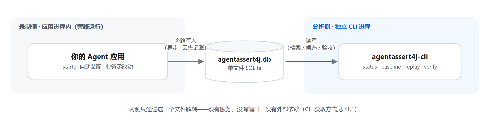
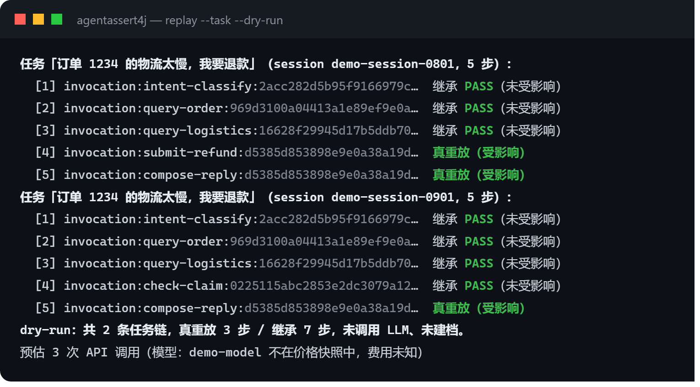

# AgentAssert4j 运维与交付手册（OPERATIONS）

> 面向部署、运维与交付工程师的实操手册。概念与命令的完整语义见 [README.zh.md](README.zh.md)；
> 架构与代码全景见 [guide/AgentAssert框架全景导读.md](guide/AgentAssert框架全景导读.md)。

**目录**：[1. 部署形态](#1-部署形态) ｜ [2. 配置参考](#2-配置参考) ｜ [3. 库文件运维](#3-库文件运维) ｜
[4. CI 门禁配方](#4-ci-门禁配方) ｜ [5. 生产打包形态](#5-生产打包形态) ｜ [6. 交付验收运行手册](#6-交付验收运行手册) ｜
[7. 故障排查](#7-故障排查) ｜ [8. 最小录制契约](#8-最小录制契约) ｜ [9. 版本与兼容语义](#9-版本与兼容语义)

---

## 1. 部署形态

框架由两半组成，可以分开部署：

| 组件 | 形态 | 位置 |
|------|------|------|
| 录制侧 | starter（Boot 3/4）或三个 jar（core + recorder + storage-sqlite） | 被测应用进程内，旁路运行 |
| 分析侧 | `agentassert4j-cli` 命令行工具 | 任意能访问 SQLite 文件的机器/流水线节点 |

两侧通过**单个 SQLite 文件**解耦：应用进程写，CLI 进程读。没有服务、没有端口、没有外部依赖。



数据库默认路径 `~/.agentassert4j/agentassert4j.db`，建议在主配置里显式指到应用的持久化目录。

### 1.1 分析侧 CLI 获取

| 方式 | 适用 | 做法 |
|------|------|------|
| **standalone jar**（推荐） | 人工操作、客户现场、交付物料随行 | 从 GitHub Releases 或 Maven Central 下载 `agentassert4j-cli-standalone`，`java -jar` 直接运行（只需 JRE 8+） |
| Maven 依赖引用 | 平台工程统一管理工具链 | pom 引入 `agentassert4j-cli`，传递依赖自动就位 |
| 源码构建 | 开发调试 | 见 [README.zh.md](README.zh.md)「模块结构」折叠节 |

单机常驻使用建议设别名（示例以 Bash 为例；Windows 直接用完整命令）：

```bash
alias agentassert4j='java -jar agentassert4j-cli-standalone-1.0.0.jar'
```

## 2. 配置参考

### 2.1 主配置 `agentassert4j.json`

查找链（主配置与规则文件各一套，系统属性分别为 `agentassert4j.config.path` / `agentassert4j.rules.path`，
文件名固定 `agentassert4j.json` / `agentassert4j-rules.json`）：

1. 系统属性显式路径（不可读直接报错，不静默换源）→ 2. 当前工作目录 → 3. `~/.agentassert4j/` →
4. classpath → 5. 安全默认值。每次 CLI 命令开头会打印实际命中的配置来源。`${ENV_VAR}` 引用统一替换。

全部字段（都有安全默认值，可只写需要的段）：

```json
{
  "storage": {
    "url": "~/.agentassert4j/agentassert4j.db"
  },
  "recorder": {
    "batchSize": 100,
    "flushIntervalMs": 5000
  },
  "regression": {
    "ignorableFields": []
  },
  "llm": {
    "apiKey": "${DEEPSEEK_API_KEY}",
    "endpoint": "https://api.deepseek.com",
    "model": "deepseek-v4-flash",
    "timeoutMs": 30000,
    "temperature": 0.0,
    "extraBody": ""
  },
  "tools": {
    "excludeFromGraph": []
  }
}
```

| 段 | 键 | 默认 | 说明 |
|----|----|------|------|
| storage.url | — | `~/.agentassert4j/agentassert4j.db` | SQLite 文件路径，`~` 自动展开；CLI 各命令的 `--db` 可逐次覆盖 |
| recorder.batchSize | — | 100 | 批量落库批大小 |
| recorder.flushIntervalMs | — | 5000 | 定时冲刷间隔（毫秒） |
| regression.ignorableFields | — | 空列表 | 已知噪声字段白名单（归一化后仍不同才构成差异） |
| llm.apiKey | — | 空 | 重放用；支持 `${ENV}` 引用；缺失时 replay 打印警告 |
| llm.endpoint | — | `https://api.openai.com` | OpenAI 兼容端点（DeepSeek/通义等同协议端点均可） |
| llm.model | — | `gpt-4o` | 重放请求的模型；与录制模型不一致时命令行告警 |
| llm.timeoutMs | — | 30000 | **单次尝试**预算（下限钳 1000）；超时不重试 |
| llm.temperature | — | 0.0 | 钳位 0–2；推理模型方言下不携带（见故障排查 §7.3） |
| llm.extraBody | — | 空 | 追加到请求体顶层的原样 JSON 片段（厂商方言逃生舱，如 `"thinking":{"type":"disabled"}`） |
| tools.excludeFromGraph | — | 空列表 | 不参与依赖图建边的工具名 |

### 2.2 starter 属性（`application.yml`，前缀 `agentassert4j`）

| 属性 | 默认 | 说明 |
|------|------|------|
| `agentassert4j.enabled` | `true` | `false` 时自动装配整体退出、录制 API no-op（**生产打包形态**，见 §5） |
| `agentassert4j.database` | `agentassert4j.db` | 库文件路径 |
| `agentassert4j.invocation-id` | 空 | 应用级默认调用点标签——单技能应用一行完成身份声明 |

配置项是发布后的永久契约，刻意保持最小面。

### 2.3 规则文件 `agentassert4j-rules.json`（可选精修）

```json
{
  "invocations": {
    "refund": {
      "requiredKeywords": ["退款"],
      "forbiddenKeywords": [],
      "regexPatterns": [{ "pattern": "订单号[:：]?\\d+", "description": "必须回显订单号" }],
      "behaviors": ["nonEmptyOutput"]
    }
  }
}
```

- 顶层键是 `invocations`，值为调用点**声明标签**（invocationId）；未声明的调用点零涉入（纯结构差分）。
- 判定方向是「基线声明、当前答卷」：声明随基线指纹存档，重放时对当前输出校验。
- 只钉「该调用点**任何**合法响应都必含」的普适键——钉分支形态键会造成永久假 CHANGED。
- `rules` 命令列出全部内置行为名（`mustUseChinese` / `jsonOutput` / `nonEmptyOutput` 等 8 个）。
- 未知 behavior 名在 CLI 加载时告警；非法正则按不匹配处理（可见的失败信号，不静默放行）。

## 3. 库文件运维

- **单文件即全部状态**：备份 = 复制文件（建议停写窗口或接受只追加语义下的时间点快照）。
- **只追加**：`interactions` 是历史账本，重复录制会追加不覆盖——重建基线数据请换新文件或删除旧文件后重录。
- **schema 契约版本**（`PRAGMA user_version`）：库版本高于 CLI 支持值时**拒开**（旧工具不误读新数据）；
  预发布阶段 schema 变更以**删库重建**承接，不提供迁移。升级 CLI 后若报版本不符，删除库文件重新录制建档。
- **判定语义版本**（当前 `det-v1`）：每份基线盖章时记录；CLI 升级后语义不一致时 replay **拒绝判定**
  （exit 2）并指引 `baseline --force` 重建——拿新尺子解释旧基线是被禁止的。
- **Windows 注意**：关停应用后 CLI 才能独占写库；自带录制器 Bean 必须显式声明 destroy 方法名 `stop`，
  否则 flush 线程锁住文件。
- **健康检查**：应用日志中的计数闭合账本 `recorded = written + dropped + failed`（filtered 另列）；
  任何对不上账的情况都是缺陷。

## 4. CI 门禁配方

流水线里的推荐姿势：

```bash
# 提示词变更的整链门禁（--ci 拒绝为无基线调用点自动建档——防无人审的绿灯）
agentassert4j replay --prompt prompt-latest.txt --old-prompt prompt-main.txt --affected --ci --json
```

- **退出码分流**：`0` 绿灯放行；`1` 存在行为差异（含缺步骤/新增步骤）——人裁决 approve/reject；
  `2` 用法或基础设施故障（含 `--ci` 无基线拒绝、判定语义不符、预算耗尽/证据不完整）——修环境，不算回归。
- `--json`：stdout 只有单行机器可读报告（`agentassert4j.replay-report/1` / `task-report/1`），
  诊断与进度走 stderr；按退出码分流消费——0/1 解析 stdout，2 只读 stderr。
  同一通道契约覆盖全部命令：9 个顶层命令加 `baseline export` 各有单行 `--json` 报告
  （schema 清单见 §9），失败路径 stdout 零产出。
- **预算池**（任务域 `--task/--affected` 生效）：`--max-total-calls/--max-total-tokens` 对本次运行全部
  真实调用合计封顶；耗尽后剩余步骤标 skipped，整体 exit 2（证据不完整不允许冒充绿）。
- **干跑**：任何重放加 `--dry-run` 只列执行计划与成本预估——零调用、零落库、零建档（调用点域列选例
  清单；任务域列逐步计划：真重放 / 继承）。真实对比模式（`--task` 无 `--prompt`）本身零调用，无需干跑。



## 5. 生产打包形态

交付客户的生产构件与开发态**同一份**，仅配置不同：

```yaml
agentassert4j:
  enabled: false   # starter 不装配任何 Bean；录制 API 为 no-op
```

抽查方法：`enabled=false` 启动应用 → 正常业务调用 → 库文件不存在或无新记录 → 录制侧确认关闭。
CLI 分析侧不受影响，仍可对既有库做巡检/验收。

## 6. 交付验收运行手册

角色：开发侧（出证据）与验收侧（客户环境，模型/部署可不同）。验收侧 CLI 建议用 standalone jar
随交付物料携带（见 §1.1），只要求 JRE 8+。


**开发侧：**

1. 确认基线干净：`agentassert4j status`——全部调用点 BASELINE、无未裁决候选（候选先 approve/reject 清场）；
2. 导出：`agentassert4j baseline export --out acceptance-pack.json` → 记录打印的 **SHA-256** 与任务链/步骤数；
3. 需要附样本供人读时加 `--include-samples`（样本强制 MASK 脱敏，判定不消费）；
4. 敏感任务：确认录制时已用 `withMetadata("taskKey", <场景id>)` 声明任务键——**任务键=请求原文**会随包出境。

**搬运：** 验收方核对文件 SHA-256 后接收。包内容天然脱敏（结构指纹+调用点键；无原文/无模板/无规则文件）。

**验收侧：**

1. 部署被测应用（可 `enabled=false` 不录制），**真实执行**全部验收请求——框架不驱动产品入口，执行由验收人发起；
2. 核对：`agentassert4j verify --pack acceptance-pack.json --report verify-report.md`
3. 判读：
   - 结构偏差（工具集/参数类型/输出结构）= **真问题**，转开发侧；
   - 跨模型标注（开发侧/本地 servedModel 不同）= 文本措辞差异属预期内，结构判定依然有效；
   - **覆盖缺口**（包内任务未执行，exit 2）= 补执行后重跑，缺口不允许冒充通过；
   - 范围外链（本地多出的任务）= 只列出，不判定。
4. `verify` 全程只读（不落库、不改本地基线），可反复执行；markdown 报告即交付证据，归档时附包文件的 SHA-256。

**退出码**：`0` 全部结构一致 ｜ `1` 存在结构偏差（含缺步骤/新增步骤）｜ `2` 版本守卫拒绝/覆盖缺口/用法错误。

## 7. 故障排查

**7.1 数据面**

| 症状 | 处置 |
|------|------|
| 落库数与业务调用量对不上 | 读应用日志计数账本：dropped（缓冲满，调大 batch/flush 或接受丢弃）、failed（批量写失败看 ERROR）、filtered（采集门，策略性） |
| status 看不到画像 | 建档守卫剔除了解析失败的记录——看命令告警行；`baseline` 幂等可重跑 |
| CLI 报「库版本高于支持值」 | 库由更新版本的框架创建——升级 CLI，或（预发布阶段）删库重建 |

**7.2 判定面**

| 症状 | 处置 |
|------|------|
| 重放全红 | 看每行的 served 模型注记（配置模型 ≠ 录制模型）；`status` 看判定语义版本是否一致（exit 2 有指引） |
| 疑似误报 | 看 summary 定位维度：参数类型→两侧词表应同源；文本不同≠差异（判定只看结构指纹）；确属噪声的字段加 `regression.ignorableFields` |
| 纯文本回答被判 CHANGED | 多为数量级跳变（回答长度档位变了）或声明规则失配——维度 2/3 的差异明细会点名 |

**7.3 调用面（重放 400/报错）**

| 症状 | 处置 |
|------|------|
| 端点 400 | tool 帧缺 callId 会跳过并告警；历史 system 帧已自动跳过；o 系模型的 temperature 由方言表自动裁剪并 WARN |
| 推理模型拒绝 temperature | 该参数不携带（自动）；需要厂商特殊开关用 `llm.extraBody` 逃生舱 |
| 超时 | `timeoutMs` 是单次尝试预算；超时不重试（重试只翻倍成本）；持续超时查网络/端点 |

**7.4 任务域**

| 症状 | 处置 |
|------|------|
| `--task` 找不到链 | 输入须与录制请求文本精确相等（或给唯一前缀，命中多个不同任务会报错列候选）；或该会话开头无请求文本（纯工具起始）不构成任务链 |
| `verify` 报覆盖缺口 | 包任务在本地没有**精确同名**任务链——验收人按交付的请求清单原文执行；前缀同名的链不冒充证据（列入范围外） |
| 追问任务对不上 | 追问链携带会话前缀——真实再执行对照必须重演到该问为止的完整前缀，报告已标注提示 |
| 改了问法导致配不上 | 录制时用 `withMetadata("taskKey", <场景id>)` 声明任务键（声明优先于派生） |
| exit 2 且有 skipped | 预算池耗尽或调用失败——证据不完整；加大预算或修复调用环境后重跑 |

## 8. 最小录制契约

不使用 SDK 适配时（JDK 8 / 自研栈），在你的 LLM 调用出口组装 `InteractionRecord` 交给录制器
（全框架共用同一存储与判定语义）：

```java
InteractionRecorder recorder = new InteractionRecorder(storageRepository, recorderConfig);
recorder.start();
try {
    // ...你的 LLM 调用...
    InteractionRecord r = new InteractionRecord();
    r.setRecordId(UUID.randomUUID().toString());
    r.setTimestamp(System.currentTimeMillis());
    r.setSeq(seq.incrementAndGet());          // 进程内单调，会话内排序键
    r.setSessionId(sessionId);
    r.setInvocationId("refund");              // 可选：声明调用点标签
    r.setTemplateHash(sha256Hex(systemPrompt)); // 身份锚（未声明时按此归组）
    r.setTemplateText(systemPrompt);          // 模板原文（重放请求重建素材）
    r.setUserInput(lastUserMessage);
    r.setModelResponse(responseText);
    r.setToolCalls(toolCalls);                // 有则填，含 toolName/arguments/result
    r.setHasToolCalls(!toolCalls.isEmpty());
    r.setApiProtocol("openai-chat");
    r.setModel(model);
    r.setServedModel(responseServedModel);
    r.setInputTokens(usage.inputTokens());
    r.setOutputTokens(usage.outputTokens());
    r.setLatencyMs(elapsed);
    r.setRecorderVersion("my-app-1");
    recorder.intercept(r);
} finally {
    recorder.stop();                          // 排空在途批次后关闭
}
```

字段分三档：

| 档 | 字段 | 说明 |
|----|------|------|
| 强烈建议显式填 | `recordId`（缺省兜底 UUID）、`sessionId`（缺省退 recordId 独立会话）、`timestamp`+`seq`（确定性排序键）、`userInput`、`modelResponse`、`invocationId` 或 `templateHash`（身份锚，双缺走 adhoc 请求哈希兜底）、`apiProtocol`、`model` | 决定身份、配对与重放质量 |
| 影响保真 | `templateText`（落 prompt_texts 原文库）、`toolsDefinition`（JSON 数组原样——重放不带工具会假阳性）、`previousTurns`（多轮上下文，重放逐字复用）、`turnIndex`、`samplingParams`、`toolCalls[].arguments/result` | 决定冻结重放的保真度 |
| 遥测 | `inputTokens/outputTokens`（输入侧=总处理 token）、`cacheRead/WriteTokens`、`reasoningTokens`、`usageRaw`（供应商原始 usage 逐字）、`latencyMs/ttftMs`、`costUsd`（无价格快照则留 null 不编造）、`servedModel` | 报告与成本可见性；`servedModel` 是跨模型验收的判定依据 |

其余字段（`invocationKey` 由管道 enrich 派生兜底；`endpoint`/`variablesFingerprint`/`modelRequestRaw` 为预留位）
可不填。`metadata` 为 JSON 字符串扩展池，任务键声明写 `{"taskKey":"<场景id>"}`。

## 9. 版本与兼容语义

| 标识 | 当前值 | 语义 |
|------|--------|------|
| 存储 schema（`PRAGMA user_version`） | 1 | 预发布固定不演进，schema 变更=删库重建；发布后只增不改 |
| 判定语义 | `det-v1` | 改变「同样差异得出什么判定」的变更必须递增；发布前恒定 |
| 报告 schema | `agentassert4j.replay-report/1`、`task-report/1`、`verify-report/1`、`acceptance-pack/1`、`export-report/1`、`baseline-report/1`、`adjudication/1`、`rollback/1`、`status/1`、`graph/1`、`rules/1`（每命令 `--json` 各对应其一） | schema 标识自出生冻结；验收包跨引擎由判定语义版本守卫把关 |
| Maven 版本 | `1.0.0-SNAPSHOT` | 发布时转正式版 |
| CLI 可执行形态 | `agentassert4j-cli-standalone` | cli 模块的全依赖 shaded 产物（含 slf4j-nop 与 Main-Class），`java -jar` 直接运行 |

模块坐标前缀 `io.github.agentassert4j`；core 永不引入任何外部依赖（仅 java.base）。
