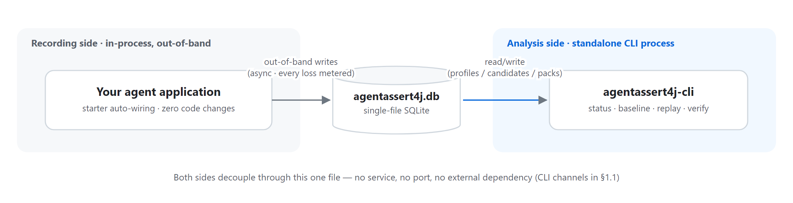

# AgentAssert4j Operations & Delivery Handbook

> The hands-on handbook for deployment, operations and delivery engineers. For concepts and the full
> command semantics see [README.md](README.md); for the architecture tour see
> [guide/framework-panorama.md](guide/framework-panorama.md).

**Contents**: [1. Deployment shapes](#1-deployment-shapes) ｜ [2. Configuration reference](#2-configuration-reference) ｜ [3. Database operations](#3-database-operations) ｜
[4. CI gating recipes](#4-ci-gating-recipes) ｜ [5. Production packaging](#5-production-packaging) ｜ [6. Delivery-acceptance runbook](#6-delivery-acceptance-runbook) ｜
[7. Troubleshooting](#7-troubleshooting) ｜ [8. Minimal recording contract](#8-minimal-recording-contract) ｜ [9. Version & compatibility semantics](#9-version-compatibility-semantics)

---

## 1. Deployment shapes

The framework comes in two halves that deploy separately:

| Component | Form | Where |
|-----------|------|-------|
| Recording side | a starter (Boot 3/4) or three jars (core + recorder + storage-sqlite) | inside the application under test, out-of-band |
| Analysis side | the `agentassert4j-cli` command-line tool | any machine or pipeline node that can reach the SQLite file |

The two sides are decoupled by **a single SQLite file**: the application process writes it, the CLI
process reads it. No service, no port, no external dependency.



The default database path is the same on both sides — `~/.agentassert4j/agentassert4j.db`. Point both
sides explicitly at the application's persistent directory in the main config / starter properties.

### 1.1 Getting the analysis-side CLI

| Channel | Best for | How |
|---------|----------|-----|
| **standalone jar** (recommended) | human operators, customer sites, delivery kits | download `agentassert4j-cli-standalone` from GitHub Releases (not published to Maven Central) and run `java -jar` directly (JRE 8+ only) |
| Maven dependency | platform teams standardizing the toolchain | add `agentassert4j-cli` to the pom; transitive dependencies come along |
| From source | development & debugging | see the "Modules & building from source" section in [README.md](README.md) |

Every subcommand ships a short alias (`s`/`b`/`a`/`g`/`v`/`d`/`c`/`rp`/`rj`/`rb`/`ru`/`au`/`m` — full
names always kept, visible in `--help`; the `completion` script registers them in your shell), and
`agentassert4j --version` prints the framework version. For a resident CLI on one machine, set a shell
alias (Bash example; on Windows use the full command):

```bash
alias agentassert4j='java -jar agentassert4j-cli-standalone-1.0.0.jar'
```


### 1.2 Cross-platform notes

- **Paths**: CLI arguments accept forward slashes everywhere (`D:/path/to.db` is equivalent to the
  backslash form on Windows, and forward slashes need no escaping inside shell quotes — examples use
  them throughout).
- **Windows**:
  - When CLI output is consumed through pipes/redirects (subprocess readers, `>` to a file parsed as
    UTF-8), start the JVM with `-Dfile.encoding=UTF-8` — the JVM defaults to the platform charset
    (GBK on Chinese Windows) and UTF-8 consumers will fail to decode special glyphs. For interactive
    terminal display, `chcp 65001` works. The framework's own output strings are always UTF-8 source
    strings with no literal GBK content.
  - **Command-line arguments take a different decoding path** (`sun.jnu.encoding`, decided by the OS
    active code page — `-Dfile.encoding` does not reach it): `--db`/`--task`/`--invocation` arguments
    containing emoji or non-BMP glyphs decode to `?` on Chinese Windows and then misreport as
    "not found". `-Dsun.jnu.encoding=UTF-8` and `JAVA_TOOL_OPTIONS` do not help either (verified on
    JDK 21: all three remedies fail; CJK inside the BMP is lossless). Identifiers with special glyphs
    should go through the MCP channel (`record`/`check` parameters travel as JSON, no argument
    decoding layer) or use BMP-only key names.
  - Git Bash / PowerShell / CMD all work; quoting rules for `-D` properties and `--db`-style
    arguments follow each shell's conventions (PowerShell: wrap paths containing spaces in quotes).
- **macOS / Linux**: nothing special; standard `java -jar` usage, JRE 8+.
- **Time zone & locale**: verdicts and reports carry no localized content; JVM log (JUL) level words
  and timestamps are normalized by the framework to English/ISO form and never follow system language.

## 2. Configuration reference

### 2.1 Main configuration `agentassert4j.json`

Lookup chain (one chain for the main config, one for the rules file; system properties
`agentassert4j.config.path` / `agentassert4j.rules.path`; file names fixed at
`agentassert4j.json` / `agentassert4j-rules.json`):

1. Explicit system-property path (unreadable → hard error, never silently falls back; when an explicit
   config is in effect, companion files such as rules/prices resolve against **that config file's
   directory**) → 2. current working directory (the search root when no explicit config is set) →
   3. `~/.agentassert4j/` → 4. classpath → 5. safe defaults. A relative `storage.url` resolves against
   the process working directory — prefer absolute paths in service deployments. Database-opening
   commands print the config source that actually hit at the start of the run (`rules`/`completion`
   never open the database, print nothing, and reject `--db` — skip those two when appending `--db`
   per command in scripts). `${ENV_VAR}` references are substituted everywhere; unset variables
   substitute to the empty string.

All fields (every one has a safe default; write only the sections you need):

```json
{
  "storage": {
    "url": "~/.agentassert4j/agentassert4j.db"
  },
  "regression": {
    "ignorableFields": []
  },
  "llm": {
    "apiKey": "${DEEPSEEK_API_KEY}",
    "endpoint": "https://api.deepseek.com",
    "model": "deepseek-v4-flash",
    "timeoutMs": 30000,
    "temperature": 0.0,
    "extraBody": ""
  }
}
```

| Section.key | Default | Meaning |
|-------------|---------|---------|
| storage.url | `~/.agentassert4j/agentassert4j.db` | SQLite file path, `~` expands automatically; `--db` on database-opening commands (status/baseline/replay/accept/reject/rollback/verify/doctor/graph show/export) overrides per run |
| regression.ignorableFields | empty list | allowlist of known noisy fields (a difference counts only if the fields still differ after normalization) |
| llm.protocol | auto-derived | Wire protocol of the re-drive endpoint. Unset: re-emits in each baseline record's original ingestion dialect (same-protocol replay needs zero config); falls back to `openai-chat` when records carry no hint. Explicit `openai-chat` / `anthropic-messages` / `openai-responses` overrides the derivation (cross-protocol replay). An unknown value errors on paths that consume the llm config and lists all legal values (both the real re-drive run and the `--dry-run` preview block it — a preview must not present a plan that is guaranteed to fail). Commands that never consume the llm config are unaffected |
| llm.apiKey | empty | For re-drive; supports `${ENV}` references; when missing, `--re-drive` prints a warning (bare alignment makes zero calls and never checks the key) |
| llm.endpoint | `https://api.openai.com` | OpenAI-compatible endpoint (DeepSeek/Qwen and other same-protocol endpoints all work) |
| llm.model | `gpt-4o` | Model for re-drive requests; a mismatch with the recorded model warns on the command line |
| llm.timeoutMs | 30000 | Budget for **a single attempt** (clamped to a 1000 floor); no retry on timeout |
| llm.maxRetries | 2 | Max retries on transport failures (429/5xx/connection refused) — directly drives re-drive cost and duration |
| llm.maxTokens | empty | Fallback `max_tokens` ceiling on emitted requests. Mandatory in the Anthropic Messages grammar — fills in when the baseline record carries none; empty = the client's built-in 4096. Optional in OpenAI-family grammars, omitted entirely |
| llm.temperature | 0.0 | Clamped to 0–2; omitted under reasoning-model dialects (see Troubleshooting §7.3) |
| llm.extraBody | empty | Verbatim JSON fragment appended to the request-body top level (vendor-dialect escape hatch, e.g. `"thinking":{"type":"disabled"}`) |

> Recording-side knobs are not in this file — this file configures the CLI/MCP operating surface.
> Recording knobs live in §2.2 starter properties (Boot apps) and `RecorderConfig.builder()`
> (non-Boot apps). A `recorder` section here earns an unknown-key warning.

The built-in price snapshot covers mainstream model families keyed by **family**
(gpt/o/gemini/qwen/deepseek…); a model outside the snapshot reports `cost unknown` and names the
model — honest, never invented. When a family is missing (or you need to change a price), drop an
`agentassert4j-prices.json` next to `agentassert4j.json` to override (same shape as the snapshot:
family → `{"input": per-token price, "output": per-token price}`, USD). It loads lazily — read and
warned about only when a cost estimate is actually needed (re-drive quotes / summaries); runs with no
re-drive targets never touch it. Lookup = exact key first, then longest containing match (dated
variants fold into the family price); **a family key in the override file genuinely outranks the
snapshot's more specific within-family keys** (writing `deepseek` reprices the whole deepseek family
and the snapshot's `deepseek-chat`-style keys step aside), while inside the override file its own
longer keys still win by exact-first. Override keys no model ever hits are harmless and silent (no
warning): same-family repricing and new-family additions both fine; a corrupted file earns a SEVERE
warning instead of failing silently. System property `agentassert4j.prices.path` overrides the path.

Endpoint and auth shapes per protocol:

| protocol | Endpoint example | Auth |
|---|---|---|
| `openai-chat` | `https://api.deepseek.com` (any OpenAI-compatible endpoint) | Bearer |
| `anthropic-messages` | `https://api.anthropic.com` or a vendor's Messages-compatible endpoint (e.g. `https://api.deepseek.com/anthropic`) | `x-api-key` + `anthropic-version` (client-provided) |
| `openai-responses` | `https://api.openai.com` or `https://api.deepseek.com` | Bearer |
### 2.2 Starter properties (`application.yml`, prefix `agentassert4j`)

The property tree mirrors the `agentassert4j.json` naming (`storage.url`), with every recording-domain
knob exposed — the same knob keeps the same meaning and shape across channels:

| Property | Default | Meaning |
|----------|---------|---------|
| `agentassert4j.enabled` | `true` | `false` → the whole auto-configuration backs off and creates no beans (the **production-packaging** switch, see §5) |
| `agentassert4j.storage.url` | `~/.agentassert4j/agentassert4j.db` | Database file path, `~` expands automatically; same name and meaning as the json channel |
| `agentassert4j.recorder.default-invocation-id` | empty | App-wide default invocation label — one line declares identity for a single-skill app |
| `agentassert4j.recorder.endpoint` | empty | Recorder-level default endpoint address (the endpoint column — the deployment identity that keeps baselines comparable across deployments); on multi-model JVMs override per call with `RecordingContext.withEndpoint` |
| `agentassert4j.recorder.batch-size` | 100 | Batch size for persisted writes |
| `agentassert4j.recorder.flush-interval-ms` | 5000 | Timed flush interval (ms) |
| `agentassert4j.recorder.max-buffer-size` | 500 | Buffer ceiling (overflow drops and counts) |
| `agentassert4j.recorder.ring-buffer-size` | 16384 | Disruptor RingBuffer size (clamped up to a power of two) |
| `agentassert4j.recorder.sensitive-fields` | empty list | Sensitive field names (mask matching, case-insensitive) |
| `agentassert4j.recorder.sanitize-strategy` | `MASK` | Sanitization strategy: `MASK` / `HASH` / `DROP` |
| `agentassert4j.recorder.sanitize-user-input` | `false` | Sanitize userInput (affects regression re-drive; off by default) |
| `agentassert4j.recorder.sanitize-model-response` | `false` | Sanitize modelResponse |
| `agentassert4j.recorder.record-undeclared-chat` | `true` | `false` filters undeclared plain conversations with no visible tool calls (a volume-hygiene option) |
| `agentassert4j.recorder.enabled` | `true` | Recorder switch: `false` keeps the pipeline down (auto-configuration stays in place — a second line of defense behind the master switch) |

Non-Boot apps (plain Java / non-Boot Spring): assemble programmatically with `RecorderConfig.builder()`
— knobs map one-to-one to the table above; for Spring Java Config, map your own config source onto the
builder inside a `@Bean` method — the framework ships no second file format.

### 2.3 Rules file `agentassert4j-rules.json` (optional refinement)

```json
{
  "invocations": {
    "refund": {
      "requiredKeywords": ["退款"],
      "forbiddenKeywords": [],
      "regexPatterns": [{ "pattern": "订单号[:：]?\\d+", "description": "必须回显订单号" }],
      "behaviors": ["nonEmptyOutput"]
    }
  },
  "tasks": {
    "refund-flow": {
      "requiredSteps": ["提交退款"],
      "requiredOrder": ["意图识别", "查询订单", "提交退款"],
      "steps": { "查询订单": { "min": 1, "max": 3 } }
    }
  }
}
```

- The values under the top-level `invocations` key are invocation **declared labels** (invocationId);
  undeclared invocations stay untouched (pure structure diffing).
- Judgment direction is "baseline declares, current output answers": declarations are archived with the
  baseline fingerprint and checked against current output at replay time.
- Pin only universal keys — keys that **every** legal response of that invocation must contain. Pinning
  branch-specific keys manufactures permanent false CHANGED verdicts.
- The `rules` command lists every built-in behavior name (`mustUseChinese` / `jsonOutput` /
  `nonEmptyOutput` — 8 total).
- Unknown behavior names warn at CLI load; illegal regexes are treated as non-matching (a visible
  failure signal, never a silent pass-through).
- The top-level `tasks` key is task-chain discipline (a declarative gate for team step discipline):
  keys are task keys declared at recording time via `withMetadata("taskKey", ...)` (**derived request
  text is never a key** — the section applies only to declared tasks); step references are invocation
  declared labels. Three constraint kinds — `requiredSteps` (must appear, order unconstrained),
  `requiredOrder` (ordered subsequence, existence included: a missing label also violates), and
  `steps.min/max` (absolute count range, judged directly on new-chain counts) — violations fold into a
  chain-level CHANGED → exit 1.
- `tasks` is evaluated at the tail of replay's per-task alignment (bare whole-project or
  `--task`/`--invocation` narrowing both work — constraints apply to chains with a declared taskKey;
  a task with a self-established baseline and only one chain is not judged — establish first, it
  takes effect from the second round when a comparison exists). **Delivery acceptance evaluates it
  too**: when the pack embeds a declared rules section, the acceptance side judges the locally
  executed chains against the pack's rules (under cross-model acceptance, orchestration jitter is
  reported honestly); packs without a rules section skip it. When `tasks` is configured but the
  judged chain declared no taskKey, the report prints a diagnostic line (not a verdict) so "configured
  but ineffective" cannot hide; malformed declarations (wrong-typed values, non-object entries, both
  min and max missing, min > max) are safely ignored at parse time or marked non-binding, each warned
  at CLI load.

The `rules` command lists all built-in behavior names and the rules-file syntax at any time (genuine
output on the demo database):


> **When declarations take effect**: rules bind **at the moment they are pinned into a baseline** —
> `baseline`/`--force` seeding, or `accept` adding to the set (the candidate fingerprint is extracted
> under the rules in effect at that moment). The report header's `Rules:` line discloses the loaded
> file, but judgment consumes only what the fingerprint carries; editing the rules file after
> establish never silently re-judges history (on a difference, establish emits a rules-drift warning
> pointing to the side-effect-free check→accept refresh or a `--force` re-seed). Read both sentences
> together: **the current rules file does participate immediately in judging new chains** — when the
> file disagrees with the pinned baseline, new chains are judged under the file's rules and land as a
> visible in-flight candidate (never silently), while the pinned baseline stays untouched; reading
> only the first sentence misleads into "editing the file changes nothing".


### 2.4 Keys and credentials (the supported way)

The LLM API key has exactly **one consumer**: `replay --re-drive` (the real calls of a controlled
re-drive). Recording, judgment, establishing and acceptance (verify) are all key-free — an install
without any key is fully functional, minus re-drive.

**Recommended shape: `${ENV}` references in the config file, the secret lives in the process
environment** —

```json
{
  "llm": {
    "apiKey": "${MY_LLM_API_KEY}",
    "endpoint": "https://api.deepseek.com",
    "model": "deepseek-chat"
  }
}
```

- ConfigLoader expands `${ENV_VAR_NAME}` at load time (hot read: a long-lived process picks up config
  file edits without restart); a missing variable resolves that key to empty, and the re-drive
  pre-flight warns "no API key configured" (visible in `--dry-run` before any money is spent).
- This `agentassert4j.json` is therefore **safe to commit** (endpoint and model yes, key no); the key
  comes from the environment of whatever process starts the CLI / MCP server (terminal `export`, CI
  secret, harness injection).

**Why not a literal key**:

| Where | Risk |
|-------|------|
| Literal in `agentassert4j.json` | Leaks the moment the file is committed, screenshotted or shared |
| `-e KEY=<literal>` in MCP registration | Most hosts' `mcp get` / config UI **echo registrations verbatim** (env values included) — the key lands in session logs; verified on Claude Code |
| Plaintext CI variable | Same leak surface, plus build logs |

**The supported MCP registration** (key flows through the parent process environment → `${ENV}`
expansion; the registration itself carries zero secrets):

```json
{
  "mcpServers": {
    "agentassert4j": {
      "command": "java",
      "args": ["-Dagentassert4j.config.path=/path/to/agentassert4j.json",
               "-jar", "/path/to/agentassert4j-cli-standalone-1.0.0.jar",
               "mcp", "--db", "/path/to/agentassert4j.db"]
    }
  }
}
```

`export MY_LLM_API_KEY=...` before starting the host (or let the host inherit a system-level
environment) and you're done — nothing secret appears in the registration, so `mcp get`-style echoes
have nothing to leak. A server used purely for record/check/verify needs no key at all.

**Same story on the CLI side**: `export` in the terminal and run (the config file still carries the
`${ENV}` reference); the one-shot equivalent is `MY_LLM_API_KEY=... agentassert4j replay --re-drive`.

## 3. Database operations
- **One file is the whole state**: backup = copy the file (prefer a write-quiesced window, or accept a
  point-in-time snapshot under append-only semantics).
- **Append-only**: `interactions` is a history ledger; re-recording appends rather than overwrites — to
  rebuild baseline data, use a fresh file or delete the old one and re-record.
- **Schema contract version** (`PRAGMA user_version`): a database newer than the CLI supports is
  **refused** (an old tool must not misread new data); pre-release schema changes are absorbed by
  **delete-and-rebuild**, no migration is provided. If a version mismatch appears after a CLI upgrade,
  delete the database file and re-record/re-establish.
- **Judgment-semantics version** (currently `det-v1`): stamped onto every baseline at write time; after
  a CLI upgrade with a semantics change, replay **refuses to judge** (exit 2) and points to
  `baseline --force` — interpreting an old baseline with a new ruler is forbidden.
- **Windows note**: the CLI can take exclusive write access only after the application shuts down; a
  self-declared recorder bean must explicitly declare the destroy method name `stop`, otherwise the
  flush thread keeps the file locked.
- **Health check**: the closing-counts ledger in the application log — `recorded = written + dropped +
  failed` (`filtered` listed separately); any mismatch is a defect.
- **Idempotency keys are database-global**: dedup does not distinguish writers (recordId is always the
  idempotency key; the response id serves only when recordId is absent) — with multi-instance
  deployments or multiple evaluators recording in parallel on one database, a second write with the
  same id lands as a duplicate attributed to the first-recorded session (on a **cross-session** resubmit
  the report carries `storedSessionId` to point there; a same-session resubmit omits the field — no
  need to say more when attribution is unambiguous). Parallel writers should prefix instance markers
  into recordId/response id (e.g. `zcode-r5-…`) to avoid collisions at the root.
- **Shared database (multiple hosts / multiple people), five operating rules**: ① whole-database
  `--ci` gating is **fail-closed on unestablished keys** (E-GUARD, exit 2) — by design, not a fault:
  with any unestablished key in the database, the gate refuses to issue a verdict; ② each host
  **judges its own domain** — check/diff with `--task`/`--invocation` narrowing, establish your own
  keys, never adjudicate for others (cross-host in-flight candidates are visible database-wide; that
  is the shared governance surface); ③ a whole-database gate is legitimate only once every key has
  been established by someone (including split keys awaiting explicit establish —
  `baseline --invocation <key>` folds them in one by one); ④ bare `replay` (no narrowing)
  **auto-establishes unestablished keys database-wide** — signed with your current actorTag, it
  effectively domains on behalf of parallel hosts (one bare run that forgot to pin
  `-Dagentassert4j.config.path` is a full-database governance write); on a shared database always run
  replay with `--task`/`--invocation`; ⑤ bare `baseline export` collects tasks database-wide — other
  parties' tasks leave with the pack together with their task keys (the raw request text when
  undeclared) and servedModel, and the acceptance side will report those tasks as coverage gaps
  (a false exit 2); always export shared databases with `--task` narrowing. The framework deliberately
  has no concept of "key ownership" — shared-database governance rests on these conventions.
- **Database health check**: the `doctor` command prints four deterministic sections in one shot
  (storage / identity / coverage / rules; the storage deep scan = PRAGMA quick_check over the whole
  file — physical damage on untouched pages is silently invisible to ordinary queries, the health
  scan flushes it out; skeleton-family shapes, multi-step zero-label chains, repeated-request-text
  task families for undeclared tasks, unestablished invocations, missing template_hash, rules
  expectation mismatches) — use it to add declarations when onboarding zero-declaration, or to
  self-check before first establish; read-only, judges nothing, establishes nothing.


## 4. CI gating recipes

The one-stage pipeline shape (precondition: the app runs its smoke/e2e once with the recorder on —
the new template really executes and lands in the database):

```bash
# Whole-project gate: --ci refuses to auto-establish unbaselined invocations (no unreviewed greens),
# and drift identity is never collected into the baseline
agentassert4j replay --ci --json
```

- **Nothing hardcoded, zero API key**: bare defaults already do whole-project change detection and
  per-task alignment, judging with zero LLM calls; a `--re-drive` controlled review is a human action
  and stays out of pipeline defaults.
- **Exit-code routing**: `0` green (under `--ci`, uncollected drift still exits 0 with an "Identity
  not collected" warning — the convergence action is left to a human-side replay or accept); `1` a
  behavioral difference or evidence gap exists (alignment CHANGED / missing step / added step / task
  rule violation / pending drift) — a human adjudicates accept/reject; `2` usage or infrastructure
  failure (including the `--ci` unbaselined refusal, judgment-semantics mismatch, re-drive budget
  exhausted / all calls failed) — fix the environment; not a regression.
- `--json`: stdout carries machine-readable reports line by line (`agentassert4j.task-report/1`,
  mode segments: drift-detection / task-align / ci-align (the `--ci` judging segment) /
  drift-disposition / task-re-drive / re-drive-dry-run / task-dry-run / member-check / exit-health
  (closing exit-health counts per flow)); diagnostics and progress go to stderr. Consume by exit
  code — 0/1 parse the stdout reports; 2 parse the closing `agentassert4j.error/1` failure envelope on
  stdout (`errorCode` in four families: E-USAGE usage & selectors / E-NO-DATA nothing actionable /
  E-GUARD judgment-guard refusal / E-ENV environment & IO; `hints[]` actionable suggestions are
  mandatory, `nextAction` names the most likely next command). Human-readable mode prints nothing to
  stdout on usage-error paths; judgment-type refusals (E-GUARD, such as `--ci` fail-closed) still
  print the pre-refusal report segments and guidance to stdout first. The same channel contract covers
  every command (schema list in §9).


- **Budget pool** (in effect under `--re-drive`): `--max-total-calls/--max-total-tokens` caps the sum
  of all real re-drive calls in this run; once exhausted the remaining points are marked skipped and
  the run exits 2 (incomplete evidence must never masquerade as green).
- **Re-drive observations are archived**: served interactions that completed a comparison land as
  observation records under the re-driven record's original key (metadata carries `redriveOf`
  pointing at the re-driven record), and the re-drive report's step rows carry the observation record
  id back — afterwards `record show` retrieves the served original text without paying for another
  re-drive. Observation records never enter task-chain judgment or drift detection (an instrument's
  observation is not a business execution), so later `replay --ci` runs are unaffected by re-drives.
- **In-flight candidates from re-drive**: a CHANGED found by re-drive registers an in-flight candidate
  under the same rules as ordinary judgment (awaiting accept/reject — this is the adjudication path
  for re-drive findings); it surfaces in the `status` candidate column and counts into `baseline
  export`'s `unadjudicated steps` warning; the `--ci` gate is unaffected (the gate only reads
  latest-chain membership in the approved set).
- **Dry-run budget preview**: `--max-total-calls/--max-total-tokens` participate in the dry-run quote —
  plan lines and estimates count only records that would execute within budget, and announce how many
  would be truncated (same budget semantics as the real run).
- **Dry run**: `replay --dry-run` prints the drift set, the alignment plan and the re-drive cost
  estimate — zero calls, zero writes, zero establishes, zero dispositions; previewing the quote with
  `--dry-run` before a re-drive is the recommended habit.
- **CI credentials**: the gate itself (`replay --ci`) needs no key — in CI, `agentassert4j.json` only
  needs `storage.url`; if the pipeline also does controlled re-drive reviews, inject the key as a CI
  secret environment variable, keep the `${ENV}` reference in the config file (see §2.4), and cap the
  run with `--max-total-calls`.
- **Acceptance stage (optional second phase)**: the delivery side `baseline export`s the pack (the
  artifact archives with the pipeline) → after the acceptance side really executes, `verify --pack`
  gates on the exit code — structural verdicts hold across models, and with `crossModel:true` wording
  diffs are annotated as expected (full recipe in §6).


- **Stability probe (`--member-check`)**: the measuring stick before approving into the set — the
  task's latest chain is compared one by one against its most recent historical chains (window 5 by
  default; `--member-window N|all` per run, `regression.memberSampleWindow` sets the config default,
  integers ≥ 1 only; `all` only for a single invocation). **Read the `matched k of N` count**
  (2/3 recent neighbors = stable; 1/N hitting only an ancient session = archaeology); the JSON
  `isMember` boolean means "any historical hit" and carries no threshold — AI consumers should trust
  the count before accepting. The machine-face field set is constant: `matchedSessions` lists every
  hit session (empty array on no hit), `closestSession`/`closestScore` always present (null on a hit,
  and closestScore null on zero pairings), and `prefixDependent` marks whether the chain continues a
  context prefix from an earlier session (a continuing chain compared without replaying the prefix
  misreads the missing context as a regression — read that flag first). Consumers never need
  conclusion-conditional branches. `--member-window` alone without `--member-check` is rejected as a
  usage error (exit 2). **Sampling & pairing semantics**: the window takes the most recent N chains
  that precede the task's latest chain (chronological; `all` = every chain preceding it); each sample
  chain is **paired step by step** against the latest chain (the same pairer, the same five-dimension
  judgment as bare replay) — a hit (matched) = that pairing agrees on every dimension; the report's
  step rows list both sides of the pairing, and a sample chain's mid-chain records appearing in step
  rows is normal (they hold their own execution slot inside the chain). Multiple executions inside a
  chain are not collapsed: pairing runs chain-against-chain, and the step rows are the evidence view
  of that pairing.

## 5. Production packaging

The production artifact you ship to customers is **the same artifact** as in development — only the
configuration differs:

```yaml
agentassert4j:
  enabled: false   # the starter assembles no beans; recording APIs are no-ops
```

Spot check: start the app with `enabled=false` → run normal business calls → the database file does
not exist (or gains no new records) — the recording side is confirmed off. The CLI analysis side is
unaffected and keeps inspecting / accepting against existing databases.
## 6. Delivery-acceptance runbook

Roles: the dev side (produces the evidence) and the acceptance side (the customer environment — model
and deployment may differ). For the acceptance-side CLI, carry the standalone jar in the delivery kit
(see §1.1); it requires only a JRE 8+.


**Dev side:**

1. Confirm a clean baseline: `agentassert4j status` — every invocation BASELINE, no unadjudicated
   candidates (clear candidates with accept/reject first);
2. Export: `agentassert4j baseline export --out acceptance-pack.json --ref <git commit>` → record the
   printed **SHA-256** and the task-chain/step counts; `--ref` is a declared code anchor (never
   validated) with which the acceptance side checks "which delivery version this behavior promise came
   from"; excluded chains are listed with reasons in the output and in the `--json` report's
   `excluded` array (unestablished steps present / the baseline violates its own declared rules) —
   exclusion is an export guard: clean that chain's baseline or fix the rules declaration first, then
   re-export;


3. If **chain-end shapes are unadjudicated or candidates are in flight** at export time, the export
   warns and writes `unadjudicatedSteps` counts into the report (in-flight candidates count
   **invocation-wide** — adjudication changes the whole set, so every step of that invocation waits
   together); the pack still writes out. Two disclosure dynamics come with it: replay's "Pending
   adjudication" section appears only when **this judgment produced a candidate** (database-wide
   scope, including other parties' in-flight candidates; the section header carries a database-wide
   marker) and disappears once the latest execution regresses to an approved shape (the candidate row
   stays in `status` until adjudicated or superseded by a new judgment); accept/reject first, then
   re-export, for a clean pack;
4. One export = one file + one SHA-256 (it identifies **that file's bytes** — the Maven-artifact
   model); re-exporting produces a new digest, so reconcile "that file", never "the latest export";
5. Append human-readable samples with `--include-samples` (samples are force-MASKed and never
   consumed by judgment; sample content is always `***` — a cross-organization pack carries no raw
   text whatsoever; mask completeness outranks sample readability, and a partial-disclosure tier
   conflicts with that threat model, so none is offered);
6. Sensitive tasks: confirm the task key was declared at recording time with
   `withMetadata("taskKey", <scene-id>)` — **the task key is the verbatim request text** and travels
   inside the pack.

**Transport:** the acceptance side receives the pack after reconciling the file's SHA-256. Pack
content is sanitized by construction (structure fingerprints + invocation keys + the declared rules
section — rules are **assertions**, not prompts; no business raw text, no templates). Acceptance
compares dimension 3/4 and task discipline symmetrically, applying the pack's rules to local execution
records (content rules work on the acceptance side: a missing required keyword judges CHANGED; packs
that declared requiredSteps/order/counts put orchestration discipline into the judgment too — under
cross-model acceptance, orchestration jitter is reported honestly); packs without a rules section
degrade automatically — dimensions 3/4 skip comparison and the report's Content rules line notes
skipped.

**Acceptance side:**

1. Deploy the application under test (may run `enabled=false`, no recording), and **really execute**
   every acceptance request — the framework never drives the product's entry points; execution is
   initiated by the acceptance engineer;
2. Verify: `agentassert4j verify --pack acceptance-pack.json --report verify-report.md`
   (when unsure how local chains pair with the pack, add `--dry-run` first — pairing and cross-model
   annotations only, zero judgment, zero writes).


3. Reading the verdicts:
   - Structural deviations (tool set / parameter types / output structure) = **real findings** → back
     to the dev side;
   - Cross-model annotation (dev-side vs local servedModel differ) = wording diffs are expected;
     structural verdicts remain valid;
   - **Read the Cross-model line before concluding**: endpoint-side alias mapping can make "switched
     model" not actually hold (both sides serve the same model, e.g. deepseek-chat/deepseek-reasoner
     both routed to one served name) — the cross-model conclusion then does not apply and the
     acceptance is a same-model re-verification;
   - **Coverage gaps** (pack tasks never executed) = execute them and re-run; a gap must never
     masquerade as a pass; a gap alone exits 2, and coexisting with CHANGED exits 1 (behavioral
     differences outrank evidence gaps — both need handling, the exit code takes the one closer to
     judgment semantics);
   - **Integrity anchor (integrityHash)**: the pack embeds a payload hash; verify recomputes it and
     refuses on mismatch; a pack exported by the same engine version but missing the anchor field
     (deleted) is also refused. The anchor guards against "hand-editing the pack after export"
     (dropping tasks / editing fingerprints); it is not tamper-proof cryptography — an adversary who
     forges anchor and fields together degrades you to out-of-band SHA-256 reconciliation discipline;
   - Under cross-model, "fields all vanished / all new": first check whether the output's markdown
     fencing or wrapper format changed — a model changing its output-wrapping habit is the most common
     false structural difference (though downstream bare-JSON parsers will genuinely break, so it
     deserves handling as a real finding);
   - Out-of-scope chains (tasks the local side has extra) = listed only, never judged.
4. `verify` is read-only throughout (no database writes, no local baseline changes) and repeatable;
   the markdown report is the delivery evidence itself — archive it together with the pack file's
   SHA-256.


**Exit codes**: `0` all structures agree ｜ `1` a structural deviation exists (including missing/added
steps) ｜ `2` version-guard refusal / coverage gap / usage error.

## 6.1 Agent governance-write audit

The framework is a pure capability provider — what an agent may call is decided by the harness's
permission system; the framework contributes transparency and after-the-fact audit. The convention:
when an agent drives governance writes it declares a machine identity with `--approver agent:<name>`
(free string; humans use the default OS identity; reject/rollback support it equally; on the MCP tool
surface approver is a required parameter — machine callers must declare an identity, absent = refused).
Six governance verbs (establish/force-rebuild/accept/reject/rollback/collect) land on the governance
event timeline as they happen; agent-declared writes trace back with one command:

```bash
agentassert4j audit              # human listing: [verb] key version + actor + UTC timestamp + code anchor
agentassert4j audit --json       # agentassert4j.audit/1 machine report (writes array)
```


Of the six verbs, `collect` has the narrowest trigger surface: when replay's alignment judges a
same-key template-identity drift PASS (no behavioral difference), the framework folds it in
automatically with the actor always being the framework itself — when reconciling by verb, it is the
only verb with no human actor. reject and rollback leave no state trace on the profile; the event
timeline is their only audit carrier. A rejected shape is remembered in that invocation's tracked set:
when the same shape shows up again, no candidate is registered (the output notes
`already tracked … previously rejected`) — the established semantics preventing candidate loops; to
re-adjudicate, rebuild the set with `baseline --force`. force archives are **retained without limit**
(rollback integrity first): an archive row is a full fingerprint snapshot (KB-scale), force is a
low-frequency governance action of the semantics-upgrade / rules-re-pinning kind, and under real
workloads there is no bloat risk — no pruning is provided. The rollback receipt discloses two
identities side by side: `executor` is the operator who ran this rollback (same source as the event
table's actor), and `approvedBy` is the original approver of the restored version — a rollback
restores a historical baseline, the approval fact travels back with it, and operators should not
misread approvedBy as their own action record. The MCP tool list's descriptions state each mutation
verb's usage requirement (e.g. accept should be called after a human instruction); authorization
confirmation is enforced by the harness's permission system. `--ref` and approver are declared
free strings, never validated — on multi-person / multi-agent shared databases, prefix refs with the
writer and the purpose (e.g. `zcode-r5-accept`, `release-gate-v3`) so timeline attribution reads at a
glance (actor separates identities, ref separates purposes).

**Shared-database multi-agent discipline: always narrow adjudication.** Bare `accept` / bare
`baseline --force` act on database-wide in-flight candidates / profiles — with several agents (or
windows) sharing one database file, that swallows **other agents'** in-flight candidates. Discipline:
`accept --invocation <key or label>` narrows explicitly (MCP's accept likewise — an absent
`invocation` parameter = every in-flight candidate); before adjudicating, look at `status --diff`
(or MCP `report` with `diff:true`) to see whose candidate it is (`approvedBy` and the candidate
fingerprint's source session are in the listing). For a single agent owning the whole database, the
bare form carries none of this risk.

**Auto-establish attribution: `governance.actorTag`.** Bare replay's auto-establish signature looks
like `auto:<OS username>` — indistinguishable when several hosts share one machine (same OS user).
Configure `governance.actorTag` per host (e.g. `"zcode"` / `"claude-code"`) and signatures become
`auto:<user>@<tag>`, restoring audit attributability; unconfigured keeps the original shape.

**taskKey is a global namespace.** Sessions declaring the same taskKey merge into one task on the
shared database — alignment scope and re-drive budget merge with it (you pay for their records). On
shared databases, prefix host markers into taskKeys (`z11-…` / `c2-…`).

## 6.2 MCP integration (the AI self-verification loop)

The standalone jar is itself an MCP server (stdio): hand the behavior-regression capability to code
agents / harnesses for autonomous driving. The tool surface = forwarding wrappers over CLI verbs
(check/diff/report/verify/doctor/graph + establish/accept/reject + re-drive + export) + the record
ingestion (how non-Java stacks feed interactions in). Among them `graph` answers value-flow questions
(where did this value originate, who fed whom): when suspecting orchestration shapes or value origins,
`graph` before `check` — read-only reconnaissance, never enters judgment; HIGH edges carry the matched
value and the source/target record pair; human-readable short form + legend, machine face graph/1.

```json
{
  "mcpServers": {
    "agentassert4j": {
      "command": "java",
      "args": ["-jar", "/path/to/agentassert4j-cli-standalone-1.0.0.jar", "mcp", "--db", "/path/to/agentassert4j.db"]
    }
  }
}
```

- Point the working directory at the project root (the implicit lookup chain of `agentassert4j.json`:
  cwd → home → classpath); bind the database file explicitly with `--db`.
- Claude Code: `claude mcp add agentassert4j -- java -jar … mcp --db …`; ZCode/OpenCode and peers are
  isomorphic (a stdio client only needs to spawn the subprocess and pipe stdio).
- Troubleshooting switch `--diag`: logs method and latency per message to stderr (silent by default;
  stdout carries protocol messages only).
- **Recording** for Java apps still goes through starter/SDK (in-process direct capture); the MCP
  record verb serves non-Java stacks (TS/Python agents report the raw request/response JSON of native
  LLM calls; idempotent and resubmittable; **when re-recording a whole chain after a partial failure,
  use a fresh recordId/session** — reusing old ids cross-contaminates with existing database records
  across runs, and broken tool_call_id linkage silently loses value-flow edges).
- **The responses dialect's identity precondition**: template extraction for `openai-responses`
  ingestion comes from `instructions`, or from `input` entries with `type:"message"` whose role is
  system/developer — entries missing the `type` annotation (chat-style mixed in) are skipped with a
  warning, the system template is lost, and identity degrades to a pure label key (no bucket suffix,
  drift detection blinded; doctor's `Records missing template_hash` counts and names the record ids).
  Note the two preconditions of the value-flow graph: a tool result must be **fed back to the model**
  (entering the next request's history as a tool message and reported with that record), and the value
  must be **carried by JSON** to be an extractable leaf (tool results as JSON objects/arrays with
  values as standalone leaves; values embedded in bare text are not extractable — a deterministic
  trade-off, no text mining). When tool results stay inside local scripts or are fed back as bare
  text, `graph` has no edge for that value flow but **the near-miss diagnosis names the reason per
  record pair** (always present regardless of database edge counts: no extractable values / all
  excluded as noise / substring containment only / no exact equality — four attributions).

**The shortest self-written client path when no MCP host exists** (python/TS spawn a stdio
subprocess; three frames report an interaction; each request carries an incrementing id, the server
responds with the same id):

```json
{"jsonrpc":"2.0","id":1,"method":"initialize","params":{"protocolVersion":"2024-11-05","capabilities":{},"clientInfo":{"name":"my-app","version":"1.0"}}}
{"jsonrpc":"2.0","method":"notifications/initialized"}
{"jsonrpc":"2.0","id":2,"method":"tools/call","params":{"name":"record","arguments":{"sessionId":"my-run-1","request":"<raw request JSON string>","response":"<raw response JSON string>","invocation":"my-step-label","taskKey":"my-task"}}}
```

The **raw-wire coverage differs by origin**: SDK-recorded records always have both raw columns empty —
Spring AI's ChatModel abstraction and LangChain4j's ChatModel abstraction both deliver structured
message objects and never expose the wire payload (verified against bytecode on Spring AI 1.x/2.x and
LangChain4j 1.0.0/1.18.0) — an existing framework-side limitation, not a backlog item; MCP-reported
records carry verbatim wire payloads; CLI re-drive observation records have **no raw columns**
(forensics go through the structured face: usage/servedModel/redriveOf, see §6.3). For `record show`
forensics, MCP reports are the full-raw-text source.

The typical sequence of an AI self-driving loop (authorization happens in the harness's permission
system, not in the framework):

```
record (report interactions, declare invocation labels and taskKey)
  → doctor (health: split keys / undeclared warnings) → establish (baseline it, approver=agent:<name>)
  → edit prompts → check (whole-project change detection, zero calls)
  → diff (narrow down to the concrete diff) → accept/reject (adjudicate after a human instruction)
  → audit (a human traces all agent:* governance writes afterwards)
```

Tool results come in two shapes: text blocks (the CLI's schema-tagged JSON report lines, truncated over
budget; record receipts carrying warnings append a `stderr:` section at the tail of the text —
**machine consumption goes through structuredContent**) + structuredContent
(`{"reports":[...]}`, only on JSON-view tools — `report {diff:true}` returning the human view carries
content only; failure states are `agentassert4j.error/1` envelope objects, self-serve continuation via
hints). Judgment semantics (PASS/CHANGED) travel in the report; exit 0/1 are not tool errors. Read
verbs follow CI semantics (refuse on unestablished keys and point to establish, zero governance
writes). Full contract in `guide/spec/mcp.md`.

## 6.3 Model switches and thinking toggles
Switching models, upgrading models, migrating vendors, shipping fine-tuned/distilled versions,
turning deep thinking off for latency, prompt A/B, swapping a tool server's implementation — the
shared question is "did behavior change, by how much, and at what price". The framework's answer: an
established baseline is a model-agnostic structural promise; re-drive sends the same batch of real
recorded prompts verbatim to the new model; structural fingerprints name the impact per invocation,
and token/cost/latency hand you the price bill.

The recipe:

1. Recording phase: really run the task chains on the current model → `baseline --ref <model/version
   tag>` (the code anchor doubles as the model-version anchor).
2. Switch: `replay --re-drive --model <new model>` (a single-run override, config file untouched;
   `--endpoint` likewise swaps the endpoint). Hot-reading an edited `llm.model` works too, but a
   shared config file gets trampled by parallel hosts — **prefer the flags in multi-host / CI
   setups**; thinking toggles = switching between the fast and thinking tiers of a model. On the MCP
   surface these are the re-drive tool's `model`/`endpoint` parameters.
3. `replay --re-drive --dry-run` for the quote (call count / budget), then the real run — recorded
   prompts go verbatim to the new model, and a `served_model` annotation discloses in place which
   model the server actually served (vendor alias mappings included — configured model ≠ received
   model, visible on the spot).
4. Reading verdicts: structural verdicts hold across models — PASS = structural behavior preserved
   under the new model; CHANGED names the impact per invocation (tool set / parameter types / output
   structure), wording and verbosity never enter the verdict.
5. Cost observation: input/output/**reasoning** tokens, costUsd, latencyMs compared chain by chain —
   how much latency and token count turning thinking off saved, how much more turning it on costs:
   numbers, not feelings (reasoning/cache tokens live in the record's structured columns and
   usage_raw; observation records have no raw-wire columns — forensics go through the structured
   face).
6. Cross-environment acceptance: `baseline export` / `verify` judge on the same structural
   fingerprints (valid across models), see §6.

The same recipe covers prompt A/B (really run the same task set on each variant — one `--model` flag
apart) and tool-server upgrade regression (the tool dimension's fingerprints compare directly).
Boundaries and guards: replay warns on a model switch when the configured model ≠ recorded model
(including the default-model blind spot); thinking content never enters structural fingerprints;
re-drive spends real calls, capped by the `--max-total-calls`/`--max-total-tokens` budget pool.

## 6.4 Database trust boundary (stated honestly)

Judgment semantics are deterministic, but the database file's trust model is a **gentlemen's
agreement**: whoever holds write access to the file holds history (interactions can be edited or
deleted), chain order (timestamp is a bare sort key), and audit signatures (approver is declared,
never authenticated). v1 provides **no** tamper detection or integrity self-attestation — protect the
database file as your source of fact (permissions, backups, analysis-side read-only in CI). When
investigating tampering, back up before collecting evidence (`agentassert4j audit` for the governance
timeline, `record show` for verbatim payloads); never delete the database while the cause is unknown.

## 7. Troubleshooting

**Two global guards first**: the analysis-side CLI (status/replay/doctor/graph/verify/audit/baseline)
refuses a nonexistent database file outright (`Database not found`) — first-recording database
creation happens only on the MCP record ingestion write path; `Protocol shape mismatches` (doctor)
triggers when **a record's declared protocol disagrees with its response body's dialect** (e.g.
declared anthropic-messages but an openai-chat payload — knock-on effects: template parsing fails,
template_hash missing, invocationKey without a bucket suffix), not "one label mixing several
protocols".

**7.1 Data plane**

| Symptom | Handling |
|---------|----------|
| Persisted counts don't match business call volume | Read the app log's closing-counts ledger: dropped (buffer full — raise batch/flush or accept the loss), failed (batch-write failures — check ERROR), filtered (capture gate, strategic) |
| `status` shows no profile | The establish guard dropped unparseable records — read the command's warning lines; `baseline` is idempotent and safe to rerun |
| `status` reports "Unestablished invocations" | Keys recorded but without a baseline profile (new prompt versions or zero-declaration invocations) — rerun `baseline` to fold them in (idempotent), or confirm they are versions you mean to discard |
| CLI reports "database version higher than supported" | The database was created by a newer framework — upgrade the CLI |

**7.2 Judgment plane**

| Symptom | Handling |
|---------|----------|
| member-check's closestScore carries no missing-step penalty | A 1-step chain vs a 4-step chain can report `closestScore=1` with `matched=0` — read the matched count and matchedSessions; closest is only the shape score of the nearest chain |
| Everything red on replay | Read each row's served-model annotation (configured model ≠ recorded model); check `status` for a judgment-semantics version mismatch (exit 2 gives the pointer) |
| Suspected false positive | Use the summary to locate the dimension: parameter types → both vocabularies should share a source; text differences ≠ findings (judgment reads structural fingerprints only); genuinely noisy fields go into `regression.ignorableFields` |
| A plain-text answer judged CHANGED | Usually a magnitude jump (the answer's length band changed) or a declared-rule mismatch — the dimension 2/3 diff detail names it |

**7.2.1 Output plane (Windows pipe garbling)**

| Symptom | Handling |
|---------|----------|
| Garbled or undecodable CLI output when consumed through pipes on Windows (redirects / subprocess readers) | The JVM writes glyphs like `●`/`▲` in the platform default charset (GBK on Chinese Windows); a UTF-8 consumer decoding as GBK garbles them. Add `-Dfile.encoding=UTF-8` to the launch command (`chcp 65001` on the terminal display side); the framework's own output strings are all UTF-8 source strings with no literal GBK content |

**7.3 Call plane (replay 400s / errors)**

| Symptom | Handling |
|---------|----------|
| Endpoint 400 | Tool frames missing a callId are skipped with a warning; history system frames are skipped automatically; o-family models' temperature is trimmed automatically by the dialect table with a WARN |
| Reasoning model rejects temperature | The parameter is simply not sent (automatic); for vendor-specific switches use the `llm.extraBody` escape hatch |
| Timeouts | `timeoutMs` is a single-attempt budget; no retry on timeout (retries only double cost); persistent timeouts — check network/endpoint |

**7.4 Task domain**

| Symptom | Handling |
|---------|----------|
| `--invocation` reports covers multiple invocations (replay/accept/reject/rollback) | These commands' target resolution must land on **a single** invocation — business labels spanning several template buckets are not accepted; use a unique invocationKey prefix or the short form `status` shows (`label@8chars`). baseline/status narrowing has no such limit (a label hits all its template buckets: `--force` rebuilds across buckets, status shows every bucket for one label) |
| `--task` finds no chain | The input must equal the recorded request text exactly (or give a unique prefix — a prefix hitting several different tasks errors and lists candidates); or the session opens with no request text (pure tool start) and forms no task chain |
| `verify` reports a coverage gap | The pack's task has **no exactly-named** task chain locally — the acceptance engineer executes the delivered request list verbatim; prefix-named chains never masquerade as evidence (listed as out of scope) |
| Follow-up tasks don't pair | Follow-up chains carry a session prefix — a real re-execution comparison must replay the complete prefix up to that question; the report already annotates this |
| Rephrased questions fail to pair | Declare the task key at recording time with `withMetadata("taskKey", <scene-id>)` (declaration outranks derivation) |
| exit 2 with skipped | The budget pool ran out or calls failed — incomplete evidence; raise the budget or fix the call environment and rerun |
| Report says task rules violated | A `rules.tasks` discipline violation (missing required step / count out of range / order wrong) — details name the label and the declared scope; a real regression → fix it back; the discipline itself changed → update the rules file and rerun |
| Report says task rules not applicable | `tasks` configured but the chain recorded no taskKey (rules apply only to declared tasks) — add the declaration and re-record, or confirm no discipline gate is wanted |
| "Task rules violated" on the very first recording | A self-established baseline (a single chain) is not judged; rules take effect from the second round when a comparison exists — this row only appears once two chains exist |
| `baseline --force` rebuilt more than expected | A `--invocation` key prefix resolves to its business label first, and **every template bucket** under that label rebuilds together (label = business identity; the output lists it transparently) — to rebuild a single bucket, target the full invocationKey |
| Report mentions "cross-version pair" | The two sides of a declared invocation carry different prompt versions — judgment proceeds but with a confounded variable; for a controlled review use `replay --re-drive` (`--dry-run` for the quote first), replaying each point against its latest archived template |
| Re-drive reports "archived template text missing" | The drifted point has no full text in `prompt_texts` (old-format recording, or the capture side never set it) — just re-record (the pipeline now derives and archives the projection automatically) |
| First bare replay floods with drifts | Establish seeds take each bucket's newest record — an old database with mixed template history reports once per invocation whose profile identity lags its newest record; after alignment PASS each point folds into the baseline automatically. A one-time convergence, not a batch regression |
| A task exits 1 on every bare replay (the diff is fixed) | The database holds rejected variant/test-artifact chains (an append-only fact; the alignment layer states it honestly) — really execute that task twice more and it heals naturally (latest vs second-latest returns to a clean pair); CI is unaffected (pipeline databases are freshly recorded) |
| The same invocation runs a different number of times per chain in an agent loop (a planner running 1–3 times, say) | Normal for the loop shape, not a regression: judgment reads each invocation's **chain-final execution**; in bare replay count differences land in the `surplusCount` annotation — **never a finding, never red**; to constrain counts, declare task discipline (`rules.tasks` `requiredSteps` + `steps` min/max ranges) — declared, per-task |
| Should mid-chain drafts / intermediate shapes in a loop chain be managed? | They don't block the gate: the chain-final judgment path discloses them via `earlierRecords`/`unapprovedEarlier` annotations (the ci-align report carries them per step); a draft's shape enters judgment only once `accept` adds it to the set — the iteration rhythm is "try many rounds, approve when it converges" |
| A task still CHANGED after a split key was folded in | Folding in only moves identity; alignment judges the fresh re-extraction of the two latest **real chains** and consumes no governance archive — two chains that structurally disagree (model non-determinism or residual variants in between) keep judging CHANGED. One green path: really execute again under the current template until the two latest chains agree (deterministic output = PASS), then replay; `baseline --force`/`accept` change the profile baseline and drift identity, never chain-vs-chain judgment |

## 8. Minimal recording contract

Without an SDK adapter (JDK 8 / home-grown stacks), assemble an `InteractionRecord` at your LLM call
site and hand it to the recorder
(the whole framework shares one storage and one judgment semantics):

```java
InteractionRecorder recorder = new InteractionRecorder(storageRepository, recorderConfig);
recorder.start();
try {
    // ...your LLM call...
    InteractionRecord r = new InteractionRecord();
    r.setRecordId(UUID.randomUUID().toString());
    r.setTimestamp(System.currentTimeMillis());
    r.setSeq(seq.incrementAndGet());          // monotonic in-process, the ordering key within a session
    r.setSessionId(sessionId);
    r.setInvocationId("refund");              // optional: declare the invocation label
    r.setTemplateHash(sha256Hex(systemPrompt)); // identity anchor (omittable: derived from templateText)
    r.setTemplateText(systemPrompt);          // template raw text (material for replay request rebuilds)
    r.setUserInput(lastUserMessage);
    r.setModelResponse(responseText);
    r.setToolCalls(toolCalls);                // fill when present, incl. toolName/arguments/result
    r.setHasToolCalls(!toolCalls.isEmpty());
    r.setApiProtocol("openai-chat");
    r.setModel(model);
    r.setServedModel(responseServedModel);
    r.setInputTokens(usage.inputTokens());
    r.setOutputTokens(usage.outputTokens());
    r.setLatencyMs(elapsed);
    r.setRecorderVersion("my-app-1");
    recorder.intercept(r);
} finally {
    recorder.stop();                          // drains in-flight batches, then closes
}
```

Fields come in three tiers:

| Tier | Fields | Why |
|------|--------|-----|
| Strongly recommended explicitly | `recordId` (defaults to a UUID), `sessionId` (defaults to the recordId as its own session), `timestamp`+`seq` (deterministic sort keys), `userInput`, `modelResponse`, `invocationId` or `templateHash` (identity anchors — with both missing, an adhoc request-hash fallback applies; with only `templateText` set, the pipeline derives `templateHash`), `apiProtocol`, `model` | These decide identity, pairing and replay quality |
| Fidelity-affecting | `templateText` (lands in the prompt_texts archive), `templateSkeleton` (the template skeleton with volatile segments replaced by stable placeholders — once declared, the invocation's identity freezes on the skeleton and dynamic templates stop drifting into label splits per assembly; the `skeletonHash` projection is backfilled by the pipeline), `toolsDefinition` (the JSON array verbatim — replaying without tools produces false positives), `previousTurns` (multi-turn context, reused verbatim in replays), `turnIndex` (the record's **user-turn ordinal** within its session, 0-based, converted per protocol — anthropic's tool_result turns count as user turns), `samplingParams`, `toolCalls[].arguments/result` | These decide the fidelity of replay (incl. chained half-replay) and controlled re-drive |
| Telemetry | `inputTokens/outputTokens` (input side = total processed tokens), `cacheRead/WriteTokens`, `reasoningTokens`, `usageRaw` (the vendor's raw usage verbatim), `latencyMs/ttftMs`, `costUsd` (stays null when no price snapshot exists — never invented), `servedModel` | Report and cost visibility; `servedModel` is the deciding evidence in cross-model acceptance |

The remaining fields (`invocationKey`; `templateHash` when default-derived from `templateText`; and
`skeletonHash` — the pipeline's enrich pass derives and backfills all of these; `endpoint` /
`modelRequestRaw` are reserved slots) may be omitted. `metadata` is a JSON-string extension pool; the
task-key declaration goes in as `{"taskKey":"<scene-id>"}`.

### 8.1 Declaration recipe: follow doctor's prompts in three steps

Declarations need no upfront design — onboard bare, and doctor plus the closing lines of every
command report the spots worth declaring as deterministic counts; layer declarations in following the
prompts. Each step answers one question:

1. **Invocation label (`invocationId`)** — "what is this invocation called". SDK side: declare at the
   adapter annotation / wiring point; starter single-skill apps: one property line
   (`agentassert4j.recorder.default-invocation-id=tavern`); minimal recording contract: fill
   `r.setInvocationId("refund")` directly. Once declared, invocation identity pairs stably across
   template versions and task rules gain step names to reference. Multi-step chains with no labels at
   all show up in doctor's "multi-step unlabeled chains" count.
2. **Task key (`taskKey`)** — "which business scenario does this chain belong to". At recording time
   write `{"taskKey":"查订单"}` into `metadata` (or let the chain's first userInput be the scenario
   name — declaration outranks derivation). Once declared, multiple executions of the same scenario
   across sessions pair automatically as "rounds of one task"; alignment / member checks / task rules
   all operate per task. Repeated-but-undeclared request-text families show up in doctor's "repeated
   request-text families".
3. **Task rules (`rules.tasks`)** — "how must this scenario flow". After declaring a taskKey, add
   `requiredSteps` / `requiredOrder` / `steps` count ranges to the rules file keyed by the declared
   value; task discipline is judged from the task's first voyage (a single chain is graded too, and
   violations fold into replay's exit code), then evaluated on the new-chain side at every alignment.
   Keys configured but never matched by a declared chain surface in doctor's "tasks expectation
   mismatches".

The discover → declare → verify loop: `agentassert4j doctor` (or the Health line in
replay/status/verify output) → add the corresponding layer's declarations per the counts → record
again → doctor's counts return to zero. The Health line's three counts: label split (undeclared new
keys split off a label), self-established tasks (a request text with only one chain — the baseline
self-established at first recording, no cross-chain alignment evidence yet), multi-step unlabeled
chains. Zero new machinery throughout — just the three optional fields of the recording contract
lit up as needed.

### 8.2 Host-shape guidance (learned from real hosts)

Three integration-shape facts verified against a real host (spring-ai-alibaba / Lynxe):

- **The starter's auto-wrapping only covers in-container ChatModel beans**: the BeanPostProcessor
  hook lands on Spring bean wiring; when a host builds ChatModels on demand inside services without
  registering them into the container (like Lynxe's dynamically-built `LlmService`), auto-wrapping
  hits nothing and recording is silently zero. Such hosts wrap manually at the build point with
  `RecordingChatModel.wrap(chatModel, recorder)` (the SDK's public API, officially supported),
  injecting the recorder bean via `@Autowired(required = false)` — null and unwrapped when
  `agentassert4j.enabled=false`. After integrating, confirm records land with `doctor`/`status` —
  "believing you're recording while nothing records" is more dangerous than a failed integration.
- **Template-drift anchoring depends on SystemMessage**: the SDK computes the template hash from the
  request's SystemMessage (the anchor of template identity and prompt-change detection). When a host
  carries its system prompt as a UserMessage (rendered by a template engine and sent inside the user
  message), no template hash is generated — every outlet discloses "template drift undetectable" as a
  zero-template invocation, honestly; the tool-orchestration and output-shape fingerprint dimensions
  are unaffected. Hosts that can change it: pass the system prompt as a SystemMessage and it lights up.
- **Multi-scenario hosts should declare invocation labels per skill**: when every record shares one
  default label, different scenarios (different output shapes / tool surfaces) land in one invocation
  bucket and acceptance produces CHANGED against each other's shapes — expected behavior of a shared
  bucket, not a false positive. Hosts declare per-skill labels via
  `RecordingContext.withInvocationId`. Two host-shape facts turn declaration from "optional
  optimization" into "a precondition of sharing a database": first, orchestration-type hosts
  (plan / multi-step execution entries) usually open chains with environment boilerplate (working
  directory, tool state, etc.) rather than the task requirement — the requirement sits in earlier
  frames, never enters the chain key, so `--task` request-text prefix narrowing fails at that entry,
  and same-shaped tasks across hosts pair with each other; second, with no declared session identity
  every model call becomes its own chain (the session key falls back to the record id), degrading
  cross-run structural comparison to adjacent-call comparison. On a shared database an undeclared
  host has no usable narrowing tool (buckets are shared, task keys indistinguishable) — declare
  first, share second.

## 9. Version & compatibility semantics

| Identifier | Current value | Semantics |
|------------|---------------|-----------|
| Storage schema (`PRAGMA user_version`) | 1 | Frozen; a schema change = increment the version, add-only never mutate |
| Judgment semantics | `det-v1` | Any change to "what verdict the same diff produces" must increment |
| Report schemas | `task-report/1` (replay's line-by-line segmented report), `verify-report/1` (with `localServedModel`: under cross-model acceptance the machine face can rebuild both sides' model comparison self-sufficiently), `acceptance-pack/1`, `export-report/1`, `baseline-report/1`, `adjudication/1`, `rollback/1`, `status/1`, `candidate-diff/1` (`status --diff --json`: per-invocation structured diff of candidate vs anchored shape, for AI consumers to draft adjudication suggestions), `graph/1` (`nodes` full key list + `scanned` statistics; HIGH edges carry `evidence`: matched value + source/target record ids), `rules/1`, `doctor/1`, `audit/1`, `record/1` (MCP record ingestion receipt: status/recordId/invocationKey/turnIndex/tokens; duplicates and shape degradation disclosed via note), `record-view/1` (`record show --json`: the full single-record view, recordKind distinguishing business from re-drive observations; structured content conditionally projected — userInput/modelResponse/finishReason/samplingParams/previousTurns count/toolCalls (success projected as its three-state value, null = not observed at this layer); content SDKs capture without raw wire becomes readable here) (each command's `--json` maps to one; replay's mode segments in §4), `error/1` (the `--json` failure envelope: four errorCode families + hints + nextAction) | Schema identifiers are frozen at birth; cross-engine acceptance packs are guarded by the judgment-semantics version |
| Maven version | `1.0.0` | Released; defect fixes increment the patch number (1.0.1…) |
| CLI executable form | `agentassert4j-cli-standalone` | The cli module's fully-shaded artifact (slf4j-nop and a Main-Class included), runs directly with `java -jar` |

Module coordinates share the `io.github.agentassert4j` prefix; core never takes on any external
dependency (java.base only).
