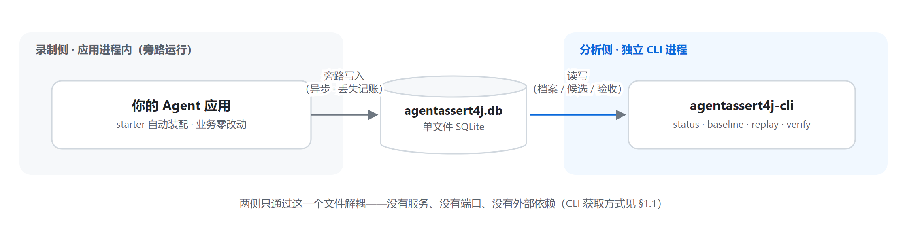
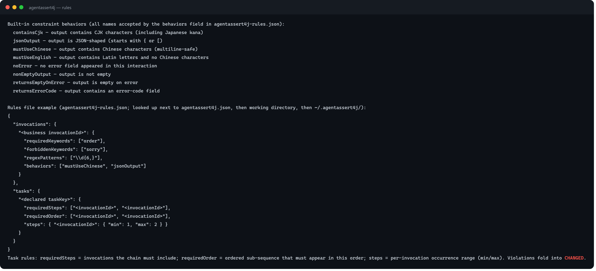
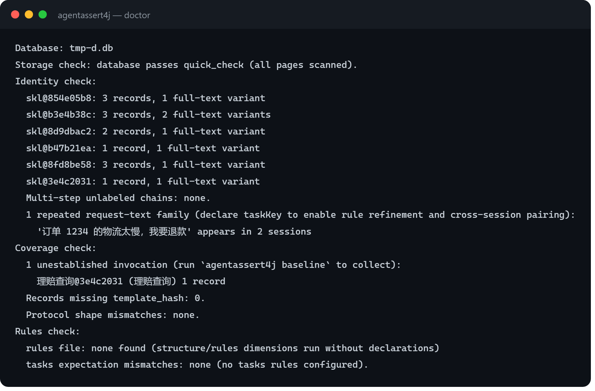
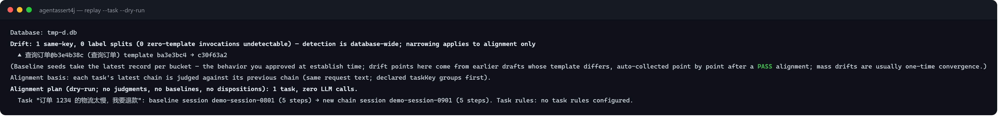
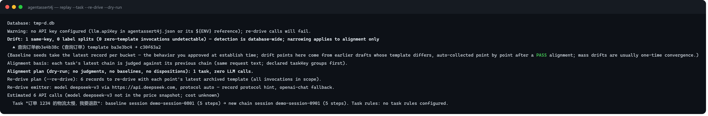
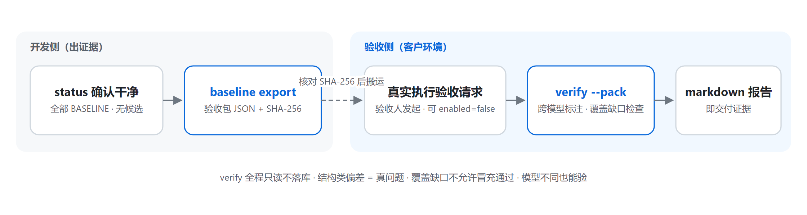
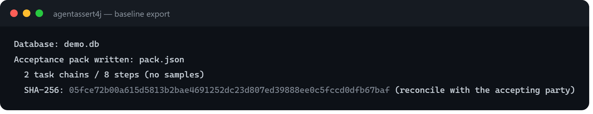
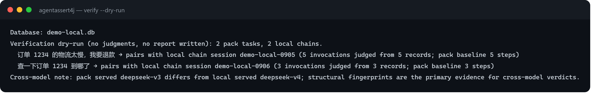
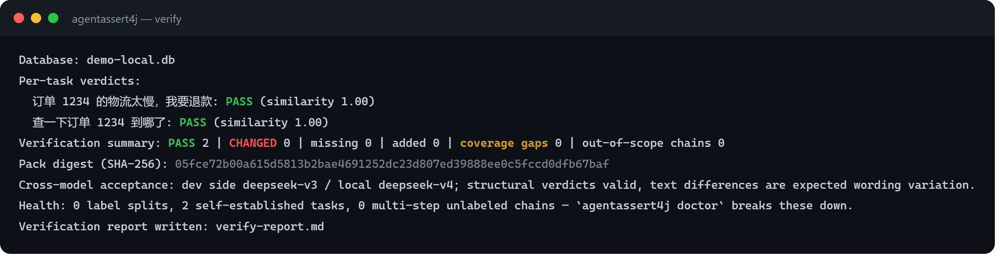
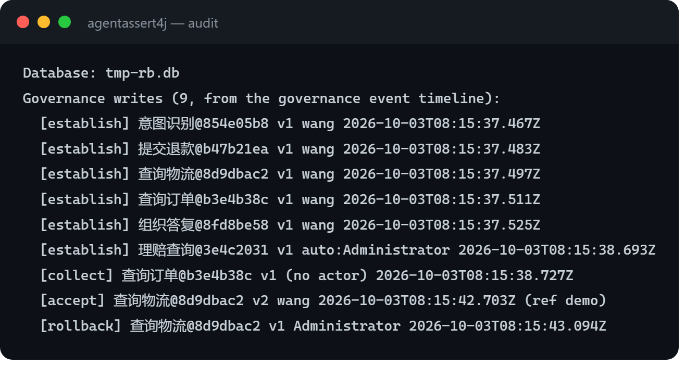

# AgentAssert4j 运维与交付手册（OPERATIONS）

> 面向部署、运维与交付工程师的实操手册。概念与命令的完整语义见 [README.zh.md](README.zh.md)；
> 完整生命周期教程见 [guide/tutorial.zh.md](guide/tutorial.zh.md)；架构地图见
> [ARCHITECTURE.zh.md](ARCHITECTURE.zh.md)。

**目录**：[1. 部署形态](#1-部署形态) ｜ [2. 配置参考](#2-配置参考) ｜ [3. 库文件运维](#3-库文件运维) ｜
[4. CI 门禁配方](#4-ci-门禁配方) ｜ [5. 生产打包形态](#5-生产打包形态) ｜ [6. 交付验收运行手册](#6-交付验收运行手册) ｜
[7. 故障排查](#7-故障排查) ｜ [8. 最小录制契约](#8-最小录制契约) ｜ [9. 版本与兼容语义](#9-版本与兼容语义)

---

## 1. 部署形态

框架由两半组成，可以分开部署：

| 组件 | 形态 | 位置 |
|------|------|------|
| 录制侧 | starter（Boot 3/4）或三个 jar（core + recorder + storage-sqlite） | 被测应用进程内，旁路运行 |
| 分析侧 | `agentassert4j-cli` 命令行工具 | 任意能访问 SQLite 文件的机器/流水线节点 |

两侧通过**单个 SQLite 文件**解耦：应用进程写，CLI 进程读。没有服务、没有端口、没有外部依赖。



数据库默认路径分侧：CLI 分析侧与 starter 录制侧默认均为 `~/.agentassert4j/agentassert4j.db`——建议在
主配置/starter 属性里显式指到应用的持久化目录，两侧保持一致。

### 1.1 分析侧 CLI 获取

| 方式 | 适用 | 做法 |
|------|------|------|
| **standalone jar**（推荐） | 人工操作、客户现场、交付物料随行 | 从 GitHub Releases 下载 `agentassert4j-cli-standalone`（不发布 Maven Central），`java -jar` 直接运行（只需 JRE 8+） |
| Maven 依赖引用 | 平台工程统一管理工具链 | pom 引入 `agentassert4j-cli`，传递依赖自动就位 |
| 源码构建 | 开发调试 | 见 [README.zh.md](README.zh.md)「模块结构」折叠节 |

每个子命令内置短别名（`s`/`b`/`a`/`g`/`v`/`d`/`c`/`rp`/`rj`/`rb`/`ru`/`au`/`m`，完整名永远保留，`--help` 可见；
`completion` 生成脚本会一并注册），`agentassert4j --version` 报出框架版本。单机常驻使用建议设别名
（示例以 Bash 为例；Windows 直接用完整命令）：

```bash
alias agentassert4j='java -jar agentassert4j-cli-standalone-1.0.0.jar'
```


### 1.2 跨平台运行注意

- **路径**：CLI 参数里的路径一律接受正斜杠（Windows 下 `D:/path/to.db` 与反斜杠等价，
  正斜杠在 shell 引号里无需转义，示例统一用正斜杠）。
- **Windows**：
  - 管道/重定向消费 CLI 输出（子进程读取、`>` 落盘后按 UTF-8 解析）时，启动命令加
    `-Dfile.encoding=UTF-8`——JVM 默认按平台字符集（中文 Windows 为 GBK）写特殊字形，
    UTF-8 消费者会解码失败；交互式终端显示侧可配 `chcp 65001`。框架自身输出串恒为
    UTF-8 源码串，无字面 GBK 内容。
  - **命令行参数走另一条解码链**（`sun.jnu.encoding`，由 OS 活动代码页决定，`-Dfile.encoding`
    管不到它）：含 emoji/非 BMP 字形的 `--db`/`--task`/`--invocation` 参数在中文 Windows 上会被
    解码成 `?` 并误报「不存在」——`-Dsun.jnu.encoding=UTF-8` 与 `JAVA_TOOL_OPTIONS` 同样无效
    （JDK 21 实测三种补救全部无效；BMP 内 CJK 无损）。含特殊字形的标识符走 MCP 通道
    （`record`/`check` 的参数经 JSON 传输，无参数解码层）或改用 BMP 内键名。
  - Git Bash / PowerShell / CMD 均可运行；`-D` 系统属性与 `--db` 等参数的引号规则遵循
    各 shell 惯例（PowerShell 对含空格路径用引号包裹即可）。
- **macOS / Linux**：无额外注意事项；`java -jar` 标准用法，JRE 8+。
- **时区与 locale**：判定与报告不含本地化内容；JVM 日志（JUL）级别词与时间戳由框架
  统一为英文/ISO 格式，不随系统语言变化。

## 2. 配置参考

### 2.1 主配置 `agentassert4j.json`

查找链（主配置与规则文件各一套，系统属性分别为 `agentassert4j.config.path` / `agentassert4j.rules.path`，
文件名固定 `agentassert4j.json` / `agentassert4j-rules.json`）：

1. 系统属性显式路径（不可读直接报错，不静默换源；显式配置生效时，rules/价格等伴生文件按**该配置文件所在目录**解析）→ 2. 当前工作目录（无显式配置时的查找起点）→ 3. `~/.agentassert4j/` →
4. classpath → 5. 安全默认值。 `storage.url` 为相对路径时按进程当前工作目录解析——服务化部署建议绝对路径。打开库的命令开头会打印实际命中的配置来源（`rules`/`completion` 不开库不打印，也不接受
`--db`——统一脚本逐命令追加 `--db` 时对这两个命令要跳过）。`${ENV_VAR}` 引用统一替换，未设置的变量替换为空串。

全部字段（都有安全默认值，可只写需要的段）：

```json
{
  "storage": {
    "url": "~/.agentassert4j/agentassert4j.db"
  },
  "regression": {
    "ignorableFields": []
  },
  "llm": {
    "apiKey": "${DEEPSEEK_API_KEY}",
    "endpoint": "https://api.deepseek.com",
    "model": "deepseek-v4-flash",
    "timeoutMs": 30000,
    "temperature": 0.0,
    "extraBody": ""
  }
}
```

| 段 | 键 | 默认 | 说明 |
|----|----|------|------|
| storage.url | — | `~/.agentassert4j/agentassert4j.db` | SQLite 文件路径，`~` 自动展开；开库命令（status/baseline/replay/accept/reject/rollback/verify/doctor/graph show/export）的 `--db` 可逐次覆盖 |
| regression.ignorableFields | — | 空列表 | 已知噪声字段白名单（归一化后仍不同才构成差异） |
| llm.protocol | — | 自动推导 | 重放端点的 wire 协议。不配置时自动推导：按基线记录的原摄取方言发射（同协议原样重放零配置），无记录提示时回退 `openai-chat`；显式配置 `openai-chat`/`anthropic-messages`/`openai-responses` 覆盖推导（跨协议重放）；未知值在消费 llm 配置的路径上报错并列全部合法值（re-drive 真跑与 re-drive dry-run 预演面都拦——预演不应展示真跑必然失败的计划）——不消费 llm 配置的命令不触发 |
| llm.apiKey | — | 空 | 重放用；支持 `${ENV}` 引用；缺失时 `--re-drive` 打印警告（bare 对齐零调用，不检查 Key） |
| llm.endpoint | — | `https://api.openai.com` | OpenAI 兼容端点（DeepSeek/通义等同协议端点均可） |
| llm.model | — | `gpt-4o` | 重放请求的模型；与录制模型不一致时命令行告警 |
| llm.timeoutMs | — | 30000 | **单次尝试**预算（下限钳 1000）；超时不重试 |
| llm.maxRetries | — | 2 | 传输层失败（429/5xx/连接被拒）的最大重试次数——直接决定重驱成本与时长 |
| llm.maxTokens | — | 空 | 发射请求的 max_tokens 兜底上限。Anthropic Messages 文法必填、基线记录未携带时按此值填充；空 = 客户端内置 4096。OpenAI 系文法可选、不发送 |
| llm.temperature | — | 0.0 | 钳位 0–2；推理模型方言下不携带（见故障排查 §7.3） |
| llm.extraBody | — | 空 | 追加到请求体顶层的原样 JSON 片段（厂商方言逃生舱，如 `"thinking":{"type":"disabled"}`） |

> 录制侧旋钮不在本文件——本文件是 CLI/MCP 操作面配置；录制旋钮见 §2.2 starter
> 属性（Boot 应用）与 `RecorderConfig.builder()`（非 Boot 应用）。写了 `recorder`
> 段会收到未知键告警。

内置价格快照按**模型族**键覆盖主流族（gpt/o/gemini/qwen/deepseek 等；快照未覆盖的模型报 `cost unknown` 并点名该模型名——如实不编造）。价格快照缺模型族（或需要改价）时，在 `agentassert4j.json` 同目录放 `agentassert4j-prices.json`（按需惰性加载：仅在有成本估算需求——重驱报价/总结——时读取与告警，零重驱目标的运行不会触碰它）
覆盖（格式与快照一致：模型族 → `{"input": 每token价, "output": 每token价}`，美元）。查价规则
= 先精确键、后最长包含匹配（带日期变体归入族价）；**覆盖文件的族键真实压过快照更具体的族内键**
（写 `deepseek` 即给全 deepseek 族改价，快照的 `deepseek-chat` 等键同时让位），覆盖文件内部
自己的更长键仍以精确优先；未被任何模型命中的覆盖键惰性无害（不告警）：
同族改价、新族补充；文件损坏会被 SEVERE 告警而非静默失效。也可用系统属性
`agentassert4j.prices.path` 显式指定路径。
三协议的端点与鉴权形态：

| protocol | 端点示例 | 鉴权 |
|---|---|---|
| `openai-chat` | `https://api.deepseek.com`（一切 OpenAI 兼容端点） | Bearer |
| `anthropic-messages` | `https://api.anthropic.com` 或厂商的 Messages 兼容端点（如 `https://api.deepseek.com/anthropic`） | `x-api-key` + `anthropic-version`（客户端自带） |
| `openai-responses` | `https://api.openai.com` 或 `https://api.deepseek.com` | Bearer |

### 2.2 starter 属性（`application.yml`，前缀 `agentassert4j`）

属性树镜像 agentassert4j.json 的命名（storage.url），录制域全旋钮开放——同一旋钮跨通道同语义同形：

| 属性 | 默认 | 说明 |
|------|------|------|
| `agentassert4j.enabled` | `true` | `false` 时自动装配整体退出、不创建任何 Bean（**生产打包形态**，见 §5） |
| `agentassert4j.storage.url` | `~/.agentassert4j/agentassert4j.db` | 库文件路径，`~` 自动展开；与 json 通道同名同义 |
| `agentassert4j.recorder.default-invocation-id` | 空 | 应用级默认调用点标签——单技能应用一行完成身份声明 |
| `agentassert4j.recorder.endpoint` | 空 | 录制器级默认端点地址（endpoint 列，基线跨部署可比的部署身份）；多模型 JVM 用逐调用 `RecordingContext.withEndpoint` 覆盖 |
| `agentassert4j.recorder.batch-size` | 100 | 批量落库批大小 |
| `agentassert4j.recorder.flush-interval-ms` | 5000 | 定时冲刷间隔（毫秒） |
| `agentassert4j.recorder.max-buffer-size` | 500 | 缓冲上限（超限丢弃并计数） |
| `agentassert4j.recorder.ring-buffer-size` | 16384 | Disruptor RingBuffer 大小（向上钳位到 2 的幂） |
| `agentassert4j.recorder.sensitive-fields` | 空列表 | 敏感字段名（脱敏匹配，忽略大小写） |
| `agentassert4j.recorder.sanitize-strategy` | `MASK` | 脱敏策略：`MASK` / `HASH` / `DROP` |
| `agentassert4j.recorder.sanitize-user-input` | `false` | 脱敏 userInput（影响回归重放，默认关） |
| `agentassert4j.recorder.sanitize-model-response` | `false` | 脱敏 modelResponse |
| `agentassert4j.recorder.record-undeclared-chat` | `true` | `false` 时未声明且无可见工具调用的纯对话被过滤（量级卫生选项） |
| `agentassert4j.recorder.enabled` | `true` | 录制器开关：`false` 时管道不启动（自动装配仍在，与总开关构成两层防护） |

非 Boot 应用（原生 Java / 非 Boot Spring）：程序化装配 `RecorderConfig.builder()`——
旋钮与上表一一对应；Spring Java Config 姿势：`@Bean` 方法内经 builder 映射宿主自己的
配置源，框架不自带第二份文件格式。

### 2.3 规则文件 `agentassert4j-rules.json`（可选精修）

```json
{
  "invocations": {
    "refund": {
      "requiredKeywords": ["退款"],
      "forbiddenKeywords": [],
      "regexPatterns": [{ "pattern": "订单号[:：]?\\d+", "description": "必须回显订单号" }],
      "behaviors": ["nonEmptyOutput"]
    }
  },
  "tasks": {
    "refund-flow": {
      "requiredSteps": ["提交退款"],
      "requiredOrder": ["意图识别", "查询订单", "提交退款"],
      "steps": { "查询订单": { "min": 1, "max": 3 } }
    }
  }
}
```

- 顶层键 `invocations` 的值是调用点**声明标签**（invocationId）；未声明的调用点零涉入（纯结构差分）。
- 判定方向是「基线声明、当前答卷」：声明随基线指纹存档，重放时对当前输出校验。
- 只钉「该调用点**任何**合法响应都必含」的普适键——钉分支形态键会造成永久假 CHANGED。
- `rules` 命令列出全部内置行为名（`mustUseChinese` / `jsonOutput` / `nonEmptyOutput` 等 8 个）。
- 未知 behavior 名在 CLI 加载时告警；非法正则按不匹配处理（可见的失败信号，不静默放行）。
- 顶层键 `tasks` 是任务链纪律（团队步骤纪律的声明式门禁）：键是录制时以
  `withMetadata("taskKey", ...)` 声明的任务键（**派生请求文本不作键**，只对声明任务生效）；
  步骤指称是调用点声明标签。三类约束——`requiredSteps`（必备步骤，出现即可、顺序不约束）、
  `requiredOrder`（有序子序列，含存在性：任一标签未出现同样判违规）、`steps.min/max`
  （绝对次数范围，对新链出现计数直接判定）——违规折叠进链级 CHANGED → exit 1。
- `tasks` 在 replay 的逐任务对齐收尾评估（bare 全项目或 `--task`/`--invocation` 缩域均可——约束对
  已声明 taskKey 的链生效；自建基线即仅一条链的任务不评，首录先立档，从有对照的第二轮起生效）。
  **交付验收同样评估**：包内嵌声明规则段时，验收侧以包内规则对本机执行链评任务纪律（跨模型验收时
  编排波动会被如实报告）；无规则段的包降级跳过。配置了 tasks 但被评链未声明 taskKey 时报告出
  诊断行（不涉判定），防「配了规则没生效」；畸形声明（类型错值、非对象条目、min/max 双缺、min>max）
  解析时安全忽略或标注无约束力，CLI 加载时逐条告警。

`rules` 命令随时列出全部内置行为名与规则文件写法（演示库真实输出）：



> **声明何时生效**：规则声明在**钉入基线的时刻**绑定——`baseline`/`--force` 播种或 `accept` 入集
> （候选指纹按当时的规则提取）。报告头的 `Rules:` 行披露当前加载的文件，但判定只消费指纹携带的
> 钉定声明；建档后改规则文件不会静默重判历史（存在差异时 establish 会给规则漂移告警并指路
> check→accept 无副作用刷新或 `--force` 重播种）。两句并读才完整：**当前规则文件即时参与新链
> 判定**——文件内容与基线钉定不一致时，新链按文件规则评估并以在途候选可见落库（不静默），
> 与「钉定基线不动」同时成立；孤立读前句会误判为「改文件不影响判定」。


### 2.4 密钥与凭据配置（官方姿势）

LLM API Key **只被一个功能消费**：`replay --re-drive`（受控重驱的真调用）。录制、判定、
建档、验收（verify）全链路零 Key——不配密钥的安装是完整可用的，只差重驱。

**推荐形态：配置文件写 `${ENV}` 引用，密钥活在进程环境里**——

```json
{
  "llm": {
    "apiKey": "${MY_LLM_API_KEY}",
    "endpoint": "https://api.deepseek.com",
    "model": "deepseek-chat"
  }
}
```

- ConfigLoader 在加载时展开 `${环境变量名}`（热读：长驻进程改配置文件即生效，无需重启）；
  变量缺席时该键解析为空，重驱前置检查会给出「no API key configured」警告（dry-run 即可
  提前看到，不花钱）。
- 这个 `agentassert4j.json` 因此**可以安全入库**（含端点与模型，不含密钥）；密钥由
  启动 CLI / MCP server 的那个进程的环境提供（终端 `export`、CI secret、harness 注入）。

**为什么不用「字面量密钥」**：

| 位置 | 风险 |
|------|------|
| `agentassert4j.json` 写字面量 | 文件一旦入库/截图/共享即泄漏 |
| MCP 注册带 `-e KEY=<字面量>` | 多数宿主的 `mcp get`/配置界面会**原样回显注册项**（含 env 值），密钥进会话记录——Claude Code 已实测如此 |
| CI 明文变量 | 泄漏面同上，且进构建日志 |

**MCP 注册的官方姿势**（密钥经父进程环境 → `${ENV}` 展开，注册项零密钥）：

```json
{
  "mcpServers": {
    "agentassert4j": {
      "command": "java",
      "args": ["-Dagentassert4j.config.path=/path/to/agentassert4j.json",
               "-jar", "/path/to/agentassert4j-cli-standalone-1.0.0.jar",
               "mcp", "--db", "/path/to/agentassert4j.db"]
    }
  }
}
```

启动宿主前 `export MY_LLM_API_KEY=...`（或让宿主从系统级环境继承）即可；注册里不出现
密钥，`mcp get` 类回显也就无密可露。纯 record/check/verify 用途的 server 甚至无需密钥。

**CLI 侧同理**：终端 `export` 后直接跑（配置文件仍走 `${ENV}` 引用）；一次性注入的等价
形态是 `MY_LLM_API_KEY=... agentassert4j replay --re-drive`。

## 3. 库文件运维

- **单文件即全部状态**：备份 = 复制文件（建议停写窗口或接受只追加语义下的时间点快照）。
- **只追加**：`interactions` 是历史账本，重复录制会追加不覆盖——重建基线数据请换新文件或删除旧文件后重录。
- **schema 契约版本**（`PRAGMA user_version`）：库版本高于 CLI 支持值时**拒开**（旧工具不误读新数据）；
  发布前 schema 变更以**删库重建**承接，不提供迁移。升级 CLI 后若报版本不符，删除库文件重新录制建档。
- **判定语义版本**（当前 `det-v1`）：每份基线盖章时记录；CLI 升级后语义不一致时 replay **拒绝判定**
  （exit 2）并指引 `baseline --force` 重建——拿新尺子解释旧基线是被禁止的。
- **Windows 注意**：关停应用后 CLI 才能独占写库；自带录制器 Bean 必须显式声明 destroy 方法名 `stop`，
  否则 flush 线程锁住文件。
- **健康检查**：应用日志中的计数闭合账本 `recorded = written + dropped + failed`（filtered 另列）；
  任何对不上账的情况都是缺陷。
- **幂等键是全库全局的**：去重不区分写入方（recordId 恒为幂等键；response id 仅在 recordId 缺省时充当）——多实例部署或多评估者共库
  并行录制时，同 id 的第二条会 duplicate 并归属首录会话（**异会话**重发时报告带 `storedSessionId` 指路；同会话重发该字段省略——归属无歧义时不多说）。
  并行写入方给 recordId/response id 带实例前缀（如 `zcode-r5-…`）可从根上避开撞车。
- **共享库（多宿主/多人同库）三条运维规则**：①`--ci` 全库门禁对未建档键**fail-closed 拒绝**（E-GUARD
  exit 2）——这是设计行为不是故障：库里有任何未建档键，门禁就不出结论；②各宿主**判自己的域**——
  check/diff 带 `--task`/`--invocation` 缩域、establish 自己的键，别替别人裁决（跨宿主的在途候选
  对全库可见，属共享治理面）；③想跑全库门禁，前提是库里每个键都有人 establish 过（含等待显式
  建档的裂键——`baseline --invocation <key>` 逐个并入基线）。**④bare `replay`（无缩域）对
  全库未建档键自动建档**——以你当时的 actorTag 署名逐键 establish，等于替并行宿主建域（漏钉
  `-Dagentassert4j.config.path` 的一次裸跑就是一轮全域治理写）；共库上的 replay 一律带
  `--task`/`--invocation` 缩域。**⑤bare `baseline export` 收录全库任务**——他方任务连同
  任务键（未声明时即请求原文）与 servedModel 随包出境，验收侧还会把他方任务判为覆盖缺口
  （exit 2 假阴性）；共库出包一律 `--task` 缩域。框架不引入「键归属」概念，共享库的治理纪律靠这几条约定承载。
- **库体检**：`doctor` 命令一次性输出存储/身份/覆盖/规则四段确定性事实（存储深扫=PRAGMA
  quick_check 全库扫页——未触页的物理损坏对普通查询静默不可见，体检面主动扫出；骨架族形态、
  多步零标签链、未声明任务的重复请求文本任务族、未建档调用点、template_hash 缺失、规则期望
  错位）——零声明接入补声明、首次建档前自查都用它；只读不判定不建档。



## 4. CI 门禁配方

流水线里的一段式姿势（前置：应用带 recorder 跑一遍冒烟/e2e——新模板真实运行、归档入库）：

```bash
# 全项目门禁：--ci 拒绝为无基线调用点自动建档（防无人审的绿灯），漂移身份不并入
agentassert4j replay --ci --json
```

- **零写死、零 API Key**：bare 缺省即全项目变更检测与逐任务对齐，判定零 LLM 调用；
  `--re-drive` 受控复核属人工动作，不进流水线缺省。
- **退出码分流**：`0` 绿灯放行（`--ci` 下漂移未并入仍出 0，附「Identity not collected」警告——收敛动作
  留给人侧 replay 或 accept）；`1` 存在行为差异或证据缺口（对齐 CHANGED/缺步骤/新增步骤/
  任务规则违规/漂移挂起）——人裁决 accept/reject；`2` 用法或基础设施故障（含 `--ci` 无基线
  拒绝、判定语义不符、重驱预算耗尽/全败）——修环境，不算回归。
- `--json`：stdout 逐行输出机器可读报告（`agentassert4j.task-report/1`，mode 分段：
  drift-detection / task-align / ci-align（`--ci` 判定段）/ drift-disposition / task-re-drive / re-drive-dry-run / task-dry-run / member-check / exit-health（每流收尾的出口健康计数）），
  诊断与进度走 stderr；按退出码分流消费——0/1 解析 stdout 报告，2 解析 stdout 收尾行的
  `agentassert4j.error/1` 失败包络（`errorCode` 四族：E-USAGE 用法与选择器 / E-NO-DATA
  无可操作对象 / E-GUARD 判定守卫拒绝 / E-ENV 环境与 IO；`hints[]` 可行动建议必填，
  `nextAction` 给最可能的下一条命令）。人读模式的用法错误路径 stdout 零产出；判定类
  拒绝（E-GUARD，如 `--ci` fail-closed）stdout 会先输出拒绝前的报告段与引导文案。
  同一通道契约覆盖全部命令（schema 清单见 §9）。


- **预算池**（`--re-drive` 下生效）：`--max-total-calls/--max-total-tokens` 对本次运行全部真重驱
  合计封顶；耗尽后剩余点标 skipped，整体 exit 2（证据不完整不允许冒充绿）。
- **重驱观测归档**：完成对照的真调 served 交互会按被重驱记录的原键落库为观测记录
  （metadata 携带 `redriveOf` 指向被重驱记录），重驱报告的步级行回带观测记录 id——事后
  `record show` 即可取证 served 原文，不必重花钱再驱。观测记录不进任务链判定与漂移检测
  （检测仪器的观测不是业务执行），后续 `replay --ci` 不受重驱影响。
- **重驱的在途候选**：重驱判出的 CHANGED 与普通判定同规则注册在途候选（等待
  accept/reject——这是重驱发现的裁决路径），`status` 候选列上浮、`baseline export` 的
  `unadjudicated steps` 警告会计入；`--ci` 门禁不受影响（门禁只看最新链对认可集合的归属）。
- **重驱干跑的预算预演**：`--max-total-calls/--max-total-tokens` 参与干跑报价——计划行与
  估价只计预算内会执行的记录，并预告将被截断的数量（与真跑同一预算语义）。
- **干跑**：`replay --dry-run` 输出漂移集、对齐计划与重驱成本预估——零调用、零落库、零建档、
  零处置；重驱前先 `--dry-run` 看报价是推荐惯例。
- **CI 凭据**：门禁本体（`replay --ci`）零 Key——CI 里 `agentassert4j.json` 只需
  `storage.url` 一项；如需在流水线做受控重驱复核，密钥走 CI secret 注入环境变量、
  配置文件保持 `${ENV}` 引用（见 §2.4），并配 `--max-total-calls` 预算封顶。
- **验收段（可选第二阶段）**：交付侧 `baseline export` 出包（工件随流水线存档）→
  验收侧真实执行后 `verify --pack` 以退出码 gating——结构判据跨模型有效，
  `crossModel:true` 时措辞差异按预期标注（完整配方见 §6）。





- **稳定性探针（`--member-check`）**：入集前的量尺——任务最新链对最近几条历史链逐一对照（默认窗 5；
  `--member-window N|all` 单次，`regression.memberSampleWindow` 设配置默认，只收 ≥1 整数；`all`
  仅限单次调用）。**读数看 `matched k of N` 计数**（近邻 2/3=稳定，1/N 远古命中=考古），JSON 的
  `isMember` 布尔=「历史任一命中」，不承载阈值——AI 消费者 accept 前以计数为准。机器面字段集
  恒定：`matchedSessions` 列全部命中会话（未命中为空数组），`closestSession`/`closestScore`
  常驻（命中为 null、零配对时 closestScore 为 null），`prefixDependent` 标记该链是否延续早前
  会话的上下文前缀（延续链不回放前缀直接对比会把上下文缺失误判为回归，读数先看该标记）
  ——消费端无需按结论写条件分支。不带
  `--member-check` 时 `--member-window` 单独出现按用法错误拒绝（exit 2）。
  **取样与配对语义**：窗口取「该任务最新链之前」的最近 N 条历史链（按时间序，`all`=全部
  先于最新链的历史）；每条样本链与最新链做**逐步配对**（与 bare replay 同一配对器、
  同一五维判定）——命中（matched）=该次配对全维一致；报告步骤行列出的是配对双方，
  样本链的中段记录出现在步骤行属正常（它在链内有自己的执行位）。链内多次执行不折叠：
  配对按链对链进行，步骤行是配对的证据视图。

## 5. 生产打包形态

交付客户的生产构件与开发态**同一份**，仅配置不同：

```yaml
agentassert4j:
  enabled: false   # starter 不装配任何 Bean；录制 API 为 no-op
```

抽查方法：`enabled=false` 启动应用 → 正常业务调用 → 库文件不存在或无新记录 → 录制侧确认关闭。
CLI 分析侧不受影响，仍可对既有库做巡检/验收。

## 6. 交付验收运行手册

角色：开发侧（出证据）与验收侧（客户环境，模型/部署可不同）。验收侧 CLI 建议用 standalone jar
随交付物料携带（见 §1.1），只要求 JRE 8+。



**开发侧：**

1. 确认基线干净：`agentassert4j status`——全部调用点 BASELINE、无未裁决候选（候选先 accept/reject 清场）；
2. 导出：`agentassert4j baseline export --out acceptance-pack.json --ref <git提交号>` → 记录打印的 **SHA-256** 与任务链/步骤数；`--ref` 是申报制代码锚（不校验），验收方凭它核对"这份行为承诺来自哪个交付版本"；
   被排除的链在输出与 `--json` 报告的 `excluded` 数组中列出并给出原因（存在未建档步骤 / 基线违反自身
   声明规则）——排除属导出守卫，先把该链的基线建干净或修正规则声明再重导；



3. 导出时若存在**链末形态未裁决或在途候选**，导出警告并把 `unadjudicatedSteps` 计数写进报告
   （在途候选按调用点**全域**计数——裁决会改变整个集合，该调用点的全部步骤一起等）；包照常写出，
   顺带两条披露动力学：replay 的「Pending adjudication」段只在**本次判定产生了候选**时出现
   （全库口径、含他方在途候选，段头带 database-wide 标注），最新执行回归已认可形态后该段消失
   （候选行仍在 `status`，等裁决或被新判定取代）；
   先 accept/reject 再重导才是干净包；
4. 每次导出=一个文件+一个 SHA-256（标识**该文件字节**，Maven 发布物模型）；重新导出产生新摘要，
   核对认「那个文件」不认「最新导出」；
5. 需要附样本供人读时加 `--include-samples`（样本强制 MASK 脱敏，判定不消费；样本内容恒为
   `***`——跨组织包不携带任何原文，掩码完备优先于样本可读性，部分披露档与该威胁模型冲突，
   不提供）；
4. 敏感任务：确认录制时已用 `withMetadata("taskKey", <场景id>)` 声明任务键——**任务键=请求原文**会随包出境。

**搬运：** 验收方核对文件 SHA-256 后接收。包内容天然脱敏（结构指纹+调用点键+声明规则段——规则是
**断言**而非提示词，不含业务原文/模板；无原文/无模板）。验收比对以包内规则对本地执行记录对称
评估维度 3/4 与任务纪律（内容规则在验收侧有效：必需关键词缺失会被判 CHANGED；声明了
requiredSteps/order/counts 的包，编排纪律同样参与判定——跨模型验收时编排波动会被如实报告）；无规则段的包自动降级——
维度 3/4 跳过比对，报告 Content rules 行注记 skipped。

**验收侧：**

1. 部署被测应用（可 `enabled=false` 不录制），**真实执行**全部验收请求——框架不驱动产品入口，执行由验收人发起；
2. 核对：`agentassert4j verify --pack acceptance-pack.json --report verify-report.md`
   （拿不准本机链与包的配对情况时，可先加 `--dry-run` 预演——只列配对与跨模型注记，零判定零写入）。



3. 判读：
   - 结构偏差（工具集/参数类型/输出结构）= **真问题**，转开发侧；
   - 跨模型标注（开发侧/本地 servedModel 不同）= 文本措辞差异属预期内，结构判定依然有效；
   - **先看 Cross-model 行再下结论**：端点侧别名映射可能让「换了模型」实际未成立
     （两侧 servedModel 相同，如 deepseek-chat/deepseek-reasoner 同被路由到同一 served 名）——
     此时跨模型结论不适用，验收只是同模型复验；
   - **覆盖缺口**（包内任务未执行）= 补执行后重跑，缺口不允许冒充通过；缺口单独存在时 exit 2，与 CHANGED 并存时 exit 1（行为差异优先于证据缺口——两者都要处理，退出码取更接近判定语义的那个）；
   - **完整性锚（integrityHash）**：包内嵌载荷哈希，verify 复算失配即拒；同版本引擎
     导出的包缺锚字段（被删）同样拒绝。锚防的是「导出后手改包」（删任务/改指纹）；
     它不是防篡改密码学——对方连锚带字段一起伪造时退化为带外 SHA-256 核对纪律；
   - 跨模型下「字段全消失/全新增」先检查输出是否被 markdown 围栏或包裹格式改变——
     模型换了输出包裹习惯是最常见的假结构差异（下游裸 JSON 解析会真崩，值得当真问题处理）；
   - 范围外链（本地多出的任务）= 只列出，不判定。
4. `verify` 全程只读（不落库、不改本地基线），可反复执行；markdown 报告即交付证据，归档时附包文件的 SHA-256。



**退出码**：`0` 全部结构一致 ｜ `1` 存在结构偏差（含缺步骤/新增步骤）｜ `2` 版本守卫拒绝/覆盖缺口/用法错误。

## 6.1 agent 治理写回溯

框架是纯能力提供方，agent 能调用什么由 harness 权限系统决定；框架承担透明与事后审计。
约定：agent 驱动治理写时以 `--approver agent:<名称>` 申报机器身份（自由字符串，人类用
默认 OS 身份；reject/rollback 同样支持；MCP 工具面 approver 为必填参数——机器调用方
必须申报身份，缺席即拒）。六个治理动词（establish/force-rebuild/accept/
reject/rollback/collect）发生时落入治理事件时间线，agent 申报的治理写用一条命令回溯：

```bash
agentassert4j audit              # 人类清单：[动词] 键 版本 + 主体 + UTC 时间戳 + 代码锚
agentassert4j audit --json       # agentassert4j.audit/1 机器报告（writes 数组）
```



六个动词里 `collect` 的触发面最窄：同键模板身份漂移在 replay 对齐判定为 PASS（无行为差异）
时由框架自动并入，actor 恒为框架自身——按动词检索对账时它是唯一无人工主体的动词。
reject 与 rollback 不在画像上留状态痕迹，事件时间线是其唯一审计载体。被 reject 的形态会记入该调用点的 tracked 集合：同形态再次出现时不再注册候选（输出注记 `already tracked … previously rejected`）——防候选循环的既定语义，需要重裁时以 `baseline --force` 重建集合。force 的归档
**无限保留**（rollback 完整性优先）：归档行是完整指纹快照（KB 级），force 是语义升级/规则
重钉类的低频治理动作，真实负载下无膨胀风险——不设修剪。rollback 回执并列披露
两个身份：`executor` 是本次执行回滚的操作者（与事件表 actor 同源），`approvedBy` 是恢复版本
的原始审批人——回滚恢复的是历史基线，审批事实随之回退，操作者不要把 approvedBy 误读成自己
的操作记录。MCP 工具清单的
description 声明各变异动词的使用要求（如 accept 应在人类指示后调用），授权确认由
harness 权限系统执行。`--ref` 与 approver 是申报制自由串、不做校验——多人/多 agent 共库
协作时给 ref 带写入方与用途前缀（如 `zcode-r5-accept`、`release-gate-v3`），时间线的归属
一眼可读（actor 区分身份，ref 区分事由）。

**共库多代理纪律：裁决永远缩域**。bare `accept`/bare `baseline --force` 作用于全库在途
候选/画像——共享一个库文件的多代理（或多窗口）场景下，这会吞掉**其他代理**的在途候选。
纪律：`accept --invocation <键或标签>` 显式缩域（MCP 的 accept 同理——`invocation` 参数
缺省=全部在途候选）；裁决前先 `status --diff`（或 MCP `report` 带 `diff:true`）看清候选
属于谁（`approvedBy`/候选指纹的来源会话在列）。单代理独库场景 bare 形态无此风险。

**自动建档归因：`governance.actorTag`**。裸 replay 的自动建档署名形如 `auto:<OS用户名>`——多宿主
共用一台机器（同一 OS 用户名）时不可分。为每个宿主配置 `governance.actorTag`（如 `"zcode"`/
`"claude-code"`）后署名变 `auto:<user>@<tag>`，审计时间线恢复可归因；不配置则维持原形态。

**taskKey 是全局命名空间**。声明了相同 taskKey 的会话在共库上合并为同一任务——对齐域与重驱
预算随之合并（你会替对方的记录买单）。共库多宿主给 taskKey 带宿主前缀（如 `z11-…`/`c2-…`）。

## 6.2 MCP 接入（AI 自主验证回路）

standalone jar 本身就是 MCP server（stdio）：把行为回归能力交给 code agent / harness
自主调用。工具面 = CLI 动词的转发封装（check/diff/report/verify/doctor/graph + establish/
accept/reject + re-drive + export）+ record 摄取（非 Java 栈上报交互的入场券）。
其中 `graph` 回答值流问题（这个值最初从哪来、谁喂谁）：怀疑编排形状或值来源时先
`graph` 再 `check`——只读勘察、不进判定，HIGH 边自带命中值与源/目标记录对，人读
短形 + 图例，机器面 graph/1。

```json
{
  "mcpServers": {
    "agentassert4j": {
      "command": "java",
      "args": ["-jar", "/path/to/agentassert4j-cli-standalone-1.0.0.jar", "mcp", "--db", "/path/to/agentassert4j.db"]
    }
  }
}
```

- 工作目录建议指向项目根（`agentassert4j.json` 的隐式查找链 cwd → home → classpath）；
  `--db` 显式绑定库文件。
- Claude Code：`claude mcp add agentassert4j -- java -jar … mcp --db …`；ZCode/OpenCode
  等同构（stdio 客户端只需拉起子进程 + 读写管道）。
- 排障开关 `--diag`：逐消息向 stderr 记 method 与耗时（默认静默；stdout 只出协议消息）。
- Java 应用的**录制**仍走 starter/SDK（进程内直录）；MCP record 动词服务非 Java 栈
  （TS/Python agent 把原生 LLM 调用的原始请求/响应 JSON 上报落库，幂等可重发；
  **部分失败后重录整链时换新 recordId/session**——复用旧 id 会与库内既有记录跨运行混搭，
  tool_call_id 关联断裂会让值流图静默缺边）。
- **responses 方言的身份前提**：`openai-responses` 摄取的模板提取来自 `instructions`，或
  `input` 里 `type:"message"` 且 role 为 system/developer 的条目——条目缺 `type` 注解（chat
  风格混入）会被跳过并警告，system 模板随之丢失，身份退化为纯标签键（键无桶后缀、漂移检测
  致盲；doctor 的 `Records missing template_hash` 计数并点名记录 id）。
  注意值流图的两个前置条件：工具结果必须**回灌给模型**（作为 tool 消息进入下一条请求的
  history 并随该条记录上报），且值须由 **JSON 承载**才是可提取叶子（工具结果为 JSON 对象/
  数组、值是独立叶子；裸文本里嵌的值不可提取——确定性取舍，不做文本挖掘）。工具结果只留在
  本地脚本、或以裸文本回灌时，`graph` 对该值流无边缘但**近失诊断按记录对提示原因**（与
  库里边数无关恒在场：无可提取值/全被噪声排除/仅子串包含/无精确相等四类归因）。

**无 MCP 宿主时的最短自写客户端路径**（python/TS 起 stdio 子进程后，三段报文即可上报；
每次请求带递增 id，服务端响应同 id）：

```json
{"jsonrpc":"2.0","id":1,"method":"initialize","params":{"protocolVersion":"2024-11-05","capabilities":{},"clientInfo":{"name":"my-app","version":"1.0"}}}
{"jsonrpc":"2.0","method":"notifications/initialized"}
{"jsonrpc":"2.0","id":2,"method":"tools/call","params":{"name":"record","arguments":{"sessionId":"my-run-1","request":"<原始请求 JSON 字符串>","response":"<原始响应 JSON 字符串>","invocation":"my-step-label","taskKey":"my-task"}}}
```两种来源的
  **原文覆盖不同**：SDK 录制的记录 raw 双列恒为空——Spring AI 的 ChatModel 抽象层与
  LangChain4j 的 ChatModel 抽象层都只交付结构化消息对象、不暴露线上报文（Spring AI 1.x/2.x
  与 LangChain4j 1.0.0/1.18.0 均经字节码核实），属框架侧既有限制而非待办；MCP 上报的记录携带逐字原文；
  CLI 重驱的观测记录**无 raw 双列**（取证走结构化面：usage/servedModel/redriveOf，见 §6.3），
  `record show` 取证时以 MCP 上报为原文全量来源。

AI 自主回路的典型时序（人在 harness 权限系统里授权，不在框架里）：

```
record（上报交互，声明 invocation 标签与 taskKey）
  → doctor（健康：裂键/未声明告警）→ establish（建档，approver=agent:<名称>）
  → 改提示词 → check（全项目变更检测，零调用）
  → diff（缩域看具体差异）→ accept/reject（人类指示后裁决）
  → audit（人类事后回溯全部 agent:* 治理写）
```

工具结果为双形态：text 文本块（CLI 的 schema 标签 JSON 报告行，超预算截断；
含警告的 record 回执会在 text 尾部附 `stderr:` 段——**机器消费走 structuredContent**）+
structuredContent（`{"reports":[...]}`，JSON 视图工具才有——`report {diff:true}` 返回人读
视图时仅 content；失败态为 agentassert4j.error/1 包络对象，
按 hints 自助续行）。判定语义（PASS/CHANGED）由报告承载，exit 0/1 都不是工具错误；
读动词走 CI 语义（未建档拒绝并指向 establish，零治理写）。完整契约见
`guide/spec/mcp.md`。

## 6.3 模型切换与思考档位的行为回归

换模型、模型升级、供应商迁移、微调/蒸馏版本上线、为时延关掉深度思考、提示词 A/B 二选一、
工具服务换实现——共同的问题是「行为变了没有、变了多少、代价是什么」。框架的答案：已录基线是模型无关的结构承诺；重驱把同一批真实提示词原样打给新模型；
结构指纹逐调用点点名影响面，token/成本/时延给出代价账单。

配方：

1. 录制期：当前模型真实跑任务链 → `baseline --ref <模型/版本标注>`（代码锚顺带锚定模型版本）。
2. 切换：`replay --re-drive --model <新模型>`（单次运行覆盖，不改配置文件；`--endpoint` 同理可
   换端点）。改 `llm.model` 配置热读同样可行，但共享配置文件会被并行宿主互踩——**多宿主/CI
   场景优先用旗标**；思考档位 = 在快档/思考档两档模型间切换。MCP 面对应 re-drive 工具的
   `model`/`endpoint` 参数。
3. `replay --re-drive --dry-run` 看报价（调用数/预算），确认后真跑——录制的提示词原样发往新模型，
   `served_model` 注记就地披露服务端实际服务的模型（含厂商别名映射，配置模型 ≠ 到手模型当场可见）。
4. 判定读法：结构判定跨模型成立——PASS = 结构行为在新模型下保持；CHANGED 逐调用点点名影响面
   （工具集 / 参数类型 / 输出结构），措辞与详略差异不进判定。
5. 代价观测：input/output/**reasoning** tokens、costUsd、latencyMs 逐链对照——关思考省了
   多少时延与 token、开思考贵了多少，是数字不是感觉（reasoning/cache tokens 在记录的
   结构化列与 usage_raw，观测记录无 raw wire 双列，取证走结构化面）。
6. 跨环境验收：`baseline export` / `verify` 的主判据同样是结构指纹（跨模型成立），见 §6。

同一配方亦适用于提示词 A/B（两变体各真实跑同任务集，`--model` 一旗标之差）与工具服务升级回归
（工具维指纹直接比对）。
边界与守卫：配置模型 ≠ 录制模型时重放有换模型告警（含默认模型盲区）；思考内容不进结构指纹；
重驱花真实调用，`--max-total-calls`/`--max-total-tokens` 预算池封顶。

## 6.4 库信任边界（如实声明）

判定语义是确定性的，但库文件的信任模型是**君子协定**：谁拿到库文件写权限，谁就同时拿到了
历史（interactions 可删改）、链序（timestamp 是裸排序键）与审计署名（approver 是申报制、无认证）。
框架在 v1 **不提供**防篡改检测或完整性自证——把库文件当作你的事实源来保护（权限、备份、
CI 里只给分析侧读权限）。篡改排查时先备份再取证（`agentassert4j audit` 看治理时间线、
`record show` 看逐字原文），不要在未知成因下直接删库。

## 7. 故障排查

**先看两条全局守卫**：分析侧 CLI（status/replay/doctor/graph/verify/audit/baseline）对不存在的
库文件一律拒绝（`Database not found`）——首录建库只发生在 MCP record 摄取的写路径；
`Protocol shape mismatches`（doctor）的触发条件是**记录的协议声明与响应体方言不符**
（如声明 anthropic-messages 却是 openai-chat 报文——连锁后果：模板解析失败、
template_hash 缺失、invocationKey 无桶后缀），不是「同标签混用多种协议」。

**7.1 数据面**

| 症状 | 处置 |
|------|------|
| 落库数与业务调用量对不上 | 读应用日志计数账本：dropped（缓冲满，调大 batch/flush 或接受丢弃）、failed（批量写失败看 ERROR）、filtered（采集门，策略性） |
| status 看不到画像 | 建档守卫剔除了解析失败的记录——看命令告警行；`baseline` 幂等可重跑 |
| status 报「Unestablished invocations」 | 已录制但无基线画像的键（提示词新版本或零声明调用点）——重跑 `baseline` 并入基线（幂等），或确认属待废弃版本 |
| CLI 报「库版本高于支持值」 | 库由更新版本的框架创建——升级 CLI |

**7.2 判定面**

| 症状 | 处置 |
|------|------|
| member-check 的 closestScore 不含缺步惩罚 | 1 步链对 4 步链可报 `closestScore=1` 而 `matched=0`——读数看 matched 计数与 matchedSessions，closest 只是最相近链的形状分 |
| 重放全红 | 看每行的 served 模型注记（配置模型 ≠ 录制模型）；`status` 看判定语义版本是否一致（exit 2 有指引） |
| 疑似误报 | 看 summary 定位维度：参数类型→两侧词表应同源；文本不同≠差异（判定只看结构指纹）；确属噪声的字段加 `regression.ignorableFields` |
| 纯文本回答被判 CHANGED | 多为数量级跳变（回答长度档位变了）或声明规则失配——维度 2/3 的差异明细会点名 |

**7.2.1 输出面（Windows 管道乱码）**

| 症状 | 处置 |
|------|------|
| Windows 上管道消费 CLI 输出（重定向/子进程读取）出现乱码或解码失败 | JVM 按平台默认字符集（中文 Windows 为 GBK）写 `●`/`▲` 等字形，UTF-8 消费者按 GBK 解码即乱。启动命令加 `-Dfile.encoding=UTF-8`（终端显示侧可配 `chcp 65001`）；框架自身的输出串全为 UTF-8 源码串，无字面 GBK 内容 |

**7.3 调用面（重放 400/报错）**

| 症状 | 处置 |
|------|------|
| 端点 400 | tool 帧缺 callId 会跳过并告警；历史 system 帧已自动跳过；o 系模型的 temperature 由方言表自动裁剪并 WARN |
| 推理模型拒绝 temperature | 该参数不携带（自动）；需要厂商特殊开关用 `llm.extraBody` 逃生舱 |
| 超时 | `timeoutMs` 是单次尝试预算；超时不重试（重试只翻倍成本）；持续超时查网络/端点 |

**7.4 任务域**

| 症状 | 处置 |
|------|------|
| `--invocation` 报 covers multiple invocations（replay/accept/reject/rollback） | 这些命令的目标解析要求定位到**单个**调用点，不接受覆盖多个模板桶的业务标签——改用 invocationKey 唯一前缀或 status 显示短形（`标签@8位`）；baseline/status 的缩域解析无此限制（标签命中其全部模板桶：`--force` 跨桶重建、status 一标签展示全部桶） |
| `--task` 找不到链 | 输入须与录制请求文本精确相等（或给唯一前缀，命中多个不同任务会报错列候选）；或该会话开头无请求文本（纯工具起始）不构成任务链 |
| `verify` 报覆盖缺口 | 包任务在本地没有**精确同名**任务链——验收人按交付的请求清单原文执行；前缀同名的链不冒充证据（列入范围外） |
| 追问任务对不上 | 追问链携带会话前缀——真实再执行对照必须重演到该问为止的完整前缀，报告已标注提示 |
| 改了问法导致配不上 | 录制时用 `withMetadata("taskKey", <场景id>)` 声明任务键（声明优先于派生） |
| exit 2 且有 skipped | 预算池耗尽或调用失败——证据不完整；加大预算或修复调用环境后重跑 |
| 报告出现「违反任务规则」 | `rules.tasks` 纪律违规（缺必备步骤/次数越界/顺序不符）——明细点名标签与声明范围；确认是真实回归则改回，是纪律本身变了则更新 rules 文件后重跑 |
| 报告提示「任务规则不适用」 | 配置了 tasks 但该链录制时未声明 taskKey（规则只对声明任务生效）——补声明后重录，或确认无需纪律门禁 |
| 「违反任务规则」首录就报 | 自建基线（仅一条链）不评规则；规则从有对照的第二轮起生效——本行只在已有两条链时出现 |
| `baseline --force` 重建范围比预期大 | `--invocation` 的键前缀会先换算成业务标签，该标签下的**全部模板桶**一起重建（标签=业务身份，输出会透明列出）——只想重建单个模板桶时用完整 invocationKey 作目标 |
| 报告出现「cross-version pair」 | 同一声明调用点两侧提示词版本不同——判定照常但含混杂变量；受控复核用 `replay --re-drive`（先 `--dry-run` 看报价）逐点以最新归档模板重放 |
| 重驱报告「archived template text missing」 | 该漂移点在 `prompt_texts` 无全文可取（旧版录制或捕获侧漏设）——重新录制即可（管道现自动派生投影并归档） |
| 首次 bare replay 报出大量漂移 | 建档种子取桶内最新记录——混合模板历史的旧库首跑会对「画像身份落后于最新」的调用点各报一次，对齐 PASS 后逐点自动并入基线；属一次性收敛而非批量回归 |
| 某任务每次 bare replay 都 exit 1（差异固定） | 库里有被 reject 的变异/测试工件链（只追加事实，对齐层如实陈述）——该任务再真实执行两轮即自然痊愈（最新 vs 次新回到干净对）；CI 不受影响（流水线库是新鲜录制） |
| agent loop 里同一调用点每条链执行次数不同（规划器跑 1~3 次之类） | 这是 loop 主形态的正常现象，不是回归：判定只读每个调用点的**链末执行**；裸重放里次数差异进 `surplusCount` 注记、**不判差异不翻红**；确实要约束次数就声明任务纪律（`rules.tasks` 的 `requiredSteps` + `steps` min/max 范围），声明制、按任务生效 |
| loop 链中段的草稿/中间形态要不要管 | 不挡门：链末判定路径以 `earlierRecords`/`unapprovedEarlier` 注记披露（ci-align 报告逐步骤携带）；草稿的形态只有被 `accept` 入集才参与判定——迭代节奏就是「多轮试错，收敛了再入集」 |
| 标签裂键并入后任务仍 CHANGED | 并入只前移身份；对齐判定看的是最新两条**真实链**的现场重提比对，不消费任何治理档案——两条链结构本就不一致（模型非确定性或中间变异残留）就会持续 CHANGED。变绿路径只有一条：在当前模板下再真实执行，让最新两链结构一致（确定性输出即 PASS）后重放；`baseline --force`/`accept` 改的是画像基线与漂移身份，不改变链对链判定 |

## 8. 最小录制契约

不使用 SDK 适配时（JDK 8 / 自研栈），在你的 LLM 调用出口组装 `InteractionRecord` 交给录制器
（全框架共用同一存储与判定语义）：

```java
InteractionRecorder recorder = new InteractionRecorder(storageRepository, recorderConfig);
recorder.start();
try {
    // ...你的 LLM 调用...
    InteractionRecord r = new InteractionRecord();
    r.setRecordId(UUID.randomUUID().toString());
    r.setTimestamp(System.currentTimeMillis());
    r.setSeq(seq.incrementAndGet());          // 进程内单调，会话内排序键
    r.setSessionId(sessionId);
    r.setInvocationId("refund");              // 可选：声明调用点标签
    r.setTemplateHash(sha256Hex(systemPrompt)); // 身份锚（可省：缺省由 templateText 派生）
    r.setTemplateText(systemPrompt);          // 模板原文（重放请求重建素材）
    r.setUserInput(lastUserMessage);
    r.setModelResponse(responseText);
    r.setToolCalls(toolCalls);                // 有则填，含 toolName/arguments/result
    r.setHasToolCalls(!toolCalls.isEmpty());
    r.setApiProtocol("openai-chat");
    r.setModel(model);
    r.setServedModel(responseServedModel);
    r.setInputTokens(usage.inputTokens());
    r.setOutputTokens(usage.outputTokens());
    r.setLatencyMs(elapsed);
    r.setRecorderVersion("my-app-1");
    recorder.intercept(r);
} finally {
    recorder.stop();                          // 排空在途批次后关闭
}
```

字段分三档：

| 档 | 字段 | 说明 |
|----|------|------|
| 强烈建议显式填 | `recordId`（缺省兜底 UUID）、`sessionId`（缺省退 recordId 独立会话）、`timestamp`+`seq`（确定性排序键）、`userInput`、`modelResponse`、`invocationId` 或 `templateHash`（身份锚，双缺走 adhoc 请求哈希兜底；只填 `templateText` 时 `templateHash` 由管道派生）、`apiProtocol`、`model` | 决定身份、配对与重放质量 |
| 影响保真 | `templateText`（落 prompt_texts 原文库）、`templateSkeleton`（动态段替换为稳定占位符的模板骨架——声明后调用点身份按骨架定格，动态模板不再随组装漂移裂键；投影 `skeletonHash` 由管道回填）、`toolsDefinition`（JSON 数组原样——重放不带工具会假阳性）、`previousTurns`（多轮上下文，重放逐字复用）、`turnIndex`（该记录所处会话内的**用户轮次序号**，0 基、按协议各自换算——anthropic 的 tool_result 轮计为 user 轮）、`samplingParams`、`toolCalls[].arguments/result` | 决定重放（含链式半重放）与受控重驱的保真度 |
| 遥测 | `inputTokens/outputTokens`（输入侧=总处理 token）、`cacheRead/WriteTokens`、`reasoningTokens`、`usageRaw`（供应商原始 usage 逐字）、`latencyMs/ttftMs`、`costUsd`（无价格快照则留 null 不编造）、`servedModel` | 报告与成本可见性；`servedModel` 是跨模型验收的判定依据 |

其余字段（`invocationKey`、`templateHash`（缺省由 `templateText` 派生）与 `skeletonHash` 由管道 enrich 派生兜底；`endpoint`/`modelRequestRaw` 为预留位）
可不填。`metadata` 为 JSON 字符串扩展池，任务键声明写 `{"taskKey":"<场景id>"}`。

### 8.1 声明配方：跟着 doctor 提示三步走

声明不需要提前设计——先裸跑接入，doctor 与各命令出口会把值得声明的位置以确定性计数报出来，
按提示逐层补声明即可。三步各解决一个问题：

1. **调用点标签（`invocationId`）**——「这个调用点叫什么」。SDK 侧在适配注解/装配处声明；
   starter 单技能应用一行完成（`agentassert4j.recorder.default-invocation-id=tavern`）；最小录制契约直接填
   `r.setInvocationId("refund")`。声明标签后：调用点身份可跨模板版本稳定配对、任务规则有
   步骤名可依。多步全无标签的链会出现在 doctor「multi-step unlabeled chains」计数里。
2. **任务键（`taskKey`）**——「这条链属于哪个业务场景」。录制时在 `metadata` 写
   `{"taskKey":"查订单"}`（或链首 userInput 即场景名，声明优先于派生）。声明后：同一场景
   跨会话的多次执行自动配成「同一任务的多轮」，对齐/成员判定/任务规则全部按任务生效。
   重复出现却未声明的请求文本族会出现在 doctor「repeated request-text families」里。
3. **任务规则（rules.tasks）**——「这个场景必须怎么走」。声明 taskKey 后可在规则文件按
   声明值加 `requiredSteps`/`requiredOrder`/`steps` 次数范围；任务纪律在任务首航即评
   （单链也批改，违规折叠进 replay 退出码），此后每次对齐按新链侧评估。配了键却从未出现
   声明链会在 doctor「tasks expectation mismatches」里报错位。

发现-声明-验证的闭环：`agentassert4j doctor`（或 replay/status/verify 出口的 Health 一行）
→ 按计数补上面对应层的声明 → 重新录制 → doctor 计数归零。Health 一行的三个计数：label
split（同标签裂出的未建档新键）、self-established tasks（该请求文本只有一条链的任务——首次
录制即自建基线、暂无链间对齐证据）、multi-step unlabeled chains（多步零标签链）。全程零新机制，只是把录制契约
里已有的三个可选字段按需点亮。

### 8.2 宿主形态指引（真实宿主验证所学）

三条来自真实宿主（spring-ai-alibaba/Lynxe）验证的接入形态事实：

- **starter 自动包装只覆盖容器内 ChatModel bean**：BeanPostProcessor 挂点按 Spring bean
  装配命中；宿主在服务内部按需构建 ChatModel、不注册进容器时（如 Lynxe 的
  `LlmService` 动态构建），自动包装零命中、静默零录制。此类宿主在构建点手工
  `RecordingChatModel.wrap(chatModel, recorder)`（SDK 公开 API 的官方支持用法），
  录制器 bean 经 `@Autowired(required = false)` 注入、`agentassert4j.enabled=false`
  时为 null 不包装。接入后用 `doctor`/`status` 确认记录落库——「以为在录、实际没录」
  比接入失败更危险。
- **模板漂移锚定依赖 SystemMessage**：SDK 从请求里的 SystemMessage 计算模板哈希
  （模板身份与 prompt 变更检测的锚点）。宿主以 UserMessage 类型承载系统提示（模板引擎
  渲染后随用户消息进入请求）时模板哈希不生成——各出口以 zero-template invocation 如实
  披露「模板漂移不可检」，工具编排与输出形状两维指纹不受影响。宿主可改的把系统提示按
  SystemMessage 传入即可点亮。
- **多场景宿主应逐技能声明调用点标签**：全部记录共用一个默认标签时，不同场景（不同输出
  形状/工具面）落在同一调用点桶里，验收时以彼此形状为参照产生 CHANGED——这是共用桶的
  预期行为，不是误报。宿主按技能经 RecordingContext.withInvocationId 声明各自标签。
  两个使声明从「可选优化」变成「共库前置条件」的宿主形态事实：其一，编排型宿主
  （计划/多步执行入口）的链首文本常是环境样板（工作目录、工具状态等）而非任务要求
  ——任务要求在更早轮的帧里，不进链键，`--task` 请求文本前缀缩域对该入口失效，
  且同形态任务跨宿主互相配对；其二，未声明会话身份时每次模型调用各自独立成链
  （会话键兜底为记录 id），跨运行结构对比退化为相邻调用比较。共库环境下无声明
  的宿主没有可用的缩域手段（桶是共享的、任务键不可分辨），先声明再共库。

## 9. 版本与兼容语义

| 标识 | 当前值 | 语义 |
|------|--------|------|
| 存储 schema（`PRAGMA user_version`） | 1 | 固定不演进；schema 变更=递增版本号并只增不改 |
| 判定语义 | `det-v1` | 改变「同样差异得出什么判定」的变更必须递增 |
| 报告 schema | `task-report/1`（replay 逐行分段报告）、`verify-report/1`（含 `localServedModel`：跨模型验收时机器面可自足重建两侧模型对照）、`acceptance-pack/1`、`export-report/1`、`baseline-report/1`、`adjudication/1`、`rollback/1`、`status/1`、`candidate-diff/1`（`status --diff --json`：逐调用点的候选 vs 锚定形态结构化差异，供 AI 消费者给出裁决建议）、`graph/1`（`nodes` 全键清单 + `scanned` 扫描统计；HIGH 边含 `evidence`：命中值 + 源/目标记录 id）、`rules/1`、`doctor/1`、`audit/1`、`record/1`（MCP record 摄取回执：status/recordId/invocationKey/turnIndex/tokens，duplicate 与形状降级经 note 披露）、`record-view/1`（`record show --json`：单记录全量视图，recordKind 区分业务与重驱观测；结构化内容条件投影——userInput/modelResponse/finishReason/samplingParams/previousTurns 条数/toolCalls（success 三态原样投影，null=本层未观察执行结果），SDK 无 raw 捕获的内容经此可读）（每命令 `--json` 各对应其一；replay 的 mode 分段见 §4）、`error/1`（`--json` 失败包络：errorCode 四族 + hints + nextAction） | schema 标识自出生冻结；验收包跨引擎由判定语义版本守卫把关 |
| Maven 版本 | `1.0.0` | 已发布；后续缺陷修复递增 patch 号（1.0.1…） |
| CLI 可执行形态 | `agentassert4j-cli-standalone` | cli 模块的全依赖 shaded 产物（含 slf4j-nop 与 Main-Class），`java -jar` 直接运行 |

模块坐标前缀 `io.github.agentassert4j`；core 永不引入任何外部依赖（仅 java.base）。
