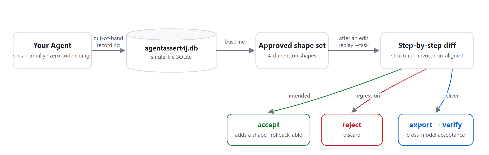
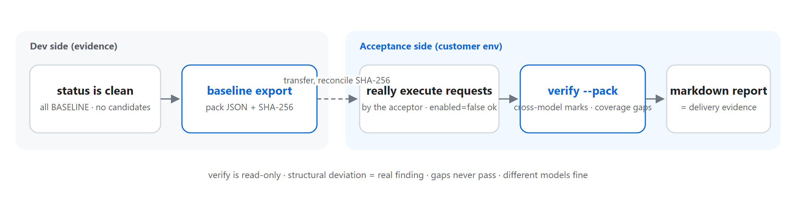

<div align="center">

# AgentAssert4j

**JVM-native behavioral regression testing for AI Agents**

Record → replay → differ: turn "will my prompts still work?" into a one-command diff report.

[](LICENSE)
[](#integration-matrix)
[](https://central.sonatype.com/)
[](#the-core-loop)

[Quick start](#quick-start) · [The core loop](#the-core-loop) · [Delivery acceptance](#delivery-acceptance-the-second-workflow) · [CLI reference](#cli-surface) · [Integration matrix](#integration-matrix) · [Operations guide](OPERATIONS.md)

English: **README.md** (this file) ｜ 中文文档：[README.zh.md](README.zh.md)

</div>

> **Positioning**: the verdict answers only "**same or different**" — 100% deterministic, reproducible,
> CI-gateable. Whether it is "better or worse" is a human call. Not an observability platform, not a
> prompt manager, no LLM-as-judge, no proxy/gateway, and it never drives your product's execution.

---

## The problem it solves

Your team ships a customer-service bot and iterates on system prompts daily. After every change two
questions hang in the air: **will the model still call the right tools? will the output format break?**
Multi-step tasks are worse — one user request makes the model run a look-up-order → check-logistics →
refund chain, and comparing two such chains by eye, line by line, is the most painful ritual in agent
development.

AgentAssert4j turns that ritual into one command: **recording establishes the baseline, replay after an
edit produces the diff report, a real re-run is aligned automatically, and `approve` / `reject` closes
the loop.** Zero business-code changes, a zero-dependency core, all state in a single SQLite file,
fully offline behind firewalls.

## The core loop



| Stage | Command | What happens |
|-------|---------|--------------|
| **Recording is the baseline** | (automatic) | The framework intercepts every real LLM call out-of-band; first recording establishes baselines automatically |
| **Frozen replay** | `replay --task --prompt` | Recorded inputs + new prompt, real calls: only steps whose template was edited actually run; the rest inherit the baseline verdict |
| **Automatic alignment** | `replay --task` | After the new version really runs, the two chains are paired by invocation: missing steps / added steps / per-step structure diff |
| **Adjudicate & gate** | `approve` / `reject` | Intended change gets promoted (old baseline archived, rollback-able); regression gets discarded; exit codes 0/1/2 gate CI directly |

## Quick start

Spring Boot 3 + Spring AI 1.x shown (for Boot 4 + Spring AI 2.x use
`agentassert4j-spring-boot4-starter`; every other stack, see the [integration matrix](#integration-matrix)).

**1. Add the starter, then use your ChatClient exactly as before**

```xml
<dependency>
    <groupId>io.github.agentassert4j</groupId>
    <artifactId>agentassert4j-spring-boot3-starter</artifactId>
    <version>1.0.0</version>
</dependency>
```

It works on startup: the framework wraps every `ChatModel` and records each call out-of-band — no
business-code changes, no added latency. The database defaults to `./agentassert4j.db`
(`agentassert4j.database` to relocate; full configuration in [OPERATIONS.md](OPERATIONS.md)).
To declare a business identity for specific calls (optional):

```java
try (RecordingContext scope = RecordingContext.start(sessionId).withInvocationId("refund")) {
    chatClient.prompt()...call();
}
```

**2. Get the CLI** (once)

```bash
# Download the standalone jar from GitHub Releases (single file, zero install) and alias it;
# on Windows use the full command directly
alias agentassert4j='java -jar agentassert4j-cli-standalone-1.0.0.jar'
```

**3. Establish baselines** (idempotent, safe to re-run)

```bash
agentassert4j baseline --approver wang
```

**4. Change the prompt, replay the whole task chain**

```bash
# --old-prompt names the prompt text BEFORE the edit: only steps whose template matches it
# replay with the new prompt; the rest are unaffected and inherit the baseline verdict
agentassert4j replay --task "Order 1234 arrived late, refund it" --prompt prompt-v2.txt --old-prompt prompt-v1.txt
```

```text
Task "Order 1234 arrived late, refund it" (session 20260831-a3f2, 5 steps):
  [1] classify-intent    inherited PASS (unaffected)
  [2] query-order        inherited PASS (unaffected)
  [3] query-logistics    CHANGED  score=0.76  output structure: added delivery.promise
  [4] submit-refund      post-divergence — not executed (conditional: re-establish by a real re-run)
  [5] compose-reply      post-divergence — not executed (conditional: re-establish by a real re-run)
Task summary: PASS 2 | CHANGED 1 | inherited 2 | post-divergence 2 | skipped 0 (5 steps, 1 real call)
```

Only affected steps make real calls; a CHANGED stops all later steps (marked "post-divergence");
text-wording differences are shown as low-confidence diffs for humans — **the verdict only reads
structural fingerprints**. Replays make real LLM calls and cost real money: preview the step plan and
cost estimate with `--dry-run` (zero calls, no baselining), then cap real runs with the
`--max-total-calls/--max-total-tokens` budget pool.

**5. Adjudicate, then align the real re-run automatically**

```bash
agentassert4j approve --invocation query-logistics   # intended: promote, old baseline archived
agentassert4j reject  --invocation query-logistics   # regression: discard; prompt rollback is git's job

# After the new version has really run, drop --prompt: zero LLM calls, the two chains are paired
agentassert4j replay --task "Order 1234 arrived late, refund it"
# missing steps / added steps / per-step structure diff / low-confidence text diff
```

A real alignment report (genuine CLI output on fictional demo data — one missing step, one added
step, one structural change, each named; exit 1; CLI output is localized in Chinese):


## Delivery acceptance (the second workflow)

Ship the behavior you demonstrated as portable evidence — **even when the customer environment runs a
different model**:



```bash
# Dev side: export the acceptance pack (single JSON, naturally sanitized — structure fingerprints and
# invocation keys only); note the printed SHA-256 for reconciliation
agentassert4j baseline export --out acceptance-pack.json

# Acceptance side: after the acceptance engineer really executes the requests, one command verifies
agentassert4j verify --pack acceptance-pack.json --report verify-report.md
```

- Structural deviations (tool set / param types / output structure) are **real findings** → dev side;
- Different models on the two sides are marked **cross-model acceptance**: wording diffs are expected,
  structural verdicts remain valid;
- Pack tasks never executed locally are **coverage gaps** (exit 2) — incomplete evidence never
  masquerades as a pass;
- `verify` is read-only and repeatable; the markdown report is the delivery evidence itself.

> The task key is the verbatim request text and travels inside the pack. For sensitive tasks, declare a
> task key at recording time via `RecordingContext.withMetadata("taskKey", <scene-id>)`.

## Four fingerprint dimensions: what the verdict reads

Every comparison consumes four structural fingerprint dimensions — deterministic operations only:

| Dimension | What is compared | When it participates |
|-----------|------------------|----------------------|
| ① Tool calls | Tool-call set, parameter type mapping | Every verdict |
| ② Output structure | Field-path set (added/removed named one by one), field types, content type, text magnitude band | Every verdict |
| ③ Content rules | Required / forbidden keywords, regexes | Only when declared in the baseline |
| ④ Behavior constraints | Built-in behavior checks (`nonEmptyOutput`, `jsonOutput`, `mustUseChinese`, 8 total) | Only when declared in the baseline |

No rules file = pure structure diffing (dimensions ①②): the default path has zero configuration and
zero noise. Compliance-style assertions can be declared per invocation in `agentassert4j-rules.json`;
dimensions ③④ then operate as "baseline declares, current output answers" (`rules` lists all built-in
behaviors). No second assertion language. Text differences never enter the verdict — they are shown to
humans as low-confidence references only. The same file's `tasks` section adds chain-level discipline
for declared tasks (required steps / step counts / ordering); violations fold into the same binary
verdict — see [OPERATIONS §2.3](OPERATIONS.md).

## CLI surface

| Command | What it does |
|---------|--------------|
| `baseline` | Extract fingerprints per invocation from recordings and stamp baselines (idempotent); `--force` rebuilds after a judgment-semantics upgrade |
| `baseline export` | Export the acceptance pack (`--task` to narrow; `--include-samples` appends force-masked samples) |
| `status` | Invocation list and baseline status; `--diff` shows pending candidate diffs |
| `replay` | Replay & compare. Task scope: `--task` (whole chain) / `--affected` (blast radius); invocation scope: `--prompt --invocation` (single point) |
| `approve` / `reject` | Adjudicate candidate fingerprints (promote / discard), `--invocation <target>` or `--all` |
| `rollback` | Restore a baseline from the archive (`--invocation` and `--version` both required) |
| `verify` | Delivery acceptance: pack × locally recorded chains (read-only) |
| `rules` | List built-in behavior checks and rules-file syntax |
| `graph show` | Read-only dependency graph (rebuilt from recordings on the spot) |

The inspection surface looks like this (genuine CLI output on the demo data — one row per invocation:
identity, baseline status, version, candidate, archived versions, business label; output in Chinese):


**Exit-code contract**:

| Exit code | Meaning | CI action |
|----------|---------|-----------|
| `0` | No deviation | Pass |
| `1` | Behavioral deviation (including missing/added steps) | Human adjudication: approve / reject |
| `2` | Usage or infrastructure failure / incomplete evidence (budget exhausted, coverage gap, `--ci` with unbaselined invocations) | Fix the environment; not a regression |

`--json` emits a single-line machine-readable report on stdout (one schema tag per command);
diagnostics go to stderr. Channel contract and schema list in [OPERATIONS.md](OPERATIONS.md).

## Integration matrix

| Your stack | Dependencies | Effort |
|------------|--------------|--------|
| Spring Boot 3.x + Spring AI 1.x | `agentassert4j-spring-boot3-starter` | Zero business-code changes |
| Spring Boot 4.x + Spring AI 2.x | `agentassert4j-spring-boot4-starter` | Zero business-code changes |
| Spring AI without Boot | `agentassert4j-sdk-spring-ai1` / `-ai2` + `recorder` + `storage-sqlite` | Assemble three beans manually |
| JDK 8+ any stack (hand-rolled HTTP) | `agentassert4j-core` + `recorder` + `storage-sqlite` | Build an `InteractionRecord` at the call site, hand it to `recorder.intercept(record)` — minimal recording contract in [OPERATIONS.md](OPERATIONS.md) |
| Home-grown "JSON routing" stack (no protocol-level toolCalls) | same as above | Declare identity where you parse the tool name; pin intent routing with rules.json regexes |

For stacks where Spring AI runs the full tool loop inside the model call, the framework decorates tool
callbacks with a pure observer: every tool name / arguments / result lands in the same record, in
order — zero business changes, the tool dimension fully visible. Replaying such records uses a
**chained half-replay**: recorded tool results are fed back as props round by round; the chain stops at
the first divergent decision and pinpoints the round.

## Identity: declared and zero-declaration

Invocation identity is derived deterministically from each record, in priority order: **declared label
> skeleton hash > template hash > request anchor**.

- **Declarations survive prompt edits**: every prompt edit changes the template hash; a declared label
  (`withInvocationId("refund")`, or app-wide `agentassert4j.invocation-id=tavern`) is the only anchor
  that survives;
- **Dynamic prompts freeze on the skeleton**: when the assembled prompt embeds volatile segments
  (dates, environment), declare a template skeleton (`withTemplateSkeleton(...)`, volatile parts
  replaced by stable placeholders) — same skeleton, different assembled text, same invocation; identity
  no longer drifts per run. Gating and replay still use the archived full text;
- **Zero-declaration is a first-class citizen**: undeclared records group by template hash with full
  replay/adjudication support — loop-style agents work completely with no declarations;
- Verdict correctness is decoupled from declaration quality: declarations affect report granularity,
  never verdict correctness.

## Design principles

| Principle | In one line |
|-----------|-------------|
| Determinism first | The verdict path is 100% deterministic and reproducible — same diff, same verdict, anywhere; never LLM-as-judge |
| Zero intrusion | The pipeline would rather drop data than block a business request; every loss is metered |
| Zero-dependency core | java.base only — JDK 8 clients can integrate; no licensing burden |
| Derived, not stored | Task chains and the dependency graph are derived views over recordings, rebuildable at any time |
| Internalize, don't externalize | Recording, grouping, baselining, selection, impact analysis — the framework does the work; users edit prompts and adjudicate |

<details>
<summary><strong>Modules & building from source</strong></summary>

```
agentassert4j-core                     zero-dependency heart (java.base only): model / SPI / algorithm / verdict
agentassert4j-recorder                 Disruptor async out-of-band pipeline (non-blocking, bounded, every loss metered)
agentassert4j-storage-sqlite           SQLite storage (aggregated under agentassert4j-storage/)
agentassert4j-sdk-spring-ai1 / -ai2    Spring AI 1.x / 2.x adapters (incl. tool-observation decoration)
agentassert4j-spring-boot3-starter     Boot 3 auto-configuration (core+recorder+ai1+sqlite)
agentassert4j-spring-boot4-starter     Boot 4 auto-configuration (core+recorder+ai2+sqlite)
agentassert4j-cli                      command-line tool (composition root: baseline/status/replay/verify/…)
agentassert4j-cli-standalone           fully-shaded executable form of cli (java -jar, no install)
```

Dependencies point one way; lower layers never know upper layers. Any non-JDK import in core is a
defect (greppable in CI).

Build the CLI from source:

```bash
mvn -B install -DskipTests
mvn -B -pl agentassert4j-cli dependency:build-classpath -Dmdep.outputFile=target/cp-cli.txt -Dmdep.includeScope=runtime
java -cp "agentassert4j-cli/target/classes;$(cat agentassert4j-cli/target/cp-cli.txt)" \
    io.github.agentassert4j.cli.AgentAssert4jCli status
```

Config lookup chain: system property `agentassert4j.config.path` → working directory →
`~/.agentassert4j/` → classpath → safe defaults. Full configuration reference in
[OPERATIONS.md](OPERATIONS.md).

</details>

## Documentation

- **[OPERATIONS.md](OPERATIONS.md)** — deployment forms, full configuration reference, CI gating
  recipes, delivery-acceptance runbook, minimal recording contract, troubleshooting
- **[guide/AgentAssert框架全景导读.md](guide/AgentAssert框架全景导读.md)** — a technical panorama and
  learning path: one continuous story through every feature, each act mapped back to real classes,
  methods and tables (for developers and contributors; content in Chinese)
- **[AGENTS.md](AGENTS.md)** — repository collaboration contract for human contributors and AI agents

## License

[Apache-2.0](LICENSE)
