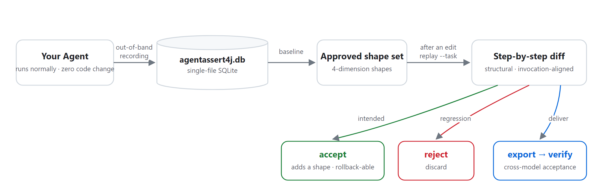
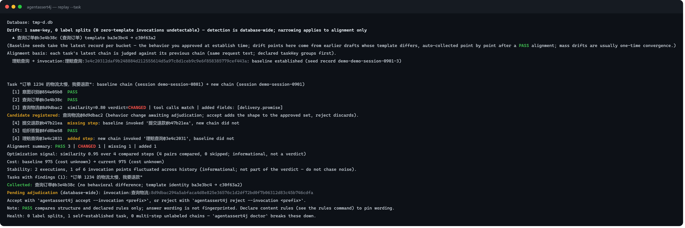
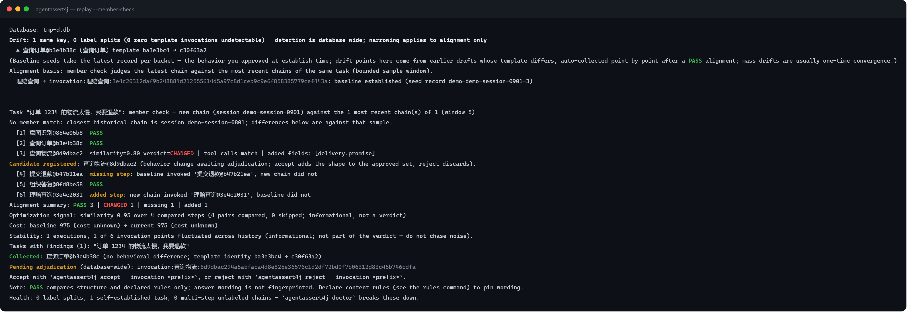
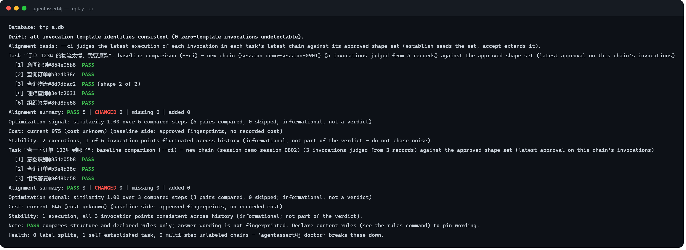
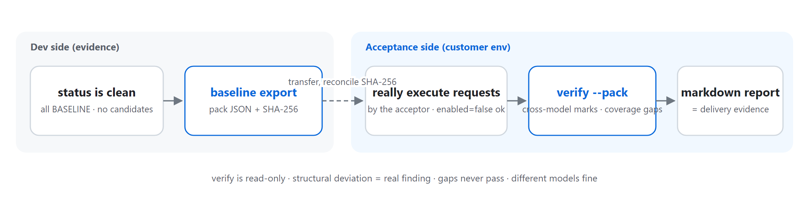
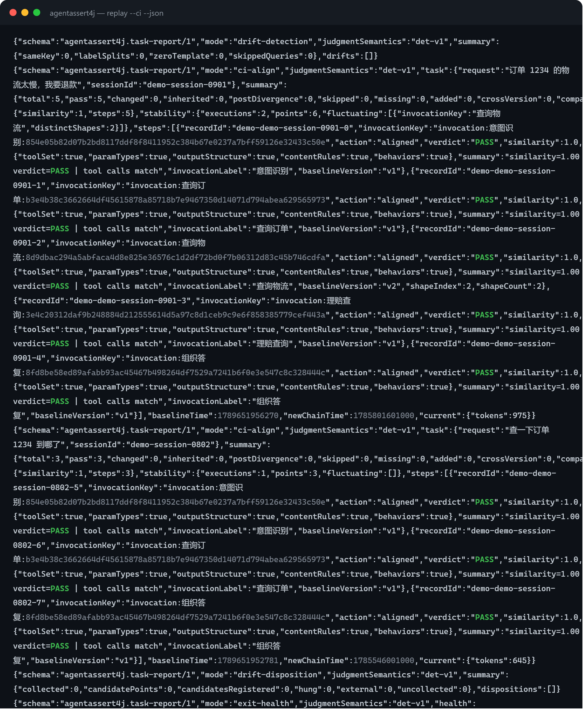
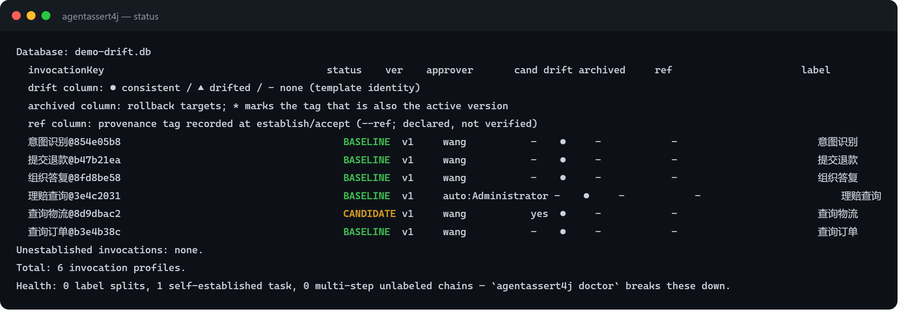

<div align="center">

# AgentAssert4j

**JVM-native behavioral regression testing for AI Agents**

Record → replay → differ: turn "will my prompts still work?" into a one-command diff report.

[](LICENSE)
[](https://central.sonatype.com/search?q=io.github.agentassert4j)
[](#integration-matrix)
[](https://github.com/agentassert4j/agentassert4j/releases)

[Quick start](#quick-start) · [The core loop](#the-core-loop) · [Delivery acceptance](#delivery-acceptance-the-second-workflow) · [CI](#ci-the-one-liner) · [Integration matrix](#integration-matrix) · [Operations handbook](OPERATIONS.md)

English: **README.md** (this file) ｜ 中文文档：[README.zh.md](README.zh.md)

</div>

> **Positioning**: the verdict answers only "**same or different**" — 100% deterministic, reproducible,
> CI-gateable. Whether it is "better or worse" is a human call. Not an observability platform, not a
> prompt manager, no LLM-as-judge, no proxy/gateway, and it never drives your product's execution.

---

## Five questions from real workflows

Your team ships a customer-service bot and iterates on system prompts daily; one user request makes the
model run a look-up-order → check-logistics → refund chain, and comparing two such chains by eye, line
by line, is the most painful ritual in agent development. Five real moments, one engine:

1. **"The prompt edit is done — who tells me nothing else broke before I ship?"**
   `replay` re-aligns the whole project after one real re-run and names every behavioral diff; `replay --ci`
   gates the pipeline on it. → [The core loop](#the-core-loop), [CI](#ci-the-one-liner)
2. **"The model stopped picking the new tool, or fills its params wrong — can merge review catch that?"**
   Tool descriptions are prompts too. The tool dimension (call set, parameter types) is fingerprinted and
   compared like everything else — a reworded tool description that flips selection shows up as a named
   diff; the same dimension gates tool-server upgrades. → [Fingerprint dimensions](#four-fingerprint-dimensions-what-the-verdict-reads)
3. **"The customer runs an intranet with a different model — how do I prove the behavior is still there?"**
   Export the acceptance pack, really execute on their side, `verify` one command: structural verdicts
   stay valid across models, wording diffs are marked as expected. → [Delivery acceptance](#delivery-acceptance-the-second-workflow)
4. **"Let the AI itself edit prompts, verify, and iterate."**
   The same engine is an MCP stdio server (17 tools): record, check, adjudicate-with-approval, audit —
   deterministic verdicts are a natural fit for self-correction loops. → [Operations handbook §6.2](OPERATIONS.md),
   [A Behavior-Regression Loop for AI](guide/ai-behavior-regression-loop.md)
5. **"We're switching models — or turning deep thinking off for speed. What exactly changes in the agent's behavior?"**
   Hot-swap `llm.model` and re-drive the recorded prompts against the new model: structural fingerprints name
   the behavior impact per invocation, and the report carries token/cost/latency deltas — reasoning tokens
   included, so the price of the thinking toggle is measurable, not anecdotal. → [Operations handbook §6.3](OPERATIONS.md)

One engine covers every working shape — prompt iteration on a Java agent, loop-style agent development
(judgment reads each invocation's chain-final execution, so a planner running 1–3 times per chain is
never a false red), single-call apps (zero-declaration grouping by template hash), model bake-offs,
intranet delivery, AI self-correction, and team forensics (see [Code anchors](#code-anchors) and the
[operations handbook](OPERATIONS.md)).

## The core loop



| Stage | Command | What happens |
|-------|---------|--------------|
| **Recording is the evidence** | (automatic) | The framework intercepts every real LLM call out-of-band; `baseline` seeds each invocation's **approved shape set** with the current shape — the latest execution per invocation, disclosed as `(seed record …)` (idempotent). In dev mode `replay` auto-establishes *fresh* invocations; a label-split key (same label, new template) is only disclosed, never auto-collected |
| **Change detection & alignment** | `replay` | Whole-project drift detection + per-task invocation alignment: missing steps / added steps / per-step structure diff, zero LLM calls |
| **Controlled re-drive (optional)** | `replay --re-drive` | Replays recorded inputs per drifted point against its latest archived template, real calls capped by a budget pool |
| **Adjudicate & gate** | `accept` / `reject` | Intended change: the shape **joins the approved set** (the previous set is archived as a version snapshot, restorable via `rollback`); regression: discarded. Exit codes 0/1/2 gate CI directly |

A baseline here is not one frozen answer: it is **the set of behavior shapes you approved**. Judgment asks
one question — does the latest execution land inside the set? `accept` appends, `rollback` restores a
whole-set snapshot, and the same truth travels into CI and the acceptance pack.

## Quick start

Spring Boot 3 + Spring AI 1.x shown (for Boot 4 + Spring AI 2.x use
`agentassert4j-starter-spring-ai2`; every other stack, see the [integration matrix](#integration-matrix)).

**1. Add the starter, then use your ChatClient exactly as before**

```xml
<dependency>
    <groupId>io.github.agentassert4j</groupId>
    <artifactId>agentassert4j-starter-spring-ai1</artifactId>
    <version>1.0.0</version>
</dependency>
```

Effective on startup: the framework wraps every `ChatModel` and records each call out-of-band — zero
business-code changes, no added latency. The database defaults to `~/.agentassert4j/agentassert4j.db`
(configurable via `agentassert4j.storage.url`, [full configuration](OPERATIONS.md#2-configuration-reference)).
To declare a business identity for one call (optional):

```java
try (RecordingContext scope = RecordingContext.start(sessionId).withInvocationId("refund")) {
    chatClient.prompt()...call();
}
```

**2. Get the CLI** (once)

```bash
# Download the standalone jar from GitHub Releases (single file, zero install); Windows: use the full command
alias agentassert4j='java -jar agentassert4j-cli-standalone-1.0.0.jar'
alias aa='agentassert4j'   # optional short alias, kubectl-style; full names always kept
```

**3. Establish the baseline** (idempotent)

```bash
agentassert4j baseline --approver wang
```

Every line discloses its seed: `… baseline established (seed record <id>)` — the seed is that
invocation's latest execution, i.e. the behavior you approved at establish time.

**4. Edit the prompt, really run it once, then re-align the whole project**

After editing, **really execute once** (smoke or e2e — the new chain lands automatically), then one
command, zero arguments, zero LLM calls:

```bash
agentassert4j replay
```

```text
Drift: 2 same-key, 0 label splits (0 zero-template invocations undetectable)
  ▲ 查询物流@8d9dbac2 (查询物流) template 6feac2e8 → d15016ac
Alignment basis: each task's latest chain is judged against its previous chain (same request text; declared taskKey groups first).
Task "订单 1234 的物流太慢，我要退款": baseline chain (session demo-session-0801) → new chain (session demo-session-0901)
  [2] 查询订单@b3e4b38c  PASS
  [3] 查询物流@8d9dbac2  similarity=0.80 verdict=CHANGED | tool calls match | added fields: [delivery.promise]
Candidate registered: 查询物流@8d9dbac2 (behavior change awaiting adjudication; accept adds the shape to the approved set, reject discards).
  [4] 提交退款@b47b21ea  missing step: baseline invoked '提交退款@b47b21ea', new chain did not
  [6] 理赔查询@3e4c2031  added step: new chain invoked '理赔查询@3e4c2031', baseline did not
Alignment summary: PASS 3 | CHANGED 1 | missing 1 | added 1
Pending adjudication: invocation:查询物流:8d9dbac294a5abfaca4d8e825e36576c1d2df72bd0f7b06312d83c45b746cdfa
Accept with `agentassert4j accept --invocation <prefix>`, or reject with `agentassert4j reject --invocation <prefix>`.
```

The detection layer names **which invocations changed template identity**; the alignment layer pairs
the two real chains of every task by invocation — missing steps / added steps / per-step structure diff,
wording differences shown to humans as low-confidence references, **the verdict reading structural
fingerprints only**. Zero API key. For a controlled review of recorded inputs against each point's new
template, add `--re-drive` (real calls; preview with `--dry-run`, cap with
`--max-total-calls/--max-total-tokens`).

**5. Adjudicate, then let the next real run re-align automatically**

```bash
agentassert4j accept   # bare = adjudicate every pending candidate; intended: the shape joins the approved set (previous set archived, rollback-able)
agentassert4j reject --invocation 查询物流   # regression: discard that candidate; prompt rollback is git's job

agentassert4j replay   # after the next real execution the new chain pairs automatically
```

A real alignment report (genuine CLI output on the demo database — one missing step, one added step,
one structural change, each named; exit 1):



## Iterating until it's good (the shape-set workflow)

"Try many drafts, baseline when satisfied" is a first-class rhythm: drafts never block the gate
(judgment reads each invocation's latest execution, earlier drafts disclosed as `unapprovedEarlier`
counts), a split key you haven't adjudicated never quietly turns the gate green or red, and the whole
approved set is versioned and rollback-able.

<details>
<summary><strong>The five rules of the shape-set workflow</strong></summary>

1. **Drafts don't gate.** Judgment reads each invocation's **latest execution** — an experimental draft
   earlier in the chain never fails the run; it is disclosed transparently (`earlierRecords` /
   `unapprovedEarlier` counts in the report).
2. **Measure stability before approving.** `replay --member-check` samples the task's most recent chains
   (window 5 by default; `--member-window N|all` per run, `regression.memberSampleWindow` as config) and
   reports `matched k of N` plus the matching session ids. Read stability from the count — `matched 2 of
   3` recent neighbors is stable; `1 of N` hitting only an old session is archaeology. The JSON
   `isMember` boolean means *any* historical hit; it deliberately carries no threshold.
3. **Approve each intended shape.** `accept` adds the shape to the invocation's approved set; the gate
   goes green immediately for chains ending that shape (`PASS (shape i of n)` in the report,
   `shapeIndex`/`shapeCount` in JSON).
4. **Shared invocations legitimately hold several shapes.** A file-reading tool called by different
   tasks with different output shapes is a normal citizen: approve each shape once — every chain ending
   an approved shape rechecks green, no flip-flopping between tasks.
5. **Roll back a whole set.** `rollback --version vN` restores the entire approved-set snapshot of that
   version (rolling back to the currently active version is refused with a pointer to `reject`).





</details>

## Delivery acceptance (the second workflow)

Ship the behavior you demonstrated as portable evidence — **even when the customer environment runs a
different model**:



```bash
# Dev side: export the acceptance pack (single JSON, naturally sanitized — no raw text, no templates);
# note the printed SHA-256 for reconciliation
agentassert4j baseline export --out acceptance-pack.json

# Acceptance side: after the acceptance engineer really executes the requests, one command verifies
agentassert4j verify --pack acceptance-pack.json --report verify-report.md
```

- Structural deviations (tool set / param types / output structure) are **real findings** → dev side;
  different models on the two sides are marked **cross-model acceptance**: wording diffs are expected,
  structural verdicts remain valid;
- Pack tasks never executed locally are **coverage gaps** (exit 2) — incomplete evidence never
  masquerades as a pass; the markdown report is the delivery evidence itself;
- The pack freezes the **approved shape sets** (the same truth the CI gate checks) and warns when
  chain-end shapes or in-flight candidates were never adjudicated (`unadjudicatedSteps`);
- Every export is one file with one printed digest — the SHA-256 identifies **that file's bytes**; re-
  exporting produces a new digest, so reconcile the specific file, not "the latest export".

> The task key is the verbatim request text and travels inside the pack. For sensitive tasks, declare a
> task key at recording time via `RecordingContext.withMetadata("taskKey", <scene-id>)`.

The full runbook — export guards, integrity anchor, verdict-reading checklist — is in the
[operations handbook §6](OPERATIONS.md#6-delivery-acceptance-runbook).

## CI, the one-liner

Gating a pipeline takes two fixed steps: run the app's smoke/e2e with the recorder on (the new
template really runs and is archived), then one command gates the whole project — nothing hardcoded,
no API key:

```groovy
stage('AgentAssert behavior regression') {
  steps {
    sh 'java -jar agentassert4j-cli-standalone-1.0.0.jar replay --ci --json > agentassert-replay.json'
  }
  post { always { archiveArtifacts 'agentassert4j.db, agentassert-replay.json' } }
}
```

The gate in action (genuine demo output: a real behavioral deviation → exit 1, the `task-report/1`
machine report lands line by line on stdout):



`--ci` judges the **latest execution of each invocation in each task's latest chain against its approved
shape set**. It never auto-baselines: an unbaselined invocation in scope exits 2 (fail-closed) —
including label-split keys awaiting explicit establish — and never collects drift identity inside the
pipeline. `--re-drive` is a human review action and stays out of pipeline defaults.

**Exit-code contract**:

| Exit code | Meaning | CI action |
|----------|---------|-----------|
| `0` | No deviation | Pass |
| `1` | Behavioral deviation (including missing/added steps) | Human adjudication: accept / reject |
| `2` | Usage or infrastructure failure / incomplete evidence (budget exhausted, coverage gap, `--ci` with unbaselined invocations, judgment-semantics mismatch) | Fix the environment; not a regression |

`--json` emits machine-readable JSON reports on stdout, one document per line; diagnostics go to
stderr; a failed run appends an `agentassert4j.error/1` envelope (error code, actionable hints, next
command) — ask for JSON, always get JSON. Channel contract and schema list in the
[operations handbook §4](OPERATIONS.md#4-ci-gating-recipes).

## Four fingerprint dimensions: what the verdict reads

Every comparison consumes four structural fingerprint dimensions — deterministic operations only:

| Dimension | What is compared | When it participates |
|-----------|------------------|----------------------|
| ① Tool calls | Tool-call set, parameter type mapping | Every verdict |
| ② Output structure | Field-path set (added/removed named one by one), field types, content type, text magnitude band | Every verdict |
| ③ Content rules | Required / forbidden keywords, regexes | Only when pinned into the baseline |
| ④ Behavior constraints | Built-in behavior checks (`nonEmptyOutput`, `jsonOutput`, `mustUseChinese`, 8 total) | Only when pinned into the baseline |

No rules file = pure structure diffing (dimensions ①②): the default path has zero configuration and
zero noise. Declarations bind **when they are pinned into a baseline** — editing the rules file after
establish never silently re-judges history. Text differences never enter the verdict — they are shown
to humans as low-confidence references only. The rules file's `tasks` section adds chain-level
discipline for declared tasks (required steps / counts / ordering) — see
[operations handbook §2.3](OPERATIONS.md#23-rules-file-agentassert4j-rulesjson-optional-refinement).

## Code anchors

Establishing (`baseline` / `--force`) and `accept` accept an optional `--ref` — a declared, never-
validated code anchor (a git commit, a tag, anything your team agrees on) that answers one question:
**which version of the code last had this behavior approved?** Every governance write lands on the
`audit` timeline with its actor, timestamp and anchor — AI (`agent:*`) and human writes on one line.

<details>
<summary><strong>Five ways teams use code anchors</strong></summary>

- **Incident archaeology** — behavior broke in production → the baseline's ref names the commit where it
  was last approved → `git diff <ref>..HEAD -- prompts/` is your suspect list;
- **Branch environments** — the database is a local file and never goes through git; each worktree carries
  its own, so branches are naturally isolated, and a rebase renumbering commits never corrupts the
  anchor's historical meaning;
- **Delivery reconciliation** — the acceptance pack carries its exporting code ref: "this behavior
  promise came from delivery X" is a cross-team receipt, not a claim;
- **AI prompt-optimization loops** — an agent naturally knows the HEAD it edited; approving with
  `--ref HEAD` costs nothing and keeps the audit trail complete (audit lists refs per write);
- **Honest boundaries** — anchors are leads, not credentials: refs may be absent (legal), they are never
  validated, and multi-repo teams should agree on which repo's commits a ref points at.

</details>

<details>
<summary><strong>CLI surface — all commands</strong></summary>

| Command | What it does |
|---------|--------------|
| `baseline` | Seed each invocation's approved shape set from recordings (latest execution per invocation, seed record disclosed; idempotent); `--force` rebuilds after a judgment-semantics upgrade |
| `baseline export` | Export the acceptance pack (`--task` to narrow; `--include-samples` appends force-masked samples) |
| `status` | Invocation list and baseline status; `--diff` shows pending candidate diffs; `--invocation` narrows |
| `replay` | Whole-project template-drift detection and task alignment (zero LLM calls by default); `--task`/`--invocation` narrowing; `--re-drive` controlled review; `--member-check` stability probe |
| `accept` / `reject` | Adjudicate the candidate shape (add to the approved set / discard). bare = every pending candidate; `--invocation <target>` narrows |
| `rollback` | Restore the invocation's whole approved set from an archived version snapshot (`--invocation` and `--version` both required) |
| `record show` | Echo one stored interaction's raw wire payloads (troubleshooting/forensics) |
| `verify` | Delivery acceptance: pack × locally recorded chains (read-only); `--dry-run` previews the pairing, `--report` writes the markdown evidence |
| `rules` | List built-in behavior checks and rules-file syntax |
| `graph show` | Read-only value-flow provenance graph (HIGH edges carry the matched value and record pair) |
| `audit` | List governance writes from the event timeline (verb/actor/time/code ref, including reject and rollback) |
| `mcp` | Run as a stdio MCP server (17 tools mirroring CLI verbs, for non-Java AI hosts) |
| `doctor` | Read-only health check in deterministic sections: identity, coverage, rules; advisory only (exit 0 in normal operation) |
| `completion` | Emit a shell completion script (bash style) |

Every command also has a short alias (`s`, `b`, `a`, `g`, `v`, `d`, `c`, `rp`, `rj`, `rb`, `ru`, `au`,
`m` — full names always kept, visible in `--help`); the `completion` script registers them in your shell.

The inspection surface looks like this (genuine CLI output on the demo database — one row per invocation:
identity, baseline status, version, candidate, archived versions, business label):



</details>

## Integration matrix

| Your stack | Dependencies | Effort |
|------------|--------------|--------|
| Spring Boot 3.4.5+ (verified baseline 3.4.5) | `agentassert4j-starter-spring-ai1` | Zero business-code changes |
| Spring Boot 4.0+ (verified baseline 4.0.0) | `agentassert4j-starter-spring-ai2` | Zero business-code changes |
| Spring Boot 3.4.5+ + LangChain4j 1.x | `agentassert4j-starter-langchain4j` | Zero business-code changes |
| LangChain4j (no Spring) | `agentassert4j-langchain4j` + `recorder` + `storage-sqlite` | Wrap your `ChatModel` with `RecordingChatModel.wrap(...)` |
| Spring AI without Boot | `agentassert4j-spring-ai1` / `-ai2` + `recorder` + `storage-sqlite` | Assemble three beans manually |
| Spring AI + LangChain4j in one app | both starters | Shared recorder/storage, each framework wrapped by its own decorator |
| JDK 8+ any stack (hand-rolled HTTP) | `agentassert4j-core` + `recorder` + `storage-sqlite` | Build an `InteractionRecord` at the call site, hand it to `recorder.intercept(record)` — minimal recording contract in [operations handbook §8](OPERATIONS.md#8-minimal-recording-contract) |
| Home-grown "JSON routing" stack (no protocol-level toolCalls) | same as above | Declare identity where you parse the tool name; pin intent routing with rules.json regexes |

For stacks where Spring AI runs the full tool loop inside the model call, the framework decorates tool
callbacks with a pure observer — every tool name / arguments / result lands in the same record, in
order; replaying such records uses a **chained half-replay** (recorded results fed back as props round
by round, stopping at the first divergent decision). LangChain4j orchestrates the tool loop outside the
model, so every LLM round is captured as its own record — value provenance consumes both shapes equally.

## Identity: declared and zero-declaration

Invocation identity is derived deterministically from each record, in priority order: **declared label
> skeleton hash > template hash > request anchor**. Declarations survive prompt edits
(`withInvocationId("refund")`, or app-wide `agentassert4j.recorder.default-invocation-id=tavern`);
dynamic prompts freeze on a declared template skeleton (`withTemplateSkeleton(...)`) so identity no
longer drifts per run; zero-declaration is a first-class citizen — undeclared records group by
template hash with full replay/adjudication support, so loop-style agents work with no declarations at
all. Verdict correctness is decoupled from declaration quality: declarations affect report granularity,
never verdict correctness.

## Design principles

| Principle | In one line |
|-----------|-------------|
| Determinism first | The verdict path is 100% deterministic and reproducible — same diff, same verdict, anywhere; never LLM-as-judge |
| Zero intrusion | The pipeline would rather drop data than block a business request; every loss is metered |
| Zero-dependency core | java.base only — JDK 8 clients can integrate; no licensing burden |
| Derived, not stored | Task chains and the dependency graph are derived views over recordings, rebuildable at any time |
| Internalize, don't externalize | Recording, grouping, baselining, drift detection, alignment, task derivation — the framework does the work; users edit prompts and adjudicate |

<details>
<summary><strong>Modules & building from source</strong></summary>

```
agentassert4j-core                     zero-dependency heart (java.base only): model / SPI / algorithm / verdict
agentassert4j-recorder                 Disruptor async out-of-band pipeline (non-blocking, bounded, every loss metered)
agentassert4j-storage-sqlite           SQLite storage (aggregated under agentassert4j-storage/)
agentassert4j-spring-ai1 / -ai2    Spring AI 1.x / 2.x adapters (incl. tool-observation decoration)
agentassert4j-langchain4j         LangChain4j 1.x adapter (pure programmatic, zero Spring; per-round capture)
agentassert4j-starter-spring-ai1     Boot 3 auto-configuration (core+recorder+ai1+sqlite)
agentassert4j-starter-spring-ai2     Boot 4 auto-configuration (core+recorder+ai2+sqlite)
agentassert4j-starter-langchain4j  Boot 3 auto-configuration for LangChain4j (core+recorder+lc4j+sqlite)
agentassert4j-cli                      command-line tool (composition root: baseline/status/replay/verify/…)
agentassert4j-cli-standalone           fully-shaded executable form of cli (java -jar, no install)
```

Dependencies point one way; lower layers never know upper layers. Any non-JDK import in core is a
defect (greppable in CI).

Build the CLI from source:

```bash
mvn -B install -DskipTests
mvn -B -pl agentassert4j-cli dependency:build-classpath -Dmdep.outputFile=target/cp-cli.txt -Dmdep.includeScope=runtime
java -cp "agentassert4j-cli/target/classes;$(cat agentassert4j-cli/target/cp-cli.txt)" \
    io.github.agentassert4j.cli.AgentAssert4jCli status
```

Config lookup chain: system property `agentassert4j.config.path` → working directory →
`~/.agentassert4j/` → classpath → safe defaults. Full configuration reference in the
[operations handbook](OPERATIONS.md).

</details>

## Documentation

- **[Operations handbook (OPERATIONS.md)](OPERATIONS.md)** — deployment shapes, full configuration
  reference, CI gating recipes, delivery-acceptance runbook, shared-database operating rules, MCP
  integration, minimal recording contract, troubleshooting
- **[Framework panorama (guide/framework-panorama.md)](guide/framework-panorama.md)** — the technical
  tour and learning path: one continuous story through every feature, each act mapped back to real
  classes, methods and tables (for developers and contributors)
- **[A Behavior-Regression Loop for AI (guide/ai-behavior-regression-loop.md)](guide/ai-behavior-regression-loop.md)**
  — why deterministic verdicts fit self-correction loops, and how to drive the MCP surface responsibly
- **[CONTRIBUTING.md](CONTRIBUTING.md)** — how to contribute; the full collaboration contract lives in
  [AGENTS.md](AGENTS.md) (Chinese)

## Community

- Bug reports and feature requests → [GitHub Issues](https://github.com/agentassert4j/agentassert4j/issues)
- Questions and integration help → open an issue with your CLI `--json` output attached
- Contributions → [CONTRIBUTING.md](CONTRIBUTING.md)

## License

[Apache-2.0](LICENSE)
