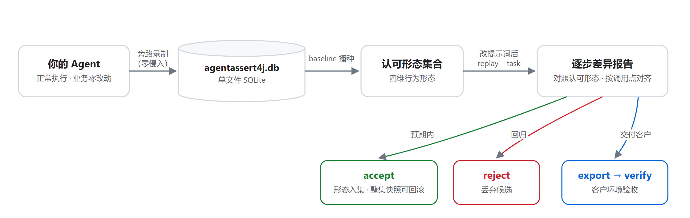
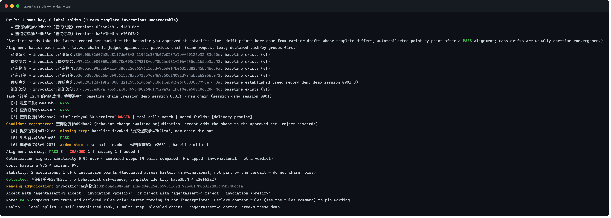
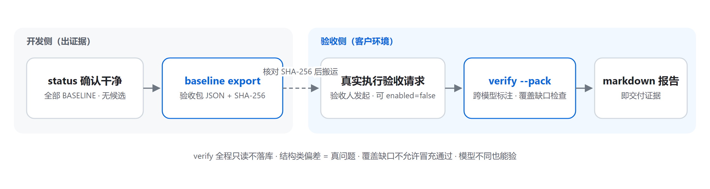
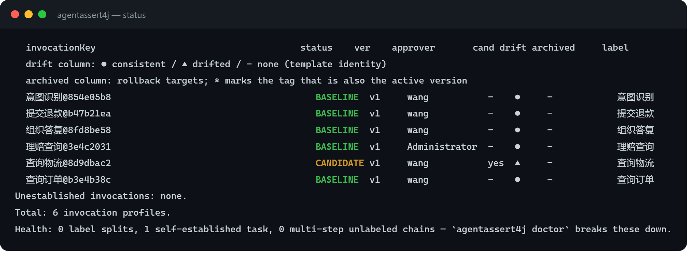

<div align="center">

# AgentAssert4j

**JVM 原生的 AI Agent 行为回归测试框架**

录制 → 重放 → 差分：把「改完提示词心里没底」变成一条命令的差异报告。

[](LICENSE)
[](#接入矩阵)
[](https://central.sonatype.com/)
[](#核心闭环)

[快速开始](#快速开始) · [核心闭环](#核心闭环) · [交付验收](#交付验收第二个工作流) · [CLI 参考](#cli-命令面) · [接入矩阵](#接入矩阵) · [运维手册](OPERATIONS.md)

中文文档：**README.zh.md**（本文）｜ English: [README.md](README.md)

</div>

> **定位**：判定只回答「**一样不一样**」——100% 确定、可复现、CI 可门禁；「更好还是更坏」由人裁决。
> 不是观测平台，不是提示词管理器，不引入 LLM-as-judge，不做代理网关，也从不驱动你的产品执行。

---

## 它解决什么问题

客服机器人每天都在改系统提示词，每次改完两个问题悬着：**该调的工具还会调吗？输出格式会崩吗？**
多步任务更磨人——用户一句「帮我退款」，模型自己跑出 查订单 → 查物流 → 退款 的调用链；改完提示词
再跑一遍，两条链哪里变了，全靠人肉眼逐行对。

AgentAssert4j 把这件事变成一条命令的功夫：**录制即基线，改后重放即报告，真实执行后自动对齐，
approve / reject 一键裁决。** 业务代码零改动，core 零外部依赖，全部状态就是一个 SQLite 文件，
内网离线可用。

## 核心闭环



| 环节 | 命令 | 发生了什么 |
|------|------|-----------|
| **录制即基线** | （自动） | 框架旁路拦截每次真实 LLM 调用，首录自动建档，零仪式 |
| **冻结重放** | `replay --task --prompt` | 录制输入 + 新提示词真实重放：只有模板被改动影响的步骤真调用，其余继承基线结论 |
| **自动对齐** | `replay --task` | 新版本真实执行后，按调用点自动配对两条链：缺步骤 / 新增步骤 / 逐步结构 diff |
| **裁决门禁** | `approve` / `reject` | 预期改进转正（旧基线归档可回滚），回归丢弃；退出码 0/1/2 直接 gating |

## 快速开始

以 Spring Boot 3 + Spring AI 1.x 为例（Boot 4 + Spring AI 2.x 线换
`agentassert4j-spring-boot4-starter`；其余所有栈见[接入矩阵](#接入矩阵)）。

**1. 加 starter 依赖，然后像平常一样使用你的 ChatClient**

```xml
<dependency>
    <groupId>io.github.agentassert4j</groupId>
    <artifactId>agentassert4j-spring-boot3-starter</artifactId>
    <version>1.0.0</version>
</dependency>
```

启动即生效：框架自动包装所有 `ChatModel`，旁路录制每次调用——业务代码一行不改，接口时延无感。
库文件默认 `./agentassert4j.db`（`agentassert4j.database` 可改，[全量配置](OPERATIONS.md#2-配置参考)）。
需要给某次调用声明业务身份时（可选）：

```java
try (RecordingContext scope = RecordingContext.start(sessionId).withInvocationId("refund")) {
    chatClient.prompt()...call();
}
```

**2. 准备 CLI**（一次性）

```bash
# 从 GitHub Releases 下载 standalone jar（单文件、零安装），起个别名；Windows 用户直接用完整命令
alias agentassert4j='java -jar agentassert4j-cli-standalone-1.0.0.jar'
```

**3. 建基线**（幂等，可重复执行）

```bash
agentassert4j baseline --approver wang
```

**4. 改提示词，重放整条任务链**

```bash
# --old-prompt 指明改动前的提示词文本：只有模板与之匹配的步骤按新提示词真重放，
# 其余步骤不受这次改动影响，直接继承基线结论
agentassert4j replay --task "订单 1234 的物流太慢" --prompt prompt-v2.txt --old-prompt prompt-v1.txt
```

```text
任务「订单 1234 的物流太慢」（session 20260831-a3f2，5 步）：
  [1] 意图识别      继承 PASS（未受影响）
  [2] 查询订单      继承 PASS（未受影响）
  [3] 查询物流      CHANGED  score=0.76  输出结构: 新增 delivery.promise
  [4] 提交退款      分歧后下游——未执行（条件态：基线行为在此之后是否仍成立需真实重跑收口）
  [5] 组织回复      分歧后下游——未执行（条件态：基线行为在此之后是否仍成立需真实重跑收口）
任务汇总: PASS 2 | CHANGED 1 | 继承 2 | 分歧后 2 | 跳过 0（共 5 步，真重放 1 次）
```

只有受影响的步骤发起真实调用；真重放遇 CHANGED 即停止后续步骤（标「分歧后下游」条件态）；文本措辞
差异以低置信 diff 呈现给人看，**判定只看结构指纹**。重放发起真实 LLM 调用、产生真实费用——先加
`--dry-run` 只出执行计划与成本预估（零调用、零建档），真实运行再用 `--max-total-calls/--max-total-tokens`
预算池封顶。

**5. 裁决，然后真实执行自动对齐**

```bash
agentassert4j approve --invocation 查询物流   # 预期内：候选转正，旧基线归档可回滚
agentassert4j reject  --invocation 查询物流   # 回归：丢弃候选；提示词回滚是 git 的事

# 新版本真实跑过之后，同一命令去掉 --prompt：零 LLM 调用，自动配对两条链
agentassert4j replay --task "订单 1234 的物流太慢"
# 缺步骤 / 新增步骤 / 逐步结构 diff / 文本 diff（低置信）
```

真实对齐报告长这样（虚构演示数据的真实输出——缺一步、新增一步、一个结构变化，逐条点名，exit 1）：



## 交付验收（第二个工作流）

把「演示时跑通的行为」作为可携带证据带到客户内网——**客户环境模型不同也能验**：



```bash
# 开发侧：导出验收包（单 JSON；天然脱敏——只有结构指纹与调用点键），记录打印的 SHA-256 与验收方对账
agentassert4j baseline export --out acceptance-pack.json

# 验收侧：客户环境真实执行验收请求后，一条命令核对并产出报告
agentassert4j verify --pack acceptance-pack.json --report verify-report.md
```

- 结构类偏差（工具集 / 参数类型 / 输出结构）= **真问题**，转开发侧；
- 开发侧与本地模型不同时自动标注**跨模型验收**：措辞差异属预期内，结构判定依然有效；
- 包内有而本地未执行的任务 = **覆盖缺口**（exit 2）——证据不完整不允许冒充通过；
- `verify` 全程只读不落库，可反复执行；markdown 报告即交付证据。

> 任务键 = 请求原文，随包出境。敏感任务请在录制时用
> `RecordingContext.withMetadata("taskKey", <场景id>)` 声明任务键，原文不入包。

## 四维指纹：判定看什么

每次比对消费四维结构指纹，全部确定性运算，无概率模型：

| 维度 | 比对什么 | 何时参与 |
|------|---------|---------|
| ① 工具调用 | 工具调用集合、参数类型映射 | 每次判定 |
| ② 输出结构 | 字段路径集合（新增/删除逐一点名）、字段类型、内容类型、文本数量级档位 | 每次判定 |
| ③ 内容规则 | 必含 / 禁含关键词、正则 | 基线声明了才有 |
| ④ 约束行为 | 内置行为约束（`nonEmptyOutput` / `jsonOutput` / `mustUseChinese` 等 8 种） | 基线声明了才有 |

不给 rules 文件 = 纯结构差分（维度 ①②），默认路径零配置零噪声；需要合规类断言时按调用点声明
`agentassert4j-rules.json`，维度 ③④ 以「基线声明、当前答卷」自动生效（`rules` 命令列出全部内置
行为名）。不引入第二套断言语言。文本差异永不进判定，只作低置信参考。同一文件的 `tasks` 段可给
声明任务加链级纪律（必备步骤 / 步骤次数 / 顺序），违规同样折叠进二值判定——写法见
[OPERATIONS §2.3](OPERATIONS.md)。

## CLI 命令面

| 命令 | 干什么 |
|------|--------|
| `baseline` | 从录制数据给每个调用点提取指纹、盖章建档（幂等）；`--force` 判定语义升级后重建 |
| `baseline export` | 导出验收基线包（`--task` 缩域；`--include-samples` 附强制脱敏样本） |
| `status` | 调用点清单与基线状态巡检；`--diff` 看待裁决差异 |
| `replay` | 重放比对。任务域：`--task`（整链）/ `--affected`（波及面）；调用点域：`--prompt --invocation`（单点） |
| `approve` / `reject` | 裁决候选指纹（转正 / 丢弃），`--invocation <目标>` 或 `--all` |
| `rollback` | 把基线回滚到归档版本（`--invocation` `--version` 均必填） |
| `verify` | 交付验收：验收包 × 本机真实执行链（只读） |
| `rules` | 查看内置约束行为目录与规则文件写法 |
| `graph show` | 依赖图谱只读视图（从录制数据现场重建） |

巡检界面长这样（演示库真实输出——每行一个调用点：身份、基线状态、版本、候选、归档、业务标签）：



**退出码契约**：

| 退出码 | 语义 | CI 动作 |
|-------|------|--------|
| `0` | 无差异 | 放行 |
| `1` | 存在行为差异（含缺步骤 / 新增步骤） | 人裁决 approve / reject |
| `2` | 用法或基础设施故障 / 证据不完整（预算耗尽、覆盖缺口、`--ci` 遇无基线调用点） | 修环境，不算回归 |

`--json` 输出单行机器可读报告到 stdout（每命令一个 schema 标签），诊断与进度走 stderr——
程序与人各看各的。通道契约与 schema 清单见 [OPERATIONS.md](OPERATIONS.md#4-ci-门禁配方)。

## 接入矩阵

| 你的栈 | 依赖 | 接入成本 |
|--------|------|---------|
| Spring Boot 3.x + Spring AI 1.x | `agentassert4j-spring-boot3-starter` | 零业务代码改动 |
| Spring Boot 4.x + Spring AI 2.x | `agentassert4j-spring-boot4-starter` | 零业务代码改动 |
| Spring AI（无 Boot） | `agentassert4j-sdk-spring-ai1` / `-ai2` + `recorder` + `storage-sqlite` | 手动装配三个 Bean |
| JDK 8+ 任意栈（自封装 HTTP） | `agentassert4j-core` + `recorder` + `storage-sqlite` | 调用出口组装 `InteractionRecord` 后 `recorder.intercept(record)`——最小录制契约见 [OPERATIONS.md](OPERATIONS.md#8-最小录制契约) |
| 自研「JSON 路由」栈（协议层无 toolCalls） | 同上 | 解析出工具名处写身份声明字段；意图识别用 rules.json 正则钉住 |

Spring AI 默认在模型侧内部执行完整工具回路的，框架通过**工具回调观察装饰**把每轮工具名 / 参数 /
结果按序记入同一条记录——业务零改动，工具维满血。重放这类记录走**链式半重放**：基线录制的旧结果
当道具逐轮续问，决策分歧当场停下并定位到轮。

## 身份：声明与零声明

调用点（invocation）身份从记录确定性派生，优先级：**声明锚点 > 模板锚点 > 请求锚点兜底**。

- **声明跨编辑稳定**：提示词一改模板指纹就变；`withInvocationId("refund")` 或应用级
  `agentassert4j.invocation-id=tavern` 是唯一跨提示词编辑稳定的身份锚；
- **零声明是一等公民**：不声明的记录按模板哈希归组，重放、裁决样样可用——agent loop 形态零声明
  即可完整使用，框架不逼人表态；
- 判定正确性与声明质量解耦：声明只影响报告粒度，不影响判定对错。

## 设计原则

| 原则 | 一句话 |
|------|--------|
| 确定性优先 | 判定链路 100% 确定、可复现——同样的差异在任何机器得到同一判定；永不引入 LLM-as-judge |
| 零侵入 | 录制失败宁可丢数据也绝不阻塞业务请求；每笔丢失进计数账本 |
| core 零依赖 | 仅 java.base——JDK 8 客户可接入，发布无合规负担 |
| 派生不建表 | 任务链与依赖图都是录制数据的派生视图，可随时全量重建 |
| 能内部消化的不外溢 | 录制、归类、建档、选例、影响集、任务派生框架自己算；用户只改提示词和做裁决 |

<details>
<summary><strong>模块结构</strong></summary>

```
agentassert4j-core                     零依赖心脏（仅 java.base）：模型 / SPI / 算法 / 判定
agentassert4j-recorder                 Disruptor 异步旁路录制（不阻塞、不 OOM、丢失记账）
agentassert4j-storage-sqlite           SQLite 存储（聚合于 agentassert4j-storage/）
agentassert4j-sdk-spring-ai1 / -ai2    Spring AI 两代适配（含工具观察装饰）
agentassert4j-spring-boot3-starter     Boot 3 自动装配（聚合 core+recorder+ai1+sqlite）
agentassert4j-spring-boot4-starter     Boot 4 自动装配（聚合 core+recorder+ai2+sqlite）
agentassert4j-cli                      命令行工具（组合根：baseline/status/replay/verify/…）
agentassert4j-cli-standalone           cli 的全依赖可执行形态（java -jar 直接用）
```

依赖单向、下层不感知上层；core 出现任何非 JDK import 都是缺陷（CI 可 grep 验证）。

从源码构建 CLI：

```bash
mvn -B install -DskipTests
mvn -B -pl agentassert4j-cli dependency:build-classpath -Dmdep.outputFile=target/cp-cli.txt -Dmdep.includeScope=runtime
java -cp "agentassert4j-cli/target/classes;$(cat agentassert4j-cli/target/cp-cli.txt)" \
    io.github.agentassert4j.cli.AgentAssert4jCli status
```

配置查找链：系统属性 `agentassert4j.config.path` → 当前目录 → `~/.agentassert4j/` → classpath →
安全默认值。全量配置参考见 [OPERATIONS.md](OPERATIONS.md)。

</details>

## 文档

- **[OPERATIONS.md](OPERATIONS.md)** — 部署形态、全量配置参考、CI 门禁配方、交付验收运行手册、
  最小录制契约、故障排查
- **[guide/AgentAssert框架全景导读.md](guide/AgentAssert框架全景导读.md)** — 框架技术全景与学习路线：
  用一个完整故事串起全部功能，每一幕落回真实的类、方法与表结构（面向开发者与贡献者）
- **[AGENTS.md](AGENTS.md)** — 面向贡献者与 AI 编码代理的仓库协作契约

## 许可证

[Apache-2.0](LICENSE)
