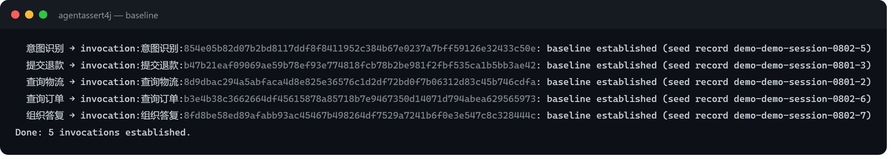
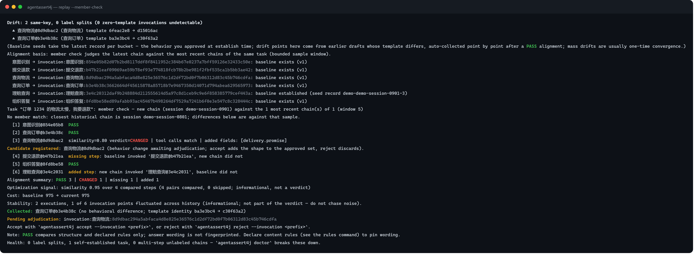
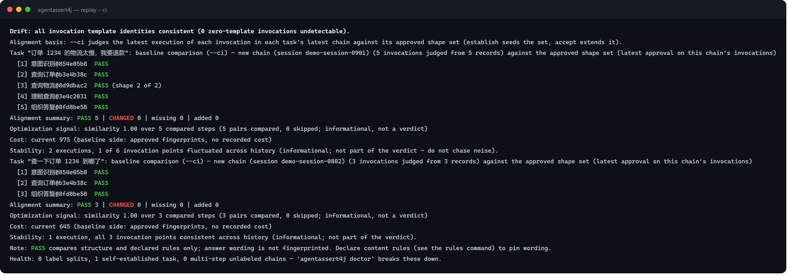
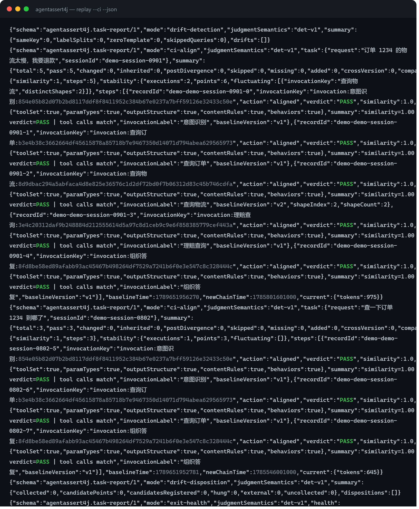

<div align="center">

# AgentAssert4j

**JVM 原生的 AI Agent 行为回归测试框架**

录制 → 重放 → 差分：把「改完提示词心里没底」变成一条命令的差异报告。

[](LICENSE)
[](#接入矩阵)
[](https://central.sonatype.com/)
[](#核心闭环)

[快速开始](#快速开始) · [核心闭环](#核心闭环) · [交付验收](#交付验收第二个工作流) · [CLI 参考](#cli-命令面) · [接入矩阵](#接入矩阵) · [运维手册](OPERATIONS.md)

中文文档：**README.zh.md**（本文）｜ English: [README.md](README.md)

</div>

> **定位**：判定只回答「**一样不一样**」——100% 确定、可复现、CI 可门禁；「更好还是更坏」由人裁决。
> 不是观测平台，不是提示词管理器，不引入 LLM-as-judge，不做代理网关，也从不驱动你的产品执行。

---

## 来自真实工作流的四个问题

客服机器人每天都在改系统提示词；用户一句「帮我退款」，模型自己跑出 查订单 → 查物流 → 退款 的
调用链，改完再跑一遍，两条链哪里变了全靠人肉眼逐行对。四个真实时刻，同一个引擎：

1. **「提示词改完了——发版前谁能告诉我没改坏别处？」**
   真实重跑一遍后 `replay` 全项目重新对齐，逐条点名行为差异；`replay --ci` 把它变成流水线门禁。
   → [核心闭环](#核心闭环)、[CI 一段式](#ci-一段式)
2. **「模型不选新工具了 / 参数填错了——合并评审能拦住吗？」**
   工具描述也是提示词。工具维（调用集合、参数类型）与一切行为同等地进指纹比对——一条改写措辞的
   工具描述翻转了选择，会以具名 diff 出现。→ [四维指纹](#四维指纹判定看什么)
3. **「客户内网、模型不一样——怎么证明行为还在？」**
   导出验收包，验收侧真实执行，`verify` 一条命令：结构判定跨模型有效，措辞差异标注为预期。
   → [交付验收](#交付验收第二个工作流)
4. **「让 AI 自己改提示词、自己验证、自己迭代。」**
   同一引擎即 stdio MCP server（17 工具）：record 摄取、check/diff 判定、带 approver 的治理动词、
   audit 对账——确定性判定天然适配自修循环。→ [OPERATIONS.md](OPERATIONS.md)、
   [给 AI 装上行为回归回路](guide/给AI装上行为回归回路.md)

## 五分钟按角色进入

- **在 Java Agent 上迭代提示词的你** → [快速开始](#快速开始)：加 starter，跑三条命令
  （`baseline` → 改完真实跑一遍 → `replay`），`accept`/`reject` 裁决。
- **要交付并在客户现场证明行为的你** → [交付验收](#交付验收第二个工作流)：己侧 `baseline export`，
  对方 `verify --pack`。
- **构建 AI 宿主的你（任意语言栈）** → 把 `agentassert4j mcp` 当 stdio server 用工具驱动整个回路：
  `record`（收原始 wire JSON，三协议）、`check`/`diff`、带 `approver` 的治理动词、`audit`。
  见 [OPERATIONS.md](OPERATIONS.md) 与 [给 AI 装上行为回归回路](guide/给AI装上行为回归回路.md)。

## 核心闭环


| 环节 | 命令 | 发生了什么 |
|------|------|-----------|
| **录制即证据** | （自动） | 框架旁路拦截每次真实 LLM 调用；`baseline` 以当前形态为每个调用点**播种认可形态集合**——种子=该调用点最新执行，逐行披露 `(seed record …)`（幂等）。replay 开发态只为全新调用点自动建档；裂键（同标签换模板）只披露、永不自动收编 |
| **变更检测与对齐** | `replay` | 全项目漂移检测 + 逐任务按调用点对齐：缺步骤 / 新增步骤 / 逐步结构 diff，零 LLM 调用 |
| **受控重驱（可选）** | `replay --re-drive` | 逐漂移点以最新归档模板重放历史输入做受控复核，花真实调用、预算池封顶 |
| **裁决门禁** | `accept` / `reject` | 预期改进：形态**加入认可集合**（此前整集归档为版本快照，`rollback` 可恢复）；回归：丢弃。退出码 0/1/2 直接 gating |

这里的基线不是一份冻结的标准答案，而是**你认可过的行为形态集合**：判定只问一件事——最新执行落在
不在集合里？`accept` 追加、`rollback` 恢复整集快照，CI 与验收包消费同一份真相。详见
[迭代到满意（形态集工作流）](#迭代到满意形态集工作流)。

## 快速开始

以 Spring Boot 3 + Spring AI 1.x 为例（Boot 4 + Spring AI 2.x 线换
`agentassert4j-spring-boot4-starter`；其余所有栈见[接入矩阵](#接入矩阵)）。

**1. 加 starter 依赖，然后像平常一样使用你的 ChatClient**

```xml
<dependency>
    <groupId>io.github.agentassert4j</groupId>
    <artifactId>agentassert4j-spring-boot3-starter</artifactId>
    <version>1.0.0</version>
</dependency>
```

启动即生效：框架自动包装所有 `ChatModel`，旁路录制每次调用——业务代码一行不改，接口时延无感。
库文件默认 `~/.agentassert4j/agentassert4j.db`（`agentassert4j.storage.url` 可改，[全量配置](OPERATIONS.md#2-配置参考)）。
需要给某次调用声明业务身份时（可选）：

```java
try (RecordingContext scope = RecordingContext.start(sessionId).withInvocationId("refund")) {
    chatClient.prompt()...call();
}
```

**2. 准备 CLI**（一次性）

```bash
# 从 GitHub Releases 下载 standalone jar（单文件、零安装），起个别名；Windows 用户直接用完整命令
alias agentassert4j='java -jar agentassert4j-cli-standalone-1.0.0.jar'
# 可选：更短别名（kubectl 的 k 同款社区约定；完整名永远保留）
alias aa='agentassert4j'
```

**3. 建基线**（幂等，可重复执行）

```bash
agentassert4j baseline --approver wang
```

每一行都披露种子：`… baseline established (seed record <id>)`——种子=该调用点最新执行，
即你在建档时刻认可的行为。



**4. 改提示词，真实跑一遍，然后全项目对齐**

提示词改完先**真实执行一遍**（冒烟或 e2e——新链自动入库），然后一条命令，零参数、零 LLM 调用：

```bash
agentassert4j replay
```

命令输出为英文单语（下面是演示库真实输出的节选）：

```text
Drift: 2 same-key, 0 label splits (0 zero-template invocations undetectable)
  ▲ 查询物流@8d9dbac2 (查询物流) template 6feac2e8 → d15016ac
  ▲ 查询订单@b3e4b38c (查询订单) template ba3e3bc4 → c30f63a2
Alignment basis: each task's latest chain is judged against its previous chain (same request text; declared taskKey groups first).
Task "订单 1234 的物流太慢，我要退款": baseline chain (session demo-session-0801) → new chain (session demo-session-0901)
  [1] 意图识别@854e05b8  PASS
  [2] 查询订单@b3e4b38c  PASS
  [3] 查询物流@8d9dbac2  similarity=0.80 verdict=CHANGED | tool calls match | added fields: [delivery.promise]
Candidate registered: 查询物流@8d9dbac2 (behavior change awaiting adjudication; accept adds the shape to the approved set, reject discards).
  [4] 提交退款@b47b21ea  missing step: baseline invoked '提交退款@b47b21ea', new chain did not
  [5] 组织答复@8fd8be58  PASS
  [6] 理赔查询@3e4c2031  added step: new chain invoked '理赔查询@3e4c2031', baseline did not
Alignment summary: PASS 3 | CHANGED 1 | missing 1 | added 1
Pending adjudication: invocation:查询物流:8d9dbac294a5abfaca4d8e825e36576c1d2df72bd0f7b06312d83c45b746cdfa
Accept with `agentassert4j accept --invocation <prefix>`, or reject with `agentassert4j reject --invocation <prefix>`.
```

检测层先点名**哪些调用点的模板身份变了**；对齐层把每个任务的
两条真实链按调用点配对——缺步骤 / 新增步骤 / 逐步结构 diff，文本措辞差异以低置信呈现给人看，
**判定只看结构指纹**。整条命令零 API Key。想让框架用各点的新模板重放历史输入做受控复核，加
`--re-drive`（花真实调用，先加 `--dry-run` 看报价，`--max-total-calls/--max-total-tokens` 预算池封顶）。

**5. 裁决，然后真实执行自动对齐**

```bash
agentassert4j accept   # bare = 裁决全部待裁决候选；预期内：形态加入认可集合（此前整集归档可回滚）
agentassert4j reject --invocation 查询物流   # 回归：缩域丢弃该候选；提示词回滚是 git 的事

# 下一次真实执行之后再跑一次 bare replay：新链自动配对，差异继续逐条点名
agentassert4j replay
```

真实对齐报告长这样（虚构演示库的真实输出——缺一步、新增一步、一个结构变化，逐条点名，exit 1）：


## 迭代到满意（形态集工作流）

「多轮试错、满意了再定基线」是被一等公民支持的自然节奏：

1. **草稿不挡门**。判定只读每个调用点的**最新执行**——链中更早的实验性草稿不会把整个运行判红，
   它以透明层披露（报告中的 `earlierRecords` / `unapprovedEarlier` 计数）。
2. **入集前先量稳定性**。`replay --member-check` 抽样任务最近几条链（默认窗 5；单次
   `--member-window N|all`，配置 `regression.memberSampleWindow`）给出 `matched k of N` 与命中
   会话名单。稳定性看计数：近邻 `matched 2 of 3` 是稳定，`1 of N` 命中一条旧会话是考古。JSON 的
   `isMember` 布尔=「历史任一命中」，刻意不承载阈值。
3. **逐形态认可**。`accept` 把该形态加入调用点的认可集合；以该形态收尾的链立即转绿
   （人读报告 `PASS (shape i of n)`，JSON `shapeIndex`/`shapeCount`）。
4. **共享调用点天然可以多形态**。同一个读文件工具被不同任务以不同输出形态调用是正常公民：
   每个形态认可一次——凡以认可形态收尾的链都复检为绿，不再任务间摆振。
5. **整集回滚**。`rollback --version vN` 恢复该版本的**整个认可集合快照**（回滚到当前活动版本会被
   拒绝并指路 `reject`）。





提示词编辑改了模板身份（同标签换模板）时，新键**永远不会被静默收编**：它以标签裂键浮出、被门禁
排除在外（`--ci` 出 2、fail-closed），等显式 `baseline --invocation <key>`——未经你裁决的裂键既不会
悄悄把门禁变绿，也不会悄悄变红。

## 交付验收（第二个工作流）

把「演示时跑通的行为」作为可携带证据带到客户内网——**客户环境模型不同也能验**：


```bash
# 开发侧：导出验收包（单 JSON；天然脱敏——结构指纹、调用点键与声明规则段，无原文无模板），
# 记录打印的 SHA-256 与验收方对账
agentassert4j baseline export --out acceptance-pack.json

# 验收侧：客户环境真实执行验收请求后，一条命令核对并产出报告
agentassert4j verify --pack acceptance-pack.json --report verify-report.md
```

- 结构类偏差（工具集 / 参数类型 / 输出结构）= **真问题**，转开发侧；
- 开发侧与本地模型不同时自动标注**跨模型验收**：措辞差异属预期内，结构判定依然有效；
- 包内有而本地未执行的任务 = **覆盖缺口**（exit 2）——证据不完整不允许冒充通过；
- `verify` 全程只读不落库，可反复执行；逐任务判定行（`Per-task verdicts: <任务> PASS/CHANGED
  (similarity …)`）一眼分诊，markdown 报告即交付证据；
- 验收包定格的是**认可形态集合**（与 CI 门禁同一真相源）；链末形态或在途候选未裁决时
  `baseline export` 警告并在报告给出 `unadjudicatedSteps` 计数——在途候选按调用点全域计为
  未裁决（裁决会改变集合，整个调用点一起等），先裁决再导出才干净；
- 每次导出=一个文件+一个打印摘要——SHA-256 标识**该文件的字节**（Maven 发布物模型）；重新导出
  产生新摘要，对账要对「那个文件」，不是「最新一次导出」。

> 任务键 = 请求原文，随包出境。敏感任务请在录制时用
> `RecordingContext.withMetadata("taskKey", <场景id>)` 声明任务键，原文不入包。

## CI 一段式

流水线里接入回归门禁固定为两步：应用带 recorder 跑一遍冒烟/e2e（新模板真实运行、归档入库），
然后一条命令全项目门禁——零写死、零 API Key：

```groovy
stage('AgentAssert 行为回归') {
  steps {
    sh 'java -jar agentassert4j-cli-standalone-1.0.0.jar replay --ci --json > agentassert-replay.json'
  }
  post { always { archiveArtifacts 'agentassert4j.db, agentassert-replay.json' } }
}
```

门禁实跑长这样（演示库真实输出：存在真实行为差异 → exit 1，`task-report/1` 机器报告逐行落 stdout）：



`--ci` 以「每任务最新链中每个调用点的最新执行 vs 该调用点的**认可形态集合**」（establish 播种集合、
accept 扩展集合——裁决立即对门禁生效）为判定基准；不做任何自动建档：缩域内存在未建档调用点直接
出 2（fail-closed，含等待显式建档的裂键）；漂移身份不在流水线里收编（绿灯但漂移未收编时
保持出 0 并附「Identity not collected」警告行；CHANGED 照落候选等裁决、出 1）。`--re-drive` 属
人工复核动作，不进流水线缺省。

## 四维指纹：判定看什么

每次比对消费四维结构指纹，全部确定性运算，无概率模型：

| 维度 | 比对什么 | 何时参与 |
|------|---------|---------|
| ① 工具调用 | 工具调用集合、参数类型映射 | 每次判定 |
| ② 输出结构 | 字段路径集合（新增/删除逐一点名）、字段类型、内容类型、文本数量级档位 | 每次判定 |
| ③ 内容规则 | 必含 / 禁含关键词、正则 | 钉入基线才有 |
| ④ 约束行为 | 内置行为约束（`nonEmptyOutput` / `jsonOutput` / `mustUseChinese` 等 8 种） | 钉入基线才有 |

不给 rules 文件 = 纯结构差分（维度 ①②），默认路径零配置零噪声；需要合规类断言时按调用点声明
`agentassert4j-rules.json`。**声明的绑定时机=钉入基线的时刻**——`baseline`/`--force`（播种）或
`accept`（候选指纹按当时的规则提取）。报告头的 `Rules:` 行披露当前加载的规则文件；判定本身只消费
指纹携带的钉定声明，建档后改规则文件不会静默重判历史（规则漂移告警会指给你刷新路径）。维度 ③④
以「基线声明、当前答卷」自动生效（`rules` 命令列出全部内置行为名）。不引入第二套断言语言。文本差异
永不进判定，只作低置信参考。同一文件的 `tasks` 段可给声明任务加链级纪律（必备步骤 / 步骤次数 /
顺序），违规同样折叠进二值判定——写法见 [OPERATIONS §2.3](OPERATIONS.md)。

## 代码锚：接进你已有的 git 工作流

建档（`baseline` / `--force`）与 `accept` 可带可选 `--ref`（代码锚：git 提交号、tag，或团队约定的
任何参照）。它是申报制而非凭证——框架从不连 git——只回答一个问题：**这个行为最后一次被认可，
是在哪个代码版本？**（`rollback` 刻意不带 ref：恢复的快照自带当时的历史锚——回退后，活动锚
描述的正是那个实际生效的历史基线。） 五种用法：

- **事故回溯**——线上行为出问题 → 基线的 ref 指认最后一次认可它的提交 →
  `git diff <ref>..HEAD -- prompts/` 就是嫌疑清单；
- **多分支环境**——库是本地文件、不入 git；每个 worktree 自带一份，分支天然隔离，rebase 改号
  也不破坏锚的历史坐标语义；
- **交付对账**——验收包携带导出时的代码锚：「这份行为承诺来自交付 X」是跨团队凭据而非口头声明；
- **AI 提示词优化循环**——agent 天然知道自己改的 HEAD，裁决时带 `--ref HEAD` 零成本，审计链完整
  （audit 每笔治理写都列 ref）;
- **如实标注边界**——锚是线索不是凭证：允许空缺（合法）、从不校验，多仓库团队自行约定 ref 指向
  模板所在仓库的提交。

## CLI 命令面

| 命令 | 干什么 |
|------|--------|
| `baseline` | 从录制数据为每个调用点播种认可形态集合（种子=最新执行，逐行披露；幂等）；`--force` 判定语义升级后重建 |
| `baseline export` | 导出验收基线包（`--task` 缩域；`--include-samples` 附强制脱敏样本） |
| `status` | 调用点清单与基线状态巡检；`--diff` 看待裁决差异；`--invocation` 缩域 |
| `replay` | 全项目模板漂移检测与任务对齐（缺省零 LLM 调用）；`--task`/`--invocation` 复合缩域；`--re-drive` 受控复核；`--member-check` 稳定性探针 |
| `accept` / `reject` | 裁决候选形态（加入认可集合 / 丢弃）。bare = 全部待裁决候选；`--invocation <目标>` 缩域 |
| `rollback` | 把调用点的整个认可集合恢复到某归档版本快照（`--invocation` `--version` 均必填） |
| `record show` | 回显单条交互记录的原始请求/响应 wire 载荷（排障/取证） |
| `verify` | 交付验收：验收包 × 本机真实执行链（只读）；`--dry-run` 配对预演，`--report` 产出 markdown 交付证据 |
| `rules` | 查看内置约束行为目录与规则文件写法 |
| `graph show` | 依赖图谱只读视图（从录制数据现场重建） |
| `audit` | 按治理事件时间线列出全部治理写（动词/主体/时间/代码锚，含 reject 与 rollback）——AI（`agent:*`）与人写同一条时间线，供对账 |
| `mcp` | 以 stdio MCP server 运行（17 工具镜像 CLI 动词，供非 Java 栈 AI 宿主接入） |
| `doctor` | 只读库体检，三段确定性事实：身份（骨架族、多步零标签链、值得声明任务键的重复请求族）、覆盖（未建档调用点、缺 template_hash 的记录）、规则（畸形声明、期望错位）；仅陈述事实，正常执行恒出 0（不承载门禁语义） |
| `completion` | 生成 shell 补全脚本（bash 风格） |

每个命令另有短别名（`s`、`b`、`a`、`g`、`v`、`d`、`c`、`rp`、`rj`、`rb`、`ru`、`au`、`m`——完整名永远保留，
`--help` 可见）；`completion` 生成脚本会一并注册到 shell。

巡检界面长这样（演示库真实输出——每行一个调用点：身份、基线状态、版本、候选、归档、业务标签）：


**退出码契约**：

| 退出码 | 语义 | CI 动作 |
|-------|------|--------|
| `0` | 无差异 | 放行 |
| `1` | 存在行为差异（含缺步骤 / 新增步骤） | 人裁决 accept / reject |
| `2` | 用法或基础设施故障 / 证据不完整（预算耗尽、覆盖缺口、`--ci` 遇无基线调用点、判定语义不符） | 修环境，不算回归 |

`--json` 输出单行机器可读报告到 stdout（每命令一个 schema 标签），诊断与进度走 stderr；
失败的运行以 `agentassert4j.error/1` 错误包络收尾 stdout（错误码 + 可行动建议 + 下一步命令）——
要了 JSON 就恒得 JSON。通道契约与 schema 清单见 [OPERATIONS.md](OPERATIONS.md#4-ci-门禁配方)。

## 接入矩阵

| 你的栈 | 依赖 | 接入成本 |
|--------|------|---------|
| Spring Boot 3.x + Spring AI 1.x | `agentassert4j-spring-boot3-starter` | 零业务代码改动 |
| Spring Boot 4.x + Spring AI 2.x | `agentassert4j-spring-boot4-starter` | 零业务代码改动 |
| Spring AI（无 Boot） | `agentassert4j-sdk-spring-ai1` / `-ai2` + `recorder` + `storage-sqlite` | 手动装配三个 Bean |
| JDK 8+ 任意栈（自封装 HTTP） | `agentassert4j-core` + `recorder` + `storage-sqlite` | 调用出口组装 `InteractionRecord` 后 `recorder.intercept(record)`——最小录制契约见 [OPERATIONS.md](OPERATIONS.md#8-最小录制契约) |
| 自研「JSON 路由」栈（协议层无 toolCalls） | 同上 | 解析出工具名处写身份声明字段；意图识别用 rules.json 正则钉住 |

Spring AI 默认在模型侧内部执行完整工具回路的，框架通过**工具回调观察装饰**把每轮工具名 / 参数 /
结果按序记入同一条记录——业务零改动，工具维满血。重放这类记录走**链式半重放**：基线录制的旧结果
当道具逐轮续问，决策分歧当场停下并定位到轮。

## 身份：声明与零声明

调用点（invocation）身份从记录确定性派生，优先级：**声明锚点 > 骨架锚点 > 模板锚点 > 请求锚点兜底**。

- **声明跨编辑稳定**：提示词一改模板指纹就变；`withInvocationId("refund")` 或应用级
  `agentassert4j.recorder.default-invocation-id=tavern` 是唯一跨提示词编辑稳定的身份锚；
- **动态模板按骨架定格**：组装后提示词内嵌日期/环境等动态段时，声明模板骨架
  （`withTemplateSkeleton(...)`，动态段换成稳定占位符）——同骨架异全文同键，
  身份不再随每次运行漂移裂键；受控重驱仍以归档全文为准；
- **零声明是一等公民**：不声明的记录按模板哈希归组，重放、裁决样样可用——agent loop 形态零声明
  即可完整使用，框架不逼人表态；
- 判定正确性与声明质量解耦：声明只影响报告粒度，不影响判定对错。

## 设计原则

| 原则 | 一句话 |
|------|--------|
| 确定性优先 | 判定链路 100% 确定、可复现——同样的差异在任何机器得到同一判定；永不引入 LLM-as-judge |
| 零侵入 | 录制失败宁可丢数据也绝不阻塞业务请求；每笔丢失进计数账本 |
| core 零依赖 | 仅 java.base——JDK 8 客户可接入，发布无合规负担 |
| 派生不建表 | 任务链与依赖图都是录制数据的派生视图，可随时全量重建 |
| 能内部消化的不外溢 | 录制、归类、建档、漂移检测、对齐、任务派生框架自己算；用户只改提示词和做裁决 |

<details>
<summary><strong>模块结构</strong></summary>

```
agentassert4j-core                     零依赖心脏（仅 java.base）：模型 / SPI / 算法 / 判定
agentassert4j-recorder                 Disruptor 异步旁路录制（不阻塞、不 OOM、丢失记账）
agentassert4j-storage-sqlite           SQLite 存储（聚合于 agentassert4j-storage/）
agentassert4j-sdk-spring-ai1 / -ai2    Spring AI 两代适配（含工具观察装饰）
agentassert4j-spring-boot3-starter     Boot 3 自动装配（聚合 core+recorder+ai1+sqlite）
agentassert4j-spring-boot4-starter     Boot 4 自动装配（聚合 core+recorder+ai2+sqlite）
agentassert4j-cli                      命令行工具（组合根：baseline/status/replay/verify/…）
agentassert4j-cli-standalone           cli 的全依赖可执行形态（java -jar 直接用）
```

依赖单向、下层不感知上层；core 出现任何非 JDK import 都是缺陷（CI 可 grep 验证）。

从源码构建 CLI：

```bash
mvn -B install -DskipTests
mvn -B -pl agentassert4j-cli dependency:build-classpath -Dmdep.outputFile=target/cp-cli.txt -Dmdep.includeScope=runtime
java -cp "agentassert4j-cli/target/classes;$(cat agentassert4j-cli/target/cp-cli.txt)" \
    io.github.agentassert4j.cli.AgentAssert4jCli status
```

配置查找链：系统属性 `agentassert4j.config.path` → 当前目录 → `~/.agentassert4j/` → classpath →
安全默认值。全量配置参考见 [OPERATIONS.md](OPERATIONS.md)。

</details>

## 文档

- **[OPERATIONS.md](OPERATIONS.md)** — 部署形态、全量配置参考、CI 门禁配方、交付验收运行手册、
  共享库运维规则、MCP 接入、最小录制契约、故障排查
- **[guide/AgentAssert框架全景导读.md](guide/AgentAssert框架全景导读.md)** — 框架技术全景与学习路线：
  用一个完整故事串起全部功能，每一幕落回真实的类、方法与表结构（面向开发者与贡献者）
- **[guide/给AI装上行为回归回路.md](guide/给AI装上行为回归回路.md)** — 面向 AI 宿主集成者的人读评估：
  为什么确定性判定天然适配自修循环，以及如何负责任地驱动 MCP 面
- **[AGENTS.md](AGENTS.md)** — 面向贡献者与 AI 编码代理的仓库协作契约

## 许可证

[Apache-2.0](LICENSE)
