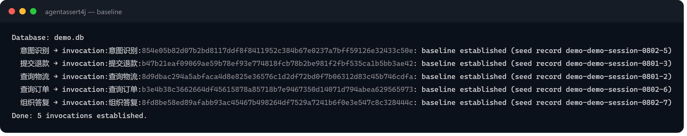
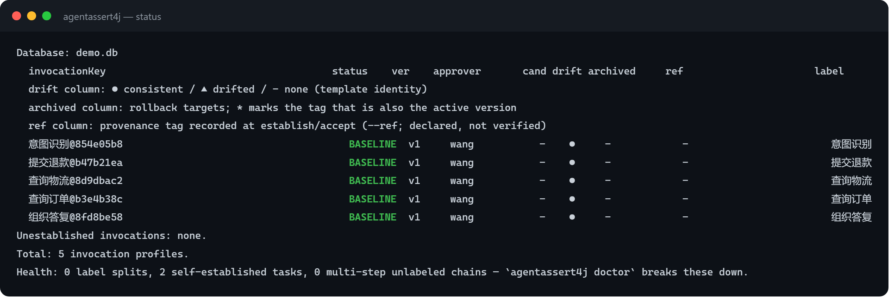
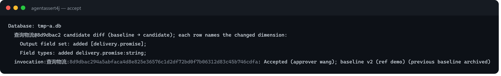
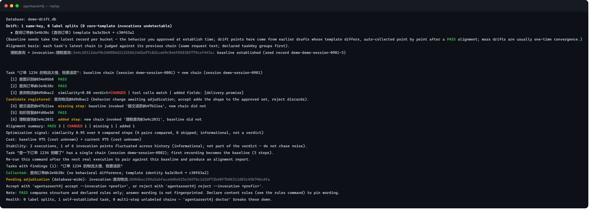
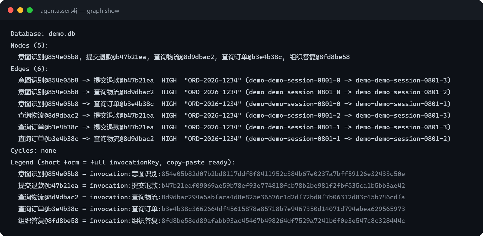
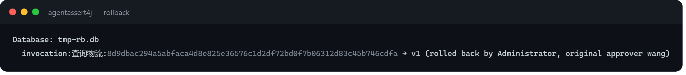
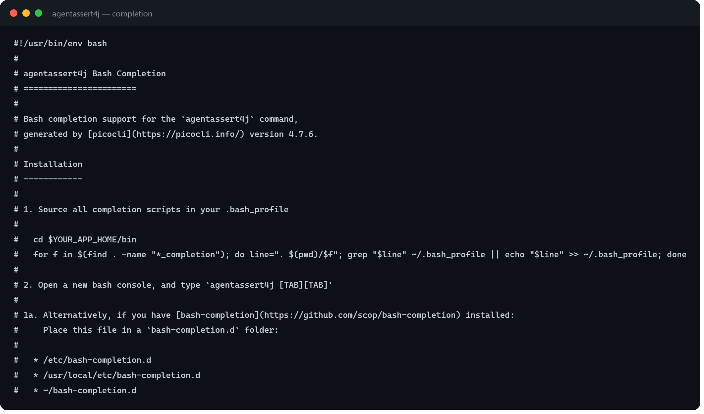

# AgentAssert Framework Panorama

> **What this document is**: the framework's technical panorama and learning path, written for contributors who "know Java and the basic concepts, but have not read a single document or line of code in this repository." The whole document tells one continuous story about a fictional customer-service bot, "ShopMate," and uses it to connect every feature of the framework: Part I tells the story only, to build intuition; Part II takes each act of the story apart and maps it back onto real classes, methods, and table schemas; Part III describes how to work once you have mastered the framework.
>
> **The promise to the reader**: after one straight read-through you should be able to read the intent behind any piece of framework code, localize a defect to the module responsible, and design and review new features against the checklist.
>
> **How to use it**: read Part I straight through the first time (intuition only, no code digging); then go deep into the Part II chapters you need; keep Part III at hand as a working manual for day-to-day development.
>
> **Nature of this document**: a living document that evolves with the code. It only describes what the current code is, and every claim lands on a real class name, method name, or column name — if the document and the code ever disagree, the code wins and the document gets fixed immediately. It divides responsibilities cleanly with AGENTS.md (the collaboration contract) and README / OPERATIONS (the user onboarding and operations manuals); none of them replaces another.

---

## Where to Start: Three Reader Paths

- **Prompt engineers / business developers** (edit prompts, read diff reports) → follow Part I, Acts 0–3 (recording → fingerprints → establishing baselines → changes and adjudication); add Act 7 when you need CI gating;
- **Harness / framework developers** (who want the classes, methods, and tables behind every act) → jump straight to Part II, Chapters 10 and 11 (the dependency graph, task regression) and Chapter 7 (baseline governance), circling back to the corresponding Part I acts as needed;
- **AI integrators** (who want to plug the framework into their own loop as an MCP server) → Chapter 13 of this guide (the CLI surface at a glance) is enough here; your main battlefield is the MCP recipes in [OPERATIONS.md](../OPERATIONS.md) and the [AI behavior-regression companion](ai-behavior-regression-loop.md).

# Part I The Story — Three Months of ShopMate

## Opening: Xiao Wang's Problem

Xiao Wang is a backend engineer at an e-commerce company. He owns ShopMate, the customer-service bot: shoppers ask about orders, shipping, and refunds; ShopMate understands the intent, calls the right tool (`get_order` to look up an order, `refund` to issue a refund), and phrases the answer. The stack is the most common combination there is: Spring Boot 3.5 + Spring AI 1.x + DeepSeek.

The three-person team spends its days polishing the system prompt. Ops says "the refund wording sounds too stiff." Product says "the opening line should be warmer." After every edit, Xiao Wang has no idea whether he just broke something: will the model stop calling the refund tool when it should? Will it forget to mention the order number? Will it mangle the answer format? The only trustworthy check was to walk every test conversation by hand. Every time. Worse still are the multi-step tasks triggered by a single sentence — "shipping on order 1234 is too slow, refund me please" — where the model runs a four-step tool chain on its own; after a prompt edit you run it again, and diffing the two chains is pure eyeball work, line by line.

AgentAssert4j exists to remove exactly this uncertainty. The idea, in plain words: with **zero changes to your business code**, the framework records every real LLM call verbatim from the side (**out-of-band recording**). For each kind of business behavior it captures a structured "behavior photo" of what the behavior currently looks like, and the photos you approve become the standard — the photo is called a **fingerprint**, the standard a **baseline**. A baseline is not a single photo; it is the **set** of behavior shapes you have approved (how that set grows is covered in Act 7.5). From then on, every prompt change gets re-run for real (**replay**) and compared item by item against the baseline; when the changed prompt runs for real again, the framework automatically pairs and aligns the new chain with the baseline chain per invocation and produces a step-by-step diff report. What changed is listed precisely; whether the change is what you wanted is decided by a human. The framework deliberately refuses to judge "better or worse" — "same or different" is a question a program can answer deterministically; "good or bad" is left to people. One picture shows the whole loop (the next twelve acts take each part of the picture apart):


Besides the framework itself embedded in the application, the package ships a **command-line tool**: available as a standalone jar (run directly with `java -jar`) or as a Maven dependency — see README for how to get it. The command is called `agentassert4j`, followed by subcommands and arguments; everything Xiao Wang does from here on goes through it. Each command is explained in place the first time it appears in the story — what it does, which arguments are required and which are optional — and the end of Part I carries a "command quick reference" you can flip back to whenever you forget one.

The whole process is zero-intrusion for business code: if the framework itself misbehaves, it would rather record less data than ever slow down a business request. One iron rule runs through the entire design, so let's plant it here: **whatever the framework can digest internally never leaks out as extra work for the user** — recording, classification, baseline establishment, change detection, alignment, task-chain derivation: the framework computes whatever it can compute itself. The user appears in exactly two places: editing prompts (which they were going to do anyway) and adjudicating direction (which only a human can do).

The story starts on the day Xiao Wang adopts the framework.

> **A note on legacy decisions** (a page of accounting for returning readers): the framework's positioning has been tightened three times, leaving three settled legacies — (1) **semantic-similarity verdicts**: not done inside the framework (determinism is the core selling point); the right answer to semantic change is real-call regression at the scenario level; (2) **multi-run statistical FLAKY verdicts**: the framework does not take these on; multi-chain stability is provided as member-check counts (Act 7.5), and soft-assertion needs wait for reader-side evolution; (3) **graph traversal compression**: withdrawn together with the "graph demotion" decision; `graph show` remains as an exploration dashboard for runtime data flow (Act 10) and no longer participates in verdicts. None of the three will be reopened; new readers can skip this note.

## Act 0 · Two Coordinates and One Line of Config

Xiao Wang adds the `agentassert4j-starter-spring-ai1` dependency to the pom and points the database path to `var/agentassert4j.db` in application.yml — that line is actually optional (there is a default), but he likes to keep data files tidy. He restarts the application: startup is normal, the logs show no new errors, endpoint latency looks unchanged, and business functionality is untouched. The only difference is a new SQLite file under var/.

"What is it doing?" Xiao Wang's first reaction is suspicion: will it slow down my endpoints? Will it alter my calls? Will it crash one day and take my application down with it? All three worries eventually get concrete answers — no, no, and no — and not as verbal promises: as structural guarantees written into the wiring and pipeline code. For now, all Xiao Wang needs to know is this: **something is now quietly working alongside his application.**

> **Where this thread leads**: how auto-configuration and the wrapping work → Chapter 2; how "zero intrusion" is guaranteed by code structure → Chapters 2 and 3.

## Act 1 · The Invisible Scribe

Three days of test traffic plus canary real traffic. Customer-service conversations come in, ShopMate calls tools and phrases answers, all as usual. On day four Xiao Wang opens the .db file with any SQLite viewer: several hundred **interaction records** lie inside — one per LLM call. Each one is startlingly complete. On the request side: the system prompt (stored as a content code — the same prompt always hashes to the same code), the user input, the tool list mounted at the time, sampling parameters. On the response side: the verbatim answer, input/output token counts (with cache-hit and thinking tokens itemized separately), end-to-end latency, time-to-first-token, and cost computed from the price table.

He never wrote a single line of collection code.

He notices the framework ships **masking**: configure a set of sensitive field names (phone numbers, say) and their values are replaced with `***` before landing in the database — the customer-service scenario will need that sooner or later; noted. On load-test day the application log showed a few "buffer full, record dropped" warnings: **what was dropped was a record; the business endpoints were untouched** — when "recording" and "not interfering" conflict, the framework always picks the latter, and it honestly books every record it drops.

With default configuration the framework **records everything** — including pure-text conversations with no tool calls. The default is deliberate: the end of a task chain is often exactly the pure-text call that assembles the final answer; filter those out by "did it call a tool" and every task chain is born missing its final step. Very-high-traffic teams can turn it off, and the number of filtered records gets its own line in the ledger (that counter is **filtered**, which is a different thing from dropped-by-full-buffer: the latter is a failure, the former is policy). Xiao Wang also adds one line for ShopMate:
`agentassert4j.recorder.default-invocation-id=tavern`, so all calls are booked under that identity; when ShopMate later splits into multiple invocations, each can be declared individually in code.

> **Where this thread leads**: how records get siphoned off → Chapter 3; masking and the ingestion gate → Chapter 3; drops and the ledger → Chapter 3.

## Act 2 · ID Photos for Behavior

So a pile of raw calls is recorded. Now what? Xiao Wang types his first subcommand:

```
$ agentassert4j baseline --approver wang
```

`baseline` is exactly what it says: this command establishes the standard for each kind of behavior. `--approver` declares who is responsible for this round of stamping; the approver name is persisted alongside the baseline as an audit trail. The argument is optional — when omitted, the current OS username is used. Real output of the first run (fictional demo database):



Inside, the command does three things in order. The first is **automatic classification**: the framework first checks whether a call has a **declared** business identity — the name the code reports for each invocation, or the application-wide default; a declaration wins when present (a prompt edit changes the template fingerprint at once, so the declaration is the only anchor whose identity survives editing). Undeclared calls are grouped by template hash: records produced from the same system prompt form one group (the "order lookup prompt" is one class, the "refund wording" another) — undeclared groups are first-class citizens all the same: replay and adjudication work on them, and the framework never forces anyone to declare. The second is extracting a **fingerprint** per invocation: a structured summary along four dimensions —

1. **Tool calls**: which tools this interaction called, and the parameter types;
2. **Output structure**: is the answer JSON or text, which fields, and for plain text, how big;
3. **Content rules**: required keywords, forbidden words, regex patterns to match;
4. **Constrained behavior**: whether declared behavioral constraints held (e.g. "must answer in Chinese", "return empty on error").

The first two dimensions are extracted fully automatically; the last two come from declarations in the team's rules file. All you need to accept here: **the same kind of behavior always yields the same fingerprint** — which is precisely why a "photo" can be used for comparison (how that works: Chapter 6). The third is **stamping**: the current fingerprint of every invocation becomes v1 of its baseline, with approver and timestamp persisted; invocations that already have a baseline are skipped, not overwritten (so re-running is safe). Note there is no "preview first, approve later" intermediate state — a baseline is by definition "a stamp on current behavior." The fingerprint details take center stage only in Act 3, when a difference appears and someone has to adjudicate.

Running `agentassert4j status` (check state) verifies the result: one line per invocation — identity code, which version the current standard is, whether a new photo awaits adjudication, which old versions are in the archive, and the human-readable name from the business side (an invocation without a declared name only gets a generated code). The real output looks like this (fictional demo database; all five invocations BASELINE):



Before this act closes, one point that runs through the whole book: the ID photo **does not ask where a capability came from**. ShopMate's current tools (`get_order`, `refund`) are written in Xiao Wang's own code; the day external tools arrive from the company's shared MCP service, or the team switches to an agent framework with a skill mechanism (when a skill triggers, the host injects instruction text into the conversation and registers its bundled scripts as tools), the framework still sees the same two things: an entry in the request's tool list, and a tool call in the answer. **Invisible at the protocol layer, fully visible at the behavior layer** — an MCP tool reaches the LLM exactly like a local function; the word "MCP" does not even exist in the request. Consequently, renaming an MCP tool or editing its description is, in nature, a prompt edit — and cannot escape the fingerprint either.

> **Where this thread leads**: identity anchors and the key grammar → Chapter 5; how fingerprints are extracted → Chapter 6; baseline stamping / archiving / rollback → Chapter 7.

## Act 2.5 · The Health Check and the Compliance Declarations

Before the first real prompt edit, Xiao Wang does two pieces of preparation. The first is the **health check**:

```
$ agentassert4j doctor
```

`doctor` is the database health-check command. In one shot it reports three sections of deterministic facts — an **identity section** (skeleton families: shape-set and full-text variant counts; chains with multiple steps but no declared label; request-text families recurring across sessions), a **coverage section** (recorded-but-unestablished invocations; the count of records missing `template_hash`), and a **rules section** (malformed declarations in the rules file; rules configured for keys that never appear in the database). It states facts only — no verdicts, no establishment (the exit code is always 0 on normal completion and carries no gate semantics) — and that is all a zero-declaration team needs to see which invocations should get declarations and whether the database is clean before the first establishment. Add `--json` for programmatic consumption: the same facts leave as a single-line `agentassert4j.doctor/1` report (full counts, capped samples). The "recurring request-text families" row deserves a special mention: the same question recurring across sessions is the best candidate for a declared task key (`withMetadata("taskKey", <scenario id>)` — pairing gets more robust). Real output (fictional demo database):


The second is the **compliance declarations**. The first two fingerprint dimensions are fully automatic; the last two (content rules, constrained behavior) come from the team's declarations, written in `agentassert4j-rules.json`: under each invocation label, a set of `requiredKeywords` (must appear), `forbiddenKeywords` (must not appear), `regexPatterns` (must match), and `behaviors` (built-in behavioral constraints — e.g. `jsonOutput` means the output must be JSON, `mustUseChinese` means the answer must be in Chinese; 8 in total, and `agentassert4j rules` lists every built-in behavior with writing examples in one command). Declarations are archived together with the baseline fingerprint, so every later judgment is "baseline declarations vs. the current answer sheet" — the declarations are universal constraints that "every legitimate response of this invocation must satisfy," not the branch shape of one particular answer. Two disciplines are planted now: a misspelled behavior name is called out explicitly at load time (typos no longer pass silently; the legal list ships with the warning), and an invalid regex is treated as "no match" — a broken rule shows up as a visible failure in every result instead of quietly passing. Real output of the `rules` command (demo database):


> **Where this thread leads**: how dimensions 3/4 are judged → Chapter 6; task discipline (the tasks section) → Chapter 11.

## Act 3 · The Courage to Change a Prompt

Xiao Lin from ops files a request: "the refund wording is too stiff — soften it." Xiao Wang edits the system prompt and first **runs the refund flow for real** — the smoke test was always part of the job, but this time the real run has a second identity: the out-of-band framework records the whole call with the new wording, and the new chain enters the database on its own. Then he runs the alignment command:

```
$ agentassert4j replay --invocation refund
```

`replay` is the protagonist of this regression. Bare (no arguments at all) means **project-wide** change detection and alignment; `--invocation` narrows the scope to one invocation (an invocation key, or the unique prefix of a business label — the short form `label@8chars` shown in status pastes directly too). The whole command makes **zero LLM calls**: the framework takes this invocation's two real chains from the database — before and after the edit — pairs them step by step, compares the four fingerprint dimensions, and summarizes in one line:

`Alignment summary: PASS 5 | CHANGED 2 | missing 0 | added 0`

There are only two verdict words: **PASS** (no difference from baseline) and **CHANGED** (differing from baseline). The framework deliberately refuses to say "severe": whether replacing tool A with tool B is an improvement or a regression is not for a program to decide — claiming "regression" would be overreach.

Two CHANGED entries; expanding the diff list: one is the answer carrying one more field than baseline — expected wording evolution. The other is the big one: **the model no longer calls the `refund` tool**; it looks up the order and apologizes in plain text. Which one is serious? The framework does not say. The differences sit there; the human reads them. Xiao Wang tightens the "soothe the user first" passage in v2, runs it for real again, and the no-tool-call chain disappears; the extra-field one is what product wanted, so he accepts it with the adjudication command:

```
$ agentassert4j accept
```

`accept` is the adjudication command: bare adjudicates **all pending candidates** at once (`--invocation` narrows it to a single invocation), adding the differing new shape **to that invocation's approved set** (v2 — the entire previous set is archived automatically and can be rolled back as a whole at any time). The short form from status (`label@8chars`) pastes into `--invocation` as well. Not happy with it? `reject` — the candidate is discarded and the approved set stays untouched. Real output of adjudicating one candidate (demo database; the diff detail names each field, the candidate is appended as v2, and the previous set is archived):



Nowhere in this chain does the framework say "this answer is better/worse." It states facts only: what matches, what differs, in which dimension, in which field. The direction call was Xiao Wang's.

> **Where this thread leads**: how replay requests are assembled → Chapter 9; verdict rules → Chapter 8; how diffs are rendered for humans → Chapter 8; how data flows after accept → Chapter 7.

## Act 4 · One-Line Change, Whole-Chain Regression

The `--invocation` alignment in Act 3 is the **microscope** — staring at one invocation and asking "did you change?" But the refund wording Xiao Wang edited lives inside a four-step task: the user says "shipping on order 1234 is too slow, refund me," and ShopMate runs the full chain on its own: look up order → check logistics → issue refund → compose the answer. Every decision point along the chain is recorded and photographed independently (in the refund round's record, the previous two rounds' calls and results are carried forward verbatim in context). If you change one link, do the others still hold? That is a question for the **telescope** — and it sits in the bare command's default capability:

```
$ agentassert4j replay
```

With no arguments, the framework does two things **project-wide**. First, **drift detection**: for each invocation it compares "the template identity at the time the baseline was approved" against "the template identity of the latest recorded records," and names every changed prompt and every drift point on the spot. Second, **per-task alignment**: for each task, the latest chain and the second-newest chain are paired per invocation — steps the baseline executed but the new chain lacks are marked "missing step"; extra steps in the new chain are marked "added step"; steps on both sides are compared fingerprint by fingerprint. The pairing subject is the **invocation** (the declared label) — the two sides of the same invocation may run different prompt versions and still pair and judge normally, with a "cross-version pair" note at line start (behavior comparison across a version switch carries a confounding variable; for controlled re-checks use `--re-drive` to re-drive point by point). Unlabeled steps pair on the full key, and no cross-version pairing is guessed. Differences in text wording are listed separately and flagged "low confidence" — the model's wording naturally wavers between two runs; structure is the trustworthy comparison surface. A real alignment report looks like this (fictional demo database — one missing step, one added step, one structural change, each named; exit 1):


Tasks need no registration and no declaration — **a task chain is simply "the run of calls in the same session triggered by one user request,"** derived by the framework from recorded data on the spot. If the orchestration system knows its scenario ID, it can also declare the task key explicitly at recording time for more robust pairing.

To have the framework re-drive recorded inputs through each point's new template for a **controlled re-check** (no real release; directly verify how the new wording behaves in historical context), add `--re-drive`: each drift point takes its own latest archived full template text and makes one real call against the recorded input. `--dry-run` first shows the quote; `--max-total-calls` / `--max-total-tokens` cap the whole re-check with a budget pool. When evidence is incomplete, the exit code tells the truth (Act 7). Real output of both dry runs (demo database; the re-drive-quote example environment has no API key configured, so the warning line shows honestly):


> **Where this thread leads**: how task chains are derived from recorded data → Chapter 11; alignment and missing/added verdicts → Chapter 11; controlled re-drive and drift disposition → Chapter 11.

## Act 5 · Who Does This Change Touch?

This time the change is not local wording of the refund skill but the **opening line shared by all skills**. Xiao Wang edits it, runs the flow for real, then types the same bare command — nothing extra:

```
$ agentassert4j replay
```

Drift detection puts the blast radius on the table: **who is using the changed prompt**, named invocation by invocation (a template identity changed is simply changed), and the actual blast radius is presented by measured per-task alignment — which invocations handed tools to each other within the same session (order lookup followed by refund is one connected behavior), all visible at a glance. Default alignment is full-scope and zero-call, so "who is affected" needs no sampling or trimming tricks: affected tasks are aligned one by one, differences named one by one, candidates recorded where they belong, and drift points whose behavior did not change are absorbed automatically. Real project-wide output (demo database):



Worth emphasizing: none of these views is an asset carefully maintained by some separate component — they are all **derivations** of recorded data. Drift detection recomputes on the spot at every run; the value-provenance graph is rebuilt from interaction data and rendered live by `agentassert4j graph show` — nodes/edges in short form, HIGH edges carrying evidence (the matched value plus its source/target record pair: see in one step "where this value originally came from"), and a legend mapping short forms to full keys verbatim; read-only, never persisted. Always consistent with the recorded data; never lies. Real output of `graph show` (demo database):

To make the re-check cheaper, `--task`/`--invocation` narrow the disposition to the range you care about at any time — the detection report remains project-wide; only the disposition (absorption / candidate registration) applies to the narrowed hits.

> **Where this thread leads**: where edges come from → Chapter 10; the graph's lifecycle (who reads, who writes) → Chapter 10; drift detection's three-way identity shapes → Chapter 10.

## Act 6 · The Undo Button

Last week Xiao Wang's finger slipped and he accepted a difference into the approved set that should never have been accepted. The remedy is one command:

```
$ agentassert4j rollback --invocation refund --version v3
```

`rollback` does what it says: restores the approved set of the given invocation **as a whole** to a historical snapshot. Both arguments are **required** — `--invocation` names the invocation, `--version` names the version to return to; the legal values are visible in the archived-versions column of the `status` list. The v3 snapshot in the archive is restored verbatim as the current set — every accept archived the entire set at that moment, precisely for today. (Rolling back to the currently active version is refused with a pointer to `reject` — that is not a rollback, that is discarding an in-flight candidate.) Real output (demo database):



Another time, the framework upgraded its fingerprint extraction algorithm — every baseline records "which comparison-algorithm version stamped it," and after the upgrade old books and new books disagree. `replay` **refuses to judge** outright (exit code 2): "these baselines were approved by an older algorithm version; refusing to reinterpret them with the new one — rebuild explicitly." Xiao Wang runs `baseline --force`: `--force` is the establish command's forced-restamp switch (without it, establish never overwrites an existing baseline). It re-extracts fingerprints with the current algorithm and stamps them as a new version; the old ones are archived automatically. Why refuse instead of warn? Because re-measuring old photos with a new ruler yields conclusions that are quietly untrustworthy — better to stop and demand an explicit human decision.

> **Where this thread leads**: the archive table and version-tag allocation → Chapter 7; the semantic-version stamp contract → Chapter 8.

The governance commands carry one more unassuming but deeply team-flavored argument: `--ref` (the code anchor). Both `baseline` and `accept` take a declared value — usually a git commit (rollback deliberately has none: a restored snapshot carries its own historical anchor, so after a rollback the active anchor describes exactly the version actually in force — anchor and baseline never mismatch). It validates nothing and never touches git; it is simply persisted with the governance fact, answering one question: **at which code version was this behavior last approved?** The uses exceed what you would expect: when production behavior breaks, the baseline's ref directly yields the suspect range for `git diff <ref>..HEAD -- prompts/` (incident retrospection); the database is a local file outside git, so every worktree carries its own and branches are naturally isolated — a rebase that renumbers commits does not break the anchor's historical coordinates (multi-branch work); an acceptance pack carries the code anchor from export time, so "this behavior promise comes from delivery X" is a cross-team credential (delivery reconciliation); when an AI edits prompts it naturally knows the HEAD it edited, so adjudicating with `--ref HEAD` completes the audit chain at zero cost (AI loops). The boundary is stated just as honestly: an anchor is a lead, not a certificate — it may be absent and is never validated; multi-repo teams agree among themselves which repo's commits a ref points to.

## Act 7 · The Gate

Xiao Wang wires replay into CI. In the change pipeline:

```
$ agentassert4j replay --ci --json
```

`--ci` is a dedicated mode for pipelines: the adjudication baseline is "chain-final execution vs. the approved baseline" (each task's latest chain compares each invocation's **chain-final execution** against that invocation's **approved shape set** — the set seeded by establish and grown shape by shape by accept; a chain ending in any approved shape is green, and the report marks which shape matched with `PASS (shape i of n)`. The CI gate judges the end state a task ran to; earlier same-session drafts remain visible but never block the gate; after the team accepts, re-checking the same chain lines up with the new baseline, so the gate follows adjudication without flapping). It does not auto-establish baselines for **chain-final invocations** that lack one — better to refuse judgment than to produce self-built, self-compared green lights (draft keys earlier than the chain end do not trigger refusal; they surface in the transparent unapproved count). Without `--ci`, replay auto-establishes new invocations at startup, and the adjudication baseline is instead the diff of latest chain vs. second-newest chain. Drift identity is also not absorbed inside the pipeline — governance writes stay on the human side (CHANGED candidates still land, awaiting adjudication), and exit 0 comes with one "Identity not collected" warning line. `--json` turns the result into a **line-by-line machine-readable report** written to standard output, while human-facing progress and diagnostics move to standard error — programs and people each read their own channel, without interference. Both arguments are optional: without them you get the human-facing default form.

The exit code speaks for him: **0** no differences; **1** differences exist (a human should adjudicate); **2** usage or infrastructure failure — for instance every case timed out, which is an environment problem, not a behavior regression, and must not be misread by CI as a red light. Alignment and controlled re-drive share this contract, plus one more clause: missing and added steps count as differences (exit 1); when a run stops partway (budget exhausted, steps skipped) the evidence is incomplete and that is a 2 — **skipped work may never impersonate a green light**. A real gated run looks like this (demo database: a real behavior difference exists → exit 1; the machine report lands line by line on stdout):


One day a colleague's PR lights CI up with a 2, and the reason field reads: "invocation X has recorded interactions but no baseline; `--ci` refuses to judge." This guards against a classic accident: CI auto-establishing baselines for unbaselined invocations and comparing against itself, producing a pile of **green lights no human ever reviewed**. A baseline must pass through a human before the gate is credible.

Two small toolbox items while we are here: `agentassert4j completion > agentassert4j.bash` generates a bash completion script (zsh-compatible via bashcompinit), and every subcommand has a short alias (`s`/`b`/`a`/`g`/`v`/`d`/`c` and `rp`/`rj`/`rb`/`ru`/`au`/`m` — the full names always remain, visible in `--help`); `agentassert4j --version` prints the framework version. The completion script looks like this (excerpt):



> **Where this thread leads**: the exit-code contract → Chapter 9; the `--json` channel contract → Chapter 9; task-domain reports → Chapter 11.

## Act 7.5 · The Stability Probe: Measure More Than Once Before You Commit

"Try a few rounds, settle on the baseline once satisfied" is the real rhythm of small teams, and the framework promotes it to a first-class citizen: adjudication reads only each invocation's **latest execution** (earlier drafts within the chain never block the gate; they surface only as `unapprovedEarlier` counts in the transparency layer). To see **stability** before a shape joins the set, use member-check:

```
$ agentassert4j replay --member-check
Task "refund task": member check — new chain (session s-42) against the 4 most recent chain(s) of 4 (window 5)
Member: behavior matches 4 of 4 sampled chain(s) (sessions s-38, s-39, s-40, s-41); no regression against the sample window.
```

It compares the task's latest chain against the most recent historical chains one by one (sample window defaults to 5; `--member-window N|all` overrides it for one run; `regression.memberSampleWindow` sets the configured default). **Read the counts**: `matched 2 of 3` against recent neighbors is stability; `1 of N` matching one ancient session is archaeology. The `isMember` boolean in JSON expresses only "matched some historical chain" and deliberately carries no threshold — whether a shape joins the set remains a human adjudication; the probe only provides a ruler. New invocations without a baseline can use it for baseline-free exploration too (chain history as reference; no baseline reads, no governance writes — with the CHANGED exception: discovered differences still land as candidates).

> **Where this thread leads**: the window-resolution ladder and the matched count → Chapter 11; boolean semantics and how to read it → the README's iterate-until-satisfied section.

## Act 8 · Two Side Stories

Colleague Lao Chen wants two of his systems on board too, and neither is Spring Boot + Spring AI.

One is an **old JDK 8 service**. It skips the starter (which needs Boot 3) and wires core + recorder + storage manually as three jars, handing records to the recorder at its own LLM-call exit point — three lines of code. The framework kernel's minimum JDK is 8, and that is one of its published selling points.

The other is a **homegrown-stack bot**: tool calls do not go through the protocol layer's toolCalls parameter; instead the model outputs JSON in an agreed format and business code parses it and dispatches itself. The protocol layer cannot see tool calls, so neither can the framework — so Lao Chen, right next to the line that parses "this time call get_order," writes the tool name into the record's identity-declaration field; intent records pin down "which tool should have been chosen" via regex in the rules file, and response records run all four dimensions as usual. A different integration posture, but what lands in the database is **the same kind of record, the same baseline semantics** — that is the payoff of the layered architecture.

> **Where this thread leads**: the manual-assembly path → Chapter 2; rules and regexes → Chapter 6; identity declarations → Chapter 5.

## Act 9 · Putting a Behavior Standard into a Single File

ShopMate is about to be delivered. The customer deploys on an intranet, and the acceptance team asks an awkward question: "the chain that passed in your demo — will it still behave this way in our environment (with a different model, even)? Show us the evidence."

The evidence cannot be the development side's database — it holds users' raw conversations, and the customer environment will not accept your database as the standard anyway. The framework's answer is a **file**:

```
$ agentassert4j baseline export --out acceptance-pack.json
```

`baseline export` packs the **approved baseline truth** into one JSON: for each task chain, per invocation, one step carrying the invocation key and the **structural fingerprint** (= the profile's approved shape set — the same source of truth as the CI gate), with the chain's last record per group serving as the evidence anchor — tool names, parameter types, output field paths and types, rule keywords. When a chain's final behavior does not match the promise (an in-flight candidate is unadjudicated, or the chain-final shape ≠ the approved fingerprint), export warns on the spot and counts `unadjudicatedSteps` — adjudicate first, then export; do not hand over an unaligned promise. Note that the pack is **naturally free of sensitive content**: no verbatim user inputs or outputs, no template text; the declared rules section travels with the pack (rules are assertions, not prompts) — structural fingerprints plus the declaration section form the sanitized "shape of the behavior." The pack also carries the development side's model names, the judgment-semantics version, and a file fingerprint (SHA-256); the two sides reconcile on the latter. Attaching human-readable samples is allowed too — `--include-samples` appends input/output samples per step, **forcibly** put through the strictest masking (every sensitive field becomes `***`); judgments never consume the samples — they exist only for the acceptance reviewer to flip through. Exporting inside a pipeline, add `--json`: stdout gets a one-line `agentassert4j.export-report/1` metadata report (output path / task-chain count / step count / SHA-256 / excluded chains) that CI can reconcile automatically. Real output of the export (demo database):


The two-sided flow of the whole delivery acceptance:


The acceptance team takes the pack and runs the acceptance requests for real in the customer environment (this is operated by the acceptance reviewer — the framework does not drive the product's entry points). Unsure whether the local chains match the pack? Run `verify --dry-run` first: it only loads the pack and lists how each task pairs with local chains, plus cross-model notes — zero judgments, zero writes (real output from the demo database). Then:


```
$ agentassert4j verify --pack acceptance-pack.json --report verify-report.md
```

`verify` is one of the top-level commands and strictly read-only — it imports the pack, compares, writes a report, and puts nothing into the local database. The comparison logic is the same machine as Act 4's real comparison: the pack's fingerprints are the baseline side; fingerprints freshly extracted from locally recorded task chains are the current side; aligned step by step per invocation. The report states three things plainly: per step, match or deviation (structural deviations are real problems); when the development side and the local model differ, it flags **cross-model acceptance** — text wording differences are expected, and structural verdicts remain valid; tasks present in the pack but never executed locally are listed as **coverage gaps** (incomplete evidence may never impersonate a pass). That markdown report is the delivery evidence itself. Real output of the summary (demo database):


> **Where this thread leads**: the pack format and version guards → Chapter 12; verify's matching and exit codes → Chapter 12.

## Act 10 · Seeing Farther

Under the default configuration, Spring AI runs the whole tool loop inside the model, where the framework cannot see it: the model decides to look up the order, gets the result, then decides to check logistics — those intermediate decisions are consumed entirely by the loop, and the decorator sees only the final "your order has shipped." The recorded interaction has no tool calls, so the tool dimension — forty percent of the fingerprint — is blind. Act 2 mentioned the framework's one-time warning; now it simply installs the eyes: the framework attaches a purely observational out-of-band hook at the **tool-callback layer** (the unavoidable path between the tools business code registers and their execution). At the same moment a tool actually executes, what was called, with which arguments, and what it returned are transcribed in order into **the same record**. Business code changes nothing, the loop runs as usual, and the tool dimension is fully captured. One record now carries one complete orchestration (order lookup → logistics check = one regression unit) — closer to the substance of "skill behavior" than per-round recording.

Replaying such orchestration records, the framework uses **chained half-replay**: round 2's "input at the time" contains round 1's tool result, and the result exists only in business hands — the framework cannot reconstruct it, but the baseline **recorded it**. So replay uses the baseline's recorded old results as props: it re-asks the model "look up the order" for round 1; the decision matches the baseline → hand back the recorded result frame and continue with round 2's "check logistics." If some round's decision disagrees with the baseline — **stop on the spot** (stop at first divergence). Old results paired with new decisions would be a fictional evolution; stopping the chain where truth loses validity is the most honest presentation:

```
  Round 1 decision  get_order(SO-1)      matches baseline
  Round 2 decision  get_logistics(SO-1)  matches baseline
  Final reply       four-dimension comparison PASS
```

On divergence the report points straight at the round: **"Tool decision diverged at round 2 …; baseline: get_logistics(SO-1), actual: cancel_order(SO-1)"** — regression localization sharpens from "some invocation changed" to "which step of the orchestration, what it was supposed to do, what it did instead." The task-domain counterpart is full per-task alignment with the three-outcome drift disposition (Chapter 11): every task's differences are named completely, with no chain-level truncation.

> **Where this thread leads**: how the observational decoration lands, and the tool-loop posture differences between the two SDK generations → Chapter 2; chained half-replay's per-round assembly and divergence semantics → Chapter 9.

## Part I Command Quick Reference

Every command that appeared in the story, for looking things up while reading. Only the **story-used** arguments are listed here — each command's full argument surface is in Chapter 13, or just run `--help` on the command.

| Command | What it does | Arguments used in the story | If omitted |
|------|--------|----------------|-----------|
| `agentassert4j baseline` | Extract fingerprints per invocation and stamp them into baselines | `--approver <name>`: approval audit trail | Approver falls back to the OS username; established invocations are not overwritten |
| `agentassert4j baseline --force` | Rebuild baselines with the current comparison algorithm (old baselines archived automatically) | same as above | Without `--force`, establish never overwrites an existing baseline |
| `agentassert4j baseline export` | Export the acceptance baseline pack (the delivery-evidence carrier) | `--task <prefix>` (narrow scope); `--include-samples` (masked samples); `--out <file>` (default `./acceptance-pack.json`); `--json` (export-report/1: out/taskCount/stepCount/unadjudicatedSteps/sha256/excluded metadata report) | Content is naturally sanitized (structural fingerprints + keys + declared rules section); steps = invocations (chain-final evidence anchor, fingerprint = profile-approved truth); prints SHA-256 for reconciliation; chains with unestablished steps or baselines violating their own declared rules are excluded with a warning; in-flight candidates / chain-final deviation → unadjudicatedSteps count + warning |
| `agentassert4j status` | View the invocation list and baseline states | `--diff`: show pending candidate diffs; `--json` (status/1) | List only; recorded-but-unestablished invocations appear in the "Unestablished invocations" section |
| `agentassert4j doctor` | Database health check: three sections of deterministic facts (identity / coverage / rules — skeleton families, multi-step zero-label chains, recurring request families for undeclared tasks, unestablished invocations, rule expectation mismatches) with declaration suggestions | no required arguments; `--json` (doctor/1: full counts + capped samples, same-source machine report) | Read-only; no verdicts, no establishment; the exit code carries no gate semantics (always 0 on normal completion; runtime command failures exit 2) |
| `agentassert4j replay` | Project-wide drift detection + per-task alignment (zero LLM calls by default) | `--task <prefix>` / `--invocation <target>` (compound scope narrowing); `--ci` (no auto-establish for unbaselined invocations, no drift absorption); `--re-drive` (controlled re-check per drift point with archived templates; costs calls) + `--full-chain` (expand to all records in scope) + `--max-total-calls/--max-total-tokens` (re-drive budget pool); `--dry-run` (drift set + alignment plan + re-drive quote); `--json` (task-report/1, line-by-line sections) | Unmatched/ambiguous scope narrowing exits 2; `--ci` with a missing baseline exits 2; drift with PASS exits 0 with an unabsorbed warning |
| `agentassert4j accept` / `reject` | Bare adjudicates all pending candidates (renders candidate diffs → shape joins the set / is discarded) | `--invocation <target>` narrows scope; `--approver <name>` (accept only; defaults to the system user) | No candidates exits 2 |
| `agentassert4j rollback` | Roll a baseline back to a specified historical version | `--invocation <target>` and `--version <tag>` (**both required**) | Missing either argument errors out immediately |
| `agentassert4j verify` | Delivery acceptance: check local real execution chains against the acceptance pack (read-only, no writes) | `--pack <file>` (**required**); `--task <prefix>` (narrow scope); `--dry-run` (pairing rehearsal, zero judgments); `--report <md>` (delivery evidence); `--json` (verify-report/1) | The version guard rejects packs with mismatched semantics; coverage gaps exit 2; cross-model flags keep structural verdicts valid; the rules section travels with the pack, and packs without one degrade with a note |
| `agentassert4j rules` | Show the built-in constrained-behavior catalog and rules-file examples | `--json` (rules/1 catalog report) | none |
| `agentassert4j graph show` | Rebuild the value-provenance graph from recorded data and render it (short-form nodes/edges, HIGH-edge evidence = matched value + record pair, legend, cycle detection — cycles are the natural graph signature of iterative loops, not a pathology) — a development-time exploration dashboard | `--json` (graph/1, HIGH edges include evidence) | With no edges, prints an empty-graph hint (recorded data lacks multi-turn sessions; not a failure) |
| `agentassert4j completion` | Generate a shell completion script (bash style; zsh-compatible via bashcompinit; includes all short aliases) | none | — |

---
---
# Part II Back to the Code — Unpacking Every Act

> Part II has 13 chapters, each with a fixed seven-part structure for searchability and cross-referencing:
>
> 1. **Story recap** — which act and which plot point of Part I this maps to (one paragraph);
> 2. **Design problem** — what would happen without this component (design motivation before implementation detail);
> 3. **Concepts and terminology** — terms introduced in this chapter, defined in place; the whole-book glossary lives in Part III;
> 4. **Code map** — the classes involved, one by one: responsibilities, real signatures of key methods, and why they are designed this way;
> 5. **Table schema** — the tables involved, column by column (name, type, why it exists, who writes it, who reads it);
> 6. **Lifecycle and concurrency contract** — the full lifeline of the objects and data, thread-safety promises, failure semantics;
> 7. **How tests pin it down** — the test classes and key cases guarding this chapter's behavior; start here when localizing defects.
>
> Writing rule: every claim lands on a real class name, method name, or column name; current state only; the "why" and the "what" appear in the same paragraph.

## Chapter 1. Bird's-Eye View

**Story recap**: all twelve acts of Part I. This chapter is the map — see the whole first, then descend into detail.

**Design problem**: in an AI application, the system prompt is the most frequently changed "code," yet no regression discipline guards it — one wording change can stop the model from calling a tool it should call, drop fields from structured output, or omit things it must say. Traditional unit tests cannot cover this, because the subject under test is the model's probabilistic behavior; manual regression can cover it but does not scale. The framework's answer: **turn "behavior" into structured objects that can be compared deterministically (fingerprints); turn "a change" into a replay of one real call; turn "one user task" into an alignable replay unit; leave adjudication to humans; give recording to the out-of-band side.**

**Concepts and terminology (what it is / what it deliberately is not)**:

- **Is**: a JVM-native behavior-regression testing framework for AI agents. Out-of-band recording of real LLM interactions → deterministic four-dimension fingerprints and baselines → project-wide change detection and per-task real alignment for prompt changes (zero LLM calls by default) → opt-in controlled re-drive, point by point → human adjudication; baselines export as acceptance packs for cross-environment delivery acceptance.
- **Deliberately is not**: (1) not a monitoring/observability platform (data is persisted for regression, not dashboards); (2) not a prompt manager (it manages behavior, not prompt content); (3) it never judges good or bad — it states only "differs from baseline or not," leaving direction to humans; (4) the judgment chain is 100% deterministic and will never introduce LLM-as-judge; (5) not a proxy/gateway — business traffic is never forwarded through it; (6) it does not drive product execution — recording is out-of-band, and acceptance is operated by the acceptance reviewer.

**Code map and the main data path (the maintenance baseline has moved to the spec)**: the module layering, core package structure, four-table overview, and main data path are now owned by `guide/spec/OVERVIEW.md` (the skeleton overview; in Chinese) — this chapter keeps its narrative role and no longer duplicates the factual picture; when narrative and spec conflict, the spec wins and the losing side gets fixed. Domain details live in the per-domain specs (`guide/spec/`, in Chinese), and the corresponding chapters will slim down into maps pointing at the specs.

**How tests pin it down**: full regression coverage of core / recorder / storage / cli (including private e2e gate cases) / both SDK generations / both starters; `mvn -B test` at the repo root must be all green. Three points of test culture: test contracts, not implementations (field-by-field alignment across component boundaries); deterministic contracts are always tested (sort stability, escaping round-trips, counter closure); error paths are always tested (precise assertions on dedicated exception types).

**Design principles at a glance** (expanded in place in each chapter): R1 core has zero dependencies / R2 program against SPIs / R3 plugins are equal / R4 configuration-driven / R5 one-way dependencies / R6 at most 5 methods per interface / R7 the graph stays in memory / R8 zero intrusion / R9 determinism first / R10 degrade, never interrupt.

---

## Chapter 2. The Integration Surface

**Story recap**: Act 0 (two coordinates, one line of config) and Act 8 (two side stories).

**Design problem**: the value of regression protection is inversely proportional to onboarding cost — if adoption requires touching business code, most teams give up on day one. So the integration surface's goal is: **Spring Boot users change zero lines of business code; non-Boot users change three; every path shares the same storage and judgment semantics.**

**Concepts and terminology**: auto-configuration (classpath probing + conditional exit), the decorator (wraps the ChatModel rather than replacing it), the recording context (a thread-bound declaration scope), full exposure of the configuration surface (every knob that should be exposed is exposed on all three channels: Boot yml / `RecorderConfig.builder()` / the CLI's `agentassert4j.json` operation surface; anything not exposed needs a stated reason).

**Code map**:

- `AgentAssert4jProperties` (starter configuration, prefix `agentassert4j`, property tree mirrors agentassert4j.json naming): `enabled` (master switch) + `storage.url` (default `~/.agentassert4j/agentassert4j.db`, `~` expanded automatically) + `recorder.{default-invocation-id, endpoint, batch-size, flush-interval-ms, max-buffer-size, ring-buffer-size, sensitive-fields, sanitize-strategy, sanitize-user-input, sanitize-model-response, record-undeclared-chat, enabled}` — every knob of the recording domain, with defaults identical to `RecorderConfig.builder()` (clamping semantics live single-sourced in the recorder module).
- `AgentAssert4jAutoConfiguration` (boot3 in `io.github.agentassert4j.springboot`, boot4 in `io.github.agentassert4j.springboot4`, structurally isomorphic): two assembly conditions — a `ChatModel` on the classpath (otherwise silent exit) and `agentassert4j.enabled=true` (absent counts as true). It produces three beans:
  1. `SqliteStorageRepository` (`destroyMethod="close"`, calls `initialize()` right after construction to create tables);
  2. `InteractionRecorder` (`destroyMethod="stop"`, calls `start()` right after construction to start the pipeline);
  3. a `static` `RecordingChatModelPostProcessor` — a **BeanPostProcessor that wraps every ChatModel in the container with `RecordingChatModel`**, skipping ones already wrapped. Why static: a BPP must be registered before this configuration class is instantiated, to avoid container startup-order warnings; the recorder is resolved lazily via `ObjectProvider` to keep the startup order clean.
  - When the user supplies their own `StorageRepository`/`InteractionRecorder` beans, `@ConditionalOnMissingBean` steps aside — a self-provided recorder must be started by its owner.
  - **Startup-failure semantics (a deliberate decision)**: a storage initialization failure interrupts host startup — "a recording framework failing silently (the user thinks it is recording when it is not)" is more dangerous than a failed startup. Environments that cannot accept this semantics should set `enabled=false` explicitly.
- `RecordingChatModel` (one per SDK generation, packages `springai1`/`springai2`): a decorator; `call()` times the call, captures context, then passes through; `stream()` captures the `RecordingContext` closure on the **calling thread** (aggregation callbacks run on the async completion-signal thread, where ThreadLocals are unreachable), aggregates the full response with `MessageAggregator`, records it, and takes TTFT from the first chunk. Recording failures only WARN, never throw — a business call is never interrupted by a recording problem. A granularity note for 1.x: by default the full tool loop runs inside the ChatModel, so from the decorator's perspective one call = one complete tool round (initial request + final aggregated response).
- `RecordingContext` (`AutoCloseable`; single-sourced in the recorder layer and shared by all three framework adapter lines; not in core): `start(sessionId)` opens a scope; `withInvocationId/withTemplateId/withTemplateSkeleton/withEndpoint/withMetadata` chain declarations; `close()` restores the outer scope (nestable). In essence a stack of ThreadLocals — **visible only on the declaring thread**; calls initiated from async threads inside a Reactor chain see no context, so stream annotations must be made within the thread scope that initiated `stream()`. `withMetadata` can also carry a task-key declaration (Chapter 11's `taskKey`).
- Differences between the two SDK generations: package names are isolated per generation (`springai1`/`springai2`, `springboot`/`springboot4`; the two generations share artifact names and are mutually exclusive, hence separate modules); cached tokens in ai1 are extracted best-effort via reflection (probing only cache-read and thinking tokens; cache-writes leave no value), while ai2 reads the `Usage` interface directly (cache read/write and thinking tokens all present); Spring AI 2.x moved the tool loop up into ChatClient's Advisor chain (above the ChatModel), so the decorator naturally sees every round.
- **The JDK8 manual path** (Lao Chen's system in Act 8): no starter; assemble core + recorder + storage-sqlite manually as three jars, build an `InteractionRecord` at your own LLM-call exit, call `recorder.intercept(record)`, and run `start()`/`stop()` yourself. core is the only zero-dependency module in the framework — that is why JDK8 customers can integrate.

**Table schema (markers the integration surface writes into records)**: the `recorder_version` column carries the SDK version string (e.g. `agentassert4j-spring-ai1`); `api_protocol` is fixed to `openai-chat` — describing the wire shape of the persisted data, not the upstream vendor; `provider` is inferred from the model-name prefix heuristics (deepseek→deepseek, gpt/o1/o3/o4→openai, claude→anthropic, qwen/qwq→qwen, gemini→gemini, llama→ollama, everything else→custom).

**Lifecycle and concurrency contract**: bean shutdown order is guaranteed by Spring destroy methods (close on the storage runs after stop on the recorder — the recorder's stop flushes remaining data before shutting down the Disruptor, with a forced close after a 10-second timeout). When registering a user-supplied recorder bean, you must set the destroy method name to `stop` explicitly (Spring's destroy-method inference only recognizes close/shutdown; otherwise the flush thread holds the database file locked on Windows after shutdown).

**How tests pin it down**: `ApplicationContextRunner` assembly tests for each starter (wrapping takes effect; the real pipeline persists; enabled=false exits; missing spring-ai exits silently; no double wrapping; custom path creates the database; user beans win); the SDK layer has async context-propagation tests (context captured in the closure is still reachable after `publishOn` switches threads).

> **Orchestration observation (in place)**: on a copy of the request's options, the recording decorator dresses every tool callback in a purely observational decorator — at the moment the internal loop actually executes a tool, the name / verbatim arguments / verbatim result are written to a buffer in order and merged into that record's toolCalls (arguments are parsed by RecursiveJsonParser and their types derived with ArgTypeUtil's shared vocabulary, comparable with the native path). 100% delegation pass-through; a decoration failure silently falls back to the original request; business objects are never touched. 1.x covers the default internal-execution posture (2.x's direct-ChatModel internal posture shares it); ChatClient-driven per-round postures carry toolCalls in the response themselves, and the observation buffer automatically stands down to avoid double counting. Coverage stated honestly: callbacks injected through options (the Spring bean/provider idiom) are all visible; private execution paths that bypass options are not. HTTP-layer interception is a reserved endgame with no schedule.

---

## Chapter 3. The Recording Pipeline

**Story recap**: Act 1 (the invisible scribe).

**Design problem**: out-of-band recording faces a three-way squeeze — never lose a record, never block, never OOM. You cannot have all three: losing nothing requires blocking business calls or unbounded buffering. The framework's trade is **no blocking + no OOM, giving up "never lose" — but every loss is booked** (dropping without blocking business requests is the supreme principle).

**Concepts and terminology**: the RingBuffer (fixed-size ring buffer, nanosecond-scale enqueue), batched persistence, counter closure (the fate of every arriving record is auditable), and the separation of masking (content rewriting) from deep copy (thread-boundary isolation).

**Code map**:

- `InteractionRecorder` (implements the `RecordingInterceptor` SPI) — the pipeline entrance:
  - `intercept(record)`: **fallbacks first, then enqueue** — the identity source of truth for `recordId` is the LLM response id (written by the same source on the SDK mapper and the MCP ingestion face; cross-face dedup relies on its global uniqueness), falling back to a UUID when missing (covering only re-interception of the same record object); an undeclared `endpoint` falls back to the recorder-level default (per-call declarations win); a missing `sessionId` degrades to its own session (taking recordId, keeping the NOT NULL constraint from blowing up the batch); **counted on arrival**; deep copy + masking; a process-local monotonic `seq` passes through (gaps from drops are legal; `(session_id, seq)` is the deterministic sort key); `tryNext()` enqueues into the RingBuffer without blocking — on full (`InsufficientCapacityException`) or on a publish exception the record is dropped, counted, and WARNed. The whole method is `synchronized` — mutually exclusive with `stop()`, otherwise a stop within the unlocked window could publish events into an already-stopped RingBuffer (records stranded forever and counters never closing). Note that fallback writes happen before the deep copy: the default invocation label, the UUID `recordId`, and the `sessionId` fallback are all written into **the caller's original record** before the deep copy + masking — if upstream resubmits the same record object, the framework has mutated the original.
  - `start()`: builds the Disruptor (`ProducerType.MULTI`, `SleepingWaitStrategy`, daemon thread factory) + a single-threaded scheduled flusher (default 5 seconds); with the global switch `enabled=false` it is a straight no-op and starts no pipeline (the production packaging shape).
  - `stop()`: flushes remaining data first, stops the scheduler, then `disruptor.shutdown(10, SECONDS)`.
- `BatchWriteHandler` (a Disruptor `EventHandler`) — the consumer side:
  - `onEvent`: decides inside `synchronized(buffer)` — when the buffer reaches `maxBufferSize` (default 500) **new records are dropped** + WARN (OOM protection); otherwise they enter the buffer; a flush triggers when the buffer reaches `batchSize` (default 100) or at batch end.
  - `flush`: swaps out the buffer snapshot and clears the original buffer → `enrich` → `saveInteractions` → on success the `written` counter increments; on failure `failed` + an ERROR log, **no retry** (retrying would block the consumer thread, violating zero intrusion).
  - `enrich`: completes derived fields before persistence — exactly three backfills: the two hash projections `template_hash`/`skeleton_hash` (sha256(full template text)/sha256(skeleton), each backfilled only when missing) and `invocation_key` (NOT NULL constraint; backfilled with the resolver-derived value when missing, otherwise the whole batch INSERT fails); **existing values are never overwritten** (an explicitly set invocation key from upstream wins); a single record's enrichment failure does not block persistence (the raw interaction data is the source of truth). Fingerprints are not extracted here — the four fingerprint dimensions are always re-extracted on the spot by `FingerprintExtractor` in the judgment domain. All of this derived computation runs on background threads (event-driven flush on the Disruptor consumer thread, scheduled flush on the scheduler thread, manual flush/stop on the calling thread) — never on a business thread.
- `DataSanitizer` — the masker:
  - **Unconditional deep copy**: the masking configuration decides only whether content is rewritten, never whether a copy is made — the consumer thread's enrich/serialization must share no mutable state with any later upstream reads or writes of the original object. The deep copy is carried by the model's own `InteractionRecord.copy()`/`ToolCall.copy()`/`TurnContext.copy()` (toolCalls deep-copied element-wise, arguments value-tree recursed, previousTurns deep-copied element-wise, null elements keep their sequence shape); copy completeness is pinned by a reflective all-fields comparison test — a model field added without copying turns red on the spot.
  - Masking scope: `toolCalls.arguments` (recursing Maps to any depth, matching key names case-insensitively — sensitive keys nested in structures are the main battlefield); `toolCalls.result` (a character-by-character key-value replacement scan over strings containing JSON; the DROP strategy backtracks over whitespace before key names and commas so the product is always valid JSON); `userInput`/`modelResponse` are configurable and **not masked by default** (rewriting would break input fidelity for regression replays).
  - Three `SanitizeStrategy` values: `MASK` (default; replaced with `***`), `HASH` (SHA-256; uniqueness preserved, irreversible), `DROP` (whole key removed).
- `RecorderConfig` (immutable, builder-constructed): `enabled=true` (master switch), `ringBufferSize=16384` (rounded up to a power of two, floor 1, ceiling 2^30), `batchSize=100` (clamped to a floor of 1), `flushIntervalMs=5000` (unclamped; ≤0 disables scheduled flushes, leaving only batch-full and shutdown triggers), `maxBufferSize=500` (clamped to a floor of 1), `defaultInvocationId` (application-level default declaration), `endpoint` (recorder-level default endpoint, the fallback slot for the endpoint column), the ingestion-gate switches, and the four masking settings (`sensitiveFields` default empty, `sanitizeStrategy=MASK`, `sanitizeUserInput=false`, `sanitizeModelResponse=false`). When `batchSize` exceeds `maxBufferSize`, maxBufferSize is raised to batchSize (the mismatch self-heals; no data lost).

**Table schema (the write-side contract with NOT NULL)**: each of `interactions`' 7 NOT NULL constraints (`record_id` is the PRIMARY KEY) has a fallback or an always-written path — `record_id` → response-id source of truth (UUID fallback), `session_id` → recordId fallback, `timestamp` → always written at capture, `invocation_id` (declaration slot) → empty-string fallback, `invocation_key` → enrich-derived fallback, `tool_calls`/`has_tool_calls` → always written (empty-array JSON and 0). The point of the fallbacks: no single record can blow up the whole batch INSERT because upstream lacked a field.

**Lifecycle and concurrency contract — the counter-closure equation**:

```
recorded (counted on arrival) = written (batch write succeeded)
                              + dropped (producer-side RingBuffer full / publish exception + consumer-side buffer overflow)
                              + failed (batch write failed; dropped without retry)
```

Every arriving record's fate lands in exactly one of four buckets: written, dropped (producer side / consumer side), failed, or ingestion-gate filtered (filtered is policy — dropped is a failure, filtered is a decision); counters are held by the recorder and injected into the handler (a stop→restart installs a fresh handler without breaking closure); `getDroppedCount()` aggregates the producer-side and consumer-side thread domains. **Shutdown ordering**: the storage's `initialize/close` shares an instance monitor with the write path — never close or swap the connection while a flush is in progress.

**How tests pin it down**: the full recorder suite (counter closure, ingestion gate, intercept-vs-stop concurrency, batch-write failures still book the ledger, masking round-trips, mismatch clamping, deep-copy isolation, and more). A representative contract: counter closure (a blocking repository + large bursty volume verifying written+dropped+failed==recorded, with filtered listed separately).

**The ingestion gate**: full recording by default (`recordUndeclaredChat=true` — task-chain completeness beats traffic hygiene; a chain's final step is often exactly the pure-text call assembling the final answer). When set to `false` (a volume-hygiene option for very-high-traffic scenarios), only records that "declared an invocationId or templateId" or "have a visible tool call in the response" pass; the filtered-out count goes to a separate `filtered` counter, strictly distinguished from dropped (dropped is a failure, filtered is a policy decision), and a WARN fires on the first filtered record and every 100th after that — silently losing data is more dangerous than losing data. With an application-level default invocation label configured (`RecorderConfig.defaultInvocationId`, the starter property `agentassert4j.recorder.default-invocation-id`), undeclared records land on the default declaration slot first (regardless of gate state). Total arrivals close as `recorded + filtered`. There is also the recording master switch `enabled=false`: the recorder starts no pipeline and consumes nothing (the production packaging shape; the starter's `agentassert4j.enabled` conditional assembly shares the semantics).

---

## Chapter 4. The Storage Layer

**Story recap**: Act 1 (landing in the database), Act 2 (profiles and establishment), Act 6 (archiving and rollback).

**Design problem**: one single-file SQLite plays three roles at once — an append-only recording ledger, a governance record (active baselines + candidates + approval trail), a history store (archives for rollback), and a derived-data cache (prompt texts) — and it must work across processes (recording in the application process, adjudication in the CLI process) and stay readable across languages. The v1 decision stands: **SQLite is the only storage backend** (the zero-infrastructure deployment story); mysql/pg are deferred two-way doors.

**Concepts and terminology**: the SPI's five-domain split (write / query / invocation / template text / archive, interfaces split by read-write responsibility); the contract version (`PRAGMA user_version`); the three-layer column structure (concept layer = protocol-stable conceptual data / raw layer = `*_raw` verbatim retention / absorption layer = a metadata JSON that absorbs unforeseen extensions).

**Code map**:

- **The SPI interface surface** (core's `spi/` package, ≤5 methods per interface):

| Interface | Methods | Count |
|------|------|----|
| `InteractionWriteStore` | `saveInteractionIfAbsent` (reports saved/duplicate) / `saveInteractions` | 2 |
| `InteractionQueryStore` | `findByInvocationId` / `findByInvocationKey` / `findBySessionId` / `findByRecordId` / `findAllSessionIds` | 5 |
| `InvocationStore` | `saveInvocationProfile` / `findInvocationByKey` / `findAllInvocations` | 3 |
| `TemplateTextStore` | `findTemplateText` (writes are implementation-private; the SPI exposes reads only) | 1 |
| `TemplateVersionArchiveStore` | `archiveTemplateVersion` / `findArchivedVersion(invocationKey, versionTag)` / `findArchivedVersions(invocationKey)` | 3 |

  `StorageRepository` is the aggregate facade: `initialize()` / `close()` plus inheritance of all five domains (no runtime plugin discovery — the composition root wires explicitly). The recording pipeline depends only on `InteractionWriteStore` (minimal knowledge surface). Plugin equality: any storage implementing these five interfaces can plug in (R3), and the priority chain contains no hardcoded `if (type=="sqlite")` (R4).

- `SqliteStorageRepository` (package `io.github.agentassert4j.storage.sqlite`):
  - **Every public method is `synchronized`**: under the single-connection strategy, multiple flush sources (batch / scheduled / manual / stop) entering concurrently would interleave at the transaction level and swallow batches — serialization is a correctness precondition, and local SQLite writes gain nothing from concurrency anyway.
  - `initialize()`: create the parent directory → `DriverManager.getConnection("jdbc:sqlite:"+dbPath)` → `setAutoCommit(true)` → `SchemaMigrator.migrate()`; on failure, clean up the opened connection and throw `StorageException` (which interrupts startup under starter assembly — see Chapter 2's deliberate decision).
  - `saveInteractions(list)` (the recording pipeline's main entrance): transaction sequence = autocommit off → INSERT row by row → commit; on exception **`rollback` first, then restore autocommit** — the order cannot be swapped, because calling `setAutoCommit(true)` with a pending transaction on sqlite-jdbc is an implicit COMMIT that would quietly persist a dirty half-batch.
  - `saveInteractionIfAbsent` (single record): the ingestion entrance (the MCP record face), `INSERT OR IGNORE` reporting saved/duplicate via the return value; template text goes into `prompt_texts` along the write path via `persistTemplateTextQuietly` (implementation-private; `INSERT OR IGNORE`, first write wins; a hash is irreversible — if the text never lands, it is lost forever).
  - Queries: all four interaction query channels (by invocationId/invocationKey/sessionId/recordId) order by `ORDER BY timestamp, seq, record_id` (a deterministic sort key with tie-breaking; `findByRecordId` is the single-record precise query for troubleshooting/forensics); session and profile listing promise no ordering; archive queries order by `archived_at DESC, rowid DESC` (the carrier of the "most recent archive wins" tiebreaker when the same invocation and tag are archived repeatedly); chain derivation for the task and acceptance domains goes through the `findBySessionId`/`findAllSessionIds` channels; with full alignment as the default there is no more graph-pruned chain-selection query.
- `JsonMapper` (package-private in the same package): two-way mapping between JSON and `toolCalls/turns/fingerprint/invocationProfile/archivedTemplateVersion`, built on `RecursiveJsonParser` (the framework's only JSON source of truth): sequences like toolCalls/turns use `LinkedHashMap` to preserve insertion order, and the fingerprint's set/map fields are ordered in natural `TreeSet`/`TreeMap` order via core's `FingerprintJson` — **serialized bytes are reproducible and diffable**. The `fingerprint` column is NOT NULL; the empty-fingerprint vs. null convention is `"{}"`↔null, symmetric on write and read.
- `SchemaMigrator` (three-way): database version **higher** than supported → refuse to open (old code must not silently misread new semantics); **equal** → verify required tables exist, then return (a correct version stamp with missing tables = a leftover database from an early development build; give an actionable error); **lower** → run `Schema.ALL_DDL` to create tables and set `PRAGMA user_version = 1` (the required-table list is derived by parsing ALL_DDL on the spot — a single source of truth). The current contract version is fixed at 1: pre-release means zero compatibility — a schema change = drop and rebuild the database; there is no "old version migration" code at all.

**Table schema (four tables, column by column)**:

- `interactions` (38 columns, append-only) — by group:
  - **Identity**: `record_id`(PK), `session_id`, `timestamp`, `seq` (process-local monotonic; with timestamp forms the deterministic sort key), `invocation_id` (declared-label slot, may be empty string)/`invocation_key` (the invocation key, NOT NULL, enrich-fallback);
  - **Prompt dual hashes**: `template_id`/`template_hash` (nullable — invocations without a system prompt fall back to request anchors via the resolver)/`skeleton_hash` (the skeleton hash projection, nullable — once a skeleton is declared, the invocation's identity freezes on the skeleton, the credential for recomputing keys on persisted records);
  - **Model and deployment**: `api_protocol`/`provider`/`model`/`served_model`/`endpoint` (per-call declaration wins, recorder-level default falls back; empty when both absent) — baselines are not comparable across models/deployments, so these must be columns;
  - **Request fidelity**: `user_input`, `turn_index`, `tools_definition`, `sampling_params`, `model_request_raw` (reserved: unobtainable through the ChatModel abstraction; no HTTP-layer schedule), `multimodal_input`/`multimodal_content`;
  - **Response fidelity**: `finish_reason`, `model_response` (nullable — pure tool-call responses have no text), `model_response_raw` (reserved as above), `tool_calls`/`has_tool_calls`;
  - **Telemetry**: `input_tokens`/`output_tokens`/`cache_read_tokens`/`cache_write_tokens`/`reasoning_tokens`/`usage_raw` (the vendor's raw usage kept verbatim)/`latency_ms`/`ttft_ms`/`cost_usd` (priced only when the price snapshot has the model; null otherwise — never invented);
  - **Multi-turn and absorption**: `previous_turns` (JSON), `metadata` (the extension-attribute pool — the task-key declaration `taskKey` lives here; see Chapter 11), `recorder_version`.
  - 4 indexes: `idx_session_seq(session_id, seq)` (the compound prefix also covers single-column queries), `idx_invocation_id`, `idx_invocation_key`, `idx_timestamp` (the fifth index `idx_archived_invocation` lives on `invocation_template_versions`; `idx_template_hash` was removed along with its only query consumer, absorbed by the dev-phase drop-and-rebuild).
- `invocations` (16 columns): `invocation_key`(PK), `label` (the declared label, nullable), `template_hash` (template hash at establishment), `invocation_name`/`invocation_type` (the `TOOL`/`PURE_CHAT` view classification; both NOT NULL, derived and backfilled at establishment), `fingerprint` (NOT NULL, the active baseline), `candidate_fingerprint` (nullable candidate), `baseline_status` (default `BASELINE`), `version_tag`, `algo_version`, `param_signature`, `approved_by`/`approved_at` (governance trail), `code_ref` (a declared code anchor: a code reference the caller declares, such as a git commit; recorded with the baseline, never participates in judgment), `total_records` (default 0), `updated_at` (NOT NULL, always written by the write side).
- `invocation_template_versions` (10 columns): auto-increment `id` (the tiebreaker for "most recent archive wins" when the same invocation and tag are archived repeatedly) + `invocation_key`, `template_hash` (version↔template text is look-up-able via prompt_texts) + the fingerprint and governance snapshot (including `code_ref` — the archive row carries the anchor from when the old baseline itself was approved, so the active row's anchor does not lie after a rollback) + `archived_at`; index `idx_archived_invocation`.
- `prompt_texts` (3 columns): `prompt_hash`(PK)/`prompt_text`/`created_at`; first write wins.

**Lifecycle and concurrency contract**: a database's life = `initialize` (create tables / migrate) → reads and writes (single connection, serialized throughout) → `close`. Shutdown ordering is guaranteed by the holder (the starter's destroy chain, the CLI's finally). Transactions appear only in `saveInteractions`; single-row writes run on autocommit.

**How tests pin it down**: the full storage suite. Representative contracts: the DDL and INSERT sides align on all 38 columns literally; special characters and hostile content (NUL/control chars/deep nesting) round-trip verbatim; concurrent flushes persist everything; after failure injection autocommit is restored with no half-batch commit; the three migration branches (higher version refuses / same version verifies tables / lower version stamps); the archive tiebreaker.

---

## Chapter 5. Data Model and Grouping

**Story recap**: the several hundred records Xiao Wang could not read in Act 1; the automatic classification and generated codes in Act 2.

**Design problem**: what is the basic unit of replay comparison? It cannot be "a single HTTP call" (one business flow makes several calls), nor "the business system" (too coarse). The framework's three-way model: **a case = one recorded interaction = the minimal regression unit**, whose expected side is always re-extracted on the spot, with no equivalence relation between cases; **an invocation = the template/code location that produces the calls = the change unit and the governance subject** (what governance governs = an invocation's template version history); **a view = an index with no identity semantics** (shape, label, and time are all view dimensions; view coarseness never affects verdict correctness). Identity cannot rely on manual registration (abandoned on day one); it must be derived deterministically from the interactions themselves.

**Concepts and terminology**: invocationKey (the invocation key — a unique identity derived deterministically from records), invocationId (the invocation's declared label — a business identity, nullable, not part of judgment), templateHash (template hash = the system prompt's SHA-256), paramSignature (a parameter-type signature, a view column).

**Code map**:

- `InteractionRecord` (a POJO in `model/`): fields correspond one-to-one with the 38 columns of `interactions` (see Chapter 4's column groups), plus two transient declaration fields, `templateText`/`templateSkeleton`, that get no column — templateText is side-loaded into `prompt_texts` via the single-record write, and the skeleton exists only as a hash projection. It is the framework's data-exchange currency: SDK capture produces it, the recording pipeline moves it, CLI analysis consumes it. `previousTurns` is a list of `TurnContext` (role/content/toolCallId/toolName/toolArguments — multi-turn history and tool result frames); `ToolCall` holds toolName/toolCallId/arguments(Map)/argTypes(Map)/result/success.
- `InvocationResolver` (pure static functions, stateless) — the single source of truth for invocation identity. `resolve(record)` derivation logic (priority high to low; first match stops):
  - **Anchor 1, the declared anchor**: the record declares an invocationId → invocationKey = `invocation:<label>`; when the declaring side also carries a skeleton or template, a `:<subdivision hash>` subdivides multiple template call sites within the same label — the subdivision hash **prefers the skeleton** (an invocation with a declared template skeleton does not suffer key splits from dynamic-segment assembly), falling back to the full-text hash; with neither, no subdivision. Shape does not participate in identity — differences among multiple shape branches under one declaration are left to fingerprints to expose (exactly what regression should catch).
  - **Anchor 2, the skeleton anchor**: undeclared but a skeleton exists → `skeleton:<skeletonHash>`. A skeleton = the template shape with dynamic segments (dates/environments/file lists) replaced by stable placeholders, provided via declaration at the emission point — **same skeleton, different full text, same key**, so an agent harness's assembled system prompt no longer becomes a new invocation on every run.
  - **Anchor 3, the template anchor**: undeclared, no skeleton, but templateHash non-empty → invocationKey = `template:<templateHash>`. **Tool calls and pure chat share this branch** — shape (tool names/parameter signatures) has exited identity and been demoted to a view dimension (the `TOOL`/`PURE_CHAT` classification and the paramSignature column are for display and case selection only).
  - **Anchor 4, the request-anchor fallback**: no declaration, no skeleton, no template (applications without a system prompt) → `adhoc:<sha256(modelRequestRaw)>`, falling back to `adhoc:<sha256(userInput)>`; with both missing, `adhoc:no-anchor` (a programmatic-construction defense). The key is provenance identity, not a judgment input, so input-derived keys are legitimate.
  - **The key grammar is injective**: labels / skeleton hashes / template hashes / request hashes all enter the key percent-encoded (`% : + [ ] ,` escaped), and the prefix namespaces (`invocation:`/`skeleton:`/`template:`/`adhoc:`) are mutually isolated — user-controlled strings can never collide with grammar-structure characters, and any team's naming convention costs nothing and collides with nothing (golden-key tests pin literal values, including colon-injection adversarial cases).
  - **invocationKey never enters the fingerprint**: fingerprint dimensions stay on the output side; the input side (keys, variables, history) never participates in judgment — verdict correctness is decoupled from declaration quality, and zero-declaration applications (the agent-loop mainstream) are a first-class path.
  - **The dual hashes divide the labor**: the full-text hash (the `template_hash` column) answers "which complete text was this record assembled from" — the basis for retrieving templates in controlled re-drive; the skeleton hash (computed from text first, the `skeleton_hash` projection column as fallback) answers "which invocation does this record belong to." Skeletons never participate in template retrieval; re-drive fetches the archived full text.
- `InvocationProfile` (the invocation profile, corresponding to an `invocations` row): identity columns (invocationKey primary key, label, templateHash) + view columns (invocationName, invocationType, paramSignature) + governance columns (fingerprint active baseline, candidateFingerprint candidate, baselineStatus, versionTag, algoVersion, approvedBy/approvedAt, totalRecords).
- **One unified identity space**: declared and derived share the same derivation grammar, the same storage column (`invocation_key`), and the same graph-node space (the graph show exploration view builds nodes on it) — governance commands no longer split into "declared/derived" tracks. A label is only a view: one label can cover multiple invocation keys (same label, multiple template steps), and the CLI's four `--invocation` spellings (business label / full invocation key / unique prefix / the status display short form like `label@8chars`) resolve equivalently. Profiles are derived data rebuildable in full from interactions (BaselineService re-runs safely).

**Table schema**: `invocations`' 16 columns are in Chapter 4; the identity landing points in `interactions` are the two columns `invocation_id` (declaration slot) and `invocation_key` (derived key, NOT NULL, enrich-fallback).

**Lifecycle and concurrency contract**: resolution is a pure function (stateless, no IO), callable on any thread; the same record always yields the same invocationKey — the precondition for "derivation rules frozen as an identity contract." Once published, derivation rules are frozen: any change = an identity epoch event (all historical baselines mismatch) and requires explicit design.

**How tests pin it down**: golden-key tests (`InvocationResolverTest`) pin the derivation rules' literal key values (all four anchors: declared/skeleton/template/adhoc; skeleton subdivision and same-skeleton-different-text-same-key; key re-derivation from persisted projections matches; namespace isolation; colon-injection adversarial; the no-anchor fallback when everything is missing), view-column normalization (case), and HIGH edges from a two-tool relay session (graph tests reuse the same derivation).

---

## Chapter 6. The Four Fingerprint Dimensions

**Story recap**: the four-dimension concept from Act 2; the rule declarations from Act 2.5; Act 3's CHANGED "the tool set changed"; Act 8's rules-regex pinning of tool choice.

**Design problem**: LLM output is probabilistic — two "semantically identical" answers will always differ verbatim. How do you make "did behavior change" a question a program can answer deterministically? The framework's answer: don't compare content, compare **structure** — project an interaction into a structured summary along four dimensions; the projection rules are pure functions, and the same input always yields the same fingerprint (R9).

**Concepts and terminology**: the four-dimension fingerprint (`DeterministicFingerprint`); declarative rules (dimensions 3/4 rely on user declarations — the framework does not infer semantics automatically); the type vocabulary (a closed vocabulary of parameter types).

**Code map**:

- `FingerprintExtractor` (static pure functions), the single entrance: `extract(record, rules, invocationId)` — passing null `rules` keeps dimensions 3/4 as empty sets (no declared rules = no assertions in those dimensions); establishment and replay judgment **must** go through the same entrance so the rules caliber is the same on both sides. Per-dimension extraction:
  - **Dimension 1, tool calls**: `toolCallSet` (a Set; call order ignored); `toolParamTypes` (parameter types across multiple calls merged; keys and values lowercased — aligned with the normalization strategy).
  - **Dimension 2, output structure**: empty response → `text/plain` + empty set + magnitude 0; parseable as JSON (Map/List) → `application/json` + the field-path set + the field-type map (`RecursiveJsonParser.extractFieldPaths/extractFieldTypeMap`); plain text → degrades to the length magnitude `log10(len)+1` (1–9 chars→1, 10–99→2, 100–999→3) — verbatim comparison of plain text is guaranteed to false-alarm, so magnitude captures only "order-of-magnitude jumps."
  - **Dimensions 3/4**: loaded from `InvocationRulesConfig` by invocation label (`requiredKeywords`/`forbiddenKeywords`/`regexPatterns`/`behaviors`), plus `hasError` (true when any tool call has `success=false`).
- `ArgTypeUtil.derive(arguments)`: the six-word parameter-type vocabulary `string / number / boolean / object / array / null` (keys lowercased), derived from **the value's runtime shape**. The capture side (SDK-filled) and the replay side (the executor deriving from responses) share this single implementation — if the two vocabularies ever drift, the parameter-type dimension becomes an endless false-positive machine.
- `InvocationRulesConfig` (`agentassert4j-rules.json`): `invocations.<invocationId>.{requiredKeywords, forbiddenKeywords, regexPatterns[{pattern,description}], behaviors}` and `tasks.<declared taskKey>.{requiredSteps, requiredOrder, steps{min,max}}`; parse failures degrade safely to empty config; `InvocationRule`/`TaskRule` are immutable, and undeclared invocations/tasks share `EMPTY`. Priority: rules.json > inline in the main config > empty default.
- `RegexPattern.matches`: `Pattern.compile(pattern).find()`; **an invalid regex is treated as no match** (fail-closed) — a broken rule shows up as a visible no-match signal in every replay, never as a silent pass or a crash.
- `BehaviorChecker`: 8 built-in behavior checks (`mustUseChinese`/`mustUseEnglish`/`returnsEmptyOnError`/`returnsErrorCode`/`noError`/`jsonOutput`/`nonEmptyOutput`/`containsCjk`); the language checks scan code points rather than use regex (`.` does not match newlines by default, so multi-line Chinese output would be misjudged by regex). Semantic boundaries stated honestly: `containsCjk`'s code-point ranges also cover Japanese kana (kana output passes too); `mustUseEnglish` = contains Latin letters and contains no CJK; `returnsEmptyOnError` currently approximates emptiness as "output contains the `[]` literal," so normal output containing an empty array would false-pass (structured emptiness checking is pending). **An unknown behavior passes by default** (better no false alarms than missed ones), but the CLI explicitly warns on unknown behavior names when loading rules and lists the legal set — typos no longer pass silently.

**Key semantics — the judgment direction of dimensions 3/4**: declared rules are **archived with the baseline fingerprint**; at judgment time the baseline's declared rules are taken out and checked against **the current output's text** (keywords `contains`, forbidden words, regex `find`). Dimensions 3/4 are thus "baseline declares, current answers" — not a set-vs-set comparison. On top of this, Chapter 12's acceptance pack **embeds the declared rules section in the pack** (rules are assertions, not prompts): the acceptance side needs no rules.json file — dimensions 3/4 are checked against local output using the declaration set carried by the pack's fingerprints, and task discipline is evaluated by the pack's rules section; a pack without a rules section degrades to skip, with a note in the report.

**Why the template is not one of the four dimensions**: the template (system prompt) and injected skill text are **input variables** — in regression testing they are exactly what gets swapped and modified; including them in the comparison means "comparing who changed," always different, zero information. The framework measures behavioral consequences: does it still call the same tools, did the output structure change, are the declared rules upheld. The template's real roles are two: identity anchor (same prompt groups together — Chapter 5) and request-reconstruction material (replay carries historical context verbatim — Chapter 9). A corollary: an MCP tool's name / description / schema is its "prompt-engineering surface" — editing a tool description and editing a prompt are the same kind of change, both detected through behavioral-dimension changes (the story version of capability-source independence closes Act 2).

**Table schema**: the four-dimension fingerprint is stored as JSON in `invocations.fingerprint` / `candidate_fingerprint` / `invocation_template_versions.fingerprint` (serialized by `JsonMapper`, insertion order preserved via LinkedHashMap); archived fingerprints are a **frozen projection of approved truth** — local-chain comparisons re-extract both sides on the spot, and the CI baseline comparison (`replay --ci`) uses the profile's approved shape set as the baseline side (the candidate side is still always re-extracted on the spot); cross-caliber comparability is enforced by the semantic-version guard, and incomparable means refusing to judge.

**Lifecycle and concurrency contract**: extraction is a pure function; the rules config loads once per process and never changes at runtime — fingerprint determinism depends on "the same rules file + the same extraction code."

**How tests pin it down**: extraction determinism (same record, same fingerprint; JSON/text branching; magnitude boundaries), rule-injection symmetry (establishment and replay share one caliber), the six-word vocabulary symmetric on both sides, invalid regexes fail closed, unknown-behavior warnings.

**Weights and thresholds**: the four dimensions combine into a 0–1 display score with 40/25/20/15 weights (undeclared dimensions dynamically gain weight) — used only to rank multiple differences, never for judgment; judgment is binary (Chapter 8).

---

## Chapter 7. Baseline Governance

**Story recap**: Act 2 (establish and stamp), Act 3 (accept/reject adjudication), Act 6 (rollback and rebuild).

**Design problem**: the baseline is the carrier of "the behavior the team approved" — if it can be quietly rewritten, the entire gate is untrustworthy. So governance must answer: who may change it? Does every change leave a trail? Can a mistake be undone? What happens to old baselines when the algorithm upgrades?

**Concepts and terminology**: the profile's three states (BASELINE active / CANDIDATE pending adjudication / ARCHIVED archived — archived is not a profile state but a row in the archive table); stamping (approver + time + judgment-semantics version, persisted with the baseline); version tags (v1, v2, v3…, one-to-one with **shape-set snapshots**); the **approved shape set** (the baseline's payload form: establish seeds a single-element set with the latest execution, accept appends with idempotent completion, rollback restores a whole-set snapshot; judgment = the chain-final fingerprint ∈ the set, a hit is PASS annotated with the shape number).

**Code map**:

- `BaselineManager` (core; every lifecycle method is `synchronized` — concurrency-safe within one JVM; cross-process concurrent writes to the same store need caller-side exclusion). The design stance is in the class Javadoc: **the framework only reports differences (the detective); accepting or rejecting is the developer's call (the judge)**.
  - `accept(invocationKey, expectedActiveVersion, approver, codeRef)`: the candidate shape joins the set (appended to the tail of the approved set; idempotent — if the candidate is already in the set, the candidate is cleared and the version untouched). When `expectedActiveVersion` is non-empty, an optimistic concurrency guard runs — with multiple hosts sharing one database, the active version may have been rewritten in parallel between what judgment saw and what adjudication writes; a mismatch is rejected on the spot with `VersionMismatchException`. `codeRef` is a declared code anchor (e.g. a git commit) recorded with the baseline and archive rows. The order is **archive the old set first, then write the new shape** — the archive row snapshots the entire previous approved set and its governance facts (approver/semantic version), so it must precede the new approval information. Archive and save are two independent writes with no cross-table transaction: a save failure is visible upstream, and on retry the `archiveIfAbsent` dedup guard (skip if the tag is already archived) prevents duplicate archive rows, so accept can be safely replayed. Version tags increment via `nextAvailableVersionTag` and **skip tags already occupied by the archive** — any tag corresponds to exactly one set snapshot between archive and active states at all times, so rollback is never ambiguous.
  - `reject(invocationKey, expectedActiveVersion)`: discard the candidate, keep the old baseline (guard semantics same as accept); no candidate throws `IllegalStateException` (symmetric with accept). **Rolling back a prompt is git's job, not the test framework's.**
  - `rollback(invocationKey, versionTag, expectedActiveVersion)`: restore from the archive (guard semantics same as accept) — the current baseline is archived first too (if its tag was never archived), then the target version's **fingerprint and three governance columns** are restored (approver and semantic version roll back with the baseline: the active row's governance facts must always describe the current baseline's own approval history).
  - `recordCandidate(baselineRecord, candidateFingerprint)`: lands a candidate when a replay comparison is not PASS. invocationKey is **recomputed on the spot** by the resolver from the baseline record; the candidate must be persisted — replay and adjudication usually run in different processes, and an in-memory candidate would make accept unreachable.
  - `autoEstablishBaseline` (idempotent establishment: existing baselines are not overwritten) / `reestablishBaseline` (the `--force` rebuild: the replaced baseline is archived first with a trail, and versions continue after those occupied by the archive; a restored old-semantics baseline will be refused judgment by the replay entrance's version check — expected; rebuild again). Establishment uses the resolver's output as its base (display columns like invocation_name/invocation_type come from resolver derivation, label/template_hash land from the record — a bare profile would violate the storage layer's NOT NULL contract); fingerprints use the three-argument extraction (same rules caliber as replay).
  - `stampApproval` (shared by all three paths to baseline status): `algoVersion = JudgmentSemantics.VERSION`; `codeRef` travels as a declaration (absence is legal); a blank approver normalizes to **null** — `approvedBy=null` is the anomaly signal for "stamped without an approval chain," and persisting an empty string would dilute it.
- `BaselineService` (cli; shared by the `baseline` command and the replay pre-pass): iterates `CliSupport.invocationBuckets` (all records in the database bucketed by derived key — a TreeMap in dictionary order of bucket keys, canonical order within buckets) and establishes idempotently; with `--force` rebuild it prints a destructive warning (naming existing baseline versions and approvers) and **takes exactly one parseable record as rebuild material** (iterating records would make version tags jump with record count); a single record's parse failure is skipped, not blocking; after establishment it backfills `totalRecords` with the true recorded count. After establishment it also runs a **seed assertion** on invocations with declared rules: the declared rules are checked against the seed record's response text, and violations (missing required keyword / forbidden word present / regex not matched) are printed as warnings one by one — not blocking, just making "the baseline itself violates the rules" visible at the establishment site.
- The CLI command surface: `baseline --db --invocation --approver --ref --expected-version --force`; `accept/reject --invocation <target> --approver --ref --expected-version` (bare = all candidates) (**before adjudication, `FingerprintDiffRenderer` renders the per-dimension diff between candidate and baseline** — replay's summary is volatile process output, and adjudication usually happens in another process at another time; the renderer puts the two persisted fingerprints in front of the adjudicator, closing the gap of "a judge opening court with no case file"); `rollback --invocation --version` (both required).

**Table schema**: `invocation_template_versions`' 10 columns (the auto-increment id is the "most recent archive wins" tiebreaker for same-invocation same-tag repeat archives) — an archive row is the baseline's complete snapshot per template version: invocation key, template hash, fingerprint, version, semantic version, approver, approval time, code anchor.

**Lifecycle and concurrency contract**: accept/reject/rollback/recordCandidate/establish are all `synchronized`; all multi-threaded SDK access lands inside this contract. `JudgmentSemantics.VERSION` (currently `det-v1`) is stamped at establish/approve/rebuild; the replay entrance verifies the version matches and refuses judgment otherwise (including untagged historical rows).

**How tests pin it down**: the full three-state flow (accept rotates the tag, reject keeps the baseline, rollback restores the three governance columns, the force→rollback chain is self-consistent), archive dedup and tag skipping, the concurrent-version-count invariant, blank approver normalization, candidates persisting across processes, destructive-operation trail wording, seed assertions (violation warnings / compliant no false alarm / disabled when turned off).

**Identity contract (in place)**: derivation rules are frozen as the identity contract — golden-key tests pin invocationKey literal values (including colon-injection adversarial cases), and the key grammar is injective over arbitrary input; establishment/rebuild/guards uniformly prefer the persisted invocation_key with on-the-fly computation as fallback — the stored key and the recomputed key never diverge. `JudgmentSemantics.VERSION` stays constant until public release; judgment-semantics changes during development are absorbed by drop-and-rebuild; after release, a derivation-rule change = an identity epoch event, handled with version increments and dedicated design.

---

## Chapter 8. Comparison and Verdicts

**Story recap**: Act 3's PASS/CHANGED summary line and "the tool set changed."

**Design problem**: put two fingerprints side by side — "is there a difference, where, and is it a regression" must be the deterministic output of one pure function — the same pair of fingerprints yields the same verdict on any machine at any time (R9). This chapter is that pure function.

**Concepts and terminology**: binary verdicts (PASS/CHANGED — any actionable difference in any dimension means CHANGED); actionable differences (dimension facts that still differ after ignorableFields normalization); the display score (a 0–1 score folded from multi-dimensional differences — ranking aid only, never part of judgment); ignorable fields (`ignorableFields`, a whitelist of known noise fields — normalization covers every field of dimension 2, including error-class leaf names; dimension 1's parameter-type map is compared as a whole and skips normalization; field types are walked by baseline-side keys, and a type change on a field newly added on the current side is reported by the added-field finding); the judgment-semantics version (the version stamp of the adjudication caliber, constant until public release).

**Code map**:

- `DeterministicComparator.compare(baseline, current, currentOutput)` — judgment = per-dimension comparison under ignorableFields normalization; **any actionable difference in any dimension means CHANGED, otherwise PASS**:

1. **Tool-call dimension**: the tool set (sorted set equality) and the parameter-type map must match item for item;
2. **Output-structure dimension**: same contentType, same plain-text length magnitude, no field-set additions or removals (after ignorable-field filtering), field types equal item by item (walked by baseline-side keys) — any failure is a difference;
3. **Content-rule / constrained-behavior dimensions**: baseline declares, current answers (keyword `contains`, forbidden words, regex `find`; built-in behavior checks).

The historical "direct-verdict rules" (an error field, a removed field, or a tool-set change judged the worst directly) and the error-class leaf-name vocabulary retired together with three-state verdicts: under binary semantics they have no reason to exist — an error field is just an ordinary actionable difference; configuring it as ignorable declares "its presence does not constitute a behavior difference," and normalization covers every field. Weighted scoring survives as the display score (the four base weights with dynamic reweighting for undeclared dimensions), never part of any branch decision.

- Four-dimension scoring (weights **dynamically allocated** by what is declared — undeclared dimensions leave the denominator, avoiding "no rules configured = naturally down 35 points"):

| Dimension | Base weight | Scoring |
|------|---------|------|
| 1 Tool calls | 0.40 | tool-set match 0.7 + parameter-type match 0.3 |
| 2 Output structure | 0.25 | text↔text: magnitude equal 1.0 / off by one step 0.7 / more 0.2; JSON↔JSON same type: contentType 0.2 + no field-set add/remove 0.5 + all types match 0.3; different contentType: 0 |
| 3 Content rules | 0.20 | baseline declares: required words 0.4 + forbidden words 0.3 + regex 0.3 (checked against current output); no declaration: 1.0, no deduction |
| 4 Constrained behavior | 0.15 | baseline declares: `BehaviorChecker.checkAll` all pass 1.0, otherwise 0; no declaration: 1.0 |

  Dynamic weights: neither of dims 3/4 declared → 0.60/0.40/0/0; behaviors only → 0.50/0.30/0/0.20; rules only → 0.48/0.30/0.22/0. `ComparatorConfig` currently holds only `ignorableFields` (thresholds are hardcoded in the matrix; externalization is injected by the caller's assembly).

- `ComparisonResult` (`result/` package): per-dimension boolean/set fields (toolCallMatch, paramTypeMatch, structureMatch, addedFields, removedFields, fieldTypeMatch, keywordMatch, regexMatch, behaviorMatch) + score + verdict + summary (a one-line human-readable summary listing each item: "tool set changed / added fields / content rule mismatch…").
- `FingerprintDiffRenderer` (cli package-private): renders **persisted** baseline and candidate fingerprints into diff lines dimension by dimension — tool set (additions/removals named), parameter types (per key, value→value), content type, field sets, field types, length magnitude, required/forbidden keywords, regex counts, constrained behaviors, error flags; outputs only differing dimensions, and one confirming line when all match. Output is sorted (TreeSet/TreeMap): the same input renders byte-identical output.
- `JudgmentSemantics` (`VERSION = "det-v1"`): the version stamp of judgment semantics. **When it must increment**: any change to "what verdict the same difference produces" — fingerprint dimension caliber (FingerprintExtractor), grouping-key derivation rules (InvocationResolver), the adjudication matrix and weights (DeterministicComparator); enhancements to capture fidelity only (new telemetry columns, escaping fixes) or pure performance optimizations do **not** increment. Once published, the version value is never redefined.

**Table schema**: judgment itself lands in no column — comparison is a pure function; what lands is its consequence (a candidate fingerprint into `invocations.candidate_fingerprint`, status to CANDIDATE — Chapter 7).

**Lifecycle and concurrency contract**: compare is stateless and freely concurrent; judgment inputs must come from the same extraction code and the same rules file (the version stamp guard ensures cross-version inputs never mix in quietly).

**How tests pin it down**: per-dimension binary verdicts (any tool/parameter/structure/rule/behavior difference means CHANGED, all-equal means PASS), the two-value contract of the verdict enum, an added field means CHANGED, ignorableFields covering every field (including error-class leaf names), dynamic weights affecting only the display score, comparator exception isolation (a comparison throwing does not blow up the batch), and determinism of summary and diff rendering.

---

## Chapter 9. Replay Execution (Controlled Re-drive and the Executor)

**Story recap**: all the technical content of Act 3 (the courage to change a prompt) and Act 7 (the gate).

**Design problem**: replay is essentially a **controlled experiment** — the only manipulated variable is the new system prompt; everything else (historical inputs, multi-turn context, tool definitions, sampling parameters) must match the recording, otherwise differences cannot be attributed. Three engineering problems surround this experiment: LLM calls time out / fail / get rate-limited (robustness for batch regression); the request body must satisfy the OpenAI protocol's strict validation (one missing `tool_call_id` gets the whole request 400-rejected); and CI needs a machine-consumable exit contract.

**Concepts and terminology**: the replay request (new prompt + historical context, synthesized); the per-attempt budget (timeout semantics); the retryable set (a transport-layer whitelist); dialect trimming (data-driven parameter omission); the evidence report (single-line JSON).

**Code map**:

- `LlmClient` (SPI, 2 methods): `chat(request, timeoutMs)` / `name()`. The Javadoc pins the timeout contract: `timeoutMs` is a **single-attempt** budget (separate caps for connect and read); any attempt timing out throws `LlmTimeoutException` immediately, **without retry** (the budget is spent; retrying only doubles the evidence cost); retryable failures are limited to HTTP 429/5xx and connection refused. core defines the contract only; the implementation lives upstream (cli's `OpenAiCompatibleClient`).
- `RegressionTestExecutor` (core; 4 constructor args: llmClient/comparator/baselineManager/rules) — the single-case flow of `execute(baselineRecord, newSystemPrompt, userInput, config)`:
  1. dryRun → return a SKIP result directly, no LLM call;
  2. `buildReplayRequest`: the new prompt becomes the systemPrompt; historical user inputs, multi-turn context (**copied in full** — tool rounds' toolCallId/toolName are correlation keys aligning with the original conversation, and dropping them gets server-side rejected; no system frame is injected — the template domain is carried by systemPrompt; a skeleton declaration does not affect replay — both request reconstruction and controlled re-drive's template retrieval use the archived full text (template_hash); the skeleton only fixes invocation identity), tool definitions (disassembled verbatim from the recorded JSON array — **a replay without tools means the model cannot call any, and the tool dimension would false-alarm with certainty**; broken definitions are skipped — better absent than broken);
  3. **Chained half-replay (the dedicated path for orchestration records)**: records produced by the observational decoration carry the full orchestration and each round's result; `execute` routes at the entrance — with all result props present, go chained: use the baseline's recorded old results as props, rebuild each round's "input at the time," and compare the response's tool_calls against the next fragment of the baseline orchestration (tool name + parsed arguments strictly equal; the tool_call id is a correlation key and does not participate); after all rounds match, the final round's four-dimension comparison closes it out. On divergence, stop and output "round k tool decision diverged" localization, and the diverged result **does not land as a candidate** — candidates come only from the final-round four-dimension comparison of a fully completed chain; divergence is handled by locating it in the report and then re-executing for real or re-drive re-checking. Synthetic frames (assistant-initiated call + tool result) are correlated with synthetic tool_call_ids, with arguments and result content lossless — `TurnContext.toolArguments` carries the real arguments, while historical recorded frames keep a "{}" placeholder (protocol validation only checks structure). Missing result props (the tool failed during recording) fall back to single-shot replay;
  4. `llmClient.chat` exceptions, three-way classified: `LlmTimeoutException` → TIMEOUT result; `LlmApiException` → API_ERROR; any other RuntimeException → ERROR (client programming errors also become a single-case result; the batch never breaks);
  5. On success, `buildCurrentRecord` constructs the current record (not persisted): the replay path's `ToolCall.argTypes` are filled by `ArgTypeUtil.derive` with the same vocabulary (symmetric with the capture side, otherwise the parameter-type dimension must mismatch); call-time telemetry (served/finishReason/usage/latency) lands in place;
  6. **Both sides use three-argument extraction** (baseline record and current record each carry rules into fingerprinting) → `comparator.compare` (the third argument is the current output text, for content-rule checks);
  7. Not PASS → `recordCandidate` lands the candidate (a persistence failure logs SEVERE for the trail without interrupting the batch); `replayOutput` passes the candidate's verbatim output through (it lives only at the replay site — the adjudication side has no verbatim text).
- `OpenAiCompatibleClient` (cli, `llm/` subpackage): built on the JDK's `HttpURLConnection` (Java 8 compatible, zero SDK dependencies), compatible with OpenAI/DeepSeek/Qwen-style chat formats. The essentials:
  - Endpoint trailing-slash normalization; request path `/v1/chat/completions`; retries via `llm.maxRetries` (default 2) with exponential backoff 1s/2s; the retryable set = 429/5xx/ConnectException; **all other IO failures throw `LlmApiException` directly** (retry-laundering only stretches latency and distorts the failure shape); `SocketTimeoutException` → `LlmTimeoutException`, no retry.
  - The request body is hand-assembled (escaping uniformly via `RecursiveJsonParser.escape`): the message sequence is system → previousTurns → user (with multimodal input, content is a JSON array injected verbatim); **if an "assistant-initiated call" frame is missing before a tool message, a minimal legal frame is synthesized from the known id/toolName** (historical recordings have no separate carrier for that round; arguments are a placeholder empty object); a tool frame missing its callId skips that round with a warning (protecting the remaining cases); when `temperature` is null/non-finite the member is omitted (a reasoning-model dialect: sending 0.0 gets 400-rejected); `extraBodyFields` are appended verbatim as top-level members (the dialect escape hatch for DeepSeek thinking mode and friends).
  - Response parsing navigates uniformly via `RecursiveJsonParser` (choices[0].message.content / tool_calls / usage subtree / top-level model / finish_reason); the usage subtree verbatim is kept in `usageRaw`; cache tokens from `prompt_tokens_details.cached_tokens`, thinking tokens from `completion_tokens_details.reasoning_tokens` (**input_tokens semantics are pinned as total processed input tokens**); `finish_reason` normalizes to the enum vocabulary stop/tool_calls/max_tokens/content_filter/other.
  - `ProviderDialects` (a data registry, the resource file `provider-dialects.json`): a rule = `matchModelPrefix` + `dropParams`; currently only dialects that error on send are listed (o1/o3/o4/gpt-5 → drop temperature); on a hit, explicitly configured parameters are trimmed with a **one-time WARN** (naming the extraBody escape hatch, preventing the silent-config-loss debugging black hole); a corrupted snapshot counts as absent — degrade without interrupting.
- `TaskReplayRunner` (cli, the unified replay engine) — the bare command is the full project-wide default capability, a three-layer judgment model: **identity detection** (DriftDetector scans the whole database read-only, comparing profile template identity vs. the latest records; the detection report is project-wide with zero calls) → **real alignment** (local mode aligns each task's latest chain vs. second-newest chain per invocation; `--ci` mode switches to chain-final baseline comparison — each task's latest chain compares each invocation's chain-final execution against that invocation's approved shape set; draft records go into transparency-layer notes; single-chain tasks judged the same; zero calls; the exit-code carrier) → **controlled re-drive** (`--re-drive` opt-in: each drift point re-drives recorded inputs with its own latest archived template, capped in total by the budget pool; `--full-chain` expands to all records in scope). The drift-disposition state machine converges every drift point to one of three outcomes: alignment PASS → automatic absorption in dev mode (`--ci` does not absorb drift identity, with a warning — CHANGED candidates still land; apart from candidate registration the pipeline performs no governance writes); CHANGED → fingerprints re-extracted on the spot, landing a candidate for human adjudication; evidence gap (missing step / added / rule violation / nothing alignable) → suspended. Five guards at the engine entrance: judgment-semantics version, `--ci` refusal on unestablished, model-switch warning (including the default-model blind spot), all-failed-as-infrastructure exit 2 (re-drive layer), served model annotated in place. **This block is a map, not the spec** — orchestration details, exit-code composition, and the behavior matrix are owned by `guide/spec/replay.md` (in Chinese) (the spec is written from the landed code).
  - **Output-channel contract** (uniform across commands): in `--json` mode stdout carries only the report body (replay: `agentassert4j.task-report/1`, line-by-line sections: drift-detection / task-align / drift-disposition / task-re-drive / task-dry-run); progress is silent, diagnostics go to stderr; a failed run closes stdout with an `agentassert4j.error/1` envelope (error-code families E-USAGE/E-NO-DATA/E-GUARD/E-ENV + hints + nextAction); the human-readable failure path produces zero stdout; config disclosure and warnings move to stderr. The report schema master table is in `guide/spec/cli.md` (in Chinese).
- `CostEstimator` (core): the price source of truth is the curated snapshot `model_prices.json` shipped in the jar (trimmed from LiteLLM's MIT library, regenerated before release; `_meta`-prefixed keys are metadata, not price rows); lookup = exact hit first, then longest-containment match into a model family. Two entrances, one table: `estimate` (the pre-execution estimate copy, fixed at 1000 input / 500 output tokens; **when a model has no price, only call counts are reported — no currency figures invented**) and `estimateCallCostUsd` (pricing at capture time from actual tokens; returns null when not found); a missing/corrupted snapshot counts as no price table; model families outside the snapshot are supplemented via the `agentassert4j-prices.json` override file (union override — same-family price changes and new-family additions); the price table loads once on first use per process, and price changes need a restart.

**Table schema**: replay adds no tables — its only persistence consequence is the candidate fingerprint written into `invocations.candidate_fingerprint` (Chapter 7).

**Lifecycle and concurrency contract — the exit-code contract** (the entirety of CI gating semantics):

A single `execute()` folds every failure into a result state (TIMEOUT/API_ERROR/ERROR), and the batch side never breaks; **process-level exit codes are composed by the unified engine** (authoritative table in Chapter 11): `0` no differences or dry-run completed; `1` behavior differences or evidence gaps (alignment CHANGED / missing steps / added steps / task-rule violations / drift suspended / re-drive CHANGED); `2` usage or infrastructure failure (no cases, `--ci` refusal for missing baselines, semantics-version mismatch, re-drive budget exhausted, **re-drive all failed with zero comparison results** — a timeout storm / dead credentials is an environment problem, not a regression).

**How tests pin it down**: `ReplayFlowTest` (a temporary database + stub client walking the whole chain: establish → replay → candidate → accept/reject, including CI refusal / dry-run read-only / all-failed exit 2, and field-level previousTurns fidelity); client protocol contract tests (500→200 retry success, 429 exhausted rethrown, 400 single-shot no retry, timeout no retry, synthesized assistant frame, tool_call_id carried, historical system rounds skipped); `DeepSeekIntegrationTest` (real machine, gated on a key environment variable).

---

## Chapter 10. Value Provenance and Drift Awareness

**Story recap**: Act 5 (who does this change touch?).

**Design problem**: "if I change a shared prompt, who is affected" is a **data question** — the answer lives in recorded data, not in any declaration file. The framework's solution: reverse-lookup prompt fingerprints (templateHash) to find who uses them + the blast radius measured by full alignment. Another equally everyday question that the judgment chain does not answer — "where did this order number **originally** come from," "who feeds whom" — is answered by `graph show`'s value-provenance graph. The graph remains a pure in-memory exploration view (a settled conclusion: no graph database, ever — this framework's scale is tens of invocations / hundreds of edges, several orders of magnitude below a graph database's threshold; a full rebuild at thousands of records is a millisecond-scale scan).

**Concepts and terminology**: drift points (three-way identity shapes: same-key drift / label split / unestablished brand-new key); HIGH/LOW confidence edges — HIGH = in-session **value provenance** (a tool argument value traced back to any earlier record's output; an edge is built even when the value is referenced steps after it was produced), carrying evidence (the matched value + source/target record ids); LOW = only a field-name prefix hint between adjacent pairs (same-domain words sharing a prefix, no evidence). **A cycle is the natural graph signature of an agent loop, not a pathology** — iterative loops (query → draft → query again) naturally produce cycles on the key-level graph; cycle detection only lists nodes and makes no pathological interpretation. The human-facing nodes/edges use the `label@8chars` short form, with full keys addressable verbatim in the legend (copy-paste straight into the `--invocation` selector). With the unified engine's default full alignment, "who is affected" is answered by measured full alignment; the graph is a development-time exploration instrument and never enters the regression workflow.

**Code map**:

- `ParameterValueTracer` — how the graph grows out of recorded data: group by `sessionId`, sort within a session by `timestamp` (ties broken by recordId — the direction of edges between same-millisecond interactions must be reproducible); for each record pair in the session (earlier j, current i, scanning j in ascending order), pairs with an empty key or **the same key are skipped** (multiple executions of the same key do not self-loop — self-loops would pollute the provenance graph and falsely trigger cycle detection); value sets and name sets are extracted once per record and reused across all pair scans:
  - Layer 1 (HIGH): j's value sources (**tool returns first** — walking `ToolCall.result` and collecting leaf values through JSON parsing; without tool results, degrading to `modelResponse`, the only value source of a record with no tool calls) exactly `equals` i's tool argument values → build an edge carrying evidence (the value set's `LinkedHashSet` insertion order + j ascending ⇒ the first hit is uniquely determined — the precondition for reproducible evidence); leaf-value depth capped at 3, total at 500, length 2–1000; meaningful-value filtering: lengths <3, boolean literals, and pure numbers excluded — nearly every tool chain flows through true/false, and without exclusion they would be fake dependencies;
  - Layer 2 (LOW): only adjacent pairs (j = i-1) that missed exact matching get field-name prefix matching (camel/underscore/hyphen first segment, minimum 3 characters — `orderId`→`order`);
  - Invocation identity: records already enriched use the stored invocationKey; otherwise the resolver computes on the spot; a computation failure skips that record without blocking the whole graph rebuild.
- `InMemoryDependencyGraph` — the graph itself: a forward adjacency list (`LinkedHashMap`, insertion order = edge enumeration order — the basis of rendering determinism); edges aggregate at the **key level** by (source key, target key): a LOW→HIGH upgrade **replaces** the evidence (higher-confidence evidence explains more), same-level duplicates keep the earliest evidence, HIGH→LOW never downgrades and never moves. `detectCycles` uses DFS coloring (white = unvisited, gray = on the recursion stack) + an explicit stack — only the segment "from the back-edge target to the stack top" counts as a cycle; trailing ancestors outside the cycle do not.
- `DriftDetector` (core, a purely read-only patrol) — per profile key, compares "the template hash of the latest groupable record vs. the profile's template hash" (the credential = a record whose stored key and recomputed key agree; corrupted records fall back in reverse order); drift points are classified three ways by key anchor: skeleton anchor **same-key drift** (full-text variants coexisting), declared-without-skeleton **label split** (a new unestablished key sharing an existing profile's label), and template:/adhoc: brand-new keys (no profile to compare against — not in the drift set); zero-template points are excluded from detection and counted; a single-key query failure is skipped and counted (degradation visible, no interruption). Detection, governance identity advancement, and re-drive target selection share the same `latestIdentityRecord` caliber.
- **The graph's lifecycle**: the replay workflow has **zero graph references** — detection only names drift points, and the blast radius is measured by alignment; the controlled re-drive target set is the intersection of "drift points × narrowed key set," never passing through the graph; `status` is its own patrol snapshot (three-state template drift and exit health, no graph involved); `graph show` = an exploration dashboard rebuilt on demand (never persisted, never in judgment), human-facing short form + legend, machine face graph/1 with full keys (HIGH edges include evidence), and via the MCP `graph` tool an AI can also self-inspect value flows; the recording pipeline **never** builds the graph.

**How tests pin it down**: non-adjacent provenance and LOW restricted to adjacent; evidence determinism (the same fixture rebuilt twice yields equal edge sets + evidence; the same database rebuilt twice yields byte-equal graph/1); same-key aggregation takes the first case; LOW→HIGH upgrade replaces; the self-loop guard (same-key value flows produce zero edges and zero cycles); tool-result-first value sources (including the degradation path) and noise filtering; a cycle with a tail reports only the cycle segment; the real command path's short forms / legend verbatim full keys / HIGH evidence lines / LOW evidence-less rendering; the empty-graph hint (no edges means no nodes); the golden-path S6c end-to-end (MCP record seeding a chain → non-adjacent edge + evidence + legend assertions).

---

## Chapter 11. Task Regression

**Story recap**: Act 4 (one-line change, whole-chain regression).

**Design problem**: single-point replay answers "is this invocation stable," but not Xiao Wang's biggest pain — "the whole chain triggered by one user request: does it still hold after the change?" Manually comparing two real chains is the most grinding work in agent development: the two chains may differ in length, steps may interleave in order, and wording inevitably differs. The framework's answer has three layers: **carve "one user request" out of recorded data deterministically (the task chain)**; **pair and align the two chains by invocation (not by step number — template version rotation shifts steps)**; **converge behavior comparison into a per-invocation aligned judgment between two real executions (with controlled re-drive as the explicit, call-spending re-check layer)**. Tasks are not a new entity: a task chain is a derived view over recorded data (same philosophy as the dependency graph — derived facts get no table), zero schema change, rebuildable in full at any time.

**Concepts and terminology**: the task chain (all records in a session triggered by one request); the task key (`(session_id, request text)` — an in-session key); the declared task key (`metadata.taskKey`; declaration beats derivation); the alignment key (invocationKey; declared labels pair across template versions); the unified replay engine (bare = project-wide drift detection + per-task alignment + drift disposition); controlled re-drive (`--re-drive`, per-point archived-template injection); the drift-disposition three outcomes (absorb / candidate / suspend); scope narrowing (`--task` × `--invocation`, compound AND); the budget pool (a global cap over the re-drive layer).

**Code map**:

- `TaskChainView` (core `algorithm/`, pure static functions) — the single source of truth for task-chain derivation:
  - `resolveSession(sessionId, records)`: the incoming records need not be ordered; they are re-sorted internally into canonical order (timestamp→seq→recordId) before walking. A record whose `userInput` is non-blank (judged after trimming both sides) updates the current request text to that verbatim text; the record belongs to the "current chain"; records at the head of a session without request text (pure tool starts) belong to no task chain. **Consecutive** same-text repeat questions within a session merge into the current chain (the key's literal definition; the chain naturally contains both executions in canonical order; the same text with a different declaration state opens a new chain) — the same text separated by other requests (A→B→A) opens a new chain each time, per the chain definition.
  - **Declaration first**: a record whose `metadata` JSON contains a non-blank `"taskKey"` (public constant `DECLARED_TASK_KEY`) uses the declared value as the request text; this is the escape hatch for cases where derivation distorts (concurrent orchestration, rephrased questions) — the declaration rides the existing recording-API entrance `withMetadata`, adding zero new surface. A metadata parse failure is treated as undeclared (R10).
  - `resolveAll(repository)`: merges chains across all sessions, ascending by chain-head time — cross-session pairing and "take the latest chain" share this caliber.
- `TaskAligner` (core `algorithm/`, pure comparison, zero LLM calls):
  - `align(baseline, newChain, comparator, rules)`: both sides group by invocation_key (canonical order within groups); a three-way classification — matched (both sides) / missing (baseline has, new chain lacks = missing step) / added (new chain has, baseline lacks = added step). Within matched groups, 1:1 pairing in canonical order (paired to the fewer side; **surplus counts go into the report but are not judged as differences**); every pair has **fingerprints re-extracted on both sides on the spot** (same rules caliber) → judged by the existing `DeterministicComparator`; the step verdict takes the first CHANGED pair (with its diff detail; later pairings stop). Missing/added steps and paired CHANGED all fold into a chain-level CHANGED.
  - **Alignment finishes by evaluating task rules** (rules.tasks; only for tasks with a declared taskKey, on the new-chain side): rule keys match the declared value exactly; three constraint classes are evaluated against the new chain's declared-label sequence (canonical order; unlabeled steps excluded) — `requiredSteps` (mandatory steps) / `requiredOrder` (an ordered subsequence, existence included) / `steps.min/max` (absolute counts; surplus is judged directly — surplus steps cannot make up for discipline) — violations go into the result's `ruleViolations` (presentation order = rule declaration order) and fold into a chain-level CHANGED, with no new verdict values added. A self-built baseline (single chain) does not enter alignment checks; verify, when the pack embeds a declared rules section, evaluates task discipline with the same finisher (packs without one degrade to no evaluation). The grouping key itself: the declared label first (pairing across template versions, with a `versionSwitch` note + a `crossVersion` count; judgment proceeds normally — the confounding variable is disclosed by the report's hint); unlabeled steps pair on the full invocationKey (the version is the identity; no cross-version pairing).
  - `align(baselineSteps, newChain, comparator, rules)`: the baseline side is given by the caller as `Map<invocationKey, List<BaselineStep>>` (fingerprint steps) — delivery acceptance (Chapter 12) consumes pack fingerprints through the same alignment core, never a second diff engine.
  - The `prefixDependent` note: any record in the chain with `turnIndex>0` or non-empty `previousTurns` = the chain carries a session prefix → the report hints that "a real re-execution comparison must replay the entire session prefix up to that question, otherwise the difference stems from missing context, not regression" (prevents false alarms; does not block).
- `TaskReplayRunner` (cli, the unified replay engine) — the orchestration details of the three-layer flow and the drift-disposition state machine, the compound scope-narrowing semantics, exit-code composition, and the task-report/1 report contract are **owned by `guide/spec/replay.md` (in Chinese)** (this block keeps only the narrative skeleton). Implementation facts still worth knowing: local-mode alignment takes "latest chain vs. second-newest chain" per task (fingerprints re-extracted on both sides); `--ci` baseline comparison takes the profile's approved shape set as the baseline side via `BaselineSides.fromProfiles` (the candidate side is always re-extracted on the spot; one step set per invocation, judging the group's latest execution — drafts go to the transparency layer without blocking the gate, and after accept the same chain re-checks green without flapping); a CHANGED step lands a candidate with on-the-spot fingerprint re-extraction (replay and adjudication usually run in different processes, so candidates must persist); the alignment report carries a cost-comparison line (token totals always shown; without prices the currency item is omitted entirely); `--re-drive` takes the template from "that point's latest archived full text" rather than the record's own hash — the semantics are "re-check recorded inputs with each point's own new template."

**Table schema**: no new tables, no new columns — the task-key declaration lives in the `interactions.metadata` JSON (the absorption layer); chains are derived on the read side.

**Lifecycle and concurrency contract — exit-code composition** (uniform 0/1/2 across commands, the replay side):

| Exit code | Trigger condition |
|--------|---------|
| 1 | Behavior difference or evidence gap — alignment CHANGED / missing step / added step / task-rule violation / drift suspended / re-drive CHANGED ("didn't run enough"; a real re-run or re-drive can supply it) |
| 2 | Usage, data, or environment problem — chain-selection error, `--ci` guard and semantics-guard refusals, re-drive budget exhausted, re-drive all failed ("truncated, or an environment failure") |
| 0 | No regression (under `--ci`, unabsorbed drift still exits 0, with a warning line) |

**How tests pin it down**: `TaskChainViewTest` (derivation / declaration first / same-text chain merging / corrupted metadata degradation), `TaskAlignerTest` (the pairing three-way classification / surplus not judged as differences / the versionSwitch note + the three task-rule constraints), `TaskReplayRunnerTest` (alignment verdicts and selectors / compound scope AND / drift disposition's three outcomes across seven scenarios / six guards / controlled re-drive across seven scenarios / the JSON three-section report), `ReplayFlowTest` (candidate → accept/reject → rollback converged across commands, the full chain).

---

## Chapter 12. Delivery Acceptance

**Story recap**: Act 9 (putting a behavior standard into a single file).

**Design problem**: the acceptance team sits on the customer intranet with no access to the development side's database, and that database cannot be handed over anyway — it holds users' raw conversations. What acceptance needs is a **portable, naturally sanitized, version-guarded** behavior standard, plus a command that compares on the local machine and writes a report. Design ruling: acceptance is a **wrapper** over Chapter 11's alignment core — pack fingerprints as the baseline side, locally re-extracted fingerprints from real execution chains as the current side, both fed into the same `TaskAligner`; never a second diff engine. Cross-model acceptance's primary criterion is the **structural fingerprint** (determinism holds across models, which LLM-as-judge cannot deliver in this scenario); integrity relies on SHA-256 reconciliation rather than encryption (encryption stays in the backlog pool).

**Concepts and terminology**: the acceptance pack (`agentassert4j.acceptance-pack/1`, a single JSON, its version frozen at birth); the version guard (a judgment-semantics mismatch refuses judgment); coverage gaps (a pack task never executed locally — an evidence gap); out-of-scope chains (local chains absent from the pack — listed only); cross-model flags (development-side vs. local servedModel mismatch — structural verdicts remain valid, wording differences are expected); forced sample masking (`--include-samples` samples are force-masked with MASK on both sides).

**Code map**:

- `AcceptancePack` (core `model/`): `SCHEMA = "agentassert4j.acceptance-pack/1"`; `PackMeta` (exportedAt / exportedBy / judgmentSemantics / storageSchemaVersion / frameworkVersion / servedModel = the development side's deduplicated union); `PackTask` (taskKey / requestText / declared / baselineTime / unadjudicatedSteps = the factory-deviation count, always serialized / steps[]); a step = `BaselineStep` (order / invocationKey / recordId / fingerprint = the same fingerprint JSON as the storage layer / nullable sampleInput / sampleOutput).
- `PackCodec` (core `util/`): pack ↔ JSON two-way serialization (built on RecursiveJsonParser); `fromJson` throws `IllegalArgumentException` on a schema mismatch (verify turns it into exit 2).
- `BaselineExportCommand` (cli, a subcommand of `baseline`):
  - Selector: full scope by default (established task chains from `TaskChainView.resolveAll`, **keeping only the chain with the latest chain-head time per task key** — symmetric with verify's "take the latest as the comparison"), `--task <prefix>` narrows; `--out` defaults to `./acceptance-pack.json`.
  - Each step's fingerprint is **extracted per record on the spot** (the same caliber as verify's re-extraction side and in-database task alignment — the profile fingerprint is a single snapshot of the establishment seed record; with multiple records under one key, impersonating other steps would guarantee false differences); an invocation with no profile or no fingerprint → that chain is **excluded and named in a warning** (export pre-discipline: establish baselines first); all excluded → exit 2.
  - The resident content is naturally sanitized: only structural fingerprints, invocation keys, and the declared rules section — no user inputs or outputs, no template text (the dimension 3/4 declaration set is serialized with the fingerprints, and the pack-level rules section embeds in the pack; the "baseline declares, current answers" asymmetric semantics mean the acceptance side needs no rules file — Chapter 6).
  - `--include-samples`: appends per-step samples run through the **forced masker** (`DataSanitizer` + MASK strategy + input/output both enabled, unaffected by the exporting environment's recorder configuration — masking completes before anything enters the pack); samples are human-readable only; judgments never consume them.
  - Export prints the file's SHA-256 (the reconciliation credential) and task-chain/step counts.
  - **The task key is the verbatim request text** (the foundation of pairing semantics) and travels in the pack — sensitive-business tasks should declare a `taskKey` (e.g. a scenario id) at recording time to keep verbatim text out of the pack.
- `VerifyCommand` / `VerifyRunner` (cli, one of the top-level commands):
  - Reads the pack file and **recomputes the SHA-256** (the digest is echoed in the report for both sides to reconcile); `PackCodec.fromJson` failure → exit 2; **version guard**: a pack with no meta or `judgmentSemantics` ≠ the current engine → exit 2, refusing judgment (no silent reinterpretation).
  - Matching: local task chains (derived by `TaskChainView.resolveAll`) match on "local requestText **exactly equal to the pack taskKey**," taking the latest when several; `--task` narrows the checked range. A locally same-prefix chain is not evidence (no mistaken pairing) — a pack task with no exact chain = a coverage gap; a surplus local chain = out of scope; both sides listed symmetrically.
  - Alignment: the pack's fingerprints group into baseline-side steps → `TaskAligner.align(baselineSteps, localChain, ...)` — the local chain's fingerprints are re-extracted on the spot, **the rules caliber = the pack's embedded declared rules section** (written into the pack at export; dimensions 3/4 are checked against local output by the pack fingerprint's declaration set, and task discipline is evaluated by the pack's rules section; an old pack without a rules section degrades — dimensions 3/4 skipped, the report's Content rules row annotated skipped).
  - Two-level cross-model judgment, task-level and global: local chain servedModel set ≠ pack servedModel → flagged "cross-model acceptance: structural verdicts valid, wording differences expected."
  - Summary and the two gap types: a pack task with no local chain = a **coverage gap** (uncovered); a local chain matching no pack task = an **out-of-scope chain** (unmatchedLocal, listed only). Exit codes: any CHANGED / missing step / added step → 1; otherwise coverage gaps → 2; otherwise 0 (deviation is the strongest signal and outranks coverage gaps).
  - Report: `--report <path>` produces the markdown delivery evidence (a pack-header info table: pack schema / SHA-256 / judgment semantics / both sides' servedModel / cross-model flag; the verdict summary; coverage-gap and out-of-scope lists; per-task, per-step detail with wording differences marked low-confidence and cross-model expected); `--json` outputs a single-line `agentassert4j.verify-report/1` (pack{digest,servedModel}, summary{tasks,pass,changed,missing,added,uncovered,unmatchedLocal,crossModel}, tasks[], uncoveredTaskKeys[], hints[] — the causal hint when out-of-scope chains exist (new recordings unestablished / not in the pack; establish baselines first, then re-export)).
  - verify is **read-only throughout**: it persists nothing and never touches local baseline or candidate state.

**Table schema**: none — the pack is a file, not database state; verify writes no tables.

**Lifecycle and concurrency contract**: a pack's life = export (development side, snapshotting the current baseline) → transport (SHA-256 reconciliation) → verify (acceptance side, read-only consumption). The pack's dual version fields (judgmentSemantics/storageSchemaVersion) make "an old pack meets a new engine" get refused at the entrance, rather than compared into an untrustworthy conclusion.

**How tests pin it down**: `VerifyExportTest` (golden pack format; export→verify round-trip PASS in one environment; cross-model flags and structural verdicts; version-guard refusals; coverage gaps exit 2; forced sample masking; reference equivalence — the pack is frozen approved truth: a local chain-final deviation is honestly judged red, two rounds of structural change on the in-database path are judged the same way, and out-of-scope chains get the causal hint).

---

## Chapter 13. CLI and Configuration

**Story recap**: every command-line interaction across all twelve acts.

**Design problem**: the CLI is the framework's **composition root** (assembling core+recorder+storage into a standalone runnable tool) and its **adjudication workbench** (status patrol, accept/reject adjudication, rollback as the safety net). Command output is a product interface, not a log (the git/mvn positioning), and the injectable PrintStream is its test channel.

**Concepts and terminology**: the four equivalent spellings (business label / full invocationKey / unique invocationKey prefix / display short form label@8chars); the config lookup chain and source disclosure; the output-channel contract.

**Code map**:

- **The command panorama** (picocli; root command `agentassert4j`; all subcommands carry `mixinStandardHelpOptions`): `status` / `baseline` (including `export`) / `replay` (including the `--member-check` stability probe) / `accept` / `reject` / `rollback` / `record show` (echo a single record verbatim) / `rules` / `graph show` / `verify` / `doctor` / `audit` (a full governance-event timeline reconciliation — AI (`agent:*`) and human writes share one ledger and one list) / `mcp` (a stdio MCP server mirroring the CLI surface with 17 tools) / `completion`. Each command's bare semantics, final argument states, and report schemas are **owned by `guide/spec/cli.md` (in Chinese)** (this table no longer duplicates the argument matrix — replay help's final argument surface has a test pin; removed arguments do not come back). The JSON output channel is a **uniform contract across all commands** (stdout carries only the report body, diagnostics go to stderr; a failed `--json` run closes stdout with an `agentassert4j.error/1` envelope; the human-readable failure path produces zero stdout; the doctor machine channel is doctor/1), pinned per command by `JsonContractTest`; the root help presents the exit-code contract as an exitCodeList.

- `CliSupport` (package-private, shared command logic):
  - `installUtf8Console`: the main entrance writes UTF-8 directly to the standard streams (bypassing the Windows console default encoding, so Chinese reports don't garble).
  - `openRepository`: after loading the configuration, **prints one line naming the config source first** (the hit path, or "not found, using defaults" — an old config silently taking effect from a wrong directory is the hardest debugging black hole), then expands the `~` prefix and initializes the database.
  - `recordedInvocationIds`: collects business labels via the "all sessions → per-record extraction" channel (a TreeSet, dictionary order, stable).
  - `resolveInvocationFilter` (used by status's human-readable scope narrowing and baseline's establishment narrowing; a label hit covers all of its template buckets): exact equality with a business invocationId is taken literally; otherwise the display short form is reverse-resolved, or the invocationKey is matched by **unique** prefix and converted back to the business label (an ambiguous prefix errors explicitly; an invocation covering multiple business labels also errors, with the list). **When a prefix matches nothing, the filter value is returned as-is** — a typo in baseline narrowing does not error; it just outputs "all established"; typo self-check relies on status's no-match hint line.
  - `resolveInvocationKeyTarget` (used by replay narrowing and the profile operations accept/reject/rollback; returns one unique invocationKey): exact hit of a full invocation key (even if it is a prefix of another key) > business label (errors naming the list when it covers multiple invocations) > display short form (full-equality comparison against the computed display form of profile keys, hash segment case-insensitive, `resolveByDisplayForm`) > unique prefix; no hit / multiple hits throw `IllegalStateException`, translated by the command layer into exit code 2.
  - `taskChains` / `invocationKeyOfRecord`: the shared entrances for task-chain derivation and per-record key resolution.
  - `currentActor`: `user.name` → recorded as `unknown` when missing (no ownerless approval records).
- `ConfigLoader` (core) — the five-level lookup chain (for the main config / rules config / price override trio, keys `agentassert4j.config.path`/`agentassert4j.rules.path`/`agentassert4j.prices.path`, file names `agentassert4j.json`/`agentassert4j-rules.json`/`agentassert4j-prices.json`):
  1. An explicit system-property path — **unreadable throws `IllegalStateException` rather than silently switching sources** (fail-fast: the user would otherwise believe the config took effect);
  2. the current working directory; 3. `~/.agentassert4j/`; 4. the classpath; 5. none of the above → safe defaults.
  `${ENV_VAR}` references are substituted uniformly after reading (unset variables become empty strings). `describeMainConfigSource` returns the actually hit source for commands to disclose.
- The main config's three sections (`AgentAssert4jConfig`, every field with a safe default): `storage.url` (default `~/.agentassert4j/agentassert4j.db`), `regression.ignorableFields`, `llm.{apiKey(${ENV} references), endpoint, model, extraBody, timeoutMs, maxRetries, maxTokens, temperature, protocol}`; unknown root sections / unknown llm keys are warned by doctor on the spot. Recording knobs do not live in this file — Boot applications use application.yml's `agentassert4j.recorder.*` (the property tree mirrors json naming); non-Boot applications use `RecorderConfig.builder()`; writing a `recorder` section earns an unknown-key warning.

**Table schema**: none — the CLI is a stateless process; all state lives in the database.

**Lifecycle and concurrency contract**: a single command process's life = open the database (including migration) → do the work → close in `finally`. The JSON mode's output-channel convention matches replay (0/1 → one line on stdout, 2 → stderr).

**How tests pin it down**: `CommandSmokeTest` (picocli full-chain smoke and exit codes), `JsonContractTest` (JSON contracts across all commands), `ReplayFlowTest`, resolver polymorphism tests (all three spellings' states and every error branch), `--help` output, unknown-behavior warnings, and the UTF-8 direct-write helper.

---

# Part III Mastery — Working Like a Maintainer

## Chapter 14. The Lifecycle at a Glance

Four diagrams fold up the whole document. When troubleshooting anything, first locate on a diagram "where in its life it died," then descend into the corresponding chapter.

**Diagram 1: the life of an interaction record**

```
 Business thread (Spring AI application)
 │  chatClient.prompt()...call()
 ▼
RecordingChatModel.call()                      ← Chapter 2 decorator (business code oblivious)
 │ timing + RecordingContext closure capture
 ▼
SpringAiRecordMapper.toRecord()                ← Chapter 2 request/response → InteractionRecord
 │  (templateHash=sha256(system prompt); tool definitions/sampling params/usage/cost land in place)
 ▼
InteractionRecorder.intercept()                ← Chapter 3 pipeline entrance (mutually exclusive with stop)
 │  recordId/sessionId fallbacks → counted on arrival → deep copy + masking → monotonic seq
 ├─ RingBuffer full ──→ dropped counter + WARN (record ends here)
 ▼
RingBuffer → BatchWriteHandler.onEvent         ← Chapter 3 consumer thread
 │  buffer (overflow drops counted) → batch full / 5s timer → flush
 ▼
enrich derived-field backfill                  ← Chapters 3/5 existing invocationKey never overwritten
 ▼
SqliteStorageRepository.saveInteractions       ← Chapter 4 transactional batch persistence
 │                                              (failure → failed counter; record ends here)
 ▼
interactions table (append-only history) ──────────────┬──→ status profile patrol              Chapter 13
                                               ├──→ baseline establishment (fingerprint extraction)  Chapters 6/7
                                               ├──→ replay case selection and replay        Chapter 9
                                               ├──→ task-chain derivation (read side, never persisted)  Chapter 11
                                               └──→ graph show exploration rebuild            Chapter 10
```

**Diagram 2: the life of a baseline**

```
recorded interactions (first groupable record in canonical order)
 ▼
BaselineService.establishMissing               ← Chapter 7 baseline command
 │  FingerprintExtractor.extract(record, rules, invocationId) ← Chapter 6 three-argument extraction
 ▼
invocations: fingerprint + versionTag=v1 + stamp(algoVersion/approver/time)
 ▼
replay comparison (version-stamp guard → controlled replay → four-dimension comparison)      ← Chapters 8/9
 │
 ├─ PASS ──→ nothing happens
 └─ not PASS ──→ recordCandidate lands a candidate (CANDIDATE state)      ← Chapter 7 reachable across processes
                 ▼
        accept (old baseline archived first → candidate promoted → tag advanced → restamped)   ← Chapter 7
         │                └─ reject (discard the candidate, keep the baseline; prompt rollback is git's job)
         ▼
  old baseline → invocation_template_versions (snapshot with template hash and the three governance columns)
         ├─ rollback --version → restore (current baseline archived first too)     ← Chapter 7
         └─ judgment-semantics upgrade → replay refuses → baseline --force rebuild ← Chapter 8 version stamp
```

**Diagram 3: the life of a task regression**

```
real executions in one session (N calls)
 ▼
TaskChainView.resolveSession                   ← Chapter 11 derived view (read side, zero schema)
 │  canonical-order walk: non-blank userInput opens a chain / blank joins the current chain
 │  metadata.taskKey declaration wins; head-of-session records without a request join no chain
 ▼
replay (bare = project-wide)──┬── Layer 1 identity detection (DriftDetector, zero calls)
 │                       │    profile template identity vs. latest records → drift points named one by one
 │                       ├── Layer 2 real alignment (TaskAligner, zero calls, per task in scope)
 │                       │    matched pairs compared with on-the-spot re-extraction / missing / added
 │                       └── drift-disposition state machine: PASS → absorbed (--ci does not absorb)│
 │                           CHANGED → lands a candidate│evidence gap → suspended (exit 1)
 │                       └── Layer 3 controlled re-drive (--re-drive opt-in, spends calls)
 │                           each drift point's latest archived template injected into RegressionTestExecutor
 │                           budget pool caps the total; --full-chain expands to all records in scope
 ▼
task-report/1 line-by-line sections (--json) + exit code 0/1/2   ← Chapter 11
```

**Diagram 4: the life of an acceptance pack**

```
development side                                       acceptance side
invocations baseline fingerprints                       acceptance requests executed for real in the customer environment
 │                                             │ (the framework does not drive product entry points)
baseline export                               TaskChainView.resolveAll (local chains)
 │  structural fingerprints + invocation keys (naturally sanitized)                  │
 │  --include-samples → forced MASK samples            │
 ▼                                             ▼
acceptance-pack.json  ──transport (SHA-256 reconciliation)──→  verify --pack
                                               │  version guard (semantics mismatch exit 2)
                                               │  local requestText exactly equal to pack taskKey, take latest
                                               │  TaskAligner: pack fingerprints × local on-the-spot re-extraction (rules = pack-embedded declarations)
                                               ▼
                                         markdown report (delivery evidence)
                                         + verify-report/1
                                         exit codes: deviation 1 / coverage gap 2 / pass 0
```

**Diagram 5: the life of a database file** (supplement): `initialize` (create directory → connect → autoCommit → three-way migration) → single-connection serialized reads and writes → `close`; schema contract version 1, pre-release means drop-and-rebuild, post-release append-only (Chapter 4).

## Chapter 15. The Defect-Triage Playbook

**Layer 1: symptom routing** (locate the chapter first, then the code):

| Symptom | Look at | Common root causes |
|------|------|---------|
| Nothing lands in the database / recorded doesn't match written | Chapter 3 | The counter-closure formula has three branches: dropped (buffer full / publish exception), failed (batch write failed — check ERROR logs), or still in the buffer/pipeline (wait for the 5-second flush) |
| Landed, but status shows no profile | Chapters 7/13 | Profiles are established per invocationKey; unparseable records are culled by the guard — read the command's warning line |
| Invocation grouping not what you expected / coded groups appear | Chapter 5 | Anchor priority: declaration > skeleton > template hash > adhoc request anchor; undeclared invocations getting `template:`/`adhoc:` coded keys is normal, and all `--invocation` spellings can select them |
| A fingerprint difference looks like a false alarm | Chapters 6/8 | Locate the dimension from the summary first: parameter types → are both sides' vocabularies the same source; content rules → were the rules archived with the baseline; differing text ≠ a difference (judgment reads structural fingerprints only) |
| Replay request 400s at the endpoint | Chapter 9 | A tool frame missing its callId (skipped with a warning), a historical system frame mixed in (skipped), o-series model temperature (dialect-table trimming + WARN), an invalid extraBody fragment |
| Every replay all red | Chapter 9 | served model ≠ recorded model note, judgment-semantics version mismatch (exit 2 with guidance), model-switch experiments (warned; model-switch/thinking-toggle regression recipes in OPERATIONS §6.3) |
| Drift detection empty but drift expected | Chapter 10 | Detection only covers keys with a profile to compare against: unestablished brand-new keys are not in the drift set (handled by establishment and patrol); zero-template points (no template identity) are undetectable — doctor's coverage section names them |
| Task chains not pairing / pairing the wrong chain | Chapter 11 | The pairing key = request text exact equality (replay offers a unique-prefix fallback on a miss, verify is pure exact equality with no fallback; neither does fuzzy normalization); if you rephrased the question, declare metadata.taskKey at recording; multiple chains under one key take the latest as the comparison |
| `--task` reports "no task chain found" | Chapter 11 | The prefix doesn't match (watch whitespace); or records at the head of that session without request text belong to no chain |
| Acceptance coverage gap (exit 2) | Chapter 12 | The pack task was never executed locally — the acceptance reviewer must run all acceptance requests first; or the local phrasing isn't verbatim-identical to the pack taskKey (acceptance pairing is pure exact equality; a same-prefix chain is not evidence) |
| CI is all exit 2 | Chapter 9 | --ci refusal for missing baselines (run baseline locally first), the semantics-version guard, all-failed = infrastructure failure |

**Layer 2: the three-layer audit lens** (after locating the layer, ask in order):

1. **Unit correctness** — is this code itself right? (concurrency, boundaries, exceptions, resources)
2. **Cross-component contracts** — does every hop of the data flow align its fields? (capture-written columns ↔ schema columns ↔ read-side deserialization keys; config keys ↔ config fields; both sides' vocabularies; pack fingerprint serialization ↔ the acceptance side's re-extraction caliber) Most of this framework's historical defects died at this layer (false-positive regressions = vocabulary drift; whole-batch failures = a broken NOT NULL fallback chain);
3. **End-to-end intent** — did the design intent actually land? (requirement-level assertions like "a replay without tools must false-alarm" and "acceptance pairing is pure exact equality — a same-prefix chain is not evidence," checked one by one).

**Layer 3: the toolbox**: `status --diff` (profile and candidate diffs), `replay --dry-run` (case selection and cost, read-only), `--json` (machine-readable evidence), `graph show` (the dependency view), direct queries of the four tables with SQLite tools, and the recorder's four-counter closure audit.

## Chapter 16. The Change Checklist and Glossary

**Before changing anything, decide: is this a one-way door?** Three kinds of changes are hard to walk back; their PRs must state the impact and migration plan explicitly:

1. **Storage schema column changes** — interactions is append-only history; a column that doesn't exist cannot be backfilled into recorded data (pre-release: drop and rebuild; post-release: append-only + backfill from raw);
2. **core/SPI public API signature changes** — after release, every one is breaking;
3. **Judgment-semantics / fingerprint-definition changes** — these silently reinterpret every historical baseline users have accepted (increment `JudgmentSemantics.VERSION` and take the `--force` rebuild path; key-derivation changes also see Chapter 7's epoch contract; the acceptance pack schema freezes the same way).

**Hard gates before submitting** (all mechanically verifiable):

- `mvn -B test` at the repo root, all green (BUILD SUCCESS across all reactor modules);
- the core zero-dependency self-check: `grep -rn "^import \(com\|org\)\." agentassert4j-core/src/main/java/` must output nothing;
- comment self-check: no process narrative or numbered anchors, comments in sync with code, top-level types carry `@author` + `@since` (first-landed date, written once, never changed);
- temporary code must carry a three-part TODO (the interim approach / details / who completes it);
- fully qualified class names only in whitelisted scenarios (reflection / SPI config files / conditional assembly, etc.); everything else imports;
- new public APIs must ship contract tests in the same change; bug fixes go red first, then green, in the same commit;
- any new external dependency must present a cost-benefit account (what it solves, size, a permissive license — GPL/AGPL/LGPL is a one-vote veto).

**Three questions for new-feature design** (before building): what does it really cost in a real scenario (quantify first — 10–50 invocations / thousands of interactions is this framework's real scale)? Is the fixed-overhead account done (every SPI interface, every storage column, every config key is a permanent contract after release)? How much complexity does cutting it save (requirements can be trimmed; feature completeness is a product decision, technical cost is an engineering judgment — the latter brings data first)?

**Glossary** (in order of appearance):

| Term | Definition | Details |
|------|------|------|
| Interaction record | The complete snapshot of one LLM call (request side + response side + telemetry), `InteractionRecord` | Chapters 4/5 |
| Out-of-band recording | Capture where business calls return as usual while the framework transcribes asynchronously | Chapters 2/3 |
| invocationKey / invocationId | The invocation key (a derived unique identity, frozen by golden-key tests) / the invocation's declared label (a business identity, nullable, not part of judgment) | Chapter 5 |
| Invocation | The change unit and the governance subject; what governance governs = the invocation's template version history | Chapters 5/7 |
| Four-dimension fingerprint | The structured summary of tool calls + output structure + content rules + constrained behavior, `DeterministicFingerprint` | Chapter 6 |
| Type vocabulary | The six-word parameter-type vocabulary string/number/boolean/object/array/null, shared by capture and replay | Chapter 6 |
| Baseline / candidate / archive | The active behavior standard / a pending difference / a rollback-able historical version | Chapter 7 |
| Stamping | Approver + time + judgment-semantics version persisted with the baseline | Chapter 7 |
| Replay | A controlled experiment: new prompt + historical context | Chapter 9 |
| Chained half-replay | Using the baseline's recorded tool results as props to rebuild context round by round and re-ask the model; stop at first decision divergence and localize to the round | Chapter 9 |
| Judgment-semantics version | The version stamp of the adjudication matrix (currently `det-v1`); a mismatch refuses judgment | Chapter 8 |
| Drift detection | Per-key comparison of profile template identity vs. the latest records; drift points named on the spot (the blast radius is measured by full alignment) | Chapter 10 |
| Task chain | All records in a session triggered by one user request; a derived view with zero schema; key = (session, request text) | Chapter 11 |
| Declared task key | The `taskKey` field in metadata; declaration beats derivation — rephrased questions still pair | Chapter 11 |
| Unified replay engine / controlled re-drive | replay bare = drift detection + per-task alignment (zero calls); `--re-drive` re-drives recorded inputs per drift point with archived templates for a controlled re-check (spends calls, capped by the budget pool) | Chapter 11 |
| Missing step / added step | The missing/added of the alignment key (invocationKey) three-way classification; both are behavior differences like CHANGED | Chapter 11 |
| Template skeleton / skeleton hash | The template shape with dynamic segments replaced by stable placeholders (declared at the emission point) / its SHA-256 — same skeleton, different full text, same key; identity no longer drifts or splits under dynamic templates | Chapters 5/9 |
| Task discipline (tasks section) | Chain-level constraints on declared task keys: mandatory steps / an ordered subsequence / step-count ranges; violations fold into the binary verdict (evaluated at alignment finish: replay alignment and acceptance comparison with the embedded rules section; declared tasks only) | Chapter 11 |
| Cost comparison | Real comparison reports carry both sides' token/cost totals; tokens always shown, costs recomputed on the same basis, omitted when unpriced | Chapter 11 |
| Stop at divergence | When a chained half-replay round's decision disagrees with the baseline orchestration, stop on the spot and localize to the round (old results with new decisions are fictional evolution) | Chapter 9 |
| Budget pool | --max-total-calls/--max-total-tokens cap the total of all real replays in one run | Chapter 11 |
| Acceptance pack | `agentassert4j.acceptance-pack/1`: a single-JSON delivery carrier of structural fingerprints + invocation keys, reconciled by SHA-256 | Chapter 12 |
| Coverage gap | A pack task never executed on the acceptance side — an evidence gap, exit 2 | Chapter 12 |
| Cross-model acceptance | Development-side and local servedModel differ — structural verdicts remain valid, wording differences are expected | Chapter 12 |
| Exit-code contract | 0 no differences / 1 differences or incomplete evidence / 2 usage or infrastructure failure | Chapters 9/11 |
| Evidence report | `--json`'s single-line machine-readable output (replay: task-report/1 in line-by-line sections; status/1, baseline-report/1, export-report/1, adjudication/1, rollback/1, audit/1, record-view/1, verify-report/1, graph/1, rules/1, doctor/1 map one-to-one per command); the failure path is the error/1 error envelope (four errorCode families + hints + nextAction) | Chapters 9/11/12/13 |
| Four equivalent spellings | business label = full invocationKey = unique prefix = display short form label@8chars (replay/accept/reject/rollback accept all four; status/baseline narrowing use three: label, display short form, prefix) | Chapter 13 |
| Counter closure | recorded = written + dropped + failed, with filtered listed separately (total arrivals = recorded + filtered) | Chapter 3 |
| Ingestion gate | Full recording by default; when recordUndeclaredChat=false, undeclared interactions without visible tool calls are filtered (filtered listed separately from dropped; warnings on the first and every 100th) | Chapter 3 |
| Binary verdicts | Verdicts take only PASS/CHANGED; weights and direct-verdict rules retired from the judgment chain | Chapter 8 |
| Anchor convergence | Declared anchor > skeleton anchor > template anchor > request-anchor fallback; the key grammar is injective over arbitrary input | Chapter 5 |

---

> **A maintenance note**: this guide is a living document describing only the current state of the code. When behavior, configuration, or defaults change, update the affected sections and the glossary in the same change; if the document and the code disagree, the code wins and the document gets fixed immediately.
