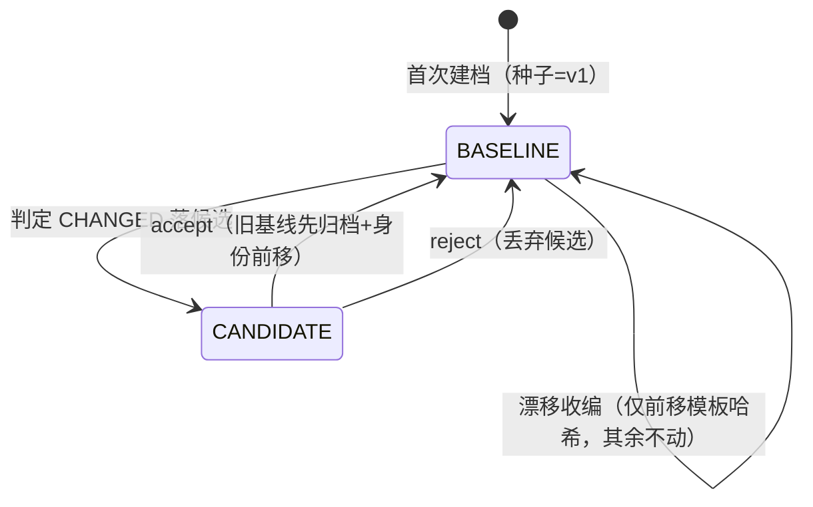

# 治理生命周期规格（governance）

> 最近复核：364801f / 2026-09-03 · S4 成文（会话内对照 BaselineManager / BaselineService /
> DriftDetector / AdjudicateCommand / StatusCommand 实现逐项对账；漂移处置状态机的引擎接线
> 随统一重放引擎批落地，本文按既定设计成文并标注钉点状态）
> 验证三档占比：【测试钉】10 条 ·【命令可证】2 条 ·【人工对账】1 条

## 职责与边界

**管**：基线生命周期（三态流转/候选/裁决/归档/回滚）、版本标签纪律、模板身份前移与漂移
收编、漂移处置状态机（三出口收敛）、裁决命令面语义。

**不管**：指纹提取与判定口径（judgment）、漂移的感知（DriftDetector 属检测原语，其键文法
依据在 identity）、判定差异何时产生（replay 引擎编排）、存储承载（storage）。

## 真源与派生

| 语义状态 | 真源 | 携带方式 |
|---|---|---|
| 治理主体 | 调用点（invocations 行，主键 = invocationKey） | 治理字段 = fingerprint/candidateFingerprint/baselineStatus/versionTag/algoVersion/approvedBy/approvedAt/codeRef/templateHash；簿记字段 = totalRecords |
| 候选 | 画像 candidateFingerprint 列 | 跨进程持久化——重放与裁决通常不在同一进程，候选必须落库才对裁决可达 |
| 归档基线 | invocation_template_versions 行 | 完整治理面快照：指纹、模板哈希、语义版本、审批人/时间、代码锚、归档时间；rollback 的唯一恢复源 |
| 审批事实 | approvedBy/approvedAt | 空白身份归一为 null——approvedBy=null 是「未经审批链盖章」的显式信号，空白串会稀释该信号 |
| 治理事件 | governance_events 行（只追加时间线） | 六动词（accept/reject/rollback/establish/force-rebuild/collect）发生时经 BaselineManager 单源落账，happenedAt 由存储实现方盖章；reject/rollback 不在画像上留状态痕迹，事件是其唯一审计载体——无状态痕迹的动作没有派生重建路径，事件必须成为真源（R11） |
| 代码锚 | codeRef（invocations 与 invocation_template_versions 双表携带） | 申报制审计标注：建档/accept 时调用方声明的代码参照（如 git 提交号），定位「行为最后被认可于哪个提交」；不校验、不连 git、不参与判定；空白归一为 null，空缺合法。归档行携带归档基线自身的锚，rollback 连锚回退——活跃行的锚必须始终描述当前基线自身，否则账本说谎 |
| 模板身份 | 最新可分组记录的 templateHash | 建档种子携带；accept/显式收编按同一口径前移（身份前移见下） |

**单一写者**：画像治理字段只经 `BaselineManager`（生命周期方法以实例监视器互斥，同一 JVM
内并发安全；跨进程排他由调用方负责）。簿记例外：建档后 totalRecords 回填由 BaselineService
直写（非治理语义）。**侦探/法官分工**：框架只报告差异并落候选，接受与否由人裁决。

## 状态机与生命周期

活跃画像只有两态：**BASELINE / CANDIDATE**（ARCHIVED 枚举值从不写入活跃行，已归档基线是
归档表的事实）。

| 事件 | 前置 | 动作 | 终态 |
|---|---|---|---|
| 首次建档（autoEstablish） | 桶内无画像或指纹空 | 种子记录现场重提指纹，versionTag=v1，盖章 | BASELINE |
| 重复建档 | 指纹已有 | 幂等跳过 | 不变 |
| 判定 CHANGED 落候选（D1） | 画像存在；候选指纹 ≠ 画像现役指纹（一致即无裁决对象，不登记不翻转） | recordCandidate（首个 CHANGED 配对的新记录 + 现场重提指纹） | CANDIDATE（不一致时）/ 不变（一致时） |
| accept | CANDIDATE，否则抛 IllegalStateException | ①归档旧基线 ②身份前移（顺序钉死）③候选升基线 ④tag 跳过归档占用 ⑤盖章 ⑥落 ACCEPT 事件 | BASELINE |
| reject | CANDIDATE，否则抛（与 accept 对称） | 丢弃候选，保留旧基线（回退模板是 git 的职责）；落 REJECT 事件（actor=否决者）——候选消失后事件是「曾发生过 reject」的唯一痕迹 | BASELINE |
| rollback(key, tag) | 归档行存在，否则抛；tag = 当前活动版本同样抛（空回滚唯一副作用是清候选，丢弃候选有专门动词 reject，拒绝即消除歧义路径） | 当前基线先归档 → 按快照恢复指纹/模板哈希/语义版本/审批/tag；在途候选随之清空（回执披露 candidateDiscarded，治理动词无静默副作用）；落 ROLLBACK 事件（actor=执行者，versionTag=目标版本）——恢复按原始审批人重激活，执行者只在事件表可见 | BASELINE |
| --force 重建 | 画像存在 | 旧基线先归档 → 桶内规范序首条记录重提指纹 → tag 顺延 | BASELINE |
| 漂移收编（显式 advanceTemplateIdentity） | 最新可分组记录哈希 ≠ 画像哈希 | 仅前移 templateHash（指纹/候选/tag/审批不动） | 不变 |

**漂移处置状态机**（传感器 = DriftDetector，执行器 = 重放引擎；每个漂移点最终只落到三个
出口之一，不存在静默绿或永久红）：

| 漂移点的对齐步结果 | 处置 | 收敛效果 |
|---|---|---|
| PASS（行为无差异） | 开发态：身份自动收编（前移模板哈希，报告可见）；`--ci`：**不收编**（治理写不进流水线，附「身份未收编」警告，出 0） | 下次检测不再命中（开发态）/ 保持命中直到人侧收敛（CI） |
| CHANGED | 落候选（D1），报告指向 accept/reject；reject 后提示回退模板或重录 | 人工裁决闭环 |
| 缺步骤 / 分歧后 / 跳过 / 无可对齐证据 | **挂起**：不前移、不落候选，exit 1 并提示真实重跑补证 | 证据补齐后落入前两行 |

**三分形态的归属**：同键漂移（骨架锚点，全文哈希变体）走完整三出口；标签裂键（声明无骨架）
**没有「前移」动作**——裂出新键建档时种子即该桶模板（桶内记录全文哈希同值，种子=最新），
收编=建档本身，候选与挂起照常作用于新画像；未建档全新键不进状态机，由建档路径与巡检视图
承接。**报告全项目、处置限缩域**：`--task`/`--invocation` 缩域外的漂移只进检测报告不处置。

**已知的自愈与回拨**：accept 的身份重算取自最新真实记录，`--re-drive` 场景下可能滞后于
指纹来源一轮检测，对齐 PASS 自动收编——自愈；`--force` 种子取桶内最早记录，身份随之回拨，
状态机下轮再收编——语义自洽（重建=回到当前算法视角的种子）。

## 契约

1. **三态流转与异常对称**：accept/reject/rollback 前置不满足一律 IllegalStateException；
   reject 与 accept 的「无候选」异常对称。【测试钉】`BaselineManagerTest`（Accept/Reject/
   Rollback 三组，含 profileNotFound/noCandidate）
2. **accept 顺序契约**：归档先于身份前移——归档行携带的旧模板哈希是 rollback 的恢复源，
   顺序颠倒会把新身份归档进旧行。【测试钉】`BaselineManagerTest.TemplateIdentity`
   （acceptAdvancesIdentity_oldHashArchived 的归档行断言）
3. **身份前移口径统一**：accept 前移与显式收编共用同一重算实现（凭据=存储键与现算键一致
   的最新可分组记录；全损或零模板保守保留原值；哈希一致幂等）。【测试钉】
   `BaselineManagerTest.TemplateIdentity`（收敛/回退/恢复/幂等/null 补齐/损坏回退/保守退化
   七场景）+ `DriftDetectorTest`（accept 后检测不再命中、reject 后仍命中）
4. **版本标签一一对应**：accept/重建生成新 tag 并跳过归档已占用 tag——任一 tag 在归档与
   活跃态之间始终只对应一个指纹，rollback(tag) 无歧义。【测试钉】`BaselineManagerTest`
   （VersionTag 组 multipleAccepts_versionIncrement）
5. **归档去重**：同 tag 已有归档行时跳过（回滚恢复的基线本就在归档中）；无 tag 的基线无
   回滚句柄、不归档。【测试钉】`BaselineManagerTest`（accept_noOldBaseline）+
   `SqliteStorageRepositoryTest`（findArchivedTemplateVersion_duplicateTag_latestArchiveWins）
6. **rollback 全治理面恢复**：指纹之外，模板哈希、语义版本、审批人/时间、tag 一并随快照
   回退——活跃行的治理事实必须始终描述当前基线自身的获批历史。【测试钉】
   `BaselineManagerTest`（Rollback 组 rollbackToVersion_restoresOldFingerprint + algoVersion
   断言）+ TemplateIdentity（rollbackRestoresArchivedIdentity）
7. **裁决证据前置**：accept/reject 在拍板前渲染候选与基线的逐维差异（裁决者必须看到证据
   本身，而非只看到「有候选」标志位）。【命令可证】`accept --invocation <目标>` 输出的
   「候选差异（基线 → 候选）」段；--json 为 adjudication/1 报告
8. **裁决目标解析**：`--invocation` 与 `--all` 互斥、必给其一；--invocation 走完整键/业务
   标签/唯一前缀/显示短形的统一目标解析。【测试钉】`CliSupportResolverTest`
9. **漂移处置状态机三出口**（含 `--ci` 不收编、Rule B 建档即收编、挂起 exit 1、缩域外
   仅报告不处置）：统一重放引擎已接线。【测试钉】`TaskReplayRunnerTest.DriftStateMachine`
   （dev 收编并前移身份/--ci 未收编身份不动/CHANGED 落候选/缺步骤挂起/无链挂起/域外不处置/
   裂键建档收编七场景）+ `Scoping`（复合缩域）
10. **漂移收编只走治理写入口**：自动收编不得由 CLI 直写画像（单一写者纪律），只经
    advanceTemplateIdentity。【测试钉】`TaskReplayRunnerTest.DriftStateMachine`
    （driftPass_dev_collects 断言身份经收编前移、driftPass_ci_keepsStale 断言 CI 不落写）
11. **rollback 守卫与副作用披露**：目标 = 当前活动版本即拒（IllegalStateException 指路
    reject——空回滚不改指纹，唯一效果是丢弃在途候选，那有专门动词）；任何 rollback 清了
    在途候选必须在回执披露（人读行 "in-flight candidate discarded"、rollback/1 的
    `candidateDiscarded:true`）——待裁决证据的丢失不得静默。人读 status 的归档列给活动 tag
    打 *（回滚恢复后活动号仍在归档列是可逆性的合法代价，标记让当前版本不靠猜；机器通道
    不标记——同行的 versionTag 即活动版）。【测试钉】`BaselineManagerTest.Rollback.
    rollbackToActiveVersion_refused` + `JsonContractTest.rollbackGuards_activeTargetRefusedAndCandidateDisclosed`
    + `statusHuman_archivedColumnMarksActive`
12. **审批溯源读面**：approvedBy/approvedAt 随 status/1 每行回读（approvedBy 空串=未盖章、
    approvedAt null 字面量=未盖章），人读 status 表带 approver 列——「这个基线是谁批的、
    何时批的」任何面可答；audit 列**全量治理时间线**（AI 与人类的治理写同账本同清单，
    actor 列自解释主体——`agent:` 前缀=机器写申报约定，其余=人类身份；裁决=统一记录，
    记录层本就经 BaselineManager 单源不分主体，展示层不再过滤）。【测试钉】
    `JsonContractTest.statusJson_exposesApprover` + `rejectAndRollback_eventsListedInAudit`
    + `audit_listsHumanWrites_alongsideAgentWrites`

## 行为矩阵

| 场景 | 行为 |
|---|---|
| 无候选 accept/reject | IllegalStateException（CLI 转译为退出码 2） |
| 画像不存在 accept/reject/rollback | IllegalStateException |
| rollback 目标 tag 无归档行 | IllegalStateException |
| rollback 目标 = 当前活动版本 | IllegalStateException，消息指路 reject（丢弃候选的专门动词） |
| rollback 时画像持有在途候选 | 候选随恢复清空，回执披露 candidateDiscarded |
| accept 时归档 tag 撞车 | nextAvailableVersionTag 顺延跳过（tag↔指纹一一对应不破） |
| 候选哈希与最新记录一致时 accept | 身份不动（幂等），候选照常转正 |
| 漂移 + 对齐 PASS（开发态） | 收编：模板哈希前移，其余治理字段不动，报告可见 |
| 漂移 + 对齐 PASS（--ci） | 不收编：出 0 附「身份未收编」警告 |
| 漂移 + 对齐 CHANGED | 落候选 → CANDIDATE，等待人工裁决 |
| 漂移 + 证据缺口（缺步骤/分歧后/跳过/无链可对齐） | 挂起：不写治理面，exit 1 |
| 缩域外的漂移点 | 只进检测报告，不处置 |
| accept 传入空白审批人 | 归一为 null（未经审批链盖章信号不稀释） |

## 域间边界

- **上游 judgment**：候选指纹 = 首个 CHANGED 配对的现场重提结果（与对齐器同口径）。
- **上游 identity**：漂移的感知按键锚点三分（同键/裂键/未建档）；身份前移只动画像
  templateHash 列，永不回改记录的键。
- **上游 replay**：重放引擎是处置执行器（对齐结果驱动三出口）；D1 落候选的顺序契约 =
  establishMissing 先于候选登记（裂键新画像必须先存在）。
- **下游 cli**：status 的候选标志与差异预览、accept/reject 命令面、adjudication/1 报告。

## 变更纪律

- 候选单漏斗（recordCandidate 唯一登记口）、单一写者、归档快照治理面 = 冻结契约；破坏
  等价于裁决可信性破坏。
- 三态枚举值与画像治理列集为存储契约（storage 域单向门）；新增治理字段先补本 spec 再补码。
- 漂移处置状态机的出口语义（收编/候选/挂起 + `--ci` 写纪律）为已批准设计：变更走显式裁决，
  不在实现批次内顺手调整。

## agent 治理与审计

框架是纯能力提供方：谁能调用哪个治理写，由执行环境（harness）的权限系统决定——
这是 harness 工程的原生职责。MCP 工具清单以 description 声明各动词的变异语义与
使用要求（例如 accept 应在人类指示之后调用），harness 据此生成权限确认；操作者把
agent 权限配置为完全访问时，授权决策已经在 harness 层完成，框架不内嵌第二套同意
机制与之竞争。框架承担的是透明与事后审计：

1. **身份申报约定**：agent 驱动治理写时以 `--approver agent:<名称>` 申报机器身份
   （自由字符串约定，框架不校验具体值；人类用默认 OS 身份），approvedBy 原样留痕。
   申报让时间线的 actor 列自解释主体（`agent:` 前缀=机器写，其余=人类）。
   **MCP 通道 approver 必填**（establish/accept/reject/rollback 的 schema required +
   服务端 E-USAGE 守卫）：机器调用方总能申报身份，缺席申报会让机器写伪装成人类身份、
   破坏人机分账的可读性；CLI 人读通道保留 OS 用户缺省不变。【测试钉】`McpServerTest`
   （schema required 四工具 + 缺 approver E-USAGE）
2. **audit 命令**：治理事件表（governance_events）时间线的**全量清单**——六动词
   （含 reject/rollback）的全部治理事件，AI 与人类的写同账本同清单、单一时间线按
   happenedAt 排序（行结构 {verb, invocationKey, versionTag, actor, codeRef,
   happenedAt}），人读与 audit/1 双通道，读动词恒 exit 0。事件在治理写发生时经
   BaselineManager 单源落账（幂等早退与前置失败不落事件；COLLECT 的 actor 恒
   null——框架自动化动作）；事件写失败按 L1 退化（记 SEVERE 不阻断治理写本体）。

## 复核台账

| 日期 | 方式 | 发现 |
|---|---|---|
| 2026-09-15 | Round 6 裁决批（D7）：audit 全量时间线（统一人机账本） | 维护者裁决「无论 AI 还是人类都应记录，分层统一处理不加分枝」——白盒证实记录层本就经 BaselineManager 单源落账全 actor（含 CLI 人类写），缺口仅在 audit 展示层的 agent:* 过滤镜。拆除过滤镜：audit/1 与人读清单改为全量时间线（actor 列自解释主体），`agent:` 前缀保留为机器写申报约定（身份申报契约 13 同步改写）；JsonContractTest 旧钉「人类 actor 不进 agent 透镜」随裁决翻转改钉（测试错误改钉理由：其断言面即被裁决取代的旧设计）。【测试钉】audit_listsHumanWrites_alongsideAgentWrites + rejectAndRollback_eventsListedInAudit（改钉） |
| 2026-09-15 | Round 6 合并无裁决收口批：rollback 空回滚守卫前置 | BaselineManager.rollback 的检查顺序调整：目标=活动版本守卫提至归档查找之前——此前目标为「活动且不在归档列表」的版本时（首建未替换的画像），用户先撞「No archived template version found」而非带 reject 指路的空回滚话术，双宿主 Round 6 实测同一拒绝两档措辞。状态机契约不变（两种失败均 IllegalStateException/E-NO-DATA）；CLI 侧 RollbackCommand.ensureVersionExists 同批放行目标=活动版本给 manager 守卫承接。【测试钉】CommandSmokeTest.rollback_toActiveRefusesWithRejectPointer |
| 2026-09-14 | Round 5 裁决批（B3/B4）：审批溯源读面 + MCP approver 必填 + rollback 守卫与披露 | ①B3 根因=approvedBy/approvedAt 一直在画像与归档行上（establish/accept/rollback 三路径盖章），读面从不渲染——audit 类注释承诺的「人类写经 status/report 可见」落空，本批兑现（契约 12）；逃逸窗口根因=MCP approver 可选 + CLI OS 用户缺省回退，机器写无痕混入人类名单，schema required + 服务端 E-USAGE 双守卫关闭；②B4 根因=nextAvailableVersionTag 只防新 accept 复用 tag，回滚恢复出的 tag 本就在归档（可逆性代价），活动 tag 因此可被 rollback 命中且顺带清候选——拒绝空回滚（指路 reject）+ candidateDiscarded 回执披露 + 归档列 * 标记（契约 11）；③MCP approver 必填是发布前收紧（对省略客户端破坏性，pre-1.0 免费） |

| 日期 | 方式 | 发现 |
| 2026-09-14 | A3 修复批（批 3）：治理事件表落地，audit 由状态投影改为时间线单源读取 | ①真源表增治理事件行；状态机事件表 accept/reject/rollback 三行补事件落账；②「agent 治理与审计」节 audit 条目重写（原「rollback/reject 不进清单」已知边界随事件表消失）；③reject/rollback 签名增 actor 参数（公开 API 变更，pre-1.0 允许），CLI/MCP 面同步 --approver；④audit/1 行结构 state→verb（schema 名开发期恒定，语义变更=删库重建承接） |
|---|---|---|
| 2026-09-04 | 盲跑复盘批：D1 登记前置条件落地（同指纹候选不登记） | 状态机「落候选」事件增前置（候选≠现役指纹）；形态来自 dogfood 盲跑实况——画像以变异期记录建档时，对齐 CHANGED 的候选与现役一致，登记即产生无信息候选与困惑界面（MIG-V1 实况）；【测试钉】`BaselineManagerTest.SameFingerprintCandidate` |
| 2026-09-03 | 统一重放引擎落地后复核（同日）：漂移处置状态机接线完成 | 契约 9/10 升【测试钉】（DriftStateMachine 七场景 + 单一写入口断言）；「对齐层陈述最近两次真实执行之间的差异」语义经端到端钉确认——accept 清候选转正基线，事实差异在新真实链入账前如实存续（ReplayFlowTest.diff_candidate_accept_settles），与 S4 成文时的收敛表述细化一致 |
| 2026-09-03 | S4 成文：BaselineManager/BaselineService/DriftDetector/AdjudicateCommand/StatusCommand 全量对账 | ①漂移处置状态机与 `--ci` 写纪律为已批准设计、引擎接线未落地（契约 9/10 人工对账，随统一引擎批升级）；②「Rule B 建档即收编」与「种子=桶内最早记录」经核不冲突——裂键新桶内记录全文哈希同值，最早记录即最新模板；③status 已有候选差异预览与未建档视图（Rule C 承接面现成），漂移列为统一引擎批增量 |
