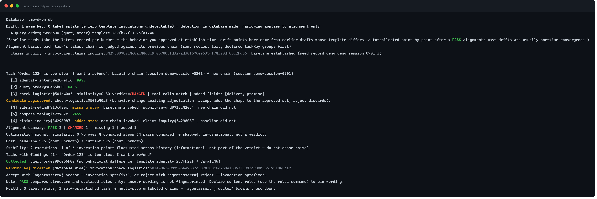
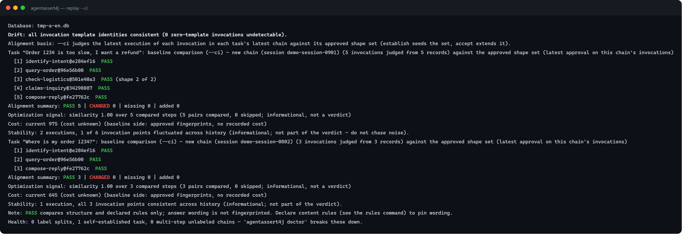

# Hands-on tutorial: from wiring to delivery

> One continuous walkthrough of the full lifecycle — wiring, recording, baselining, iterating,
> gating, re-driving, delivering, auditing. Every command and every output block is genuine CLI
> output captured from the demo database (a fictional "ShopMate" customer-service bot), so what you
> see here is what you will see on your machine.
> Companion reading: [README](../README.md) for the five questions, [operations handbook](../OPERATIONS.md)
> for task-oriented reference, [ARCHITECTURE](../ARCHITECTURE.md) for the code map.

## 0. The scenario

ShopMate is a customer-service bot on Spring Boot 3 + Spring AI 1.x. One user request makes it run a
chain: identify-intent → query-order → check-logistics → submit-refund → compose-reply. Two real
moments drive the whole tutorial:

- **Day 15**: the team edits the order-query prompt and adds a claims step to the refund flow. Who
  tells them nothing else broke?
- **Day 30**: the customer's intranet runs a different model. How do they prove the behavior is still
  there?

Everything below happens on one machine with one SQLite file. No service, no port, no API key for
the default path.

## 1. Wire it in

Add the starter — the business code stays untouched:

```xml
<dependency>
    <groupId>io.github.agentassert4j</groupId>
    <artifactId>agentassert4j-starter-spring-ai1</artifactId>
    <version>1.0.0</version>
</dependency>
```

The starter wraps every `ChatModel` bean in the container and records each call out-of-band. Two
host-shape facts learned from real integrations, worth knowing on day one:

- The auto-wrapping only covers in-container beans. If your host builds `ChatModel` instances on
  demand inside a service (not registered as beans), wrap them manually at the build point:
  `RecordingChatModel.wrap(chatModel, recorder)`. After wiring, **confirm records actually land**
  (`doctor` / `status`) — believing you're recording while nothing records is the most expensive
  integration mistake.
- The template hash (the anchor of template identity) is computed from the request's `SystemMessage`.
  Hosts that carry their system prompt inside a `UserMessage` lose template-drift detection — pass
  the system prompt as a `SystemMessage` if you can.

Non-Boot stacks: assemble programmatically (`RecorderConfig.builder()` + `InteractionRecorder`), or
report raw wire JSON through the MCP `record` tool — the minimal recording contract is in the
[operations handbook §8](../OPERATIONS.md#8-minimal-recording-contract).

## 2. First recording and identity

Run your normal smoke/e2e once — every LLM call lands in the database, zero collection code. Now
declare identity where it pays off, following `doctor`'s prompts:

```bash
agentassert4j doctor
```

Three declaration layers, each answering one question:

1. **Invocation label (`invocationId`)** — "what is this step called": `RecordingContext.start(sessionId)
   .withInvocationId("refund")`, app-wide `agentassert4j.recorder.default-invocation-id=tavern`, or the
   adapter annotation. Declared labels survive prompt edits and give task rules step names.
2. **Task key (`taskKey`)** — "which business scenario this chain belongs to":
   `RecordingContext.withMetadata("taskKey", <scene-id>)`. Declared keys group chains across sessions;
   identical request text groups automatically when you skip it.
3. **Task rules (`rules.tasks`)** — "how must this scenario flow": `requiredSteps` / `requiredOrder`
   / step counts, judged once a comparison exists.

Zero-declaration is a first-class citizen — undeclared records group by template hash with full
replay/adjudication support. Declarations affect report granularity, never verdict correctness.

## 3. Establish the baseline

```bash
agentassert4j baseline --approver wang
```

Real output on the demo database:

```text
  check-logistics → invocation:check-logistics:501e40a3…: baseline established (seed record demo-demo-session-0801-2)
  compose-reply → invocation:compose-reply:fe27762c…: baseline established (seed record demo-demo-session-0802-7)
  identify-intent → invocation:identify-intent:e284ef16…: baseline established (seed record demo-demo-session-0802-5)
  query-order → invocation:query-order:96e56b00…: baseline established (seed record demo-demo-session-0802-6)
  submit-refund → invocation:submit-refund:713c42ec…: baseline established (seed record demo-demo-session-0801-3)
Done: 5 invocations established.
```

Every line discloses its **seed**: that invocation's latest execution — the behavior you approved at
establish time. The baseline is not one frozen answer: it is **the approved shape set** of each
invocation, and `accept` appends to it, `rollback` restores a whole-set snapshot.

## 4. Edit a prompt, really run once, replay

The team ships two changes: the order-query prompt gains a "state clearly when the order does not
exist" clause, and the refund flow adds a claims step. After one real re-run:

```bash
agentassert4j replay
```

```text
Drift: 1 same-key, 0 label splits (0 zero-template invocations undetectable)
  ▲ query-order@96e56b00 (query-order) template 287fb22f → 7afa1246
Alignment basis: each task's latest chain is judged against its previous chain (same request text; declared taskKey groups first).
Task "Order 1234 is too slow, I want a refund": baseline chain (session demo-session-0801) → new chain (session demo-session-0901)
  [1] identify-intent@e284ef16  PASS
  [2] query-order@96e56b00  PASS
  [3] check-logistics@501e40a3  similarity=0.80 verdict=CHANGED | tool calls match | added fields: [delivery.promise]
Candidate registered: check-logistics@501e40a3 (behavior change awaiting adjudication; accept adds the shape to the approved set, reject discards).
  [4] submit-refund@713c42ec  missing step: baseline invoked 'submit-refund@713c42ec', new chain did not
  [6] claims-inquiry@34298087  added step: new chain invoked 'claims-inquiry@34298087', baseline did not
Alignment summary: PASS 3 | CHANGED 1 | missing 1 | added 1
Collected: query-order@96e56b00 (no behavioral difference; template identity 287fb22f → 7afa1246)
Pending adjudication (database-wide): invocation:check-logistics:501e40a3…
Accept with `agentassert4j accept --invocation <prefix>`, or reject with `agentassert4j reject --invocation <prefix>`.
```



Read the report in three layers:

- **Drift** names which invocations changed template identity. `query-order` was edited (same label,
  new template) — and because behavior did not change, the framework **collected** it automatically:
  template-only drift with a PASS alignment never interrupts you.
- **Alignment** pairs the two real chains step by step: `check-logistics` returns the same tool call
  with an **added output field** (`delivery.promise`, a delivery-promise appearing in the output
  structure) → a behavior change, registered as a **candidate**; `submit-refund` disappeared from the chain (**missing**);
  `claims-inquiry` appeared (**added**).
- **The verdict reads structural fingerprints only** — wording differences are shown to humans as
  low-confidence references, never judged.

## 5. What produces a candidate and what does not

The two drift shapes behave differently, by design:

| Shape | What happened | Outcome |
|-------|---------------|---------|
| Same label, new template, behavior unchanged | prompt edited, output shapes identical | **Collected** automatically (disclosed in the report) — no interruption |
| Same key, output shape changed | model switch, sampling change, tool result shape | **Candidate** registered — waits for your adjudication |
| New label or new template hash | undeclared edit, new invocation | **Label split** — disclosed, never auto-collected; gate stays fail-closed until you establish it explicitly |

A candidate you never adjudicated never quietly turns the gate green or red.

## 6. Adjudicate

The promise field is an intended improvement — accept it, and the CLI shows exactly what changed:

```bash
agentassert4j accept --invocation check-logistics --approver wang --ref demo
```

```text
  check-logistics@501e40a3 candidate diff (baseline → candidate); each row names the changed dimension:
    Output field set: added [delivery.promise];
```

`accept` appends the new shape to the invocation's approved set (the previous set archived as a
version snapshot, restorable via `rollback --version v1`). A regression instead gets `reject`, which
discards the candidate — prompt rollback is git's job. Shared invocations legitimately hold several
shapes: approve each shape once, and every chain ending in an approved shape rechecks green.

Note the two declared identities: `--approver` (who adjudicated) and `--ref` (a declared, never
validated code anchor answering "which commit last approved this behavior"). Both land on the audit
timeline (step 11).

## 7. Measure stability before approving

A single matching run is weak evidence. The stability probe samples the task's most recent chains:

```bash
agentassert4j replay --member-check --task "Order 1234"
```

```text
Task "Order 1234 is too slow, I want a refund": member check — new chain (session demo-session-0901) against the 1 most recent chain(s) of 1 (window 5)
No member match: closest historical chain is session demo-session-0801; differences below are against that sample.
```

Read the **count**, not the boolean: `matched 2 of 3` recent neighbors is stable reproduction; `1 of
N` hitting only an ancient session is archaeology. The JSON `isMember` means "any historical hit" and
deliberately carries no threshold.

## 8. Gate the pipeline

Two fixed steps in CI: run the app's smoke/e2e with the recorder on (the new template really runs and
is archived), then one command gates the whole project:

```bash
agentassert4j replay --ci
```

```text
Task "Order 1234 is too slow, I want a refund": baseline comparison (--ci) — new chain (session demo-session-0901) against the approved shape set
  [1] identify-intent@e284ef16  PASS
  [2] query-order@96e56b00  PASS
  [3] check-logistics@501e40a3  PASS
  [4] claims-inquiry@34298087  PASS
  [5] compose-reply@fe27762c  PASS
Alignment summary: PASS 5 | CHANGED 0 | missing 0 | added 0
```



Exit codes gate the pipeline directly: `0` pass, `1` behavioral deviation (human adjudication), `2`
environment or evidence trouble (including fail-closed refusal when unbaselined invocations are in
scope). The gate never auto-baselines and never collects drift identity inside the pipeline — an
unadjudicated split key keeps it honest.

## 9. Switch the model, price the difference

Point a re-drive at a new model: recorded prompts go verbatim, structural fingerprints name the
behavior impact per invocation, and the report carries token/cost/latency deltas — reasoning tokens
included:

```bash
agentassert4j replay --task "Order 1234" --re-drive --model <new-model> --dry-run
```

`served_model` annotations disclose what the endpoint actually served (vendor alias mappings
included — configured model ≠ received model, visible on the spot). The same recipe doubles as a
model bake-off and fine-tune acceptance; a `--max-total-calls/--max-total-tokens` budget pool caps
every real call, and `--dry-run` quotes before anything is spent.

## 10. Deliver acceptance

Ship the demonstrated behavior as portable evidence — even when the customer's intranet runs a
different model:

```bash
agentassert4j baseline export --out pack.json
```

```text
Acceptance pack written: pack.json
  2 task chains / 8 steps (no samples)
  SHA-256: 9f599f92… (reconcile with the accepting party)
```

On the acceptance side, after really executing the delivered requests:

```bash
agentassert4j verify --pack pack.json --report verify-report.md
```

```text
Per-task verdicts:
  Order 1234 is too slow, I want a refund: PASS (similarity 1.00)
  Where is my order 1234?: PASS (similarity 1.00)
Verification summary: PASS 2 | CHANGED 0 | missing 0 | added 0 | coverage gaps 0 | out-of-scope chains 0
Cross-model acceptance: dev side deepseek-v3 / local deepseek-v4; structural verdicts valid, text differences are expected wording variation.
```

Coverage gaps (pack tasks never executed locally) exit 2 — incomplete evidence never masquerades as a
pass. `verify` is read-only and repeatable; the markdown report is the delivery evidence itself.

## 11. Governance and audit

Every governance write (establish / force-rebuild / accept / reject / rollback / collect) lands on
one timeline with its actor and code anchor — AI (`agent:*`) and human writes on the same line:

```bash
agentassert4j audit
```

```text
Governance writes (9, from the governance event timeline):
  [establish] check-logistics@501e40a3 v1 wang 2026-10-03T08:15:49.341Z
  [establish] query-order@96e56b00 v1 wang 2026-10-03T08:15:49.389Z
  [establish] claims-inquiry@34298087 v1 auto:Administrator 2026-10-03T08:15:50.569Z
```

Machine callers declare `--approver agent:<name>`; MCP tool-surface mutations require the approver
parameter (absent = refused). The framework decides nothing about authorization — that is the
harness's permission system; the framework contributes transparency and after-the-fact audit.

## 12. Architecture and design trade-offs

For the reasoning behind the machinery — why the verdict is 100% deterministic (no LLM-as-judge),
why fingerprints read only structural dimensions, why recording would rather drop data than block a
business request, why the core depends on nothing but `java.base` — the code-level map is
[ARCHITECTURE.md](../ARCHITECTURE.md) and the per-domain behavior contracts live in `guide/spec/`
(the authoritative specs, in Chinese).

The trade-offs in one table:

| Decision | What it buys | What it costs |
|----------|--------------|---------------|
| Deterministic structural verdicts | same diff, same verdict, anywhere; CI-gateable | wording changes are invisible to the gate (content rules opt in) |
| Out-of-band recording | zero intrusion; business latency untouched | the pipeline drops data under pressure, metered, rather than blocking |
| Single-file SQLite storage | no infrastructure; the database file is the whole state | no tamper detection — protect the file as your source of fact |
| Zero-dependency core | JDK 8 clients; no licensing burden | the core reimplements what a dependency would provide |
| Derived, not stored | task chains and graphs rebuildable at any time | recomputation cost per analysis run (bounded, local) |
